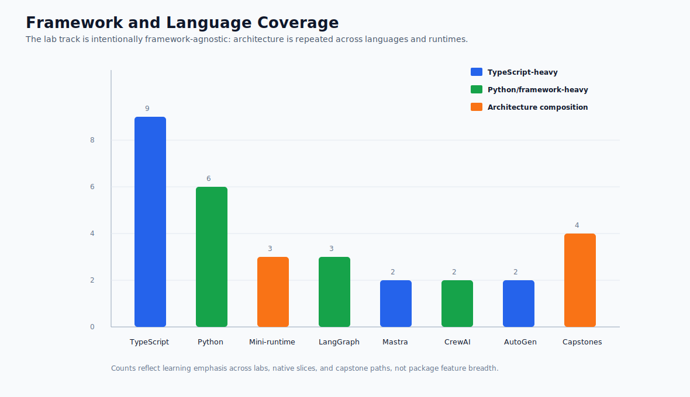

# Lab Framework and Language Matrix

The labs are intentionally language- and framework-agnostic. They use different tools so you can see the architectural pattern beneath the framework API.

## Coverage Graph

Use this graph to see the learning emphasis across languages, runtimes, framework slices, and capstones. The goal is balanced architecture exposure, not equal package coverage.

| Lab | Pattern | Language | Framework / Runtime | Framework-Agnostic Lesson |
| --- | --- | --- | --- | --- |
| [Lab 01 - Tool-Using Agent](./lab-01-tool-using-agent.md) | Tool use | TypeScript | Minimal custom runtime / AutoGen-style example | The model proposes a capability use; software owns validation and execution. |
| [Lab 02 - Agent Loop and Planning](./lab-02-agent-loop-and-planning.md) | Planning and execution | TypeScript, with Python mirror | Framework-neutral planner/executor | Planning and execution are separate responsibilities even when one framework packages both. |
| [Lab 03 - Agentic RAG](./lab-03-agentic-rag.md) | Retrieval and grounding | Python | LangChain/LangGraph-style retrieval stack | Retrieval produces scoped evidence; generation must stay grounded in that evidence. |
| [Lab 04 - A2A Communication](./lab-04-a2a-communication.md) | Agent-to-agent protocol | TypeScript | Protocol-first runtime with Ajv schema validation | Agent communication needs typed envelopes, correlation IDs, refusals, errors, and cancellation. |
| [Lab 05 - Multi-Agent Supervisor](./lab-05-multi-agent-supervisor.md) | Supervisor / worker | TypeScript | AutoGen-style manager/worker example | A supervisor owns decomposition, worker contracts, and final synthesis. |
| [Lab 06 - Observability and Evals](./lab-06-observability-and-evals.md) | Trace and eval harness | TypeScript | Framework-neutral tests over examples | Evals should inspect trajectories, not only final answers. |
| [Lab 07 - Mastra Runtime Packaging](./lab-07-mastra-runtime-packaging.md) | Runtime packaging | TypeScript | Mastra-style agents, tools, workflows, memory, and evals | Framework runtime packaging does not remove product ownership of state, policy, and acceptance. |
| [Lab 08 - CrewAI Flows and Crews](./lab-08-crewai-flows-and-crews.md) | Flow and crew orchestration | Python | CrewAI-style flows, crews, roles, and tasks | Flows own state and acceptance; crews perform bounded specialist work. |
| [Mini-Framework Track](./from-scratch-mini-framework.md) | Runtime primitives | TypeScript or Python | From-scratch educational runtime | Building the primitives once clarifies what frameworks package. |
| [Lab 09 - Minimal Agent Loop](./lab-09-minimal-agent-loop.md) | Agent loop | TypeScript or Python | From-scratch educational runtime | State, decisions, observations, budgets, and stop reasons are the core loop. |
| [Lab 10 - Tool Registry and Policy Gate](./lab-10-tool-registry-and-policy-gate.md) | Tool and policy boundary | TypeScript or Python | From-scratch educational runtime | Tool availability and policy authorization are different runtime decisions. |
| [Lab 11 - Context, Memory, Trace, and Evals](./lab-11-context-memory-trace-evals.md) | Runtime observability | TypeScript or Python | From-scratch educational runtime | Context, memory, traces, and trajectory evals make the runtime reviewable. |
| [Lab 12 - LangGraph State Graph](./lab-12-langgraph-state-graph.md) | State graph and resume | Python | LangGraph-style graph state, nodes, edges, checkpoints, and interrupts | Graph execution is strongest when state, branching, pause/resume, and node observability matter. |
| [Lab 13 - AutoGen Transcript Evals](./lab-13-autogen-transcript-evals.md) | Multi-agent transcript evaluation | TypeScript | AutoGen-style agents, teams, messages, and transcript evals | A multi-agent run needs a reviewable transcript, explicit stop reason, and role-level acceptance criteria. |

## How To Read The Matrix

Do not treat the framework column as the point of the lab. Treat it as the implementation surface. The durable lesson is the boundary: state, tools, policy, context, communication, evaluation, or runtime control.

If you later use LangGraph, Mastra AI, AutoGen, CrewAI, Semantic Kernel, MCP, or a custom runtime, keep the same questions in view:

- What does the framework own?
- What does your application still own?
- Where is state persisted?
- Where are tool calls validated?
- Where is policy enforced?
- What can be replayed after a failure?

## Current Coverage

The current labs now cover TypeScript, Python, protocol boundaries, framework-neutral tests, LangGraph-style state graphs, AutoGen-style transcripts, Mastra-style runtime packaging, CrewAI-style flow orchestration, from-scratch runtime primitives, production readiness gates, and isolated native framework examples.

Repository native examples:

| Example | Framework | Connects To |
| --- | --- | --- |
| `native-framework-examples/langgraph-refund/` | LangGraph | Lab 12 and Support Refund Agent capstone |
| `native-framework-examples/langgraph-research-rag/` | LangGraph | Lab 03 and Research RAG Agent capstone |
| `native-framework-examples/mastra-refund/` | Mastra | Lab 07 and Support Refund Agent capstone |
| `native-framework-examples/autogen-delivery/` | AutoGen | Lab 13 and Multi-Agent Delivery Workflow capstone |
| `native-framework-examples/crewai-delivery/` | CrewAI | Lab 08 and Multi-Agent Delivery Workflow capstone |

Planned lab expansion should add:

- deeper deployment walkthroughs that connect the readiness checklist to concrete cloud/runtime targets.
