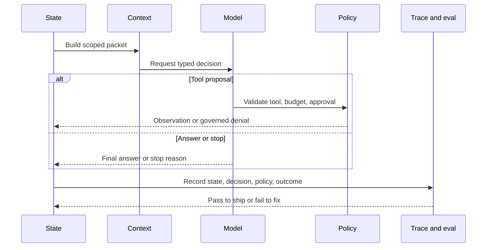

# From-Scratch Mini-Framework Track

This track builds a tiny educational agent runtime from first principles. It is not a replacement for LangGraph, Mastra AI, AutoGen-style systems, CrewAI, or production workflow engines. It is a way to understand the primitives those systems package.

Download the [lab completion worksheet](/capstone-assets/templates/lab-completion-worksheet.txt) and [lab production readiness worksheet](/capstone-assets/templates/lab-production-readiness-worksheet.txt) before starting the track.

Start with [Building a Minimal Agent Runtime](../agent-engineering-practice/building-a-minimal-agent-runtime) for the theory. Then use these labs if you want to implement the primitives yourself.

The maintained TypeScript implementation lives in `minimal-agent-runtime/typescript`. Use it as the reference solution while implementing your own small version in TypeScript or Python.

```sh
npm run mini-runtime
npm run mini-runtime:test
```

## What You Build

| Lab | Component | Main Lesson |
| --- | --- | --- |
| [Lab 09 - Minimal Agent Loop](./lab-09-minimal-agent-loop.md) | State, decisions, loop, stop reasons | An agent is a controlled loop, not a prompt. |
| [Lab 10 - Tool Registry and Policy Gate](./lab-10-tool-registry-and-policy-gate.md) | Tools, policy, approval-required outcomes | Tool execution is a software boundary. |
| [Lab 11 - Context, Memory, Trace, and Evals](./lab-11-context-memory-trace-evals.md) | Context packets, scoped memory, trace events, trajectory evals | Runtime behavior must be inspectable and testable. |

## Learning Contract

By the end of the track, you should be able to explain:

- what the loop owns;
- what belongs in state;
- why model decisions are proposals;
- how tools become narrow capabilities;
- why policy is separate from prompts;
- how context packets are assembled;
- what a trace must record;
- why trajectory evals catch failures final-answer evals miss.

## Implementation Choice

The labs are written so you can implement the runtime in TypeScript or Python. Use TypeScript if you want strong discriminated unions and a direct path to the repository's existing examples. Use Python if you want a compact teaching implementation before mapping the ideas to LangGraph or CrewAI.

Keep the implementation small. The target is not a general-purpose framework. The target is a runtime you can understand in one sitting.

The TypeScript reference is intentionally dependency-free. The Python version should preserve the same contracts: decisions are typed proposals, policy runs before execution, traces record the path, and evals inspect the trajectory.

Use this model to connect the three labs. The mini-runtime is valuable because every step has an owner: state holds the run, context scopes what the model sees, policy controls action, trace records behavior, and evals judge the trajectory.



## Track Review Gate

Before treating the track as complete, verify the runtime primitives:

| Check | Evidence |
| --- | --- |
| Loop control exists | The runtime has state, decisions, observations, budgets, and stop reasons. |
| Tools are governed | Tool lookup, policy decisions, approval-required outcomes, and unknown-tool refusals are tested. |
| Context is explicit | Context packets and memory reads are scoped rather than hidden in prompt text. |
| Trace is reviewable | Runs emit events that explain decisions, tool calls, policy outcomes, and final status. |
| Evals inspect trajectory | Tests can fail unsafe paths even when final text looks plausible. |

Record the commands, outputs, tested failure paths, and production gaps in the lab completion worksheet.

## Production Bridge

Use this table when comparing your mini-runtime to a real framework:

| Mini-Runtime Primitive | Production Runtime Question |
| --- | --- |
| Loop state | Where is state persisted, migrated, resumed, and deleted? |
| Tool registry | How are tools versioned, permissioned, disabled, and audited? |
| Policy gate | Can policy stop retrieval, memory writes, tools, and final answers before execution? |
| Trace events | Can operators reconstruct one failed run without raw secrets? |
| Trajectory evals | Which evals block prompt, model, tool, policy, memory, and workflow changes? |

The track succeeds when it improves framework judgment. It fails if it tempts the team to ship an unoperated framework.

## Production Warning

Do not ship this mini-runtime as a production platform without adding durable execution, persistence, authentication, authorization, concurrency, deployment, observability integrations, retry control, and incident response.

The right production question is not "can we build our own framework?" It is "now that we understand the primitives, which framework or runtime gives us the controls we need?"

## Compare With Frameworks

After the labs, compare each primitive with mature frameworks:

- LangGraph: graph state, nodes, edges, checkpoints, and interrupts.
- Mastra AI: agents, tools, workflows, memory, evals, and runtime packaging.
- AutoGen-style systems: manager/worker roles, messages, and function execution.
- CrewAI: flows, crews, tasks, roles, and tool assignment.
- MCP and A2A: protocol boundaries for tools and agent-to-agent calls.

## Related Chapters

- [Building a Minimal Agent Runtime](../agent-engineering-practice/building-a-minimal-agent-runtime)
- [Agent Harnesses](../agent-engineering-practice/agent-harnesses)
- [Tool Capability Design](../tools-skills-protocols/tool-capability-design)
- [Observability and Evals](../production-runtime/observability-and-evals)
