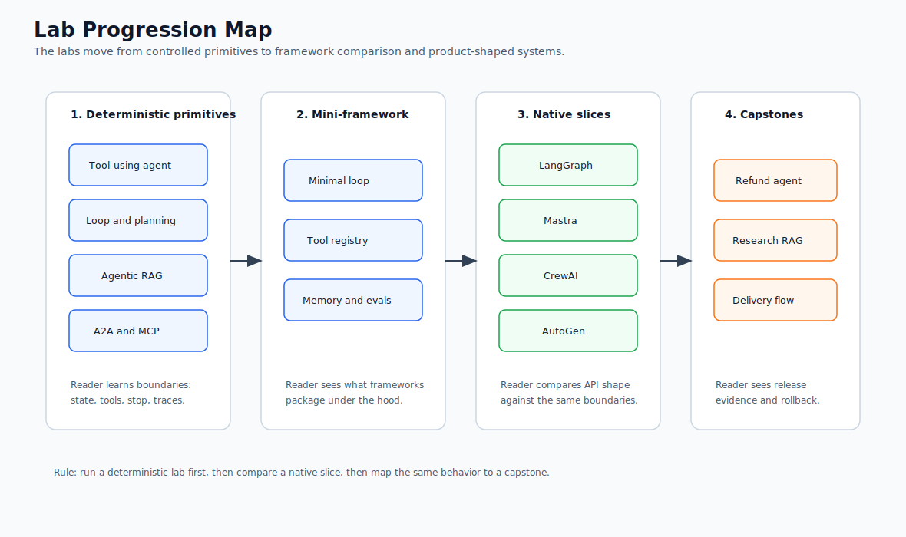

# Hands-On Labs

The labs turn the reference chapters into a build path. Each lab uses code that already lives in this repository, so you can read the pattern, run the example, change one thing, and connect the result back to production design.

The labs are intentionally framework-agnostic. They move between TypeScript and Python, and across minimal custom runtimes, LangChain/LangGraph-style retrieval, AutoGen-style manager/worker examples, A2A protocol code, MCP-style tool boundaries, and framework-neutral tests. The point is not to teach one API. The point is to show the architecture that survives when the framework changes.

Use [Lab Framework and Language Matrix](./framework-language-matrix.md) before starting if you want to see which language, framework, and architectural boundary each lab emphasizes. Use [Lab Production Readiness Checklist](./production-readiness-checklist.md) and the [lab production readiness worksheet](/capstone-assets/templates/lab-production-readiness-worksheet.txt) after each lab to identify what the demo still needs before production. Use [From-Scratch Mini-Framework Track](./from-scratch-mini-framework.md) when you want to understand what agent frameworks package under the hood. Use [Vertical Slice Examples](./vertical-slice-examples.md) after the labs, or whenever you want to see several patterns composed into one realistic task. Use [Capstone Projects](/capstone-projects/) when you want product-shaped examples with ADRs, traces, evals, runbooks, rollback plans, and native framework slices.

Run these commands from the repository root before starting:

```sh
npm install
npm test
npm run typecheck
```

Some examples can run with deterministic fallbacks. Examples that call live models require a `.env` file with `MISTRAL_API_KEY`.

## Lab Progression Map

Use this map to understand why the labs are ordered this way. The sequence starts with deterministic primitives, exposes the mini-framework underneath agent runtimes, compares native framework slices, and then moves into capstone-level release evidence.



## Lab Standard

Each lab should leave you with three things: a runnable example, a specific design boundary you can explain, and one production hardening step you know how to make.

Every lab follows the same learning contract:

1. State the objective.
2. Name the language, framework, and source files.
3. Run a baseline command.
4. Inspect the code boundary.
5. Change one thing.
6. Verify the result.
7. Identify what production would need next.

The examples stay small on purpose. A small example is useful only when the lab also says what is intentionally missing: durable state, policy enforcement, stronger schemas, approval, tracing, evals, deployment, or framework integration. When a native framework slice exists, treat it as the next comparison point, not as a replacement for the deterministic lab.

## Planning Table

Use this table to choose a lab by effort and outcome. Time estimates assume you can already run the repository tests. Each lab page also includes optional per-exercise time blocks so you can split the work across shorter sessions.

Download the reusable worksheet: [lab completion worksheet](/capstone-assets/templates/lab-completion-worksheet.txt).

Download the production follow-up worksheet: [lab production readiness worksheet](/capstone-assets/templates/lab-production-readiness-worksheet.txt).

For the high-leverage labs, use the focused worksheets for [Lab 02 planning loops](/capstone-assets/templates/lab-02-planning-loop-guided-exercise.txt), [Lab 03 Agentic RAG](/capstone-assets/templates/lab-03-agentic-rag-guided-exercise.txt), [Lab 06 observability and evals](/capstone-assets/templates/lab-06-observability-evals-guided-exercise.txt), [Lab 07 runtime packaging](/capstone-assets/templates/lab-07-runtime-packaging-guided-exercise.txt), and [Lab 12 state graphs](/capstone-assets/templates/lab-12-state-graph-guided-exercise.txt).

Compare your finished worksheet with the [completed lab evidence examples](/capstone-assets/templates/completed-lab-evidence-examples.txt) before treating the lab as review-ready.

Use the [captured lab and capstone command output examples](/capstone-assets/output-examples/lab-and-capstone-command-output.txt) when you need a concrete model for saved command output, trace snapshots, eval snapshots, and release evidence.

| Lab | Time | Level | Prerequisite | Reusable Artifact |
| --- | ---: | --- | --- | --- |
| [Lab 01 - Tool-Using Agent](./lab-01-tool-using-agent.md) | 20-30 min | Beginner | TypeScript basics | Tool boundary and error behavior. |
| [Lab 02 - Agent Loop and Planning](./lab-02-agent-loop-and-planning.md) | 35-55 min | Beginner | Lab 01 or equivalent tool boundary | Plan/execute split with structured stop-condition evidence. |
| [Lab 03 - Agentic RAG](./lab-03-agentic-rag.md) | 45-75 min | Intermediate | Retrieval and Python basics | Evidence-grounded answer path plus missing-evidence eval fixture. |
| [Lab 04 - A2A Communication](./lab-04-a2a-communication.md) | 45-60 min | Intermediate | JSON schema and HTTP/message concepts | Typed agent message envelope. |
| [Lab 05 - Multi-Agent Supervisor](./lab-05-multi-agent-supervisor.md) | 45-60 min | Intermediate | Delegation and aggregation concepts | Supervisor/worker contract. |
| [Lab 06 - Observability and Evals](./lab-06-observability-and-evals.md) | 50-85 min | Intermediate | Any earlier lab | Trace contract, negative eval, and CI gate sketch. |
| [Lab 07 - Mastra Runtime Packaging](./lab-07-mastra-runtime-packaging.md) | 70-105 min | Advanced | TypeScript runtime packaging | Agent, tool, workflow, memory, eval, and rollback slice. |
| [Lab 08 - CrewAI Flows and Crews](./lab-08-crewai-flows-and-crews.md) | 60-90 min | Advanced | Python and role/task orchestration | Flow, crew, role, and acceptance contract. |
| [Mini-Framework Track](./from-scratch-mini-framework.md) | 2-4 hr | Advanced | Labs 01, 02, and 06 | Runtime primitives you can compare to frameworks. |
| [Lab 09 - Minimal Agent Loop](./lab-09-minimal-agent-loop.md) | 45-75 min | Intermediate | Mini-framework setup | Loop state, observations, budgets, and stop reasons. |
| [Lab 10 - Tool Registry and Policy Gate](./lab-10-tool-registry-and-policy-gate.md) | 45-75 min | Intermediate | Lab 09 | Tool registry with policy decisions. |
| [Lab 11 - Context, Memory, Trace, and Evals](./lab-11-context-memory-trace-evals.md) | 60-90 min | Advanced | Labs 09 and 10 | Reviewable runtime trace and trajectory eval. |
| [Lab 12 - LangGraph State Graph](./lab-12-langgraph-state-graph.md) | 70-105 min | Advanced | Graph/state concepts | Checkpointed state graph with interrupt, resume, and replay review. |
| [Lab 13 - AutoGen Transcript Evals](./lab-13-autogen-transcript-evals.md) | 60-90 min | Advanced | Multi-agent basics | Transcript rubric and regression check. |

## Completion Standard

A lab is complete when you can show four things:

1. The baseline command runs.
2. The expected output matches the lab's success signal.
3. One intentional failure path is visible and controlled.
4. You can name the production gap before using the pattern with real users, data, credentials, or side effects.

Do not count a lab as finished just because the happy path works. The value comes from seeing the boundary: what the model can decide, what software must enforce, what gets traced, and what would block production.

## Lab Evidence Pack

Save a small evidence pack after each lab. It turns the lab from a one-time exercise into material you can reuse in a design review, ADR, eval suite, or capstone.

| Evidence | What To Capture | Why It Matters |
| --- | --- | --- |
| Baseline command | Command, exit status, and expected output signal. | Proves the example ran before you changed it. |
| Source boundary | Files inspected and the contract each file owns. | Shows where the pattern becomes code. |
| Small change | One input, rule, prompt, tool, schema, or policy change. | Proves you can modify behavior intentionally. |
| Failure path | Error, refusal, denial, timeout, budget stop, or invalid input. | Shows the boundary fails visibly instead of silently. |
| Trace or log | Minimal trace, transcript, or structured output. | Gives future evals something concrete to assert. |
| Production gap | Missing control and the next artifact needed. | Connects the lab to production architecture. |

Keep the pack short. One screen of evidence is better than a folder of unreviewed screenshots.

Use the [completed lab evidence examples](/capstone-assets/templates/completed-lab-evidence-examples.txt) as calibration. A good evidence pack names the command, output, failure path, protected boundary, production gap, and next owner.

Use the [captured command output examples](/capstone-assets/output-examples/lab-and-capstone-command-output.txt) to compare the shape of your saved terminal output. The important signal is not a screenshot. It is a short, reviewable record that shows command, success signal, trace or eval link, and production question.

## Framework-Agnostic Rule

Frameworks change the API, not the architecture questions. For every lab, ask:

- What owns state?
- What can the model decide?
- What can software validate?
- What tools are exposed?
- What policy is enforced outside the prompt?
- What is traced?
- Why does the run stop?

Those questions apply whether the code uses LangGraph, LangChain, Mastra AI, AutoGen-style agents, CrewAI, MCP, A2A, or a small custom runtime.

## End-To-End Reader Path

Use this path when you want to move from learning to implementation:

1. Start with [Lab Framework and Language Matrix](./framework-language-matrix.md) and choose the highest-risk boundary.
2. Run the matching deterministic lab.
3. Read the production extension and readiness checklist.
4. Compare the matching native example under `native-framework-examples/`.
5. Map the same behavior to a capstone.
6. Fill out the framework selection ADR and rollback worksheet.
7. Add evals that fail the build before adding real side-effect tools.

For the support refund path, use Lab 07, `native-framework-examples/mastra-refund/`, the Support Refund Agent capstone, and the production readiness worksheet.

## Lab Sequence

1. [Lab Framework and Language Matrix](./framework-language-matrix.md)
2. [Lab Production Readiness Checklist](./production-readiness-checklist.md)
3. [Build a Tool-Using Agent](./lab-01-tool-using-agent.md)
4. [Build an Agent Loop with Planning](./lab-02-agent-loop-and-planning.md)
5. [Build Agentic RAG](./lab-03-agentic-rag.md)
6. [Build A2A Agent Communication](./lab-04-a2a-communication.md)
7. [Build a Multi-Agent Supervisor](./lab-05-multi-agent-supervisor.md)
8. [Add Observability and Evals](./lab-06-observability-and-evals.md)
9. [Package Agents, Tools, Workflows, Memory, and Evals](./lab-07-mastra-runtime-packaging.md)
10. [Model Flows, Crews, Roles, and Task Contracts](./lab-08-crewai-flows-and-crews.md)
11. [Study the From-Scratch Mini-Framework Track](./from-scratch-mini-framework.md)
12. [Build a Minimal Agent Loop](./lab-09-minimal-agent-loop.md)
13. [Build a Tool Registry and Policy Gate](./lab-10-tool-registry-and-policy-gate.md)
14. [Add Context, Memory, Trace, and Evals](./lab-11-context-memory-trace-evals.md)
15. [Model State Graphs, Checkpoints, and Interrupts](./lab-12-langgraph-state-graph.md)
16. [Evaluate Multi-Agent Transcripts](./lab-13-autogen-transcript-evals.md)
17. [Study Vertical Slice Examples](./vertical-slice-examples.md)

## How To Use These Labs

Read the objective first, then run the command exactly as shown. After that, inspect the named source files and make the small change in the lab. The goal is to see where the pattern becomes code: input contracts, state, tool boundaries, stop conditions, evaluation, and failure handling.

Each lab ends with a production extension. Treat that section as the bridge between a working demo and an architecture decision.

## Expected Output Map

Use this table as the quick success check before you move to the production extension.

| Lab | Expected Output Signal |
| --- | --- |
| Lab 01 | Structured `read_order` and `search_refund_policy` results with trust labels and evidence references. |
| Lab 02 | `Planning test OK` plus a deterministic plan and result for the CLI path. |
| Lab 03 | Answer reflects retrieved evidence from the local document set. |
| Lab 04 | A2A test shows success, refusal, invalid-input error, and cancellation. |
| Lab 05 | Manager delegates bounded work and final aggregation uses worker outputs. |
| Lab 06 | Eval records expose success and negative cases, not only final text. |
| Lab 07 | `Mastra-style runtime packaging tests OK`; native slice exposes agent, tools, workflow, and eval gate. |
| Lab 08 | `CrewAI-style flow and crew tests OK`; Flow accepts only validated role outputs. |
| Lab 09 | Immediate answer stops with `success`; repeated tool proposals stop with `budget_exhausted`. |
| Lab 10 | Unknown tools are refused, write tools require approval, and allowed tools record observations. |
| Lab 11 | Trace contains context, decision, tool/policy, and stop events; unsafe trajectory eval fails. |
| Lab 12 | `LangGraph-style state graph tests OK`; resume preserves checkpointed state. |
| Lab 13 | `AutoGen-style transcript tests OK`; transcript proves role order, stop reason, and final owner. |

## Recommended Order

Do the labs in order if you are new to agent systems. The sequence starts with one agent and one tool, then adds planning, retrieval, remote agent communication, multi-agent coordination, and production-quality evaluation.

If you already know the basics, start with the lab closest to your current system and use the related chapters as reference material.

After the labs, read the vertical slices to see how the same patterns compose into support, coding, and research workflows. Then read the [Capstone Projects](/capstone-projects/) to see production-shaped systems with framework mappings, native slices, and release evidence.

If you are evaluating frameworks, do the mini-framework track before choosing a production runtime. Building the primitives once makes it easier to see which responsibilities a framework owns and which responsibilities remain in your application.
