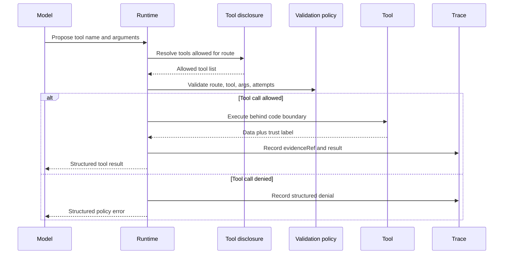

# Lab 01 - Build a Tool-Using Agent

Download the [lab completion worksheet](/capstone-assets/templates/lab-completion-worksheet.txt) and [lab production readiness worksheet](/capstone-assets/templates/lab-production-readiness-worksheet.txt) before you start.

## Objective

Build the smallest useful tool boundary: a runtime receives a proposed tool call, validates the route and arguments, executes the tool behind code, marks trusted and untrusted outputs, and returns a structured result.

## What You Will Use

- Language: TypeScript
- Framework/runtime: minimal custom runtime with an AutoGen-style example path
- Framework-agnostic lesson: the model may propose tool use, but software owns validation, execution, and error handling.
- Pattern chapter: [Tool Use](/foundations/tool-use)
- Source folder: [`tool-using-agent-pattern/`](https://github.com/GTuritto/Agentic-Systems-Patterns/tree/main/tool-using-agent-pattern)
- Download: [tool-use.zip](/downloads/tool-use.zip)
- Main file: `tool-using-agent-pattern/typescript/src/tool_runtime.ts`
- Demo file: `tool-using-agent-pattern/typescript/src/run_demo.ts`

## Exercise Time Budget

These estimates assume dependencies are already installed.

| Exercise | Time | Output |
| --- | ---: | --- |
| Setup and baseline run | 5 min | Passing tool-runtime command output. |
| Inspect the tool boundary | 8 min | Notes on route validation, trusted data, and untrusted policy text. |
| Change one route or tool case | 8-10 min | A visible success, denial, or controlled error. |
| Review the production gap | 5-7 min | One missing control to carry into the readiness worksheet. |

## Setup

From the repository root:

```sh
npm install
```

This lab runs without a model key. It exercises the tool runtime directly so you can inspect the software boundary before adding model proposals.

## Run It

```sh
npm run tool-using-agent
```

Expected output:

```json
{
  "order": {
    "status": "ok",
    "tool": "read_order",
    "trust": "trusted_system"
  },
  "policy": {
    "status": "ok",
    "tool": "search_refund_policy",
    "trust": "untrusted_content"
  }
}
```

The actual output also includes tool data and `evidenceRef` values. Record those fields in the lab completion worksheet.

## Inspect The Code

Open `tool-using-agent-pattern/typescript/src/tool_runtime.ts` and find:

- `ToolName`: the exposed tool names.
- `ToolContext`: the runtime context for route, approvals, timeouts, and attempts.
- `disclosedTools(route)`: the route-based tool disclosure boundary.
- `validateProposal(proposal, context)`: the validation boundary.
- `execute(proposal, context)`: the execution boundary.

Then open `tool-using-agent-pattern/typescript/src/run_demo.ts` and find the two demo proposals: `read_order` and `search_refund_policy`.

The important design point is that a model may propose a tool call, but code owns disclosure, validation, execution, trust marking, and evidence references.

## Change One Thing

Change the route in `run_demo.ts` from:

```ts
route: "refund_investigation",
```

to:

```ts
route: "order_status",
```

Run the lab again.

## Expected Result

The `read_order` call should still succeed because `order_status` may use that tool. The `search_refund_policy` call should be denied because that route exposes only `read_order`.

Record the denial as the intentional failure path. It proves that tool availability depends on the route, not on what the model asks for.

Use this flow as the acceptance model for the lab. The model proposes a call, but the runtime owns disclosure, validation, execution, trust marking, and trace evidence.



## Lab Review Gate

Before moving on, verify the boundary instead of only checking the happy path:

| Check | Evidence |
| --- | --- |
| Tool disclosure is narrow | `order_status` exposes `read_order`; `refund_investigation` exposes refund-investigation tools. |
| Tool execution is code-owned | `ToolRuntime` executes `read_order` and `search_refund_policy`; model text does not. |
| Invalid route/tool use is controlled | A hidden or disallowed tool returns a structured denial. |
| Trust is explicit | Order data is `trusted_system`; policy text is `untrusted_content`. |
| Evidence is traceable | Successful tool results include `evidenceRef`. |
| The production gap is visible | The lab names missing authorization integration, trace export, dashboards, deployment, and incident handling. |

Record the command, output, and failure behavior in the lab completion worksheet.

## Production Extension

Replace prefix routing with a typed tool request:

- tool name
- JSON schema for arguments
- authorization check
- timeout
- structured success or error result
- trace ID for the run

Do not give the model broad access to arbitrary functions. Expose narrow tools with explicit permissions.

## Production Bridge

Use this table when adapting the lab to a real product tool:

| Lab Concept | Production Version |
| --- | --- |
| `ToolName` union | Versioned tool manifest with owner, permission, timeout, and side-effect class. |
| `disclosedTools(route)` | Route, actor, tenant, and risk-based tool disclosure. |
| `validateProposal(...)` | Schema, policy, approval, budget, and state validation. |
| `trust` field | Data classification that separates trusted system data from untrusted content. |
| `evidenceRef` | Trace-linked evidence reference for audit, replay, and evals. |
| Demo console output | Structured response plus trace event, eval record, and dashboard signal. |

The first production milestone is not adding more tools. It is proving that one tool can be called, denied, traced, and tested safely.

## Cross-Framework Mapping

- In LangGraph, this boundary usually appears as a tool node or callable bound to graph state.
- In Mastra AI, it maps to a typed tool exposed through an agent or workflow.
- In AutoGen-style systems, it maps to a function/tool call proposed by an assistant and executed by the runtime.
- In CrewAI, it maps to tools assigned to an agent role, with the flow or crew configuration limiting access.

## Related Chapters

- [MCP-first Tool Use](/tools-skills-protocols/mcp-first-tool-use)
- [Human Approval Gates](/tools-skills-protocols/human-approval-gates)
- [Policy Enforcement](/production-runtime/policy-enforcement)
