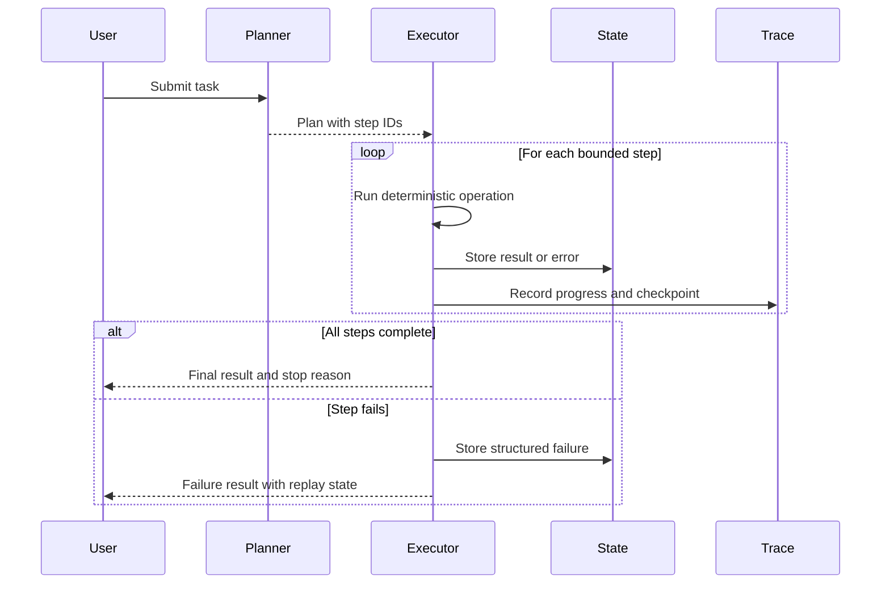
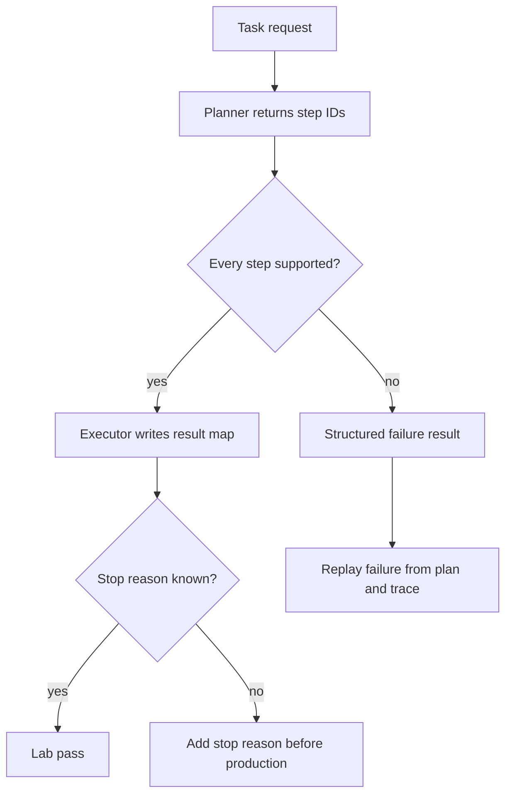

# Lab 02 - Build an Agent Loop with Planning

Download the [Lab 02 planning loop guided exercise worksheet](/capstone-assets/templates/lab-02-planning-loop-guided-exercise.txt), [lab completion worksheet](/capstone-assets/templates/lab-completion-worksheet.txt), and [lab production readiness worksheet](/capstone-assets/templates/lab-production-readiness-worksheet.txt) before you start.

## Objective

Separate planning from execution. The planner decides the steps; the executor runs bounded operations and records results. This gives you the control structure behind many agent loops without making every step autonomous.

## What You Will Use

- Language: TypeScript, with a Python mirror
- Framework/runtime: framework-neutral planner and executor
- Framework-agnostic lesson: planning and execution are separate responsibilities even when a framework packages them together.
- Pattern chapters: [Agent Loop](/foundations/agent-loop), [Planning and Execution](/control-loops/planning-and-execution)
- Source folder: [`planning-pattern/`](https://github.com/GTuritto/Agentic-Systems-Patterns/tree/main/planning-pattern)
- Download: [planning-and-execution.zip](/downloads/planning-and-execution.zip)
- Main files:
  - `planning-pattern/typescript/src/planner.ts`
  - `planning-pattern/typescript/src/executor.ts`
  - `planning-pattern/typescript/src/run.ts`

## Exercise Time Budget

These estimates assume dependencies are already installed.

| Exercise | Time | Output |
| --- | ---: | --- |
| Setup and baseline test | 5-8 min | Passing planner/executor test output. |
| Run the baseline plan trace | 10-12 min | Plan steps, result map, and stop signal. |
| Change input and inspect failures | 10-15 min | Evidence for changed input plus unsupported or missing-input behavior. |
| Write the stop-condition rule | 10-15 min | A caller-facing stop reason and production handling note. |
| Complete the review gate | 5 min | Worksheet notes for execution boundary and production gap. |

## Setup

From the repository root:

```sh
npm install
```

## Run It

Run the deterministic test:

```sh
npm run plan:test
```

Run the CLI path:

```sh
npm run plan:run -- "Compute average of [1,2,3,4]"
```

Run the Python mirror:

```sh
npm run plan:py
```

## Inspect The Code

Open `planning-pattern/typescript/src/planner.ts` and inspect how a task becomes a list of steps. Then open `planning-pattern/typescript/src/executor.ts` and inspect how execution turns those steps into named results.

Look for these boundaries:

- the plan object
- step IDs
- deterministic executor functions
- result map
- failure surface

## Change One Thing

Change the task text:

```sh
npm run plan:run -- "Compute average of [10,20,30]"
```

Then inspect whether the deterministic fallback still produces the expected plan shape.

## Expected Result

The test should print:

```text
Planning test OK
```

The CLI should print a plan, progress events, and a computed result:

```text
Plan: {
  steps: [
    { id: 's1', description: 'Load numbers [1,2,3,4]' },
    { id: 's2', description: 'Compute average' }
  ],
  rationale: 'synthetic'
}
Progress 0 s1
Progress 50 s2
Progress 100 done
Results: { s1: [ 1, 2, 3, 4 ], s2: 2.5 }
```

After changing the task to `[10,20,30]`, the result should be:

```text
Results: { s1: [ 10, 20, 30 ], s2: 20 }
```

If you extend the planner, keep the executor deterministic and testable.

Use this flow as the acceptance model for the lab. The planner may choose the steps, but execution remains bounded, traceable, and replayable.



## Guided Exercises

Use these exercises to turn the happy path into a reviewable loop trace.

| Exercise | Time | What To Do | Evidence To Save |
| --- | ---: | --- | --- |
| Baseline plan trace | 10 min | Run `npm run plan:test` and the CLI command for `[1,2,3,4]`. | Plan steps, progress events, result map, and stop signal. |
| Input-change trace | 8 min | Run the CLI command for `[10,20,30]`. | The changed `s1` input and changed `s2` average. |
| Unsupported-step trace | 8 min | Inspect the negative cases in `planning-pattern/typescript/test/planning.spec.ts`. | A structured `unsupported_step` failure instead of `null`. |
| Missing-input trace | 8 min | Inspect the test case that runs `Compute average` without loading numbers first. | A structured `missing_numbers` failure. |
| Production stop rule | 10 min | Write the stop reason you would expose to a caller. | `success`, `unsupported_step`, `missing_numbers`, or `budget_exhausted`. |



## Stop-Condition Exercise

The executor now returns a failure object for unsupported or malformed work. Use this as the model for production stop conditions:

```ts
await executePlan([
  { id: "s9", description: "Send refund directly" }
]);
```

Expected evidence:

```json
{
  "s9": {
    "status": "failed",
    "error_type": "unsupported_step",
    "step_id": "s9",
    "description": "Send refund directly"
  }
}
```

This failure is valuable because it is replayable. A production loop should never make the reviewer infer whether a plan stopped because it finished, failed validation, exhausted budget, or hit policy.

## Lab Review Gate

Before moving on, verify the control loop:

| Check | Evidence |
| --- | --- |
| Planning is separate from execution | `planner.ts` produces steps; `executor.ts` runs bounded operations. |
| Steps are identifiable | Each step can be named, traced, and connected to a result. |
| The executor stays deterministic | The same supported plan produces the same result. |
| Failure has a surface | Unsupported or malformed tasks can return a structured failure path. |
| The stop condition is explicit | The lab can explain why the run ended. |

Record the plan shape, result map, and one failure path in the lab completion worksheet.

## Production Extension

Add loop controls before using this pattern in production:

- maximum steps
- maximum retries
- stop reason
- checkpoint after each step
- structured error result
- human review for high-risk steps

Planning is useful only when execution is bounded and inspectable.

## Production Bridge

Use this table when adapting the lab to a product workflow:

| Lab Concept | Production Version |
| --- | --- |
| Plan object | Versioned plan schema with owner and risk class. |
| Step IDs | Workflow step IDs with trace spans and retry policy. |
| Result map | Durable state with checkpoint, status, and error class. |
| Deterministic executor | Tool or workflow node with timeout, idempotency, and policy gate. |
| CLI run | Request envelope with actor, tenant, budget, trace ID, and stop reason. |

The first production milestone is a replayable plan. If a failure cannot be replayed from state and trace, the loop is still a demo.

## Cross-Framework Mapping

- In LangGraph, planning and execution can be separate nodes connected through shared graph state.
- In Mastra AI, the same split can appear as a workflow that coordinates agent and tool steps.
- In AutoGen-style systems, a manager agent may propose a plan while executor functions perform bounded work.
- In CrewAI, a flow can own the sequence while crews or agents handle delegated tasks.

## Related Chapters

- [Goals and State](/foundations/goals-and-state)
- [Self-Healing Workflows](/control-loops/self-healing-workflows)
- [Durable Workflows](/production-runtime/durable-workflows)
