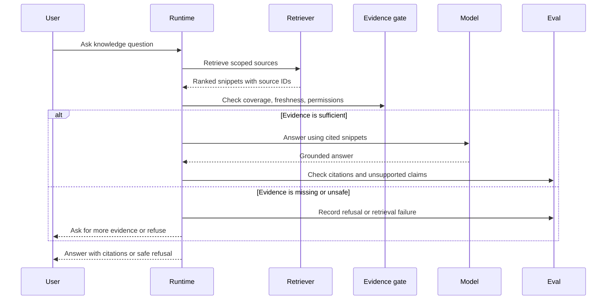

# Lab 03 - Build Agentic RAG

Download the [Lab 03 Agentic RAG guided exercise worksheet](/capstone-assets/templates/lab-03-agentic-rag-guided-exercise.txt), [lab completion worksheet](/capstone-assets/templates/lab-completion-worksheet.txt), and [lab production readiness worksheet](/capstone-assets/templates/lab-production-readiness-worksheet.txt) before you start.

## Objective

Build the retrieval boundary behind an Agentic RAG system: retrieve scoped evidence, inject it into context, answer from that evidence, and refuse or escalate when the evidence is not enough.

## What You Will Use

- Language: Python
- Framework/runtime: LangChain/LangGraph-style retrieval stack with FAISS and Hugging Face embeddings
- Framework-agnostic lesson: retrieval produces scoped evidence; generation should stay grounded in that evidence.
- Pattern chapters: [Semantic Recall and RAG](/memory-knowledge/semantic-recall-rag), [Agentic RAG Systems](/systems-architecture/agentic-rag-systems)
- Source folder: [`context-engineering-pattern/`](https://github.com/GTuritto/Agentic-Systems-Patterns/tree/main/context-engineering-pattern)
- Download: [semantic-recall-rag.zip](/downloads/semantic-recall-rag.zip)
- Main file: `context-engineering-pattern/langgraph_python_example/rag_example.py`
- Native comparison: `native-framework-examples/langgraph-research-rag/` ([download](/downloads/native-langgraph-research-rag.zip))

## Exercise Time Budget

These estimates assume the Python environment is ready.

| Exercise | Time | Output |
| --- | ---: | --- |
| Setup and baseline retrieval | 10-15 min | Query, retrieved context, and generated or fallback answer. |
| Change the corpus or query | 10-15 min | Evidence that the answer changes because retrieval changed. |
| Run the missing-evidence check | 10-15 min | Refusal or escalation note for unsupported questions. |
| Sketch the source contract | 15 min | Source packet fields for owner, freshness, access, and allowed use. |
| Compare the native graph | 15 min | Mapping from retrieval steps to graph nodes and eval gates. |

## Setup

The RAG example is Python-based. It can run in local fallback mode without a model key or optional vector-store dependencies. Install the full requirements when you want the FAISS and Hugging Face path.

From the repository root:

```sh
python3 -m venv .venv-rag
source .venv-rag/bin/activate
pip install -r context-engineering-pattern/langgraph_python_example/requirements.txt
```

For live answer generation, set `MISTRAL_API_KEY`. Without the key, the script prints a deterministic local answer from retrieved context.

## Run It

```sh
python3 context-engineering-pattern/langgraph_python_example/rag_example.py
```

## Inspect The Code

Open `context-engineering-pattern/langgraph_python_example/rag_example.py` and find:

- `docs`: the tiny demo corpus.
- `HuggingFaceEmbeddings`: the embedding model.
- `FAISS.from_texts`: the vector index.
- `retrieve(query)`: the retrieval boundary.
- `chat_mistral(messages)`: the generation boundary.

The key design move is to keep retrieved evidence separate from the instruction. The model should answer from the context, not from vague memory.

## Change One Thing

Add a new document to the `docs` list:

```py
{"content": "Agentic RAG uses retrieval, planning, tool use, and verification around a knowledge base."}
```

Then change the query:

```py
query = "What makes RAG agentic?"
```

## Guided Exercises

Use these exercises to turn the lab into an evidence pack. Each exercise should leave one note in the guided worksheet.

| Exercise | Time | Action | Done When |
| --- | ---: | --- | --- |
| Baseline retrieval trace | 10 min | Run the script unchanged and copy the query, retrieved context, and answer. | You can point to the exact text that entered generation. |
| Grounding change | 15 min | Add the Agentic RAG document above and change the query. | The answer changes because retrieved evidence changed. |
| Missing-evidence check | 15 min | Ask a question the tiny corpus cannot support, such as `What is the refund policy?`. | You can explain why this demo should refuse or escalate in production. |
| Source contract sketch | 15 min | Rewrite one document as a source packet with `source_id`, `owner`, `freshness`, and `allowed`. | You can name the metadata a real retriever must carry. |
| Native graph comparison | 15 min | Open `native-framework-examples/langgraph-research-rag/research_rag_graph.py` and compare its nodes with this lab. | You can map access policy, retrieval, filtering, answer synthesis, escalation, and evals to graph nodes. |

For the missing-evidence check, do not treat a fluent answer as success. The success signal is that you can identify the unsupported claim and the production control that should block it.

## Expected Result

Without a model key, the script should print a local fallback answer:

```text
Answer: Local fallback answer from retrieved context: Agentic systems are autonomous AI systems.

Prompt engineering improves LLM outputs.
```

With `MISTRAL_API_KEY`, the answer should reflect the retrieved context through the Mistral generation call.

After you add the new document and change the query, the answer should reflect the new document. If the answer does not cite or use retrieved evidence, the retrieval boundary is not doing enough work.

Use this flow as the lab's acceptance model: every answer must pass through scoped retrieval, evidence checks, and citation evaluation before it reaches the user.



## Lab Review Gate

Before moving on, verify the evidence path:

| Check | Evidence |
| --- | --- |
| Retrieval is visible | The code has a clear `retrieve(query)` boundary. |
| Evidence is scoped | Retrieved text is separated from instructions and generation logic. |
| Local fallback works | The script can answer from retrieved context without a provider key. |
| The answer uses evidence | The response changes when the corpus and query change. |
| Missing evidence is recognized | You can name what the demo would do poorly when no approved document exists. |
| Production controls are named | The lab identifies source IDs, ACLs, freshness, citation checks, and refusal behavior. |

Record the query, retrieved evidence, answer, and missing-evidence gap in the lab completion worksheet.

## Source-Grounding Exercise

Use this mini-review after the grounding change:

| Question | Answer |
| --- | --- |
| Which document should be retrieved first? | The document that mentions Agentic RAG. |
| Which answer sentence depends on that document? | The sentence explaining that Agentic RAG wraps retrieval with planning, tool use, or verification. |
| Which sentence would be unsupported without it? | Any claim about "what makes RAG agentic." |
| What would production add? | Source ID, citation label, freshness rule, access filter, and citation eval. |

If the answer does not change after adding the new document, inspect the retrieval boundary first. The problem may be query wording, ranking, missing metadata, or a context packet that gives the model too little evidence.

## Intentional Failure Exercise

Change the query to a topic outside the corpus:

```py
query = "What is the refund policy?"
```

The toy script will still build a context packet from the closest available documents. That is acceptable for a minimal demo, but it is not acceptable production behavior. Record the failure as:

```text
failure_type: missing_approved_evidence
observed_behavior: local fallback used unrelated retrieved context
production_behavior: refuse, clarify, or retrieve from an approved refund-policy source
eval_fixture: question should not answer unless approved refund-policy evidence is present
```

This is the key lesson of the lab: retrieval is not enough. The system needs an evidence gate that can say "the corpus does not support this answer."

## Production Extension

Add production controls:

- document IDs
- source URLs
- freshness timestamps
- access-control filters
- citation requirements
- prompt-injection checks on retrieved text
- refusal when evidence is missing

Agentic RAG is not only vector search. It is a controlled loop around retrieval, evidence, tool use, and verification.

## Production Bridge

Use this table when adapting the lab to a real knowledge system:

| Lab Concept | Production Version |
| --- | --- |
| Tiny `docs` list | Governed corpus with source IDs, owners, ACLs, freshness, and retention rules. |
| FAISS demo index | Managed retrieval service with index version, filters, evals, and rollback. |
| Retrieved text | Evidence packet with source metadata, omitted-source notes, and citation labels. |
| Mistral generation call | Answer synthesis constrained to approved evidence. |
| Manual inspection | Citation eval, stale-source eval, forbidden-source eval, and escalation test. |

The first production milestone is not a bigger index. It is a retrieval path that can refuse unsupported answers and explain which evidence it used.

## Native Framework Extension

After the deterministic RAG example passes, compare it with `native-framework-examples/langgraph-research-rag/`. The native slice maps the same boundary to a LangGraph `StateGraph` with nodes for access policy, retrieval, source filtering, answer synthesis, escalation, and citation evals.

Completion standard: the native graph should prove that stale and forbidden sources are omitted before answer synthesis, and that missing approved evidence escalates instead of producing an unsupported answer.

## Cross-Framework Mapping

- In LangGraph, retrieval can be a graph node that updates state with evidence before generation.
- In LangChain, this maps to retrievers, document loaders, vector stores, and chains or runnables.
- In Mastra AI, retrieval becomes a knowledge or tool capability used by an agent or workflow.
- In CrewAI, a research role may retrieve evidence, but the flow still needs to validate grounding and citations.

## Related Chapters

- [Context Engineering](/foundations/context-engineering)
- [Knowledge-Bound Agents](/memory-knowledge/knowledge-bound-agents)
- [Working Memory](/memory-knowledge/working-memory)
- [Research RAG Agent Capstone](/capstone-projects/research-rag-agent)
