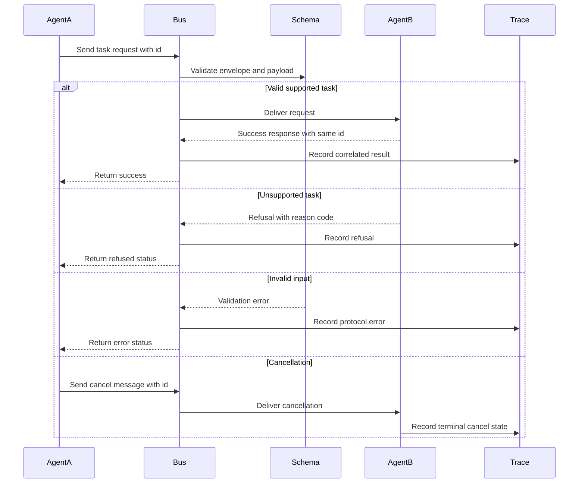

# Lab 04 - Build A2A Agent Communication

Download the [lab completion worksheet](/capstone-assets/templates/lab-completion-worksheet.txt) and [lab production readiness worksheet](/capstone-assets/templates/lab-production-readiness-worksheet.txt) before you start.

## Objective

Build a typed communication boundary between two agents. One agent requests work, another agent accepts, refuses, errors, or receives cancellation through explicit messages.

## What You Will Use

- Language: TypeScript
- Framework/runtime: protocol-first runtime with Ajv JSON schema validation
- Framework-agnostic lesson: agent communication needs typed envelopes, correlation IDs, refusal states, error states, and cancellation.
- Pattern chapter: [A2A Agent Interoperability](/tools-skills-protocols/a2a-agent-interoperability)
- Source folder: [`agent-to-agent-communication-pattern/`](https://github.com/GTuritto/Agentic-Systems-Patterns/tree/main/agent-to-agent-communication-pattern)
- Download: [a2a-agent-interoperability.zip](/downloads/a2a-agent-interoperability.zip)
- Main files:
  - `agent-to-agent-communication-pattern/src/agent_a.ts`
  - `agent-to-agent-communication-pattern/src/agent_b.ts`
  - `agent-to-agent-communication-pattern/src/bus_memory.ts`
  - `agent-to-agent-communication-pattern/protocol/a2a.schema.json`

## Exercise Time Budget

These estimates assume dependencies are already installed.

| Exercise | Time | Output |
| --- | ---: | --- |
| Setup and baseline protocol test | 8 min | Passing A2A test output. |
| Inspect the message schema | 10-12 min | Notes on task IDs, states, refusals, errors, and cancellation. |
| Change one message path | 10-15 min | A visible success, refusal, invalid-input, or cancellation result. |
| Review protocol failure ownership | 10-15 min | Owner and handling rule for malformed or cancelled work. |
| Complete production mapping | 5-10 min | Transport, auth, replay, and schema-version notes. |

## Setup

From the repository root:

```sh
npm install
```

## Run It

Run the protocol test:

```sh
npm run a2a:test
```

Run the demo:

```sh
npm run a2a:run
```

## Inspect The Code

Open `agent-to-agent-communication-pattern/src/agent_a.ts` and `agent-to-agent-communication-pattern/src/agent_b.ts`.

Look for:

- handshake
- task request
- task response
- refusal
- invalid input error
- cancellation
- schema validation with Ajv

## Change One Thing

In the test, add a second valid task request with a different ID:

```ts
a.requestTask('t5', 'sum', { a: 10, b: 15 });
```

Run:

```sh
npm run a2a:test
```

## Expected Result

The receiver should process the new task without confusing it with the existing task IDs. If correlation IDs are missing, progress and results become hard to match.

The test should print four outcomes:

```text
AgentA received response: { id: 't1', status: 'success', output: { sum: 3 } }
AgentA received response: { id: 't2', status: 'refused', error: 'unsupported_task' }
AgentA received response: { id: 't3', status: 'error', error: 'invalid_input' }
AgentB cancel received: { id: 't4', reason: 'user_request' }
A2A tests executed: success, refusal, error, cancel
```

The demo should print the happy path:

```text
AgentA received response: { id: 't1', status: 'success', output: { sum: 7 } }
```

Use this flow as the acceptance model for the lab. A2A communication is healthy only when the protocol handles success, refusal, invalid input, and cancellation with the same correlation discipline.



## Lab Review Gate

Before moving on, verify the protocol boundary:

| Check | Evidence |
| --- | --- |
| Messages are typed | The A2A schema validates task requests, responses, refusals, errors, and cancellations. |
| Correlation is explicit | Each task has an ID that connects request, progress, result, and cancellation. |
| Refusal is a first-class state | The receiver can reject unsupported work without pretending success. |
| Invalid input is controlled | Malformed payloads produce an error outcome. |
| Cancellation is observable | Cancelled work has a message and terminal state. |

Record the task IDs, message types, and one invalid-input case in the lab completion worksheet.

## Production Extension

Before using A2A across services, add:

- authentication
- authorization
- idempotency keys
- task leases
- retry policy
- durable task state
- audit logs
- transport-level encryption

A2A is a protocol boundary, not just one agent calling another function.

## Production Bridge

Use this table when adapting the lab to service-to-service agent communication:

| Lab Concept | Production Version |
| --- | --- |
| In-memory bus | Authenticated transport with durable delivery and retry policy. |
| Task ID | Correlation ID plus idempotency key and trace ID. |
| JSON schema | Versioned protocol contract with compatibility tests. |
| Refusal message | Policy-aware denial with reason code and audit record. |
| Cancellation message | Lease, timeout, cancellation reason, and cleanup behavior. |

The first production milestone is a message contract that can survive retries, refusal, cancellation, and replay without losing ownership.

## Cross-Framework Mapping

- In LangGraph, this resembles graph-to-graph or service-to-service handoff with typed state.
- In Mastra AI, this maps to service or workflow boundaries around agent calls.
- In AutoGen-style systems, it maps to structured messages between agents rather than free-form chat alone.
- In CrewAI, it maps to task handoffs and role outputs that still need schema, identity, and trace correlation.

## Related Chapters

- [Secure Agent Communication](/tools-skills-protocols/secure-agent-communication)
- [MCP-first Tool Use](/tools-skills-protocols/mcp-first-tool-use)
- [Open Personal Agent Architectures](/systems-architecture/open-personal-agent-architectures)
