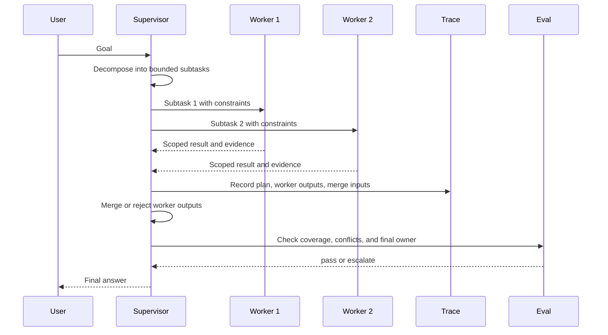

# Lab 05 - Build a Multi-Agent Supervisor

Download the [lab completion worksheet](/capstone-assets/templates/lab-completion-worksheet.txt) and [lab production readiness worksheet](/capstone-assets/templates/lab-production-readiness-worksheet.txt) before you start.

## Objective

Build the supervision shape behind multi-agent systems: one coordinator owns the goal, delegates bounded work, gathers worker outputs, and produces the final answer.

## What You Will Use

- Language: TypeScript
- Framework/runtime: AutoGen-style manager/worker example
- Framework-agnostic lesson: a supervisor owns decomposition, worker contracts, merge policy, and final synthesis.
- Pattern chapters: [Supervisor / Worker](/multi-agent-systems/supervisor-worker), [Task Delegation](/multi-agent-systems/task-delegation)
- Source folder: [`hierarchical-agent-pattern/`](https://github.com/GTuritto/Agentic-Systems-Patterns/tree/main/hierarchical-agent-pattern)
- Download: [supervisor-worker.zip](/downloads/supervisor-worker.zip)
- Main file: `hierarchical-agent-pattern/autogen_typescript_example/hierarchical_agent.ts`

## Exercise Time Budget

These estimates assume dependencies are already installed.

| Exercise | Time | Output |
| --- | ---: | --- |
| Setup and baseline run | 8-10 min | Deterministic or live supervisor output. |
| Inspect supervisor and worker contracts | 12 min | Notes on goal ownership, role boundaries, and merge behavior. |
| Change delegation or parsing | 12 min | Evidence that bounded worker output still controls synthesis. |
| Review aggregation failure | 10 min | Handling rule for missing, conflicting, or weak worker output. |
| Complete production mapping | 5-10 min | Worker contract, merge policy, trace, and final-owner notes. |

## Setup

This example can run in two modes:

- Local deterministic mode when `MISTRAL_API_KEY` is not set.
- Live Mistral mode when `MISTRAL_API_KEY` is present in `.env`.

From the repository root:

```sh
npm install
cp .env.example .env
```

Set `MISTRAL_API_KEY` in `.env` only if you want the live-model path. Leave it unset if you want the deterministic lab output below.

## Run It

```sh
npm run hierarchical-agent
```

When prompted, enter a goal such as:

```text
Draft a short plan for evaluating an agentic RAG prototype.
```

## Inspect The Code

Open `hierarchical-agent-pattern/autogen_typescript_example/hierarchical_agent.ts` and find:

- the manager prompt
- worker prompts
- subtask extraction
- aggregation prompt
- final answer path

The supervisor owns decomposition and final acceptance. Workers should not silently redefine the goal.

## Change One Thing

Change the manager instruction so it asks for three subtasks instead of two. Then inspect the parsing logic:

```ts
const subTasks = managerPlan.match(/Sub-task [12]: (.*)/g) || [];
```

Update the regex so the code can collect the third subtask.

## Expected Result

The manager should produce a plan, workers should produce bounded results, and the final aggregation should combine the worker outputs. If the parsing is brittle, the supervisor loses work.

With no `MISTRAL_API_KEY`, the deterministic path should show this shape:

```text
Manager Agent Plan:
 Sub-task 1: Define evaluation criteria for answer quality, retrieval grounding, latency, and failure handling.
Sub-task 2: Create a small test set with expected evidence, negative cases, and acceptance thresholds.

Worker Agent 1 Result:
 Worker 1 result: Sub-task 1: Define evaluation criteria for answer quality, retrieval grounding, latency, and failure handling. Criteria should include citation accuracy, unsupported-claim rate, p95 latency, and visible refusal behavior.

Worker Agent 2 Result:
 Worker 2 result: Sub-task 2: Create a small test set with expected evidence, negative cases, and acceptance thresholds. The test set should include grounded answers, missing-evidence questions, stale-document checks, and threshold failures.

Final Aggregated Result for User:
 Final answer: evaluate the RAG prototype with quality, grounding, latency, and failure-handling criteria.
Use a small test set with positive cases, missing-evidence cases, stale-document cases, and blocking thresholds.
Accept the prototype only when worker evidence meets the supervisor policy.
```

The exact wording may differ in live-model mode. The required signal is the same: one manager plan, bounded worker outputs, and a final answer that uses those outputs.



Use this flow as the lab's acceptance model. The supervisor owns decomposition, worker contracts, merge policy, trace evidence, and final acceptance.

## Lab Review Gate

Before moving on, verify the supervision boundary:

| Check | Evidence |
| --- | --- |
| The supervisor owns the goal | The manager prompt decomposes work without letting workers redefine the request. |
| Worker work is bounded | Each worker receives a specific subtask and returns a scoped result. |
| Aggregation is explicit | The final answer uses worker outputs instead of hiding merge behavior. |
| Parsing risk is visible | The regex change shows why natural-language plans need structured output. |
| Failure ownership is named | The lab can explain who handles missing, conflicting, or low-quality worker output. |

Record the manager plan, worker outputs, aggregation result, and parsing gap in the lab completion worksheet.

## Production Extension

Replace natural-language subtask parsing with structured output:

- `subtasks: Array<{ id, role, objective, constraints, expected_output }>`
- worker-specific permissions
- per-worker timeout
- merge policy
- judge or evaluator
- human escalation for disagreement

Multi-agent systems need strong contracts. More agents without a merge policy usually means more failure modes.

## Production Bridge

Use this table when adapting the lab to a production multi-agent workflow:

| Lab Concept | Production Version |
| --- | --- |
| Manager prompt | Supervisor policy with task schema, routing rules, and acceptance criteria. |
| Worker prompts | Role contracts with permissions, tools, timeouts, and expected output schema. |
| Regex subtask parsing | Structured output with validation and retry-on-invalid behavior. |
| Aggregation prompt | Merge policy with conflict handling, source attribution, and final owner. |
| Console result | Trace with per-worker spans, cost, latency, stop reason, and evaluator result. |

The first production milestone is not adding more agents. It is proving that delegated work can be scoped, merged, rejected, and audited.

## Cross-Framework Mapping

- In LangGraph, this maps to a coordinator graph that routes work to specialized nodes or subgraphs.
- In Mastra AI, this maps to workflows that coordinate agents and tools under one runtime.
- In AutoGen-style systems, this is the manager/worker conversation pattern made explicit.
- In CrewAI, this maps to crews with role-specific tasks, while a flow should still own state and final acceptance.

## Related Chapters

- [Parallel Agents](/multi-agent-systems/parallel-agents)
- [Debate and Consensus](/multi-agent-systems/debate-and-consensus)
- [CrewAI Flows and Crews](/multi-agent-systems/crewai-flows-and-crews)
