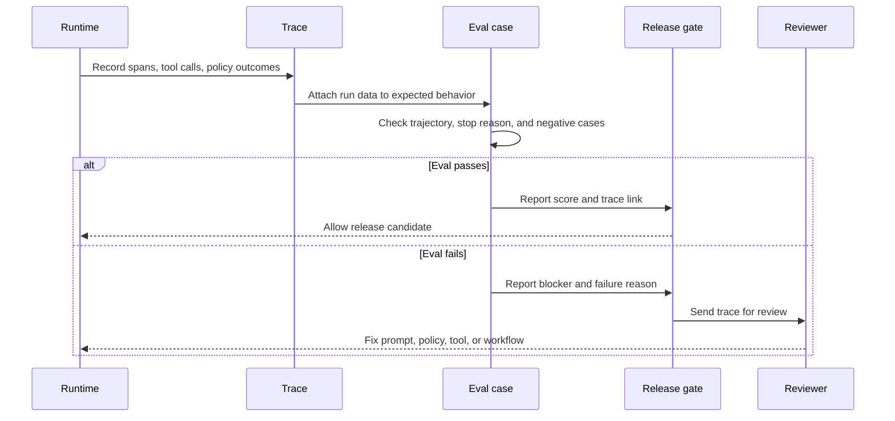
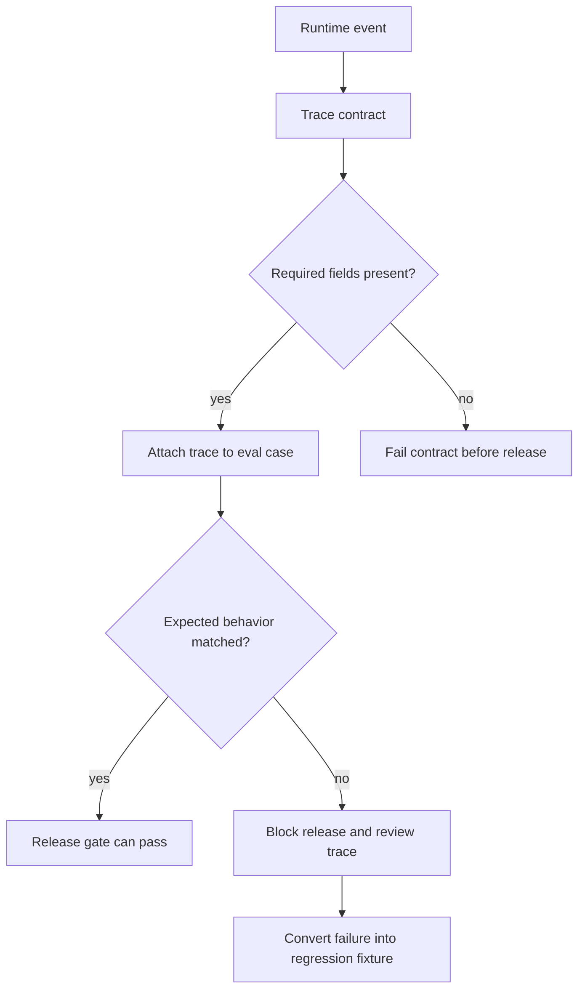

# Lab 06 - Add Observability and Evals

Download the [Lab 06 observability and evals guided exercise worksheet](/capstone-assets/templates/lab-06-observability-evals-guided-exercise.txt), [lab completion worksheet](/capstone-assets/templates/lab-completion-worksheet.txt), and [lab production readiness worksheet](/capstone-assets/templates/lab-production-readiness-worksheet.txt) before you start.

## Objective

Turn the examples into something you can evaluate. A production agent needs trace data, regression tasks, expected outcomes, and failure review before it needs more autonomy.

## What You Will Use

- Language: TypeScript
- Framework/runtime: framework-neutral tests over the repository examples
- Framework-agnostic lesson: evals should inspect trajectories, tool calls, policy outcomes, and stop reasons, not only final answers.
- Pattern chapters: [Observability and Evals](/production-runtime/observability-and-evals), [Evaluator-Optimizer](/control-loops/evaluator-optimizer)
- Source folder: [`observability-and-evals-pattern/`](https://github.com/GTuritto/Agentic-Systems-Patterns/tree/main/observability-and-evals-pattern)
- Download: [observability-and-evals.zip](/downloads/observability-and-evals.zip)
- Existing test commands:
  - `npm run observability:test`
  - `npm run plan:test`
  - `npm run a2a:test`
  - `npm run mcp:test`
  - `npm test`

## Exercise Time Budget

These estimates assume dependencies are already installed.

| Exercise | Time | Output |
| --- | ---: | --- |
| Setup and baseline eval run | 8-10 min | Passing scoped test output. |
| Inspect the trace contract | 10-12 min | Required trace fields and protected invariant. |
| Review negative cases | 15-20 min | Failure reason, severity, and release-blocking note. |
| Sketch CI and incident-to-eval gates | 15-20 min | Command, owner, threshold, and future fixture name. |
| Complete the review gate | 5-10 min | Worksheet notes for trace, eval, and production gap. |

## Setup

From the repository root:

```sh
npm install
```

## Run It

Run the deterministic checks:

```sh
npm run observability:test
npm run plan:test
npm run a2a:test
npm run mcp:test
```

Then run the full suite:

```sh
npm test
```

## Inspect The Code

Use the test files as the first eval dataset:

- `observability-and-evals-pattern/trace-contract.spec.ts`
- `observability-and-evals-pattern/trace-contract.ts`
- `planning-pattern/typescript/test/planning.spec.ts`
- `agent-to-agent-communication-pattern/test/a2a.spec.ts`
- `modern-tool-use-pattern/typescript/test/modern-tools.spec.ts`

Each test checks a contract:

- traces contain correlation IDs, model spans, stop reasons, and policy decisions for tool spans
- planning produces executable steps
- A2A handles success, refusal, error, and cancel
- MCP tool use discovers tools and returns useful data

## Change One Thing

Add one negative case to the A2A test by sending malformed input with a new task ID:

```ts
a.requestTask('t6', 'sum', { a: null, b: 10 } as any);
```

Run:

```sh
npm run a2a:test
```

## Expected Result

The system should report an error outcome, not a successful result. In an eval dataset, negative cases are as important as happy paths.

The trace contract gate should print:

```text
Trace contract test OK
```

That test proves both sides of the eval boundary: a complete trace passes, and a successful tool span without a policy decision fails.

Use this flow as the acceptance model for the lab. Observability captures what happened; evals decide whether the run is safe enough to release.



## Guided Exercises

Use these exercises to make the eval boundary visible.

| Exercise | Time | What To Do | Evidence To Save |
| --- | ---: | --- | --- |
| Trace contract baseline | 10 min | Run `npm run observability:test`. | The passing contract output and the fields protected by the test. |
| Missing-policy failure | 10 min | Inspect `missingPolicyTrace` in `trace-contract.spec.ts`. | The exact failure reason: `policy decision for tool span span_tool_missing_policy`. |
| Negative A2A case | 15 min | Add the malformed A2A input from this lab and rerun `npm run a2a:test`. | Error outcome, task ID, and why it should block release. |
| CI gate sketch | 10 min | Decide which command should block release for this slice. | `npm test`, a scoped test, or a future eval command with an owner. |
| Incident-to-eval note | 10 min | Pick one failure from the lab and turn it into a regression fixture. | Fixture name, severity, expected outcome, and trace field. |



## Intentionally Failing Eval Exercise

In `observability-and-evals-pattern/trace-contract.spec.ts`, the `missingPolicyTrace` object models a successful tool call without a policy decision. That is a release blocker because the tool used authority without an auditable allow, deny, approval, or escalation decision.

Review the failure as if it came from production:

| Question | Answer To Record |
| --- | --- |
| Which span failed? | `span_tool_missing_policy` |
| Which invariant broke? | Every tool span must have a policy decision. |
| What should CI do? | Fail the eval gate. |
| What should the owner fix? | Add the policy decision before the tool result can count as valid. |

## Lab Review Gate

Before moving on, verify the eval boundary:

| Check | Evidence |
| --- | --- |
| Trace contract is enforced | `npm run observability:test` accepts a complete trace and rejects a missing tool policy decision. |
| Tests check contracts | Planning, A2A, and MCP tests assert behavior, not only that commands run. |
| Negative cases exist | The malformed A2A input returns an error outcome. |
| Trajectory is inspected | Tests look at steps, messages, tool discovery, or outcomes before final text. |
| Release risk is visible | The lab names which failures would block a production release. |
| Eval ownership is implied | Each test protects a specific pattern boundary. |

Record the commands, pass/fail output, negative case, and protected boundary in the lab completion worksheet.

## Production Extension

Create a trace and eval record for every run:

```json
{
  "run_id": "run_001",
  "pattern": "a2a-agent-interoperability",
  "input": "sum task",
  "expected": "success with sum",
  "actual": "success with sum",
  "score": 1,
  "stop_reason": "completed",
  "latency_ms": 25
}
```

Then add release gates:

- no schema failures
- no missing trace IDs
- no unexpected tool calls
- no regression in golden tasks
- no unresolved safety or policy failures

Observability records what happened. Evals decide whether it is good enough to ship.

## Production Bridge

Use this table when adapting the lab to production evaluation:

| Lab Concept | Production Version |
| --- | --- |
| Test command | Release gate tied to changed prompt, model, tool, policy, memory, or workflow. |
| Test fixture | Versioned eval case with owner, severity, and failure reason. |
| Console output | Eval report with pass/fail, trace link, score, threshold, and blocker status. |
| Negative A2A case | Regression fixture for schema failure and unsafe trajectory. |
| Full `npm test` | CI gate plus canary monitoring and incident-to-eval workflow. |

The first production milestone is not a bigger dashboard. It is a blocking eval that catches a known bad trajectory before release.

## Cross-Framework Mapping

- In LangGraph, traces and checkpoints let you inspect node paths, state changes, and stop conditions.
- In Mastra AI, evals and observability should connect agent, tool, workflow, and memory events.
- In AutoGen-style systems, message logs need to become structured traces before they are reliable eval data.
- In CrewAI, task and flow outputs need eval cases that check role behavior and final synthesis.

## Related Chapters

- [Agent Development Lifecycle](/agent-engineering-practice/agent-development-lifecycle)
- [Evaluation-Driven Agent Development](/agent-engineering-practice/evaluation-driven-agent-development)
- [Policy Enforcement](/production-runtime/policy-enforcement)
