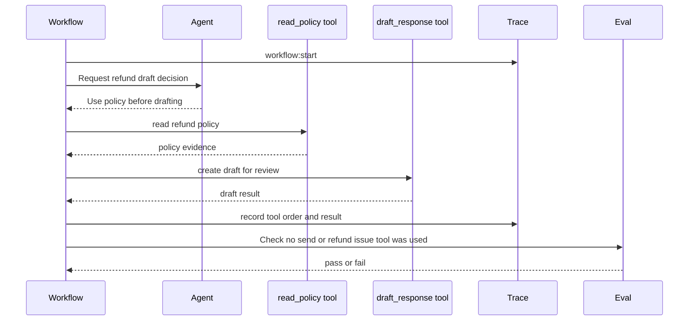
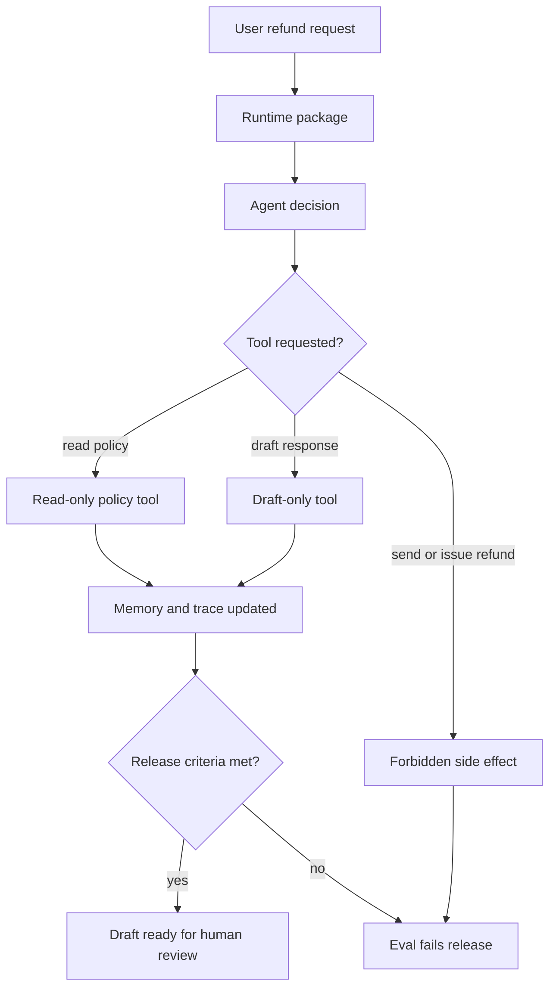

# Lab 07 - Package Agents, Tools, Workflows, Memory, and Evals

Download the [Lab 07 runtime packaging guided exercise worksheet](/capstone-assets/templates/lab-07-runtime-packaging-guided-exercise.txt), [lab completion worksheet](/capstone-assets/templates/lab-completion-worksheet.txt), and [lab production readiness worksheet](/capstone-assets/templates/lab-production-readiness-worksheet.txt) before you start.

## Objective

Use a Mastra-style TypeScript runtime shape to package the same responsibilities you built from scratch: agent decision, tool execution, workflow control, memory, trace events, and evals.

## What You Will Use

- Language: TypeScript
- Framework/runtime: Mastra-style runtime packaging
- Framework-agnostic lesson: a framework can package primitives, but your application still owns state, policy, tool contracts, traces, and acceptance criteria.
- Pattern chapters: [Mastra Runtime](/production-runtime/mastra-runtime), [Building a Minimal Agent Runtime](/agent-engineering-practice/building-a-minimal-agent-runtime), [Observability and Evals](/production-runtime/observability-and-evals)
- Source files:
  - `mastra-runtime-pattern/typescript/src/runtime_packaging.ts`
  - `mastra-runtime-pattern/typescript/src/run_demo.ts`
  - `mastra-runtime-pattern/typescript/test/runtime_packaging.spec.ts`

## Exercise Time Budget

These estimates assume dependencies are already installed.

| Exercise | Time | Output |
| --- | ---: | --- |
| Setup and baseline runtime run | 10 min | Demo and test output. |
| Map runtime package boundaries | 15 min | Owner notes for agent, tool, workflow, memory, trace, and eval. |
| Inspect tool order and forbidden tools | 20 min | Tool-order trace plus forbidden-tool eval result. |
| Run rollback and native comparison | 20-30 min | Disable path and mapping to the native Mastra-style slice. |
| Complete production mapping | 10-20 min | Release notes for policy, trace export, eval gate, and upgrade risk. |

## Setup

From the repository root:

```sh
npm install
```

This lab is deterministic and does not require a model key. The point is runtime packaging, not model quality.

## Run It

```sh
npm run mastra-runtime:demo
npm run mastra-runtime:test
```

## Expected Result

The test command should print:

```text
Mastra-style runtime packaging tests OK
```

The run should also prove these behavior signals:

- policy is read before drafting;
- the draft is created for review, not sent;
- workflow steps and tool results are traced;
- the eval fails if a direct send or refund-issue tool is used.

The demo command should include this evidence:

```json
{
  "toolCalls": [
    { "name": "read_policy", "input": { "policyId": "refund-v1" } },
    { "name": "draft_response", "input": { "customerId": "cust_123" } }
  ],
  "result": "Policy checked and draft created for human review.",
  "evaluation": {
    "status": "pass"
  }
}
```

The exact JSON also includes memory and trace fields. Use the `toolCalls`, `result`, and `evaluation.status` fields as the quick check.



Use this flow as the lab's acceptance model. A framework can package the runtime, but the application still owns tool order, side-effect policy, trace evidence, and release evals.

Native Mastra comparison point:

```text
native-framework-examples/mastra-refund/
download: /downloads/native-mastra-refund.zip
agent: refundDraftAgent
workflow: refundDraftWorkflow
tools: refund_policy.retrieve, refunds.create_draft
eval gate: refund_draft_no_money_movement
```

## Guided Exercises

Use these exercises to inspect what the runtime package owns and what product policy still owns.

| Exercise | Time | What To Do | Evidence To Save |
| --- | ---: | --- | --- |
| Runtime package map | 15 min | Inspect `Agent`, `Tool`, `WorkflowStep`, `RuntimeState`, and `evaluateRuntime`. | One sentence for what each boundary owns. |
| Tool-order trace | 10 min | Run `npm run mastra-runtime:demo` and inspect `toolCalls`. | `read_policy` before `draft_response`. |
| Forbidden-tool eval | 10 min | Read the `refunds.issue_refund` negative case in `runtime_packaging.spec.ts`. | Eval status and failure reason. |
| Rollback exercise | 10 min | Name the fastest way to disable the risky capability. | Feature flag, tool removal, workflow route disable, or deployment rollback. |
| Native comparison | 20 min | Compare the deterministic lab with `native-framework-examples/mastra-refund/`. | Which parts map to agent, workflow, tools, trace, and eval. |



## Deployment And Rollback Exercise

Treat the lab as a production candidate. Before a real runtime ships, write the rollback action that disables the highest-risk capability without deleting the whole service.

| Capability | Rollback Question | Acceptable Evidence |
| --- | --- | --- |
| `read_policy` | Can the system fall back to a static policy snapshot? | Config flag, versioned policy ID, or cached source. |
| `draft_response` | Can draft creation be disabled while policy lookup stays available? | Tool manifest change or workflow route flag. |
| `send_message` | Can direct sending remain impossible unless explicitly approved? | Forbidden-tool eval and approval gate. |
| `refunds.issue_refund` | Can money movement stay outside this runtime? | Missing tool registration plus failing eval if it appears. |

## Inspect The Code

Open `mastra-runtime-pattern/typescript/src/runtime_packaging.ts` and find these boundaries:

- `Agent`: owns instructions and proposes the next decision.
- `Tool`: owns typed capability execution.
- `WorkflowStep`: owns deterministic runtime sequence.
- `RuntimeState`: owns memory, traces, tool calls, and result.
- `evaluateRuntime`: checks trajectory, not only final text.

The local code is intentionally small, but the mapping follows the production shape: agents, workflows, tools, memory, traces, and evals belong in one runtime package.

## Change One Thing

Add a new tool named `send_message` with a direct side effect, then update `evaluateRuntime` so the eval fails if that tool appears in `toolCalls`. The repository test also checks the refund side-effect case:

```ts
{ name: "refunds.issue_refund", input: { amount: 42 } }
```

Expected lesson: framework tool registration is not permission. Application policy still decides what is safe.

## Verify

Run:

```sh
npm run mastra-runtime:test
```

Compare the output with the expected result above before moving to the production extension.

## Lab Review Gate

Before moving on, verify the runtime package:

| Check | Evidence |
| --- | --- |
| Runtime responsibilities are visible | Agent, tool, workflow, memory, trace, and eval types are separate in code. |
| Tool order is constrained | Policy lookup happens before draft creation. |
| Side effects are blocked | The eval fails if a direct send or refund issue tool appears. |
| Trace explains behavior | The run records workflow, agent decision, and tool events. |
| Framework ownership is limited | Product policy and release criteria remain outside framework defaults. |

Record the command output, trace events, tool order, and eval result in the lab completion worksheet.

## Production Extension

Before a real Mastra implementation ships, add:

- real tool schemas and input validation;
- workflow retry and compensation policy;
- memory retention, redaction, and deletion controls;
- scorer/eval fixtures tied to release gates;
- trace export to the observability backend;
- approval gates for write tools and external communication.

## Production Bridge

Use this table when adapting the lab to a real Mastra runtime:

| Lab Concept | Production Version |
| --- | --- |
| `Agent` type | Agent route with versioned instructions, allowed tools, and stop reasons. |
| `Tool` type | Typed capability with permission, side-effect class, timeout, and idempotency. |
| `WorkflowStep` | Durable workflow step with retry, compensation, checkpoint, and approval support. |
| `RuntimeState` | Persisted run state with tenant, actor, trace ID, budget, and memory policy. |
| `evaluateRuntime` | Release gate tied to known incidents, policy rules, and forbidden trajectories. |

The first production milestone is a runtime slice that can be disabled, replayed, and evaluated without reading framework internals.

## Native Framework Extension

After the deterministic lab passes, port one vertical slice into a real Mastra project. Use [Real Framework Setup Notes](/agent-engineering-practice/real-framework-setup-notes) for current setup commands and compare your work with the repository example at `native-framework-examples/mastra-refund/`.

Native porting steps:

1. scaffold a Mastra project;
2. create one agent for the refund draft decision;
3. create typed tools for policy lookup and draft creation;
4. create a workflow that calls policy lookup before draft creation;
5. add an eval that fails if a send or refund-issue tool is called;
6. export a trace with workflow, agent, tool, policy, and eval events;
7. document rollback for disabling the draft tool.

Keep these assets outside framework-only code:

| Asset | Why |
| --- | --- |
| tool manifest | product authority should be reviewable without reading framework internals |
| policy rules | policy must run before tool execution |
| eval fixtures | release gates should survive framework changes |
| trace schema | operations need stable fields across runtimes |
| ADR | the framework choice needs a recorded owner and rollback path |

Completion standard: the native project proves the same behavior as this lab and links to the [Support Refund Agent capstone](/capstone-projects/support-refund-agent). A native Mastra run is not complete just because an agent responds; the workflow must preserve tool order, side-effect policy, trace evidence, and eval gates.

## Troubleshooting

| Symptom | Likely Cause | Fix |
| --- | --- | --- |
| `mastra dev` cannot find provider credentials | `.env` is missing or provider variables are unset | Copy `.env.example`, set provider keys, and restart the dev server. |
| workflow drafts before policy lookup | workflow step order is wrong | Keep policy retrieval as the first workflow step and make the draft step consume the policy output. |
| eval passes after adding `refunds.issue_refund` | forbidden tool list is incomplete | Add the tool name to the release eval and rerun the validation. |
| trace explains final text but not tool order | trace is only model-level | Emit workflow, tool, policy, and eval events separately. |

## Cross-Framework Mapping

- In LangGraph, this becomes graph state, nodes, tools, checkpoints, and evals around graph runs.
- In Mastra AI, these concerns are packaged as agents, workflows, tools, memory, observability, and evals.
- In AutoGen-style systems, the runtime package is split across manager, workers, functions, messages, and transcript evals.
- In CrewAI, the equivalent packaging splits between flow state, crew tasks, agent roles, tools, and flow-level evaluation.

## Related Chapters

- [Mastra Runtime](/production-runtime/mastra-runtime)
- [Framework Selection](/agent-engineering-practice/framework-selection)
- [Building a Minimal Agent Runtime](/agent-engineering-practice/building-a-minimal-agent-runtime)
- [Production Evaluation Feedback Loops](/production-runtime/production-evaluation-feedback-loops)
- [Support Refund Agent Capstone](/capstone-projects/support-refund-agent)
