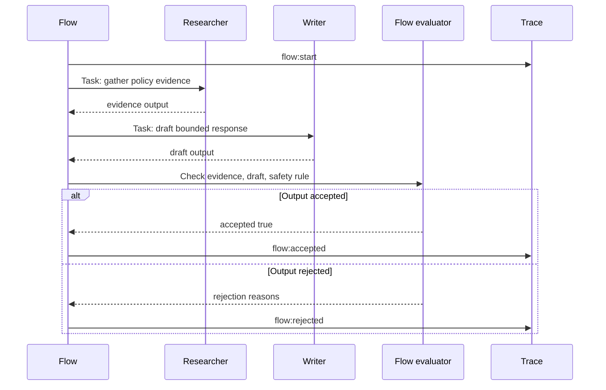

# Lab 08 - Model Flows, Crews, Roles, and Task Contracts

Download the [lab completion worksheet](/capstone-assets/templates/lab-completion-worksheet.txt) and [lab production readiness worksheet](/capstone-assets/templates/lab-production-readiness-worksheet.txt) before you start.

## Objective

Use a CrewAI-style Python shape to separate flow ownership from crew collaboration. The flow owns state, sequence, evaluation, and final acceptance. The crew owns bounded specialist work.

## What You Will Use

- Language: Python
- Framework/runtime: CrewAI-style flows and crews
- Framework-agnostic lesson: multi-agent value comes from role boundaries, task contracts, flow state, and explicit acceptance, not from adding more agents.
- Pattern chapters: [CrewAI Flows and Crews](/multi-agent-systems/crewai-flows-and-crews), [Choosing Multi-Agent Topology](/multi-agent-systems/choosing-multi-agent-topology), [Supervisor / Worker](/multi-agent-systems/supervisor-worker)
- Source files:
  - `crewai-flows-and-crews-pattern/python/flow_crew.py`
  - `crewai-flows-and-crews-pattern/python/test_flow_crew.py`

## Exercise Time Budget

These estimates assume dependencies are already installed.

| Exercise | Time | Output |
| --- | ---: | --- |
| Setup and baseline flow run | 10 min | Flow demo and test output. |
| Inspect flow and role boundaries | 15 min | Notes on state ownership, role output, and acceptance. |
| Change one role or acceptance case | 20 min | A visible accepted or rejected state. |
| Verify and troubleshoot | 10-15 min | Passing test or recorded failure cause. |
| Complete production mapping | 10-20 min | Notes for checkpoints, permissions, validators, and fallback path. |

## Setup

From the repository root:

```sh
npm install
```

This lab uses only Python standard library code. It is intentionally deterministic so you can inspect the control boundary without model variability.

## Run It

```sh
npm run crewai-flow
npm run crewai-flow:test
```

## Expected Result

The test command should print:

```text
CrewAI-style flow and crew tests OK
```

The run should also prove these behavior signals:

- researcher and writer roles produce separate outputs;
- the flow trace records start, crew kickoff, evaluation, and acceptance;
- the flow rejects output that fails the acceptance rule;
- the final state has one accountable owner.

The demo command should include this accepted-flow shape:

```text
FlowState(goal='Prepare a refund response', accepted=True, crew_outputs={'evidence': 'policy evidence for Prepare a refund response: refund window is 30 days', 'draft': 'draft based on policy evidence: offer review, do not promise payment'}, trace=['flow:start', 'flow:crew_kickoff', 'flow:evaluate', 'flow:accepted'], final='Crew output accepted by the flow.')
{'status': 'pass'}
```



Use this flow as the lab's acceptance model. The crew performs specialist work, but the flow owns state, evaluation, final acceptance, and trace evidence.

Native CrewAI comparison point:

```text
native-framework-examples/crewai-delivery/
download: /downloads/native-crewai-delivery.zip
flow: DeliveryFlow
crew: Planner, Risk reviewer, Test planner
acceptance owner: Flow
eval gate: role outputs present before acceptance
```

## Inspect The Code

Open `crewai-flows-and-crews-pattern/python/flow_crew.py` and find these boundaries:

- `FlowState`: the flow-owned source of truth.
- `Agent`: a role with a specific goal.
- `Task`: a bounded assignment to one role.
- `Crew`: the collaboration unit that executes tasks.
- `evaluate_flow`: the flow-level acceptance gate.

The important design rule is that crew output is not automatically accepted. The flow evaluates it before setting `accepted`.

## Change One Thing

Change the writer output so it omits `do not promise payment`.

Expected rejection:

```text
Crew output rejected by the flow.
{'status': 'fail', 'reasons': ['flow did not accept crew output']}
```

The repository test now runs that rejection path with an injected unsafe crew. That keeps the lab deterministic while proving that the flow, not the crew, owns final acceptance.

Then restore the writer output and rerun:

```sh
npm run crewai-flow:test
```

## Verify

Compare the output with the expected result above before moving to the production extension.

## Lab Review Gate

Before moving on, verify the flow and crew boundary:

| Check | Evidence |
| --- | --- |
| Flow owns state | `FlowState` records request, role outputs, trace, acceptance, and stop reason. |
| Roles are distinct | Researcher and writer outputs differ by responsibility. |
| Crew output is validated | `evaluate_flow` rejects output that violates the acceptance rule. |
| Acceptance has one owner | The flow, not the crew, sets final acceptance. |
| Rejection is observable | A bad writer output produces a rejected state and reason. |

Record the accepted run, rejected run, role outputs, and flow trace in the lab completion worksheet.

## Production Extension

Before a real CrewAI implementation ships, add:

- typed task inputs and outputs;
- explicit role permission boundaries;
- crew result schemas and validators;
- flow checkpoints and resumability;
- trace records per agent, task, crew, and flow step;
- evaluator cases for disagreement, missing evidence, duplicate work, and bad synthesis.

## Production Bridge

Use this table when adapting the lab to a real CrewAI implementation:

| Lab Concept | Production Version |
| --- | --- |
| `FlowState` | Durable flow state with tenant, actor, trace ID, checkpoint, and rollback data. |
| `Agent` role | Role contract with permissions, tools, model route, and expected output schema. |
| `Task` | Typed assignment with input contract, acceptance criteria, timeout, and owner. |
| `Crew` | Bounded collaboration unit with trace spans and cost budget. |
| `evaluate_flow` | Flow-level release gate for evidence, role coverage, synthesis, and safety. |

The first production milestone is not a more elaborate crew. It is a flow that can reject weak collaboration and explain why.

## Native Framework Extension

After the deterministic lab passes, port one vertical slice into a real CrewAI Flow and Crew. Use [Real Framework Setup Notes](/agent-engineering-practice/real-framework-setup-notes) for setup guidance and compare your work with the repository example at `native-framework-examples/crewai-delivery/`.

Native porting steps:

1. scaffold a CrewAI project with a Flow;
2. define Flow state for request, role outputs, acceptance, stop reason, and trace ID;
3. create researcher, writer, and reviewer agents only if each role has a distinct contract;
4. define task inputs and expected output shapes;
5. validate crew output before mutating Flow state;
6. add evals for missing evidence, bad synthesis, role disagreement, and rejected output;
7. document rollback for disabling the Crew route while keeping the deterministic Flow path.

The Flow remains the accountable owner:

| Boundary | Owner |
| --- | --- |
| state | Flow |
| task assignment | Flow |
| role behavior | Crew agents |
| output validation | Flow |
| final acceptance | Flow |
| rollback | runtime or deployment platform |

Completion standard: the native project proves the same role and acceptance behavior as this lab and links to the [Multi-Agent Delivery Workflow capstone](/capstone-projects/multi-agent-delivery-workflow). A native CrewAI run is not complete just because the crew returns text; the Flow must preserve separate role outputs and validate them before acceptance.

## Troubleshooting

| Symptom | Likely Cause | Fix |
| --- | --- | --- |
| crew returns one aggregate answer only | task outputs are not preserved separately | Read task-level outputs and copy planner, reviewer, and tester results into Flow state separately. |
| Flow accepts weak or duplicate role output | acceptance is based on completion, not validation | Add Flow-level validators before setting `accepted`. |
| provider credentials fail | CrewAI model provider variables are missing | Configure the provider environment required by your CrewAI setup. |
| roles overlap heavily | agents do not have distinct contracts | Remove the role or rewrite task contracts until each role changes risk or output quality. |
| rollback is unclear | delegation is embedded in the main path | Keep a deterministic single-owner fallback path outside the Crew route. |

## Cross-Framework Mapping

- In LangGraph, the flow can be a graph while each role maps to a node or subgraph.
- In Mastra AI, the same shape can be modeled as workflows that coordinate agents and tools.
- In AutoGen-style systems, the crew resembles manager-directed specialist agents, but the flow still needs final acceptance.
- In CrewAI, flows provide structured control while crews perform delegated collaborative work.

## Related Chapters

- [CrewAI Flows and Crews](/multi-agent-systems/crewai-flows-and-crews)
- [Choosing Multi-Agent Topology](/multi-agent-systems/choosing-multi-agent-topology)
- [Task Delegation](/multi-agent-systems/task-delegation)
- [Observability and Evals](/production-runtime/observability-and-evals)
- [Multi-Agent Delivery Workflow Capstone](/capstone-projects/multi-agent-delivery-workflow)
