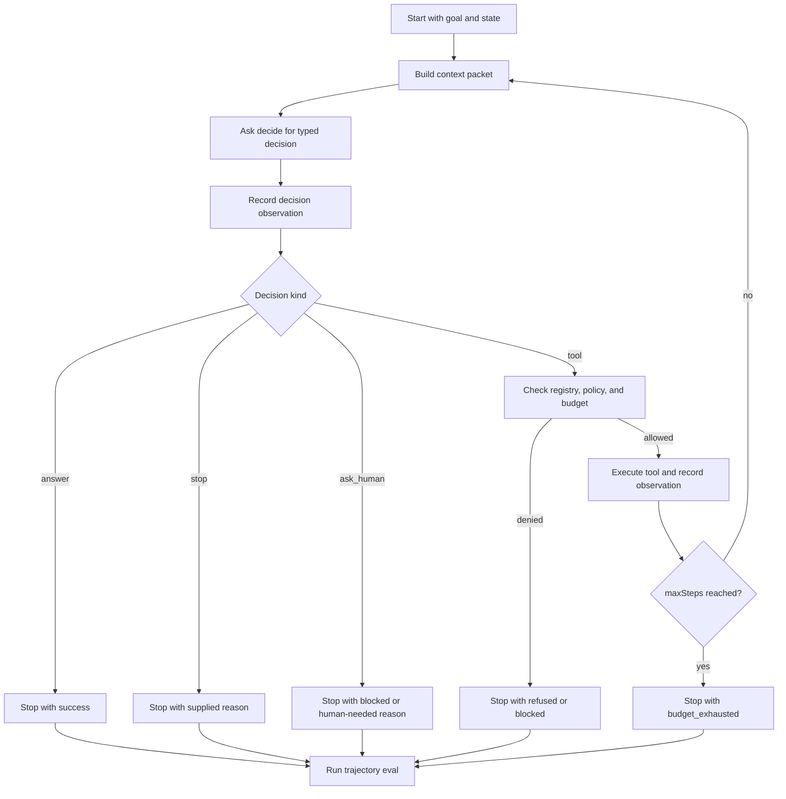

# Lab 09 - Build a Minimal Agent Loop

Download the [lab completion worksheet](/capstone-assets/templates/lab-completion-worksheet.txt) and [lab production readiness worksheet](/capstone-assets/templates/lab-production-readiness-worksheet.txt) before you start.

## Objective

Build the smallest useful runtime primitive: a loop that receives a goal, asks for a typed decision, updates state, and stops for an explicit reason.

## What You Will Use

- Language: TypeScript or Python
- Framework/runtime: from-scratch educational runtime
- Framework-agnostic lesson: an agent is a controlled loop with state, decisions, observations, budgets, and stop reasons.
- Pattern chapters: [What Is An Agent?](/foundations/what-is-an-agent), [Agent Loop](/foundations/agent-loop), [Goals and State](/foundations/goals-and-state)
- Theory chapter: [Building a Minimal Agent Runtime](/agent-engineering-practice/building-a-minimal-agent-runtime)

## Exercise Time Budget

These estimates assume dependencies are already installed.

| Exercise | Time | Output |
| --- | ---: | --- |
| Run the reference baseline | 10 min | Passing mini-runtime test output. |
| Implement or inspect the loop contract | 20-25 min | Typed state, decision, observation, and stop-reason boundaries. |
| Exercise failure and budget cases | 10-15 min | Refused, blocked, or budget-exhausted behavior. |
| Review trace and stop reasons | 10-20 min | Notes on runtime-owned limits and caller-facing outcomes. |

## Setup

Use the maintained TypeScript reference or create your own small file outside production code, such as `scratch/minimal-agent-loop.ts` or `scratch/minimal_agent_loop.py`.

Reference files:

- `minimal-agent-runtime/typescript/src/runtime.ts`
- `minimal-agent-runtime/typescript/src/run_demo.ts`
- `minimal-agent-runtime/typescript/test/runtime.spec.ts`

Run the reference test first:

```sh
npm run mini-runtime:test
```

This lab does not require a model key. Use a deterministic `decide` function so you can test the runtime without model variability.

## Runtime Contract

Use this shape if you implement the smallest version in TypeScript:

```ts
type StopReason =
  | "success"
  | "blocked"
  | "budget_exhausted"
  | "invalid_decision"
  | "tool_failure";

type Decision =
  | { kind: "answer"; text: string }
  | { kind: "tool"; name: string; input: unknown }
  | { kind: "ask_human"; question: string }
  | { kind: "stop"; reason: StopReason };

type Observation = {
  kind: "decision" | "tool" | "system";
  summary: string;
};

type AgentState = {
  goal: string;
  steps: number;
  maxSteps: number;
  observations: Observation[];
  stopReason?: StopReason;
};
```

The equivalent Python implementation can use dataclasses, typed dictionaries, or plain dictionaries. Keep the fields the same.

The maintained reference extends this contract with production-facing fields: `runId`, `toolsCalled`, scoped memory, tool definitions, policy decisions, context packets, trace events, and trajectory eval cases. Start with the small contract, then compare your result with `minimal-agent-runtime/typescript/src/runtime.ts`.

## Guided Change

Implement `runAgent(state, decide)`.

The loop should:

1. call `decide(state)`;
2. record an observation for the decision;
3. return with `success` when the decision is an answer;
4. return with the supplied reason when the decision is `stop`;
5. continue for tool decisions, or execute tools through a registry when using the reference runtime;
6. stop with `budget_exhausted` when `steps` reaches `maxSteps`.

## Baseline Run

Use the reference demo:

```sh
npm run mini-runtime
```

Then inspect the immediate-answer case in `minimal-agent-runtime/typescript/test/runtime.spec.ts`, or use a decision function that answers immediately:

```ts
const answerImmediately = async (): Promise<Decision> => ({
  kind: "answer",
  text: "done",
});
```

## Expected Result

The demo command should show a policy-read trajectory:

```json
{
  "runId": "demo_001",
  "steps": 2,
  "toolsCalled": ["lookup_policy"],
  "answer": "Policy was checked and the draft can be prepared safely.",
  "stopReason": "success"
}
```

It should also include trace events with these types:

```text
context_built
decision
policy_decision
tool_result
stop
```

The eval result should be:

```json
{
  "status": "pass",
  "caseId": "demo-policy-read"
}
```

The immediate-answer case should end with:

```text
stopReason: success
steps: 1
observations: at least one decision observation
```

The repeated-tool case should end with:

```text
stopReason: budget_exhausted
steps: maxSteps
```

The reference test also covers:

| Case | Expected Signal |
| --- | --- |
| unknown tool | `stopReason: refused`; the unknown tool is not executed. |
| write tool without approval | `stopReason: blocked`; `send_message` is not executed. |
| permissive write policy | final answer can look successful, but trajectory eval fails because `send_message` was called. |
| scoped memory | task and project memory are included; user-scope memory is omitted as `out_of_scope`. |



Use this loop as the lab's acceptance model. The runtime, not the model, owns budgets, tool authority, stop reasons, observations, and final trajectory evaluation.

## Failure Case

Use a decision function that always asks for a tool:

```ts
const neverStops = async (): Promise<Decision> => ({
  kind: "tool",
  name: "search",
  input: { query: "keep going" },
});
```

This is the first safety property of an agent runtime: the model cannot create an infinite loop just by continuing to ask.

## Verify

Check these assertions manually or with the reference test:

- immediate answer stops with `success`;
- repeated tool proposals stop with `budget_exhausted`;
- every loop step records an observation;
- the final state contains a stop reason.

The reference test covers these cases with deterministic decisions, so the result is stable across machines.

## Lab Review Gate

Before moving on, verify the loop boundary:

| Check | Evidence |
| --- | --- |
| Decisions are typed | The runtime handles answer, tool, ask-human, and stop decisions explicitly. |
| State changes are visible | Goal, step count, observations, and stop reason are recorded. |
| Budget stops the loop | Repeated tool proposals end with `budget_exhausted`. |
| Success is explicit | Immediate answers stop with `success`. |
| The model cannot self-authorize continuation | `maxSteps` belongs to the runtime, not the decision function. |
| Trajectory eval catches hidden risk | A run that sends a message can fail eval even when the final answer says success. |

Record the immediate-answer run, repeated-tool run, observations, and stop reasons in the lab completion worksheet.

## Production Extension

Before this loop can run real work, add:

- structured validation for model-produced decisions;
- tool execution through a registry;
- policy checks before side effects;
- trace events for every decision and stop;
- cancellation and timeout controls;
- durable state if the run can pause or resume.

## Production Bridge

Use this table when adapting the loop to production:

| Lab Concept | Production Version |
| --- | --- |
| `AgentState` | Durable run state with actor, tenant, trace ID, budget, and checkpoint data. |
| `Decision` | Validated model proposal with schema, policy context, and confidence metadata. |
| `Observation` | Trace event with timestamp, span ID, status, and redaction class. |
| `maxSteps` | Runtime budget with cost, latency, retry, tool, and delegation limits. |
| `stopReason` | Operator-visible reason tied to evals, dashboards, and incident review. |

The first production milestone is a loop that always stops for a reason operators can inspect.

## Cross-Framework Mapping

- In LangGraph, the loop is expressed through graph traversal, state updates, and edges.
- In Mastra AI, the loop is packaged inside agent and workflow runtime behavior.
- In AutoGen-style systems, the loop appears as message turns between manager, worker, and tool executors.
- In CrewAI, the loop is shaped by flow execution and task progression.

## Related Chapters

- [Building a Minimal Agent Runtime](/agent-engineering-practice/building-a-minimal-agent-runtime)
- [Agent Loop](/foundations/agent-loop)
- [Goals and State](/foundations/goals-and-state)
- [Durable Workflows](/production-runtime/durable-workflows)
