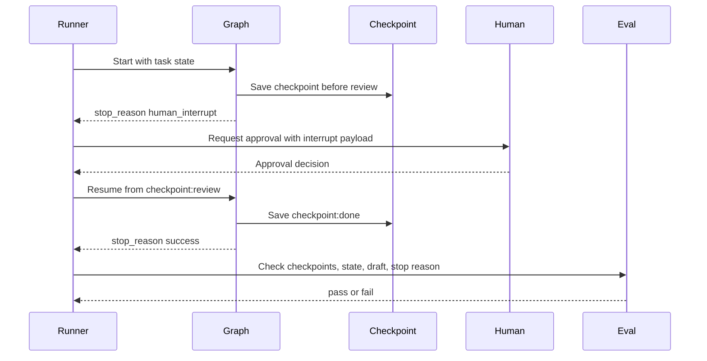
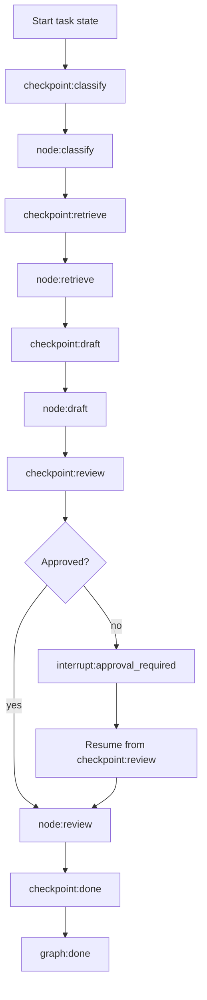

# Lab 12 - Model State Graphs, Checkpoints, and Interrupts

Download the [Lab 12 state graph guided exercise worksheet](/capstone-assets/templates/lab-12-state-graph-guided-exercise.txt), [lab completion worksheet](/capstone-assets/templates/lab-completion-worksheet.txt), and [lab production readiness worksheet](/capstone-assets/templates/lab-production-readiness-worksheet.txt) before you start.

## Objective

Use a LangGraph-style Python state graph to make state, nodes, edges, checkpoints, interrupts, and resume behavior explicit.

## What You Will Use

- Language: Python
- Framework/runtime: LangGraph-style state graph
- Framework-agnostic lesson: graph execution is valuable when state transitions, branching, pause/resume, and node-level observability matter.
- Official terminology checked: LangGraph graph state, nodes, edges, checkpoints, and interrupts.
- Pattern chapters: [Agent Loop](/foundations/agent-loop), [Goals and State](/foundations/goals-and-state), [Durable Workflows](/production-runtime/durable-workflows)
- Source files:
  - `langgraph-state-graph-pattern/python/state_graph.py`
  - `langgraph-state-graph-pattern/python/test_state_graph.py`
- Download: [langgraph-state-graph.zip](/downloads/langgraph-state-graph.zip)

## Exercise Time Budget

These estimates assume dependencies are already installed.

| Exercise | Time | Output |
| --- | ---: | --- |
| Setup and baseline graph run | 10 min | Demo and test output. |
| Inspect state, nodes, and checkpoints | 20 min | Notes on state schema, node boundaries, and checkpoint placement. |
| Exercise interrupt and resume | 20 min | Interrupted trace and resumed trace evidence. |
| Review checkpoint failure and replay safety | 20-25 min | Failing assertion or replay-risk note. |
| Compare native graph and production bridge | 10-30 min | Mapping to native graph, durable checkpointer, and approval payload. |

## Setup

From the repository root:

```sh
npm install
```

This lab is deterministic and does not require a model key. It models the LangGraph execution contract without external dependencies so the state behavior is easy to inspect.

## Run It

```sh
npm run langgraph-state
npm run langgraph-state:test
```

## Expected Result

The test command should print:

```text
LangGraph-style state graph tests OK
```

The first run should stop at human approval:

```text
stop_reason: human_interrupt
trace includes checkpoint:review
trace includes interrupt:approval_required
```

The resumed run should start from the review node with approval:

```text
stop_reason: success
trace: checkpoint:review -> node:review -> checkpoint:done -> graph:done
```

The demo command should print two graph runs. Use these fields as the quick check:

```text
first.state.stop_reason: human_interrupt
first.state.interrupted: True
first.trace: ... checkpoint:review, node:review, interrupt:approval_required
first.eval.status: pass

resumed.state.stop_reason: success
resumed.state.approved: True
resumed.state.draft: Draft a refund response for human review; do not promise payment.
resumed.trace: checkpoint:review, node:review, checkpoint:done, graph:done
resumed.eval.status: pass
```



Use this flow as the lab's acceptance model. A correct run must prove where it paused, what state survived, which approval resumed it, and why the graph stopped.

Native LangGraph comparison point:

```text
native-framework-examples/langgraph-refund/
download: /downloads/native-langgraph-refund.zip
graph: StateGraph
checkpointer: InMemorySaver for local development
interrupt: finance approval
eval gate: draft stops before money movement
```

## Guided Exercises

Use these exercises to prove that pause, resume, and replay are first-class graph behavior.

| Exercise | Time | What To Do | Evidence To Save |
| --- | ---: | --- | --- |
| Interrupted run trace | 10 min | Run `npm run langgraph-state`. | `checkpoint:review`, `interrupt:approval_required`, and `stop_reason: human_interrupt`. |
| Resumed run trace | 10 min | Inspect the resumed run after approval. | Trace starts at `checkpoint:review` and ends at `graph:done`. |
| Checkpoint failure | 15 min | Temporarily remove `checkpoint(run, node)` before node execution and rerun the test. | The failing assertion or eval reason. |
| Replay safety review | 15 min | Decide which nodes would be unsafe to replay in production. | Node name, side effect, idempotency key, and checkpoint requirement. |
| Native comparison | 20 min | Compare this lab with `native-framework-examples/langgraph-refund/`. | State schema, checkpointer, interrupt, and eval mapping. |



## Checkpoint And Resume Failure Exercise

The lab is not complete until you can explain what fails when checkpoints disappear. Remove the checkpoint call before node execution, run the test, and then restore it:

```sh
npm run langgraph-state:test
```

Record the failure in the worksheet:

| Review Question | Expected Answer |
| --- | --- |
| Where did the first run pause? | `checkpoint:review` before `interrupt:approval_required`. |
| What survived resume? | Intent, evidence, draft, approval state, and stop reason context. |
| What should never replay blindly? | Any node that reads external state, writes state, sends messages, or moves money. |
| What proves the resumed path? | Trace starts at `checkpoint:review` and reaches `graph:done`. |

## Inspect The Code

Open `langgraph-state-graph-pattern/python/state_graph.py` and find these boundaries:

- `GraphState`: shared graph state.
- `NODES`: node functions that update state.
- `EDGES`: control flow from one node to the next.
- `checkpoint`: state snapshot before node execution.
- `review`: interrupt point when human approval is missing.
- `run_graph(..., resume_from=...)`: resume path from a saved state.
- `evaluate_graph`: trajectory eval over checkpoints, state, and stop reason.

## Baseline Run

This is the core state-graph lesson: the runtime should not have to replay classification, retrieval, and drafting when a saved checkpoint is enough.

## Change One Thing

Remove the `checkpoint(run, node)` call before node execution.

Expected failure: the test should fail because the graph can no longer prove where it paused and resumed.

Restore the checkpoint call and rerun:

```sh
npm run langgraph-state:test
```

## Verify

Check that:

- every node boundary can create a checkpoint;
- interrupt state is explicit;
- resume starts from a known node;
- retrieved evidence and draft state survive resume;
- evals inspect trajectory and state, not only final text.
- success without a draft fails evaluation.

## Lab Review Gate

Before moving on, verify the graph boundary:

| Check | Evidence |
| --- | --- |
| State is explicit | `GraphState` carries the data each node needs and mutates. |
| Node boundaries are visible | Each node produces traceable state changes. |
| Checkpoints prove pause and resume | `checkpoint:review` exists before interrupt and resume. |
| Interrupt is controlled | Human approval is a structured stop, not a hidden prompt convention. |
| Eval checks trajectory | The evaluator checks checkpoints, state, and stop reason. |

Record the interrupted run, resumed run, checkpoint, approval payload, and eval result in the lab completion worksheet.

## Production Extension

Before using a real LangGraph implementation in production, add:

- durable checkpointer storage;
- thread IDs for independent user/task state;
- idempotency around node side effects;
- typed state schemas and reducers;
- interrupt payloads for human approval;
- replay tests for failed, interrupted, and resumed runs;
- trace export for node inputs, outputs, errors, and stop reasons.

## Production Bridge

Use this table when adapting the graph to production:

| Lab Concept | Production Version |
| --- | --- |
| `GraphState` | Versioned state schema with migration, tenant isolation, and deletion rules. |
| Node function | Idempotent step with typed input, output, policy check, and trace span. |
| Checkpoint | Durable checkpointer keyed by thread ID, run ID, tenant, and version set. |
| Interrupt | Approval request with exact action, reviewer role, expiry, and resume token. |
| `evaluate_graph` | Release gate over route, checkpoints, state diff, side effects, and stop reason. |

The first production milestone is a graph run that can pause, resume, and prove it did not replay unsafe work.

## Native Framework Extension

After the deterministic lab passes, port one vertical slice into a real LangGraph app. Use [Real Framework Setup Notes](/agent-engineering-practice/real-framework-setup-notes) for setup guidance and compare your work with the repository example at `native-framework-examples/langgraph-refund/`.

Native porting steps:

1. define the graph state schema from `GraphState`;
2. convert deterministic functions into node functions;
3. express route decisions as conditional edges;
4. compile the graph with a checkpointer;
5. use an interrupt for human approval instead of a local stop flag;
6. add a thread ID strategy that prevents cross-tenant state access;
7. add evals over final output, state diff, selected route, checkpoints, and stop reason.

Do not consider the native port complete until it proves:

| Requirement | Evidence |
| --- | --- |
| interrupt can pause safely | saved checkpoint and approval payload |
| resume does not replay prior side effects | idempotency key or side-effect record |
| state is inspectable | serialized state and migration note |
| trace is useful | node, tool, policy, interrupt, and eval spans |
| rollback is possible | disable one graph route or tool |

This extension maps directly to the [Support Refund Agent capstone](/capstone-projects/support-refund-agent) and [Research RAG Agent capstone](/capstone-projects/research-rag-agent). The native example is intentionally small: it proves state, interrupt, resume, and eval behavior before adding real order tools or model calls.

## Troubleshooting

| Symptom | Likely Cause | Fix |
| --- | --- | --- |
| resume restarts earlier work | graph lacks a checkpointer or stable thread ID | Compile with a checkpointer and pass a tenant-safe `thread_id`. |
| side effects repeat after resume | side-effect node is not idempotent | Move side effects behind idempotency keys or approval records. |
| approval payload is hard to audit | interrupt data is unstructured | Store ticket ID, draft ID, approver role, expiry, and requested action in the interrupt payload. |
| state migrations are unclear | state schema is only implicit | Version the state schema and document migration rules before production. |
| trace only shows final output | node spans are missing | Emit node, tool, policy, interrupt, resume, and eval events. |

## Cross-Framework Mapping

- In LangGraph, this maps directly to graph state, nodes, edges, checkpoints, and interrupts.
- In Mastra AI, the same responsibility may be represented as workflow steps, memory, and runtime traces.
- In AutoGen-style systems, checkpointing usually needs explicit transcript and task state outside the conversation.
- In CrewAI, flow state provides the equivalent durable control boundary while crews perform delegated work.

## Related Chapters

- [Goals and State](/foundations/goals-and-state)
- [Agent Loop](/foundations/agent-loop)
- [Durable Workflows](/production-runtime/durable-workflows)
- [Observability and Evals](/production-runtime/observability-and-evals)
- [Support Refund Agent Capstone](/capstone-projects/support-refund-agent)
- [Research RAG Agent Capstone](/capstone-projects/research-rag-agent)
