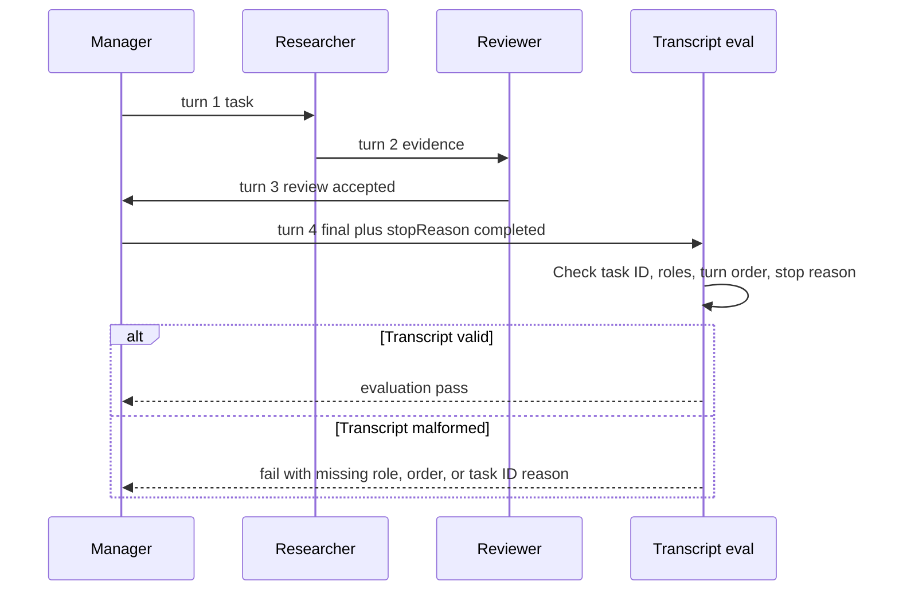

# Lab 13 - Evaluate Multi-Agent Transcripts

Download the [lab completion worksheet](/capstone-assets/templates/lab-completion-worksheet.txt) and [lab production readiness worksheet](/capstone-assets/templates/lab-production-readiness-worksheet.txt) before you start.

## Objective

Use an AutoGen-style team conversation to make agents, team turns, structured messages, transcript ownership, termination, and transcript evals explicit.

## What You Will Use

- Language: TypeScript
- Framework/runtime: AutoGen-style AgentChat team transcript
- Framework-agnostic lesson: multi-agent collaboration needs a reviewable transcript and evals that check who said what, in what order, and why the team stopped.
- Official terminology checked: AutoGen AgentChat agents, teams, messages, and observable team behavior.
- Pattern chapters: [Supervisor / Worker](/multi-agent-systems/supervisor-worker), [Task Delegation](/multi-agent-systems/task-delegation), [Observability and Evals](/production-runtime/observability-and-evals)
- Source files:
  - `autogen-transcript-pattern/typescript/src/team_transcript.ts`
  - `autogen-transcript-pattern/typescript/src/run_demo.ts`
  - `autogen-transcript-pattern/typescript/test/team_transcript.spec.ts`
- Download: [autogen-transcript.zip](/downloads/autogen-transcript.zip)

## Exercise Time Budget

These estimates assume dependencies are already installed.

| Exercise | Time | Output |
| --- | ---: | --- |
| Setup and baseline transcript run | 10 min | Demo and test output. |
| Inspect transcript schema and turn order | 15 min | Notes on sender, recipient, type, task ID, turn, and stop reason. |
| Exercise transcript failure cases | 20 min | Missing-role, wrong-order, or task-ID failure signal. |
| Compare native team behavior | 10-15 min | Mapping to AutoGen-style agents, team, messages, and termination. |
| Complete production transcript gate | 10-30 min | Notes for redaction, replay, retention, role permissions, and eval gates. |

## Setup

From the repository root:

```sh
npm install
```

This lab is deterministic and does not require a model key. It models the team transcript contract without live model calls.

## Run It

```sh
npm run autogen-transcript
npm run autogen-transcript:test
```

## Expected Result

The test command should print:

```text
AutoGen-style transcript tests OK
```

The transcript should include this role flow:

```text
manager -> researcher: task
researcher -> reviewer: evidence
reviewer -> manager: review
manager -> team: final
```

The final state should include:

```text
stopReason: completed
evaluation: pass
```

The demo command should include this four-message transcript shape:

```text
turn 1: manager -> researcher, type: task
turn 2: researcher -> reviewer, type: evidence
turn 3: reviewer -> manager, type: review, accepted: true
turn 4: manager -> team, type: final
```

Every message should carry the same task ID:

```text
taskId: autogen_style_001
```



Use this flow as the lab's acceptance model. The final answer is not enough; the transcript must prove evidence, review, final ownership, and the reason the team stopped.

The repository test also checks three malformed transcript cases:

| Case | Expected Failure |
| --- | --- |
| researcher evidence removed | `missing role: researcher` and `missing message type: evidence` |
| final message before review | `review must precede final` |
| mismatched task ID | `message task IDs do not match team task` |

Native AutoGen comparison point:

```text
native-framework-examples/autogen-delivery/
download: /downloads/native-autogen-delivery.zip
team: RoundRobinGroupChat
agents: delivery_manager, delivery_planner, risk_reviewer, test_planner
termination: TextMentionTermination("ACCEPTED") OR MaxMessageTermination(8)
eval gate: delivery_transcript_acceptance
```

## Inspect The Code

Open `autogen-transcript-pattern/typescript/src/team_transcript.ts` and find these boundaries:

- `TeamMessage`: structured transcript event.
- `Agent`: named participant with a response contract.
- `createTeam`: manager, researcher, and reviewer roles.
- `runTeam`: fixed team turn sequence and termination.
- `evaluateTranscript`: transcript-level acceptance criteria.

The transcript is the core artifact. It should show task assignment, evidence, review, final synthesis, and stop reason.

## Baseline Run

Use the expected result above as the baseline transcript contract.

## Change One Thing

Remove the researcher turn or change its message type from `evidence` to `final`.

Expected failure: the transcript eval should fail because the team can no longer prove that evidence preceded review and final synthesis.

Restore the researcher turn and rerun:

```sh
npm run autogen-transcript:test
```

## Verify

Check that:

- every message has a sender, recipient, type, task ID, and turn number;
- all required roles appear in the transcript;
- turn numbers are sequential;
- task IDs match the team task;
- evidence precedes review, and review precedes final;
- final output does not bypass human review;
- the stop reason is explicit;
- transcript evals fail on missing roles or malformed message flow.

## Lab Review Gate

Before moving on, verify the transcript boundary:

| Check | Evidence |
| --- | --- |
| Messages are structured | Sender, recipient, type, task ID, and turn number are present. |
| Roles are required | Manager, researcher, and reviewer all appear before final output. |
| Turn order is enforced | Evidence precedes review, and review precedes final synthesis. |
| Termination is explicit | The team stops with `completed`, not an ambiguous last message. |
| Eval protects the transcript | Missing roles or malformed flow fail the transcript eval. |

Record the transcript, stop reason, failed transcript case, and eval result in the lab completion worksheet.

## Production Extension

Before using a real AutoGen implementation in production, add:

- message schemas for every team event;
- termination conditions and max-turn budgets;
- tool-call and human-input records in the transcript;
- redaction before transcript storage;
- transcript replay and regression evals;
- per-agent role contracts and permission boundaries;
- migration notes if adopting Microsoft Agent Framework for new projects.

## Production Bridge

Use this table when adapting transcript evals to production:

| Lab Concept | Production Version |
| --- | --- |
| `TeamMessage` | Normalized event schema with role, task, turn, tool, approval, and redaction fields. |
| Agent role | Contract with allowed tools, authority, model route, and output schema. |
| Fixed team sequence | Termination policy plus max-turn budget and escalation rule. |
| Transcript eval | Release gate for role order, tool permission, final owner, stop reason, and safety. |
| Raw conversation | Redacted transcript store with replay, retention, deletion, and incident links. |

The first production milestone is a transcript that can prove who owned the final answer and why the team stopped.

## Native Framework Extension

After the deterministic lab passes, port one vertical slice into a real AutoGen AgentChat team. Use [Real Framework Setup Notes](/agent-engineering-practice/real-framework-setup-notes) for setup guidance and compare your work with the repository example at `native-framework-examples/autogen-delivery/`.

Native porting steps:

1. define AssistantAgent roles that match the deterministic manager, researcher, and reviewer contracts;
2. define team termination rules and max-turn budgets;
3. persist structured message events outside the raw chat transcript;
4. wrap tools so permissions and side effects are enforced outside model text;
5. redact transcript content before storage;
6. replay transcripts through evals that check role order, tool calls, final owner, and stop reason;
7. document rollback for disabling multi-agent delegation.

Transcript evals should check more than final text:

| Check | Failure It Catches |
| --- | --- |
| required roles present | fake specialization or skipped review |
| turn order valid | final answer before evidence or review |
| stop reason explicit | endless or ambiguous team behavior |
| tool calls permissioned | worker uses a tool outside its role |
| final owner present | no accountable acceptance boundary |

Completion standard: the native project proves the same transcript guarantees as this lab and links to the [Multi-Agent Delivery Workflow capstone](/capstone-projects/multi-agent-delivery-workflow). A native AutoGen team is not complete just because agents exchange messages; the system must normalize the transcript, preserve stop reason, and replay it through evals.

## Troubleshooting

| Symptom | Likely Cause | Fix |
| --- | --- | --- |
| team runs until the max-message limit | termination phrase is missing or too ambiguous | Add an explicit `TextMentionTermination` phrase and require only the final owner to use it. |
| eval cannot prove role order | raw chat is not normalized | Store sender, recipient, message type, task ID, turn number, and stop reason outside the raw transcript. |
| reviewer or tester role is skipped | team composition or turn policy is too loose | Use a bounded team pattern and eval required roles before accepting output. |
| provider import or model client fails | optional AutoGen extension package is missing | Install `autogen-ext[openai]` or the provider extension used by the project. |
| new project concern | AutoGen maintenance status is a risk | Compare AutoGen with Microsoft Agent Framework before committing long-term platform architecture. |

## Cross-Framework Mapping

- In LangGraph, the same collaboration can be represented as graph nodes or subgraphs with explicit state.
- In Mastra AI, a workflow can coordinate agents and tools while traces capture the path.
- In AutoGen-style systems, the team transcript is the reviewable execution artifact.
- In CrewAI, crews and role tasks produce similar collaborative outputs, while flows own acceptance.

## Related Chapters

- [Supervisor / Worker](/multi-agent-systems/supervisor-worker)
- [Task Delegation](/multi-agent-systems/task-delegation)
- [Choosing Multi-Agent Topology](/multi-agent-systems/choosing-multi-agent-topology)
- [Production Evaluation Feedback Loops](/production-runtime/production-evaluation-feedback-loops)
- [Multi-Agent Delivery Workflow Capstone](/capstone-projects/multi-agent-delivery-workflow)
