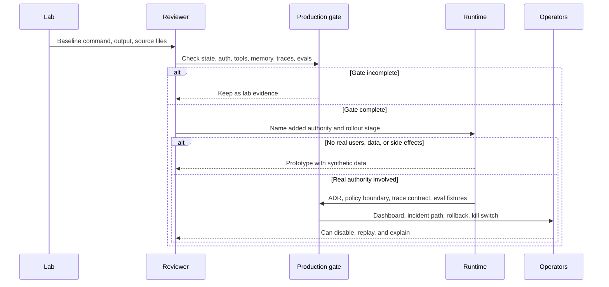

# Lab Production Readiness Checklist

The labs are teaching implementations. This checklist defines what must be added before a lab pattern becomes production work.

Use this after completing a lab. The goal is to identify the next engineering boundary: persistence, authorization, retries, idempotency, observability, eval gates, deployment, and rollback. For the full production path, continue with [Deployment Walkthrough](../production-runtime/deployment-walkthrough), [Templates and Worksheets](../agent-engineering-practice/templates-and-worksheets), and the [10/10 Production Gate](../publishing/ten-out-of-ten-production-gate).

Download the reusable production review artifact: [10/10 production gate scorecard](/capstone-assets/templates/ten-out-of-ten-production-gate-scorecard.txt).

Download the lab-specific worksheet: [lab production readiness worksheet](/capstone-assets/templates/lab-production-readiness-worksheet.txt).

## Universal Production Gate

Every lab needs these controls before real users, real data, or real side effects:

| Gate | Required Evidence |
| --- | --- |
| State ownership | State schema, owner, persistence strategy, migration plan, and replay story. |
| Auth and permissions | Actor identity, tenant/resource scope, tool permissions, approval rules, and audit records. |
| Tool safety | Input schemas, side-effect class, idempotency key, timeout, retry policy, and error contract. |
| Memory safety | Retention, deletion, redaction, consent, correction path, and write policy. |
| Observability | Trace IDs, model/tool events, policy decisions, costs, latency, stop reasons, and redaction. |
| Eval gates | Golden tasks, negative cases, trajectory checks, safety checks, and release-blocking thresholds. |
| Deployment | Runtime owner, environment config, secrets, scaling limits, rollback, kill switch, and incident path. |
| Human control | Approval UI/API, escalation rules, cancellation, reviewer identity, and expiry. |



Use this flow before changing access, data, or authority. A lab can move forward only when the next stage has reviewable evidence, not because the example command ran once.

## Lab Review Questions

Use these questions before a lab-derived system becomes a product slice:

| Question | Required Evidence |
| --- | --- |
| What did the lab prove? | Baseline command, expected output, source files, and success signal. |
| What did the lab not prove? | Missing persistence, policy, observability, evals, deployment, rollback, or human control. |
| What authority will production add? | Read data, write tools, memory, messages, approvals, money movement, or workflow execution. |
| What must fail closed? | Missing config, missing policy context, unsafe tool input, stale evidence, and failed evals. |
| What is the next production artifact? | ADR, trace contract, eval fixture, runbook, checklist, dashboard, or rollback plan. |

The lab is a learning artifact until these answers exist in reviewable engineering documents.

## Promotion Ladder

Use this ladder to decide what the lab output is ready for.

| Stage | Allowed Use | Required Evidence | Stop Condition |
| --- | --- | --- | --- |
| Lab evidence | Learning, comparison, and design discussion. | Baseline command, success signal, inspected source files, and one known failure path. | Do not connect real users, private data, credentials, or side effects. |
| Prototype | Internal demo with synthetic data. | Lab evidence plus basic schemas, deterministic test, and named production gaps. | Stop if the demo requires real credentials or broad tool access. |
| Product slice | Limited internal workflow with controlled data. | ADR, policy boundary, trace contract, eval fixtures, owner, and rollback note. | Stop if policy, trace, or rollback is missing. |
| Pilot | Small real-user or real-data rollout. | Production gate scorecard, approval rules, incident path, dashboard, and release gate. | Stop or roll back on failed blocking evals, missing trace spans, or unsafe side effects. |
| Production candidate | Controlled production release. | Deployment walkthrough evidence, runbook, kill switch, rollback path, and current eval report. | Stop if operators cannot disable, replay, or explain the run. |

Do not skip stages because a framework example runs successfully. A passing command proves execution; it does not prove authority, observability, recovery, or release safety.

## Per-Lab Readiness Matrix

| Lab | Production Additions |
| --- | --- |
| Lab 01 - Tool-Using Agent | Tool schemas, side-effect labels, permission checks, idempotency, timeout/retry, and audit records. |
| Lab 02 - Agent Loop and Planning | Durable state, plan versioning, step retry policy, cancellation, partial failure handling, and plan evals. |
| Lab 03 - Agentic RAG | Source ACLs, freshness, citation checks, retrieval evals, prompt-injection filtering, and evidence retention rules. |
| Lab 04 - A2A Communication | Agent identity, signed envelopes, correlation IDs, cancellation semantics, schema versioning, and replay logs. |
| Lab 05 - Multi-Agent Supervisor | Worker contracts, merge policy, per-worker traces, disagreement handling, final acceptance owner, and cost caps. |
| Lab 06 - Observability and Evals | Trace storage, redaction, eval datasets, release thresholds, incident-to-eval workflow, and dashboard ownership. |
| Lab 07 - Mastra Runtime Packaging | Deployment config, tool/memory policy, workflow retries, eval integration, trace export, and framework upgrade plan. |
| Lab 08 - CrewAI Flows and Crews | Flow checkpoints, role permissions, task schemas, crew output validators, human escalation, and flow acceptance evals. |
| Lab 09 - Minimal Agent Loop | Decision validation, tool registry, stop policy, state persistence, timeout/cancellation, and trace events. |
| Lab 10 - Tool Registry and Policy Gate | Policy context, approval records, schema validation, side-effect isolation, idempotency, and denial analytics. |
| Lab 11 - Context, Memory, Trace, and Evals | Memory governance, trace redaction, eval fixture versioning, context audit, and incident replay. |
| Lab 12 - LangGraph State Graph | Durable checkpointer, thread IDs, interrupt payloads, node idempotency, state migrations, and resume tests. |
| Lab 13 - AutoGen Transcript Evals | Message schemas, team termination, transcript redaction, role permissions, transcript replay, and team-level eval gates. |

## Framework-Specific Deployment Questions

| Framework Shape | Production Questions |
| --- | --- |
| LangGraph-style | Where is the checkpointer stored? How are thread IDs assigned? Which nodes can cause side effects? What state migrations are supported? |
| AutoGen-style | Who owns the transcript? Which messages are durable? How does termination work? How are agent tools permissioned? |
| Mastra-style | Which runtime features are framework-owned? How are workflows deployed? How are tools, memory, traces, and evals exported? |
| CrewAI-style | What does the flow own? What does the crew own? How are role outputs validated? How are crew failures escalated? |
| Mini-runtime | Which production controls are you willing to build and operate yourself? Which should move into an existing workflow platform? |

## Release Gate Template

Before shipping a lab-derived system, require:

```text
state: persisted or explicitly stateless
policy: enforced before side effects
tools: typed, scoped, idempotent, timed out
memory: governed by retention/deletion rules
trace: redacted and replayable
evals: include happy path, negative path, and trajectory checks
deployment: rollback and kill switch documented
owner: team and escalation path assigned
```

If any line is unknown, the system is still a demo.

## Related Chapters

- [Cross-Framework Decision Matrix](../agent-engineering-practice/cross-framework-decision-matrix)
- [Framework Selection](../agent-engineering-practice/framework-selection)
- [Real Framework Setup Notes](../agent-engineering-practice/real-framework-setup-notes)
- [Templates and Worksheets](../agent-engineering-practice/templates-and-worksheets)
- [10/10 Production Gate](../publishing/ten-out-of-ten-production-gate)
- [Production Runtime Overview](../production-runtime/overview)
- [Deployment Walkthrough](../production-runtime/deployment-walkthrough)
- [Policy Enforcement](../production-runtime/policy-enforcement)
- [Observability and Evals](../production-runtime/observability-and-evals)
