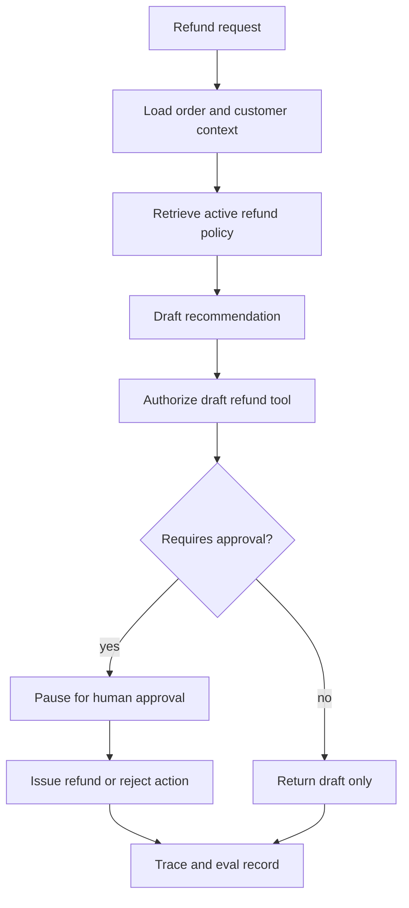
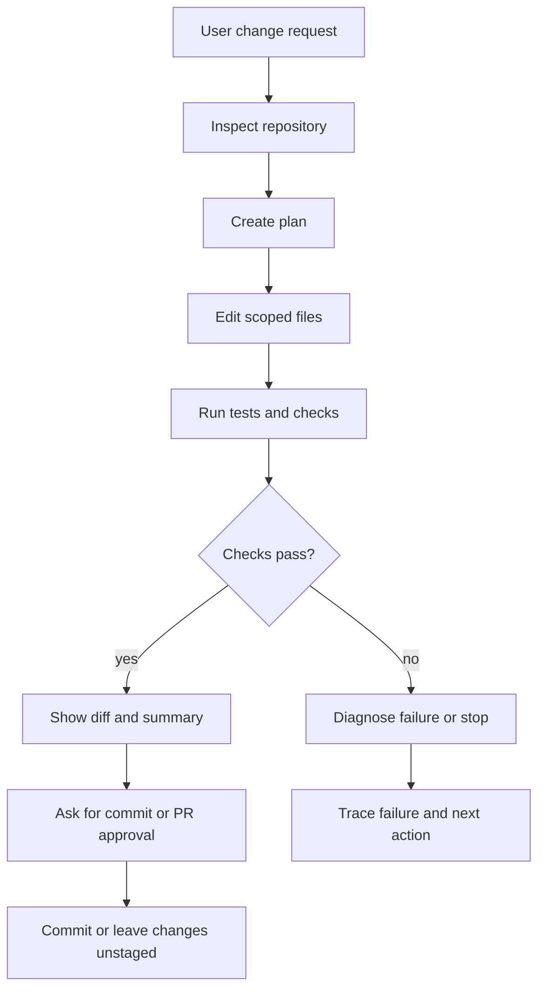
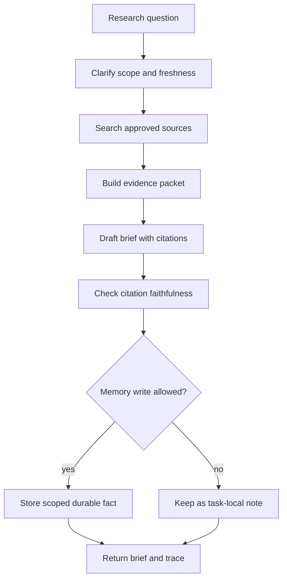

# Vertical Slice Examples

Patterns become useful when they are composed into a working system. A vertical slice is a small end-to-end design that shows the goal, agent loop, tools, state, policy, observability, evals, and runtime behavior together.

The examples in this chapter are not full products. They are slices. Each one should be small enough to review in one sitting and concrete enough to expose architecture decisions.

## How To Read A Slice

Use the same checklist for every example:

1. What user or system goal starts the run?
2. What patterns are composed?
3. What state must survive between steps?
4. What tools can the agent call, and under which scopes?
5. What requires approval?
6. What trace events prove what happened?
7. What evals catch regressions?
8. What failure mode would make this unsafe in production?

If a slice cannot answer those questions, it is still a demo.

## Slice 1: Support Refund Assistant

### Goal

A support agent helps a human support operator handle refund requests. It reads the order, retrieves the active refund policy, drafts a recommendation, and prepares a refund action. It does not issue the refund without approval.

### Pattern Composition

| Concern | Pattern |
| --- | --- |
| Agent loop | [Agent Loop](/foundations/agent-loop) |
| Context | [Context Engineering](/foundations/context-engineering) |
| Evidence | [Semantic Recall and RAG](/memory-knowledge/semantic-recall-rag) |
| Tools | [Tool Capability Design](/tools-skills-protocols/tool-capability-design) |
| Approval | [Human Approval Gates](/tools-skills-protocols/human-approval-gates) |
| Runtime | [Production Runtime Overview](/production-runtime/overview) |
| Security | [Agent Security and Sandboxing](/agent-engineering-practice/agent-security-and-sandboxing) |
| Evals | [Observability and Evals](/production-runtime/observability-and-evals) |

### Runtime Flow



### Security Controls

- The agent receives `orders:read`, `refunds:draft`, and `policies:read`.
- The `refunds.issue` tool requires human approval and an idempotency key.
- The refund policy is retrieved from an approved source with a policy version.
- Customer payment tokens never enter the prompt.
- External email is a separate tool with its own approval rule.

### Trace And Eval

Every run should record order lookup, policy retrieval, recommendation draft, tool authorization, approval state, refund side-effect ID, and stop reason.

Good eval cases:

- refund allowed by policy and approved;
- refund denied by policy;
- missing order;
- stale policy retrieved;
- model attempts `refunds.issue` without approval;
- duplicate approval message replayed.

### Minimal Code

```ts
type RefundDecision =
  | { action: "draft_refund"; orderId: string; amountCents: number; policyVersion: string }
  | { action: "deny_refund"; orderId: string; reason: string; policyVersion: string }
  | { action: "needs_human_review"; orderId: string; reason: string };

function requiresApproval(decision: RefundDecision): boolean {
  return decision.action === "draft_refund" && decision.amountCents > 0;
}
```

The code is intentionally small. The important part is the boundary: a model can propose a refund decision, but the runtime still checks policy, approval, and idempotency before money moves.

### Failure Modes

- The model treats an old refund policy as current.
- The tool call issues a refund before approval.
- The trace records the final answer but not the policy version.
- A retry issues the same refund twice.
- The agent sends the customer message before the operator reviews it.

## Slice 2: Safe Coding Agent

### Goal

A coding agent makes a small repository change, runs tests, shows the diff, and asks for approval before committing or opening a pull request.

### Pattern Composition

| Concern | Pattern |
| --- | --- |
| Loop and planning | [Planning and Execution](/control-loops/planning-and-execution) |
| Harness | [Agent Harnesses](/agent-engineering-practice/agent-harnesses) |
| Workspace | [Coding Agents](/systems-architecture/coding-agents) |
| Sandbox | [Agent Security and Sandboxing](/agent-engineering-practice/agent-security-and-sandboxing) |
| Evaluation | [Evaluation-Driven Agent Development](/agent-engineering-practice/evaluation-driven-agent-development) |
| Recovery | [Circuit Breakers, Fallbacks, and Replay](/pattern-selection/circuit-breakers-fallbacks-replay) |

### Runtime Flow



### Security Controls

- The agent works in a scoped workspace or branch.
- Shell commands run with timeouts and no ambient production secrets.
- File edits stay within the repository root.
- Network access is disabled unless the task needs dependency or documentation lookup.
- Commit, push, deploy, and destructive commands require explicit approval.

### Trace And Eval

Every run should record files inspected, commands run, tests passed or failed, diff summary, approval request, and final state.

Good eval cases:

- correct single-file change with passing tests;
- failing test stops the run;
- command timeout is handled;
- attempted edit outside workspace is denied;
- generated change touches unrelated files;
- commit requested before diff review.

### Minimal Code

```ts
type CommandPolicy = {
  allowedPrefixes: string[];
  timeoutMs: number;
  network: "blocked" | "allowlisted";
};

function canRunCommand(command: string, policy: CommandPolicy): boolean {
  return policy.allowedPrefixes.some(prefix => command.startsWith(prefix));
}
```

The model should not decide that a command is safe because it looks familiar. The harness should check the command against the current task, workspace, and approval policy.

### Failure Modes

- The agent edits generated files instead of source files.
- A test failure is summarized as success.
- The sandbox exposes secrets through environment variables.
- The agent commits unrelated user changes.
- The final answer hides a failed command or skipped check.

## Slice 3: Research To Brief Agent

### Goal

A research agent gathers evidence, produces a short technical brief, cites sources, and stores only durable facts that pass a memory policy.

### Pattern Composition

| Concern | Pattern |
| --- | --- |
| Retrieval | [Semantic Recall and RAG](/memory-knowledge/semantic-recall-rag) |
| Context control | [Context Budgets and Working Sets](/foundations/context-budgets-and-working-sets) |
| Memory | [Working Memory](/memory-knowledge/working-memory) |
| Output shape | [Structured Output](/foundations/structured-output) |
| Evals | [Production Evaluation Feedback Loops](/production-runtime/production-evaluation-feedback-loops) |
| UX | [Agent UX and Human Trust](/agent-engineering-practice/agent-ux-and-human-trust) |

### Runtime Flow



### Security Controls

- Retrieved documents are data, not instructions.
- The agent separates source evidence from system instructions.
- Memory writes require source, confidence, retention class, and correction path.
- Private or licensed content is not copied into long-term memory by default.
- The brief says when evidence is missing, stale, or conflicting.

### Trace And Eval

Every run should record query, source set, evidence packet, omitted sources, citation checks, memory decisions, and final answer shape.

Good eval cases:

- answer requires a current source;
- sources conflict;
- retrieval returns irrelevant documents;
- citation does not support the claim;
- model tries to store an unsupported memory;
- brief should refuse because evidence is missing.

### Minimal Code

```ts
type MemoryCandidate = {
  claim: string;
  sourceIds: string[];
  confidence: "low" | "medium" | "high";
  retention: "task_only" | "project" | "user";
};

function canWriteMemory(candidate: MemoryCandidate): boolean {
  return (
    candidate.retention !== "user" &&
    candidate.confidence === "high" &&
    candidate.sourceIds.length > 0
  );
}
```

The default should be task-local memory. Durable memory is a controlled write, not a side effect of reading.

### Failure Modes

- Retrieved content changes the agent's instructions.
- The brief cites a source that does not support the claim.
- Stale evidence is presented as current.
- The agent stores a user preference from one temporary task.
- The trace cannot explain why a source was included or omitted.

## Comparison

| Slice | Main risk | Primary control | Best regression eval |
| --- | --- | --- | --- |
| Support refund assistant | Money moves without authority. | Approval-bound tool execution. | Refund tool cannot execute without policy and approval trace. |
| Safe coding agent | The agent changes more than it should. | Workspace, diff, tests, and approval. | Unrelated file edits or failed checks block completion. |
| Research to brief agent | Unsupported claims look authoritative. | Evidence packets and citation checks. | Claims must be supported by cited source IDs. |

## Design Rule

A vertical slice should prove composition. It should show how the loop, tools, state, memory, security, runtime, observability, and evals work together for one real task.

Small examples are fine. Isolated examples are not enough.

## Related Chapters

- [What Is An Agent?](/foundations/what-is-an-agent)
- [Agent Harnesses](/agent-engineering-practice/agent-harnesses)
- [Production Runtime Overview](/production-runtime/overview)
- [Agent Security and Sandboxing](/agent-engineering-practice/agent-security-and-sandboxing)
- [Observability and Evals](/production-runtime/observability-and-evals)
- [Pattern Composition Playbook](/pattern-selection/pattern-composition-playbook)
