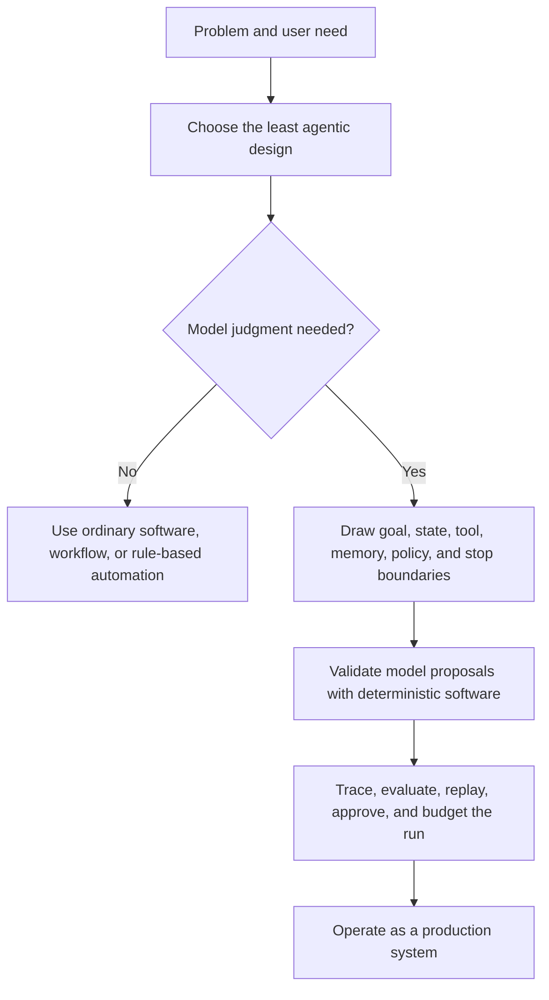
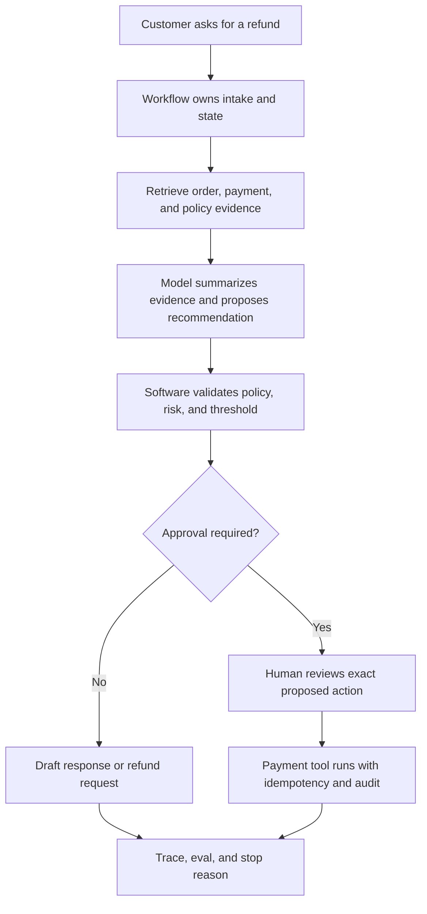

# Agentic Systems Patterns

Most agentic systems do not fail because the model is not smart enough. They fail because the architecture around the model is weak.

The goal is vague. The loop has no real stop condition. The tools are too powerful. State is hidden in a chat transcript. Nobody can replay what happened. The eval suite checks the final answer but not the path that produced it. Observability arrives after the first incident. Autonomy is added before the system has earned it.

This book is about fixing that.

It is written for software engineers, technical leads, architects, and builders who need to decide what an agent should own, what ordinary software should own, and what must never be left to a model. It is not a list of every agent pattern name I could find. It is a practical guide to choosing, composing, testing, securing, and operating agentic patterns without giving up engineering control.

A useful agent is not a prompt with ambition. It is software with boundaries.

## Architecture Argument At A Glance

Use this diagram as the book's core test: if a design skips the boundary, validation, or evidence steps, it is not ready for production.

## Running Case Study

Several chapters return to one product-shaped example: a support refund assistant. It is small enough to understand, but risky enough to force real architecture. A refund workflow touches customer data, policy evidence, payment tools, approval thresholds, audit records, and user communication. That makes it a useful test for the whole book.

The point is not to make refunds special. The point is to watch one system move from simple software, to bounded model judgment, to agentic investigation, to approval-gated side effects, to production evidence.

Use this case as a recurring question: what should the model decide, what must software own, and what evidence would let an operator replay the run after something goes wrong?

## Reader Contract

Every chapter should help you make or review an engineering decision. A strong chapter in this book should give you at least one of these:

- a boundary you can draw;
- a pattern you can choose or reject;
- a contract you can implement;
- a failure mode you can test;
- a checklist you can use in review;
- an artifact you can reuse in a design, lab, capstone, or release.

If a chapter only teaches vocabulary, it should connect that vocabulary to a decision. If a chapter shows code, it should name the production controls still missing. If a chapter recommends a pattern, it should also say when not to use it.

That is the quality bar for the online book: readers should leave with decisions, evidence, and reusable artifacts, not just familiarity with agent terminology.

## The Argument

My argument is simple:

1. Start with the least agentic architecture that can meet the requirement.
2. Add model judgment only where deterministic software is not enough.
3. Treat model outputs as proposals until software validates them.
4. Keep goals, state, tools, memory, and policy outside the model where they can be inspected.
5. Evaluate trajectories, not just final answers.
6. Operate agents like production systems, with traces, budgets, retries, approvals, and incident review.

Agentic design is not about making everything autonomous. It is about deciding exactly where autonomy helps, where it creates risk, and where ordinary software should stay in charge.

## What You Should Be Able To Do

After reading the core chapters, you should be able to:

1. Decide whether a problem needs a prompt chain, workflow, single agent, or multi-agent system.
2. Draw the boundary between model judgment and deterministic control.
3. Define the goal, state, tools, memory, policy, budget, and stop conditions for an agentic run.
4. Review a tool surface for excess authority before exposing it to a model.
5. Design evals that test trajectories, not just final answers.
6. Explain how a system will trace, replay, approve, retry, roll back, and recover.
7. Turn a demo into a production design with explicit runtime controls.

If a chapter does not help you make one of those decisions, it is not doing enough work.

## What This Book Covers

The book follows the decisions engineers make when they build real systems:

- foundations: single agents, loops, goals, state, tools, structured outputs, and context;
- pattern selection: when to use chains, routing, workflows, agents, or multi-agent systems;
- engineering practice: lifecycle, framework choice, security, evaluation, and user trust;
- control loops: planning, ReAct, reflection, evaluator-optimizer, and recovery loops;
- memory and knowledge: working memory, episodic memory, retrieval, and evidence boundaries;
- tools, skills, and protocols: tool contracts, MCP, A2A, secure communication, and approval gates;
- multi-agent systems: delegation, supervision, debate, parallel execution, and framework-shaped systems;
- systems architecture: how patterns compose into deployable products;
- production runtime: durable workflows, observability, evaluation, policy, events, and operations.

The pattern chapters are intentionally consistent. They are meant to be scanned during design work. The surrounding chapters carry the argument: why a pattern belongs in a system, what it costs, and how to know whether it is working.

## What This Book Is Not

This is not a prompt engineering cookbook, a vendor comparison report, or a claim that agents should replace normal software. It does not assume that more autonomy is better. It also does not treat framework defaults as architecture.

Frameworks are useful, but they do not remove the need to decide where state lives, which tools are allowed, how approvals work, what gets traced, or how failures become regression tests. Those are product and architecture decisions.

## How To Use It

If you are new to agentic systems, start with [How To Read This Book](/publishing/how-to-read), then read [What Is An Agent?](/foundations/what-is-an-agent), [Architecture Before Autonomy](/pattern-selection/architecture-before-autonomy), [Choosing the Right Pattern](/pattern-selection/choosing-the-right-pattern), and [From Patterns To Systems](/pattern-selection/from-patterns-to-systems).

If you are reviewing a production design, start with the selection and engineering chapters before reading individual pattern pages.

If you are implementing, use the hands-on labs after you understand the architecture. The examples are deliberately small. The production notes show what must change before those examples become systems that can handle state, policy, evals, and observability.

Because this is an online book, use it as both a guided text and a reference. Follow the reading paths when you are learning the material. Use the sidebar, search, pattern pages, checklists, diagrams, labs, and capstones when you are designing or reviewing a real system.

## License

Source code and runnable examples are licensed under the MIT License. Book/reference content, diagrams, worksheets, and generated publishing artifacts are licensed under [Creative Commons Attribution-NonCommercial-ShareAlike 4.0 International](https://creativecommons.org/licenses/by-nc-sa/4.0/) (`CC-BY-NC-SA-4.0`).
