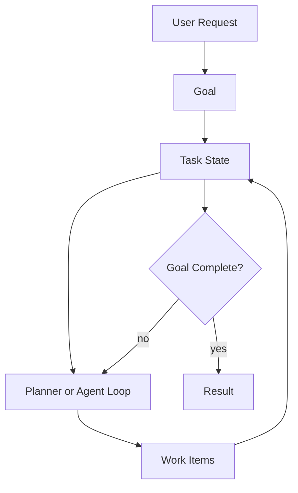

# Working Memory

Working memory is compact, typed task state the agent can update and consult during a run.

> Source and downloads
>
> - [Repository source](https://github.com/GTuritto/Agentic-Systems-Patterns/tree/main/goals-and-state-pattern)
> - [Download code bundle](/downloads/working-memory.zip)

## Intent

The Goals and State Pattern separates what the agent is trying to achieve from the mutable state it accumulates while working. Goals define success; state records progress, constraints, evidence, and pending work.

## Use When

- A task spans multiple turns, tools, or agents.
- You need resumable execution after failure or interruption.
- The agent must explain progress against an explicit objective.

## Avoid When

- The task is stateless and can be answered in one call.
- The goal cannot be expressed as observable success criteria.
- State would contain sensitive data you cannot store safely.

## Architecture

## System Shape

- **Pattern boundary:** a retrieval or memory boundary decides what information enters context and what new information can be stored.
- **State owner:** the memory or retrieval layer owns long-lived knowledge, while the agent owns task-local working state.
- **Primary artifact:** `goals-and-state-pattern/` contains the runnable reference implementation and examples.
- **Operational promise:** Working memory is compact, typed task state the agent can update and consult during a run.

## Core Protocol

1. Classify the information need: working state, episodic memory, semantic knowledge, policy, or source evidence.
2. Retrieve only scoped, relevant, and permitted material.
3. Inject retrieved material with source labels, freshness, and trust level.
4. Generate or act while keeping retrieved evidence separate from instructions.
5. Write back memory only after validation, consent, retention, and correction rules pass.

## Implementation Notes

- Store goals as structured records with `id`, `description`, `success_criteria`, `constraints`, `owner`, and `status`.
- Store state separately from chat history. Chat is evidence; state is the operational model.
- Update state through typed events such as `step_started`, `tool_result`, `blocked`, `approved`, and `completed`.
- Make state transitions auditable and idempotent so a workflow can retry safely.

## Failure Modes

- Goals that describe activity rather than success.
- State that becomes a transcript dump instead of a compact task model.
- Agents optimizing for local subgoals that no longer serve the parent goal.
- Lost cancellation or approval state after retries.

## Evaluation Strategy

- Use questions with known source answers, stale sources, conflicting sources, and missing evidence.
- Measure recall, precision, citation faithfulness, freshness, and refusal when evidence is absent.
- Test deletion, correction, and privacy boundaries separately from answer quality.
- Include cases that prove each "Use When" condition is true for this pattern.
- Include negative cases from "Avoid When" so the system chooses a simpler or safer pattern when appropriate.

## Production Checklist

- Define retention, deletion, correction, and consent rules.
- Separate instructions from retrieved facts and user memories.
- Record source IDs and retrieval scores for audit and debugging.
- Add guards against prompt injection from retrieved documents.
- Define human escalation for ambiguous, high-risk, or policy-blocked work.
- Keep the source bundle, generated chapter, tests, and deployment artifact in the same release.

## Code Walkthrough

Read the excerpt as the smallest executable expression of the pattern. The surrounding chapter explains the design constraints; the code shows where those constraints become concrete interfaces, state, validation, or control flow.

## Source Code

This pattern currently has no dedicated code excerpt. Use the source and download links below for the full pattern folder.

## Download

- [Download source bundle](/downloads/working-memory.zip)
- [Open source folder](https://github.com/GTuritto/Agentic-Systems-Patterns/tree/main/goals-and-state-pattern)

The download bundle contains the current `goals-and-state-pattern/` folder from this repository.

## Related Patterns

- [Agent Loop](https://github.com/GTuritto/Agentic-Systems-Patterns/blob/main/agent-loop-pattern/README.md)
- [Planning Pattern](https://github.com/GTuritto/Agentic-Systems-Patterns/blob/main/planning-pattern/README.md)
- [Durable Workflow](https://github.com/GTuritto/Agentic-Systems-Patterns/blob/main/durable-workflow-pattern/README.md)
