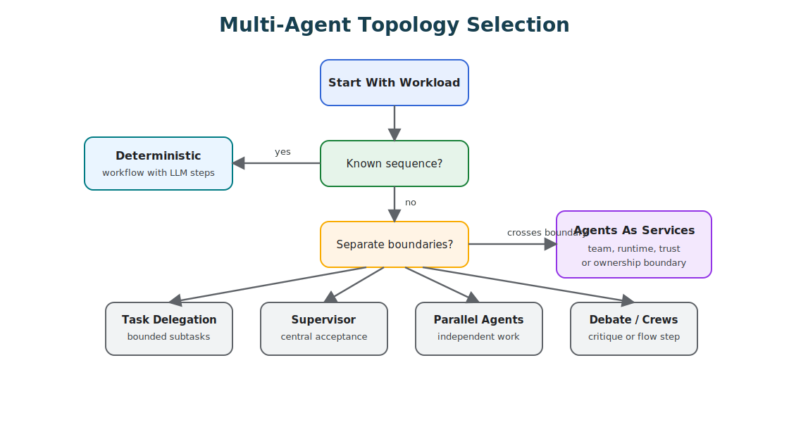

# Choosing Multi-Agent Topology

Do not start a design by asking how many agents you need.

Start by asking where the work needs separate context, separate tools, separate authority, separate timing, or separate accountability. If those boundaries are real, multiple agents can help. If those boundaries are not real, multiple agents usually add cost, latency, and failure modes.

Multi-agent design is not about making the system look more intelligent. It is about creating useful boundaries.



## First Rule

Use the smallest topology that gives you the boundary you need.

Many systems do not need multiple agents. They need:

- a deterministic workflow;
- one agent loop with better tools;
- routing between workflows;
- a reviewer step;
- stronger context management;
- better evals;
- better observability.

Multiple agents are justified when one agent would have to carry too much context, too much authority, too many tools, or too many conflicting responsibilities.

## Topology Decision Matrix

| Situation | Prefer | Avoid |
| --- | --- | --- |
| Known sequence with clear rules | Deterministic workflow | Multi-agent chat. |
| One task needs specialist decomposition | Task delegation | One general agent with a giant prompt. |
| Central owner must control quality and merge results | Supervisor-worker | Peer agents with no final owner. |
| Independent work can run concurrently | Parallel agents | Sequential agent chains that waste time. |
| Output improves through critique or comparison | Debate and consensus | Voting without evidence or tests. |
| Workflow state matters more than agent chatter | Flow with crews | Crew as substitute for state design. |
| Agents cross team, runtime, or trust boundaries | Agents as services over A2A, MCP, events, or workflows | Unstructured natural language handoffs. |
| Agents need asynchronous coordination over time | Board, queue, durable workflow, or task ledger | Shared context windows and manual copy-paste. |

The right topology is usually boring. That is a feature.

A topology selector should encode the same bias:

```ts
interface WorkloadShape {
  knownSequence: boolean;
  independentSubtasks: boolean;
  needsSpecialists: boolean;
  needsCentralAcceptance: boolean;
  benefitsFromCritique: boolean;
  crossesTrustBoundary: boolean;
}

function chooseTopology(workload: WorkloadShape) {
  if (workload.knownSequence && !workload.needsSpecialists) {
    return 'deterministic_workflow';
  }

  if (workload.crossesTrustBoundary) {
    return 'agents_as_services';
  }

  if (workload.independentSubtasks && workload.needsCentralAcceptance) {
    return 'supervisor_worker';
  }

  if (workload.independentSubtasks) {
    return 'parallel_agents';
  }

  if (workload.benefitsFromCritique) {
    return 'debate_and_consensus';
  }

  return 'single_agent_or_workflow';
}
```

The point is not to automate architecture. The point is to make the selection criteria visible enough to argue with.

## Deterministic Workflow First

If code can own the sequence, let code own the sequence.

Use a deterministic workflow when:

- the steps are known;
- branching rules are clear;
- correctness depends on policy or business rules;
- state transitions must be auditable;
- latency and cost matter;
- human approval must pause the process.

The model can still be useful inside the workflow. It can classify, extract, summarize, draft, rank, or critique. But the workflow owns the path.

## Task Delegation

Use task delegation when the work decomposes into bounded subtasks.

Good delegation has:

- clear subtask contracts;
- scoped context for each worker;
- expected output shape;
- acceptance criteria;
- one owner for final merge;
- evals that prove decomposition helps.

Bad delegation is just asking several agents to "work on this" and hoping the combined answer is better.

## Supervisor-Worker

Use supervisor-worker when a central agent or workflow must own the goal, state, routing, and final acceptance.

This topology is useful when:

- workers have different tools or context;
- the supervisor can evaluate worker outputs;
- there is one accountable final answer;
- some worker failures should not fail the whole task;
- workers must not see each other's full context.

The supervisor should not become a hidden god agent. It should own coordination, not every detail of execution.

## Parallel Agents

Use parallel agents when work is independent and the merge policy is clear.

Good cases:

- search multiple sources;
- generate several candidate plans;
- review the same artifact from different angles;
- run separate checks such as security, correctness, and style;
- compare outputs from different models or prompts.

Parallelism is not free. It increases cost, trace volume, and merge complexity. Use it when it buys latency reduction, quality lift, or independent coverage.

## Debate And Consensus

Use debate or consensus when independent critique improves judgment.

It is useful for:

- ambiguous decisions;
- design reviews;
- risk analysis;
- comparing candidate answers;
- exposing weak assumptions.

It is weak for:

- factual questions that need retrieval;
- tool decisions that need policy;
- tasks where every agent shares the same blind spot;
- high-risk actions where voting replaces authority.

Consensus is not proof. It is a signal that still needs evidence, tests, or an accountable owner.

## Crews And Flows

Use crews inside flows when the workflow needs explicit state and a group of specialized agents performs one bounded step.

The flow should own:

- state;
- event order;
- retries;
- approvals;
- persistence;
- stop conditions.

The crew should own:

- local collaboration;
- specialist roles;
- bounded output for one workflow step.

If crew-local chat becomes the state machine, the architecture is weak.

## Agents As Services

When agents cross process, team, runtime, vendor, or trust boundaries, treat them like services.

That means:

- explicit capability contract;
- typed request and response;
- authentication;
- authorization;
- timeouts;
- idempotency;
- refusal semantics;
- cancellation;
- trace correlation;
- versioning;
- contract tests.

The protocol may be A2A, MCP, REST, gRPC, event streams, or a durable workflow engine. The important thing is not the protocol brand. The important thing is that the boundary is explicit and testable.

## Board, Queue, Or Ledger Coordination

Some multi-agent work should not be coordinated through direct chat.

Use a board, queue, task ledger, or durable workflow when:

- work happens asynchronously;
- humans and agents both participate;
- decisions need to stay attached to work items;
- agents run in separate sessions;
- progress must survive restarts;
- handoffs need audit history.

This is especially useful for coding agents, operations agents, research pipelines, and long-running review workflows.

## Shared State

Shared state is where multi-agent systems often fail.

Avoid:

- every agent writing to the same memory;
- hidden shared scratchpads;
- unversioned summaries;
- agents overwriting each other's conclusions;
- state stored only in conversation history.

Prefer:

- one owner for each state object;
- append-only task logs;
- explicit merge steps;
- durable workflow state;
- typed artifacts;
- human-readable handoff records;
- trace IDs across agents.

If shared state is unclear, the topology is not ready.

## Evaluation Guidance

A multi-agent system should beat a simpler baseline.

Evaluate:

- single-agent baseline versus multi-agent topology;
- quality lift;
- latency cost;
- token and tool cost;
- merge accuracy;
- worker failure handling;
- disagreement handling;
- trace completeness;
- permission isolation;
- context isolation;
- final accountability.

Include negative evals where the system should choose a simpler topology. A good topology selector should know when not to use multiple agents.

## Design Checklist

Before adding another agent, answer:

- What boundary does this new agent create?
- Does it need separate context?
- Does it need separate tools?
- Does it need separate permissions?
- Does it need independent timing?
- Who owns final acceptance?
- How are outputs merged?
- What happens if this agent fails, refuses, or times out?
- What state does it own?
- What context must it never see?
- How do traces connect across agents?
- What eval proves this topology is better than the simpler baseline?

If the only reason for another agent is "it feels more agentic," do not add it.

## Related Chapters

- [Task Delegation](./task-delegation)
- [Supervisor / Worker](./supervisor-worker)
- [Parallel Agents](./parallel-agents)
- [Debate and Consensus](./debate-and-consensus)
- [CrewAI Flows and Crews](./crewai-flows-and-crews)
- [Agents As Services](../systems-architecture/agents-as-services)
- [A2A Agent Interoperability](../tools-skills-protocols/a2a-agent-interoperability)
- [Context Budgets and Working Sets](../foundations/context-budgets-and-working-sets)
- [Evaluation-Driven Agent Development](../agent-engineering-practice/evaluation-driven-agent-development)
