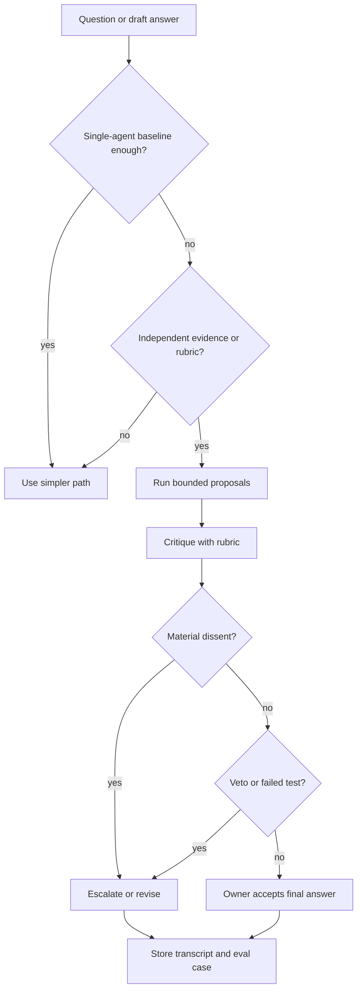

# Debate and Consensus

Debate and consensus use multiple independent proposals, critiques, votes, or rankings before producing a final answer.

> Source and downloads
>
> - [Repository source](https://github.com/GTuritto/Agentic-Systems-Patterns/tree/main/consensus-seeking-multi-agent-system-pattern)
> - [Download code bundle](/downloads/debate-and-consensus.zip)

## Intent

Debate and consensus use multiple independent proposals, critiques, votes, or rankings before producing a final answer.

Use this pattern to expose disagreement, missing evidence, and weak reasoning before a risky answer becomes a final decision. Do not use it to make an answer look more trustworthy without adding independent evidence or a stronger review rule.

## Scenario

A team is reviewing whether an agent-generated incident summary is good enough for an executive update. One agent drafts the summary from traces. A second agent checks chronology against the incident timeline. A third agent checks customer impact and omitted evidence. A judge then accepts, rejects, or asks for a revised summary.

This works only if the agents see meaningfully different evidence or apply different rubrics. Three agents with the same prompt, same context, and same blind spot create a louder single-agent failure. Consensus is not evidence by itself; it is a way to expose disagreement before one accountable owner makes the final call.

## Use When

- A single answer is risky, ambiguous, or likely to miss evidence.
- Participants have genuinely different evidence, roles, rubrics, models, or tools.
- The final decision can wait for the extra cost and latency.
- A written merge rule exists before the workers start.
- Dissent should be preserved for review, not hidden by synthesis.

## Avoid When

- A deterministic test, database query, retrieval step, or policy check can answer directly.
- Participants share the same context and will repeat the same failure.
- Majority vote would replace evidence, tests, or an accountable owner.
- The task needs one clear owner more than it needs more opinions.
- The system cannot trace proposals, critiques, votes, dissent, and final acceptance.

## Architecture

Use this diagram to read Debate and Consensus as a system boundary, not only a code shape. The key ownership question is: the coordinator owns the shared goal, decomposition, assignments, merge policy, and final acceptance.



Read it as an evidence-backed decision process: independent agents propose answers, critique each other, and an accountable owner resolves agreement, dissent, or escalation.

## Decision Rules

Use debate only when independence is real and the merge rule is known before execution.

| Question | Good Answer | Bad Answer |
| --- | --- | --- |
| What differs between agents? | Evidence source, rubric, role, model, or tool access. | Only the name of the role prompt. |
| Who owns the final decision? | A coordinator, deterministic reducer, or human reviewer. | The majority vote by itself. |
| What can overturn consensus? | Missing evidence, safety violation, failed test, or owner rejection. | Nothing; agreement is treated as truth. |
| What is the cost limit? | Fixed number of agents, turns, tokens, and retries. | Debate continues until outputs look confident. |
| How is dissent handled? | Recorded, classified, and escalated when material. | Smoothed away during synthesis. |

### Debate Gate Flow



### When Consensus Hurts Quality

| Situation | Why It Hurts | Better Pattern |
| --- | --- | --- |
| Same prompt, same evidence, same model. | Correlated failures look like agreement. | Single agent plus evaluator, or retrieval/tool verification. |
| Weak majority overrules strong evidence. | Votes hide the reason a minority is correct. | Evidence-weighted judge or human approval gate. |
| Debate happens after synthesis. | Critique cannot change the underlying evidence path. | Review proposals before final synthesis. |
| Workers optimize for persuasion. | Outputs become rhetorical instead of testable. | Score against a rubric with required citations. |
| The owner is unnamed. | No one can accept residual risk. | Supervisor or human final-owner gate. |

### Voting Protocols

| Protocol | Use When | Guardrail |
| --- | --- | --- |
| Majority vote | Outputs are low risk and independently produced. | A safety or evidence veto can override the majority. |
| Weighted rubric | Roles have different authority or expertise. | Weights are fixed before the run starts. |
| Veto rule | One class of defect should block release. | Veto reasons must cite evidence or policy. |
| Pairwise comparison | Several candidate answers compete. | Compare against the same rubric, not preference. |
| Owner review | The decision carries product, legal, safety, or customer risk. | The owner sees dissent and trace evidence before accepting. |

## System Shape

- **Pattern boundary:** a coordinator delegates bounded work to agents with narrow roles, then evaluates and merges their outputs.
- **State owner:** the coordinator owns the shared goal, decomposition, assignments, merge policy, and final acceptance.
- **Primary artifact:** `consensus-seeking-multi-agent-system-pattern/` contains deterministic TypeScript and Python reference implementations plus tests for proposal, critique, dissent, and final-owner behavior.
- **Operational promise:** debate exposes disagreement before a risky answer becomes a final decision.
- **Runnable path:** start with `npm run debate-consensus` before adapting the pattern to a larger system.

## Contract

A debate run should produce a transcript that another engineer can inspect.

| Field | Purpose |
| --- | --- |
| `runId` | Correlates all proposals, critiques, votes, and final decision. |
| `goal` | Defines the exact question being debated. |
| `agents[]` | Records role, evidence scope, model, tools, and permission limits. |
| `proposal` | Captures each agent's answer with citations or evidence references. |
| `critique` | Names specific defects, missing evidence, or risks. |
| `vote` or `score` | Applies a predeclared rubric, not an improvised preference. |
| `dissent` | Preserves material disagreement for the owner. |
| `finalOwner` | Names the coordinator, reducer, or human accountable for acceptance. |
| `stopReason` | Explains accepted, rejected, escalated, budget_exhausted, or inconclusive. |

## Core Protocol

1. Define the shared goal, worker roles, expected outputs, and acceptance criteria.
2. Split work only where independent or specialist execution adds value.
3. Dispatch tasks with scoped context and permissions.
4. Collect outputs, errors, refusals, and evidence from each worker.
5. Merge results through an explicit judge, reducer, supervisor, or human review gate.

## Implementation Notes

- Start with a single-agent baseline. Add debate only when measured quality improves enough to justify cost and latency.
- Give each participant a different evidence scope, rubric, model, or tool boundary.
- Keep proposals separate until critique begins. Early shared context can collapse independence.
- Require citations, trace IDs, test output, or source references for material claims.
- Preserve minority reports when they name missing evidence, policy risk, or unsupported claims.
- Cap agent count, turns, judge passes, retry count, total tokens, and wall-clock time.
- Treat a failed worker, missing evidence, or material dissent as a typed outcome, not as prose to smooth over.

## Failure Modes

- False agreement: agents share the same blind spot and all approve the wrong answer.
- Majority trap: two weak answers outvote one evidence-backed objection.
- Debate theater: agents critique style while ignoring source support, tests, or policy.
- Dissent erasure: final synthesis removes the disagreement the pattern was meant to reveal.
- Judge capture: the judge trusts confident prose instead of the predeclared rubric.
- Role collapse: all agents perform the same task despite different titles.
- Cost runaway: debate continues after the decision has become no clearer.
- Owner gap: the system produces a consensus with no one accountable for acceptance.

## Review Checklist

Before using debate or consensus in production, check:

- A single-agent baseline exists and debate beats it on measured tasks.
- Agents receive different evidence, roles, rubrics, models, or tools for a reason.
- The merge policy is written before the run starts.
- Dissent is preserved in the trace instead of erased by synthesis.
- The coordinator can refuse, escalate, or ask for more evidence.
- Cost and latency budgets cap agents, turns, retries, and judge passes.
- Evals include correlated failure, false agreement, bad majority vote, and judge error.

## Evaluation Strategy

- Compare multi-agent output against a single-agent baseline on the same tasks.
- Test cases where all agents agree and are wrong because they share evidence.
- Test cases where the minority answer is correct because it cites stronger evidence.
- Test worker failure, missing worker output, duplicated work, and bad merge decisions.
- Test veto behavior for safety, policy, missing evidence, and failed deterministic checks.
- Measure quality lift, latency cost, token cost, merge accuracy, dissent handling, and final-owner accountability.

## Production Checklist

- Give every worker a narrow role, evidence scope, permission set, and output schema.
- Make the merge policy explicit before workers run.
- Log per-worker inputs, outputs, critiques, scores, votes, and evidence references.
- Keep one owner for final acceptance and escalation.
- Preserve material dissent in the final trace and operator view.
- Add budget controls for agents, turns, retries, judge passes, tokens, and time.
- Define human escalation for high-risk, inconclusive, or policy-blocked work.
- Keep the source bundle, generated chapter, tests, and deployment artifact in the same release.

## Run the Example

```sh
npm run debate-consensus
npm run debate-consensus:test
```

## Code Walkthrough

Read the excerpt as the smallest executable expression of the pattern. The surrounding chapter explains the design constraints; the code shows where those constraints become concrete interfaces, state, validation, or control flow.

## Source Code

These excerpts show the implementation shape. The complete code is available in the download bundle and repository source.

### `consensus-seeking-multi-agent-system-pattern/typescript/src/consensus.ts`

[Open full source](https://github.com/GTuritto/Agentic-Systems-Patterns/blob/main/consensus-seeking-multi-agent-system-pattern/typescript/src/consensus.ts)

```ts
export type Vote = "accept" | "revise" | "escalate";

export type StopReason = "accepted" | "needs_revision" | "escalated" | "blocked";

export type DebateEvidence = Record<string, string | undefined>;

export type DebateInput = {
  runId: string;
  goal: string;
  evidence: DebateEvidence;
  finalOwner: string;
  agents: DebateAgent[];
};

export type Proposal = {
  agentId: string;
  role: string;
  evidenceScope: string;
  answer: string;
  evidenceRefs: string[];
  vote: Vote;
  confidence: number;
  risks: string[];
};

export type Critique = {
  fromAgentId: string;
  targetAgentId: string;
  concerns: string[];
  material: boolean;
};

export type DebateAgent = {
  id: string;
  role: string;
  evidenceScope: string;
  weight: number;
  propose: (input: Omit<DebateInput, "agents">) => Omit<Proposal, "agentId" | "role" | "evidenceScope">;
};

export type DebateDecision = {
  stopReason: StopReason;
  finalOwner: string;
  accepted: boolean;
  summary: string;
  dissent: string[];
};

export type TranscriptEvent = {
  type: "proposal" | "critique" | "decision";
  agentId?: string;
  targetAgentId?: string;
  message: string;
  vote?: Vote;
  evidenceRefs?: string[];
};

export type DebateRun = {
  runId: string;
  goal: string;
  finalOwner: string;
  agents: Array<Pick<DebateAgent, "id" | "role" | "evidenceScope" | "weight">>;
  proposals: Proposal[];
  critiques: Critique[];
  decision: DebateDecision;
  transcript: TranscriptEvent[];
};

export type DebateEvaluation = {
  status: "pass" | "fail";
  reasons: string[];
};

export function createRubricAgent(config: {
  id: string;
  role: string;
  evidenceScope: string;
  requiredEvidence: string[];
  acceptedAnswer: string;
  weight?: number;
}): DebateAgent {
  return {
    id: config.id,
    role: config.role,
    evidenceScope: config.evidenceScope,
    weight: config.weight ?? 1,
    propose(input) {
      const missing = config.requiredEvidence.filter(key => !input.evidence[key]);
      const evidenceRefs = config.requiredEvidence.filter(key => Boolean(input.evidence[key]));
```

_Excerpt truncated for readability. Download the bundle or open the source file for the complete implementation._

### `consensus-seeking-multi-agent-system-pattern/typescript/test/consensus.spec.ts`

[Open full source](https://github.com/GTuritto/Agentic-Systems-Patterns/blob/main/consensus-seeking-multi-agent-system-pattern/typescript/test/consensus.spec.ts)

```ts
import {
  createRubricAgent,
  evaluateDebate,
  incidentSummaryAgents,
  runDebate,
  type DebateRun,
} from "../src/consensus.ts";

function assert(condition: unknown, message: string): asserts condition {
  if (!condition) throw new Error(message);
}

const acceptedRun = runDebate({
  runId: "debate_accept",
  goal: "Approve incident summary",
  finalOwner: "incident-commander",
  evidence: {
    timeline: "incident timeline",
    customer_impact: "customer impact statement",
    mitigation: "mitigation record",
    owner: "follow-up owner",
  },
  agents: incidentSummaryAgents(),
});

assert(acceptedRun.decision.stopReason === "accepted", "Expected accepted decision");
assert(acceptedRun.decision.accepted, "Expected accepted flag");
assert(acceptedRun.proposals.length === 3, "Expected one proposal per agent");
assert(acceptedRun.transcript.some(event => event.type === "decision"), "Expected decision transcript event");
assert(evaluateDebate(acceptedRun).status === "pass", "Expected accepted run to pass evaluation");

const missingImpactRun = runDebate({
  runId: "debate_revision",
  goal: "Approve incident summary",
  finalOwner: "incident-commander",
  evidence: {
    timeline: "incident timeline",
    mitigation: "mitigation record",
    owner: "follow-up owner",
  },
  agents: incidentSummaryAgents(),
});

assert(missingImpactRun.decision.stopReason === "needs_revision", "Expected revision decision");
assert(missingImpactRun.decision.dissent.some(item => item.includes("customer_impact")), "Expected impact dissent");
assert(evaluateDebate(missingImpactRun).status === "pass", "Expected preserved dissent to pass evaluation");

const correlatedAgent = createRubricAgent({
  id: "same_1",
  role: "same reviewer",
  evidenceScope: "same scope",
  requiredEvidence: ["timeline"],
  acceptedAnswer: "same answer",
});
const correlatedRun = runDebate({
  runId: "debate_correlated",
  goal: "Approve incident summary",
  finalOwner: "incident-commander",
  evidence: { timeline: "incident timeline" },
  agents: [
    correlatedAgent,
    { ...correlatedAgent, id: "same_2" },
  ],
});
const correlatedEval = evaluateDebate(correlatedRun);
assert(correlatedEval.status === "fail", "Expected correlated agents to fail");
assert(correlatedEval.reasons.includes("agents are not independent"), "Expected independence reason");

const missingOwner: DebateRun = {
  ...acceptedRun,
  finalOwner: "",
  decision: {
    ...acceptedRun.decision,
    finalOwner: "",
  },
};
const missingOwnerEval = evaluateDebate(missingOwner);
assert(missingOwnerEval.status === "fail", "Expected missing final owner to fail");
assert(missingOwnerEval.reasons.includes("missing final owner"), "Expected final-owner reason");

console.log("Debate and consensus tests OK");
```

### `consensus-seeking-multi-agent-system-pattern/python/consensus.py`

[Open full source](https://github.com/GTuritto/Agentic-Systems-Patterns/blob/main/consensus-seeking-multi-agent-system-pattern/python/consensus.py)

```py
from dataclasses import dataclass
from typing import Literal

Vote = Literal["accept", "revise", "escalate"]
StopReason = Literal["accepted", "needs_revision", "escalated", "blocked"]

@dataclass(frozen=True)
class Proposal:
    agent_id: str
    role: str
    evidence_scope: str
    answer: str
    evidence_refs: list[str]
    vote: Vote
    confidence: float
    risks: list[str]

@dataclass(frozen=True)
class Critique:
    from_agent_id: str
    target_agent_id: str
    concerns: list[str]
    material: bool

@dataclass(frozen=True)
class DebateAgent:
    id: str
    role: str
    evidence_scope: str
    required_evidence: list[str]
    accepted_answer: str
    weight: float = 1.0

    def propose(self, evidence: dict[str, str]) -> Proposal:
        missing = [key for key in self.required_evidence if not evidence.get(key)]
        evidence_refs = [key for key in self.required_evidence if evidence.get(key)]

        if missing:
            return Proposal(
                agent_id=self.id,
                role=self.role,
                evidence_scope=self.evidence_scope,
                answer=f"{self.role} cannot accept until evidence is added: {', '.join(missing)}.",
                evidence_refs=evidence_refs,
                vote="revise",
                confidence=0.45,
                risks=[f"missing evidence: {key}" for key in missing],
            )

        return Proposal(
            agent_id=self.id,
            role=self.role,
            evidence_scope=self.evidence_scope,
            answer=self.accepted_answer,
            evidence_refs=evidence_refs,
            vote="accept",
            confidence=0.9,
            risks=[],
        )

def incident_summary_agents() -> list[DebateAgent]:
    return [
        DebateAgent(
            id="chronology",
            role="Chronology reviewer",
            evidence_scope="incident_timeline",
            required_evidence=["timeline"],
            accepted_answer="Timeline is supported by the incident trace.",
        ),
        DebateAgent(
            id="impact",
            role="Impact reviewer",
            evidence_scope="customer_impact",
            required_evidence=["customer_impact"],
            accepted_answer="Customer impact is explicit and bounded.",
        ),
        DebateAgent(
            id="safety",
            role="Safety reviewer",
            evidence_scope="mitigation_and_followup",
            required_evidence=["mitigation", "owner"],
            accepted_answer="Mitigation, owner, and follow-up are recorded.",
        ),
    ]
```

_Excerpt truncated for readability. Download the bundle or open the source file for the complete implementation._

## Download

- [Download source bundle](/downloads/debate-and-consensus.zip)
- [Open source folder](https://github.com/GTuritto/Agentic-Systems-Patterns/tree/main/consensus-seeking-multi-agent-system-pattern)

The download bundle contains the current `consensus-seeking-multi-agent-system-pattern/` folder from this repository.

## Related Patterns

- [Task Delegation](/multi-agent-systems/task-delegation)
- [Supervisor / Worker](/multi-agent-systems/supervisor-worker)
- [Parallel Agents](/multi-agent-systems/parallel-agents)
- [Choosing the Right Pattern](/pattern-selection/choosing-the-right-pattern)
- [Resource-Aware Agent Design](/pattern-selection/resource-aware-agent-design)
