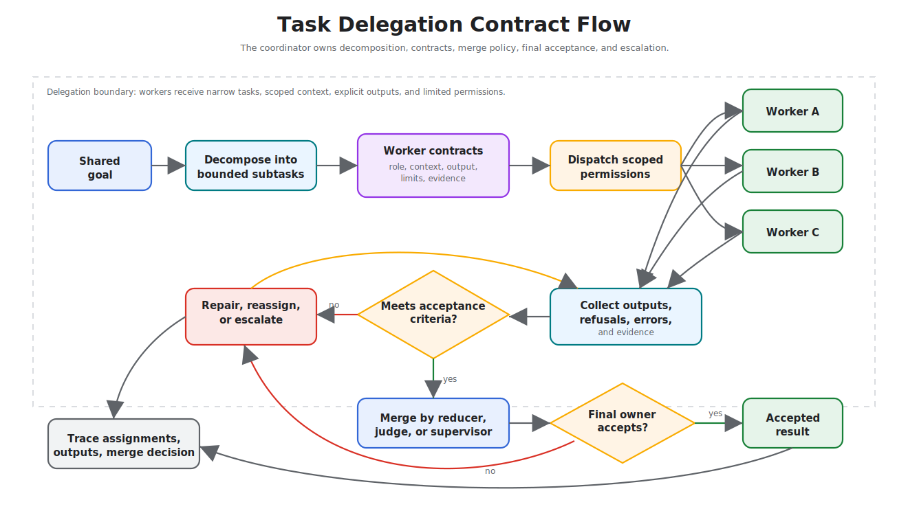

# Task Delegation

Task delegation assigns bounded subtasks to specialized workers and combines their outputs.

> Source and downloads
>
> - [Repository source](https://github.com/GTuritto/Agentic-Systems-Patterns/tree/main/task-delegation-pattern)
> - [Download code bundle](/downloads/task-delegation.zip)

## Intent

Task delegation assigns bounded subtasks to specialized workers and combines their outputs.

## Use When

- Specialized workers can complete independent subtasks better than one general agent.
- The manager can define expected outputs, constraints, and acceptance criteria.
- Subtask results can be merged and checked.

## Avoid When

- The task has no useful decomposition.
- Workers share hidden mutable state.
- The manager cannot evaluate returned work.

## Architecture

Use this diagram to read Task Delegation as a system boundary, not only a code shape. The key ownership question is: the coordinator owns the shared goal, decomposition, assignments, merge policy, and final acceptance.



Read it as an ownership contract: the coordinator owns decomposition, worker scope, merge policy, final acceptance, and escalation.

## System Shape

- **Pattern boundary:** a coordinator delegates bounded work to agents with narrow roles, then evaluates and merges their outputs.
- **State owner:** the coordinator owns the shared goal, decomposition, assignments, merge policy, and final acceptance.
- **Primary artifact:** `task-delegation-pattern/` contains the runnable reference implementation and examples.
- **Operational promise:** Task delegation assigns bounded subtasks to specialized workers and combines their outputs.
- **Runnable path:** start with `npm run task-delegation` before adapting the pattern to a larger system.

## Core Protocol

1. Define the shared goal, worker roles, expected outputs, and acceptance criteria.
2. Split work only where independent or specialist execution adds value.
3. Dispatch tasks with scoped context and permissions.
4. Collect outputs, errors, refusals, and evidence from each worker.
5. Merge results through an explicit judge, reducer, supervisor, or human review gate.

## Implementation Notes

- Keep the pattern boundary explicit: inputs, state, side effects, and outputs should be visible.
- Validate model-produced decisions before they affect tools, users, or durable state.
- Emit enough trace data to debug failures after the run.

## Failure Modes

- The pattern is applied where a simpler deterministic workflow would be better.
- State, tool calls, or model decisions are not observable enough to debug.
- The system lacks clear stop, retry, or escalation behavior.

## Evaluation Strategy

- Compare multi-agent output against a single-agent baseline on the same tasks.
- Test worker disagreement, worker failure, duplicated work, and bad merge decisions.
- Measure quality lift, latency cost, token cost, merge accuracy, and accountability.
- Include cases that prove each "Use When" condition is true for this pattern.
- Include negative cases from "Avoid When" so the system chooses a simpler or safer pattern when appropriate.

## Production Checklist

- Give every worker a narrow contract and permission set.
- Make the merge policy explicit before workers run.
- Log per-worker inputs, outputs, and decision evidence.
- Keep one owner for final acceptance and escalation.
- Define human escalation for ambiguous, high-risk, or policy-blocked work.
- Keep the source bundle, generated chapter, tests, and deployment artifact in the same release.

## Run the Example

```sh
npm run task-delegation
```

## Code Walkthrough

Read the excerpt as the smallest executable expression of the pattern. The surrounding chapter explains the design constraints; the code shows where those constraints become concrete interfaces, state, validation, or control flow.

## Source Code

These excerpts show the implementation shape. The complete code is available in the download bundle and repository source.

### `task-delegation-pattern/autogen_typescript_example/task_delegation.ts`

[Open full source](https://github.com/GTuritto/Agentic-Systems-Patterns/blob/main/task-delegation-pattern/autogen_typescript_example/task_delegation.ts)

```ts
// Task Delegation Pattern - Autogen TypeScript Example
// To run: npm install && npm run task-delegation

import axios from 'axios';
import * as readline from 'readline';
import * as dotenv from 'dotenv';
dotenv.config();

const MISTRAL_API_URL = 'https://api.mistral.ai/v1/chat/completions';
const MISTRAL_API_KEY = process.env.MISTRAL_API_KEY;

async function managerAgent(task: string): Promise<string> {
  // Step 1: Decompose the task
  const decomposePrompt = `You are a manager agent. Decompose the following task into two subtasks and describe each one. Task: ${task}`;
  const decomposeResp = await axios.post(
    MISTRAL_API_URL,
    {
      model: 'mistral-tiny',
      messages: [{ role: 'user', content: decomposePrompt }],
    },
    {
      headers: {
        'Authorization': `Bearer ${MISTRAL_API_KEY}`,
        'Content-Type': 'application/json',
      },
    }
  );
  const subtasks = decomposeResp.data.choices[0].message.content.split(/\n|\r/).filter(Boolean);
  const subtask1 = subtasks[0] || 'Subtask 1';
  const subtask2 = subtasks[1] || 'Subtask 2';

  // Step 2: Delegate to workers
  const worker1Prompt = `You are Worker Agent 1. Complete this subtask: ${subtask1}`;
  const worker2Prompt = `You are Worker Agent 2. Complete this subtask: ${subtask2}`;
  const [worker1Resp, worker2Resp] = await Promise.all([
    axios.post(MISTRAL_API_URL, {
      model: 'mistral-tiny',
      messages: [{ role: 'user', content: worker1Prompt }],
    }, {
      headers: {
        'Authorization': `Bearer ${MISTRAL_API_KEY}`,
        'Content-Type': 'application/json',
      },
    }),
    axios.post(MISTRAL_API_URL, {
      model: 'mistral-tiny',
      messages: [{ role: 'user', content: worker2Prompt }],
    }, {
      headers: {
        'Authorization': `Bearer ${MISTRAL_API_KEY}`,
        'Content-Type': 'application/json',
      },
    })
  ]);

  // Step 3: Aggregate results
  return `Results:\n- ${worker1Resp.data.choices[0].message.content}\n- ${worker2Resp.data.choices[0].message.content}`;
}

const rl = readline.createInterface({
  input: process.stdin,
  output: process.stdout
});

rl.question('Task: ', async (userInput: string) => {
  try {
    const result = await managerAgent(userInput);
    console.log(result);
  } catch (err) {
    console.error('Error:', err);
  }
  rl.close();
});
```

### `task-delegation-pattern/langgraph_python_example/task_delegation.py`

[Open full source](https://github.com/GTuritto/Agentic-Systems-Patterns/blob/main/task-delegation-pattern/langgraph_python_example/task_delegation.py)

```py
# Task Delegation Pattern - LangGraph Python Example

This example demonstrates the Task Delegation Pattern using LangGraph and Python. A manager agent decomposes a task and delegates subtasks to two worker agents, then aggregates the results. The LLM is Mistral.

## Requirements

- Python 3.8+
- `langgraph` library
- `python-dotenv` (for .env support)
- Mistral LLM API access

## Install dependencies

``​`bash
pip install langgraph python-dotenv requests
``​`

## Example Code

``​`python
import os
from langgraph import Agent, Environment, LLM
from dotenv import load_dotenv

load_dotenv()

MISTRAL_API_KEY = os.getenv("MISTRAL_API_KEY")
MISTRAL_API_URL = "https://api.mistral.ai/v1/chat/completions"

class SimpleEnvironment(Environment):
    def get_observation(self):
        return input("Task: ")
    def send_action(self, action):
        print(action)

class ManagerAgent(Agent):
    def __init__(self, llm):
        self.llm = llm
    def act(self, task):
        prompt = f"You are a manager agent. Decompose the following task into two subtasks and describe each one. Task: {task}"
        return self.llm.complete(prompt)

class WorkerAgent(Agent):
    def __init__(self, llm, name):
        self.llm = llm
        self.name = name
    def act(self, subtask):
        prompt = f"You are {self.name}. Complete this subtask: {subtask}"
        return self.llm.complete(prompt)

llm = LLM(
    provider="mistral",
    api_key=MISTRAL_API_KEY,
    api_url=MISTRAL_API_URL,
)

env = SimpleEnvironment()
manager = ManagerAgent(llm)
worker1 = WorkerAgent(llm, "Worker Agent 1")
worker2 = WorkerAgent(llm, "Worker Agent 2")

task = env.get_observation()
subtasks = manager.act(task).split("\n")
subtask1 = subtasks[0] if len(subtasks) > 0 else "Subtask 1"
subtask2 = subtasks[1] if len(subtasks) > 1 else "Subtask 2"
result1 = worker1.act(subtask1)
result2 = worker2.act(subtask2)
final = f"Results:\n- {result1}\n- {result2}"
env.send_action(final)
``​`

---

- Try a complex or multi-step task to see delegation in action.
- Make sure your `.env` file contains your Mistral API key.
```

## Download

- [Download source bundle](/downloads/task-delegation.zip)
- [Open source folder](https://github.com/GTuritto/Agentic-Systems-Patterns/tree/main/task-delegation-pattern)

The download bundle contains the current `task-delegation-pattern/` folder from this repository.

## Related Patterns

- [Supervisor / Worker](/multi-agent-systems/supervisor-worker)
- [Debate and Consensus](/multi-agent-systems/debate-and-consensus)
- [Parallel Agents](/multi-agent-systems/parallel-agents)
- [Choosing the Right Pattern](/pattern-selection/choosing-the-right-pattern)
- [Resource-Aware Agent Design](/pattern-selection/resource-aware-agent-design)
