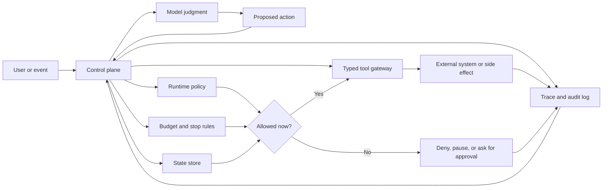

# Architecture Before Autonomy

Do not start with the framework. Start with the boundary: what is the model allowed to decide?

Agents earn their place when software cannot know every step in advance. They become a liability when the system lets the model own decisions that should belong to code, things like permission checks, stop conditions, budget limits, state transitions, audit records, and irreversible side effects. Good agentic architecture separates judgment from authority. The model proposes the next useful action; the system decides whether that action is valid, allowed, affordable, observable, and safe to execute.

## The Model Is Not The System

An LLM can summarize context, propose plans, choose from tools, critique outputs, and explain tradeoffs. None of that makes it the control plane. The control plane owns the active goal, the allowed tools, the current state, the budget, the stop condition, the policy context, the approval requirements, the retry and fallback rules, and the trace of what happened.

When those responsibilities live only in a prompt, the system gets hard to test and harder to operate. A prompt can influence behavior. It cannot replace a durable boundary.

## A Practical Boundary

Use this division of responsibility as your default:

| Concern | Owned By Software | Proposed By Model |
| --- | --- | --- |
| Goal | The task contract and success criteria | Clarifying questions or subgoals |
| State | Durable store, workflow engine, or application service | Summaries or candidate memory writes |
| Tools | Typed schemas, permissions, timeouts, and audit logs | Tool choice and arguments |
| Policy | Runtime checks and approval gates | Risk explanation or escalation request |
| Evaluation | Tests, rubrics, traces, and review workflow | Self-critique or candidate score |
| Stopping | Explicit success, failure, budget, or cancellation rule | Claim that the goal appears complete |

This does not make the system less agentic. It makes the autonomy legible, which is what lets you operate it.

## Boundary Map

Use this map when reviewing a design. The model can propose judgment-heavy work, but software must own authority, execution, and evidence.



This chapter names the boundary. [Tool Capability Design](../tools-skills-protocols/tool-capability-design) and [Human Approval Gates](../tools-skills-protocols/human-approval-gates) define the concrete tool and approval contracts behind it.

In code, the boundary can be small and explicit:

```ts
interface ProposedAction {
  kind: 'read' | 'write' | 'notify' | 'stop';
  tool?: string;
  input?: unknown;
  risk: 'low' | 'medium' | 'high';
}

function decideExecution(action: ProposedAction, policy: RuntimePolicy) {
  if (action.kind === 'stop') return { status: 'stop' };

  if (!action.tool || !policy.allowedTools.includes(action.tool)) {
    return { status: 'deny', reason: 'tool_not_allowed' };
  }

  if (action.risk === 'high' && !policy.hasHumanApproval) {
    return { status: 'pause', reason: 'approval_required' };
  }

  return { status: 'execute', tool: action.tool, input: action.input };
}
```

The model proposes `ProposedAction`. The runtime decides whether it is denied, paused, executed, or stopped.

## Premature Autonomy

Premature autonomy shows up when a team reaches for an agent loop before answering simpler questions first: Could this be a deterministic workflow with model-assisted steps? Could a prompt chain with validation solve it? Could routing isolate the different task types? Could a human approval gate handle the risky cases? Can the system already prove why an action was taken, and can a failed run be replayed?

When the answer to those is no, adding more agents tends to hide the weakness rather than fix it. Multi-agent systems amplify unclear goals, weak state, and poor observability far more reliably than they cure them.

## A Common Rewrite

A weak design says:

```text
Give the agent access to order data, refund tools, and the customer conversation.
Let it investigate the case and issue the refund if appropriate.
```

That sounds efficient, but the boundary is missing. The model owns too much: policy interpretation, evidence selection, risk classification, approval, tool authority, and stop conditions.

A better design says:

```text
Workflow receives refund request.
Software loads order, payment, customer, and policy records.
Model summarizes evidence and proposes a refund recommendation.
Software validates required evidence, refund threshold, account status, and policy version.
Low-risk denial or draft response can proceed.
High-risk refund creates an approval request.
Payment tool executes only after approval, with idempotency and audit records.
Run stops with completed, denied, needs_approval, policy_blocked, or evidence_missing.
```

The second design still uses model judgment, but the model no longer owns authority. It proposes a recommendation inside a system that can be reviewed, tested, paused, replayed, and operated.

## The Engineering Test

Before adding autonomy, ask whether an operator could inspect a failed run and answer:

1. What goal was active?
2. What state did the system believe?
3. What evidence was available?
4. What did the model propose?
5. What did software validate?
6. What tool calls ran?
7. What policy checks passed or failed?
8. Why did the run stop?
9. What changed in the outside world?

If those answers are not available, the next thing to build is not another agent. It is state, policy, evaluation, or observability.

## Autonomy Review Checklist

Use this checklist before approving an agentic design:

| Question | Pass Condition |
| --- | --- |
| What runtime decision does the model make? | The decision is named and narrower than "do the task." |
| What does software own? | Goal, state, policy, tools, budget, stop reasons, and audit records are outside the model. |
| What side effects can happen? | Every write, send, payment, permission change, or memory write has an owner and idempotency rule. |
| What requires approval? | Risk thresholds and approver roles are defined before execution. |
| What is persisted? | State, evidence, proposals, validation decisions, tool results, and stop reason can be inspected. |
| What is tested? | Evals cover allowed actions, denied actions, missing evidence, failed tools, and budget stops. |
| What happens on failure? | The system can stop, retry, fall back, escalate, or replay without repeating unsafe side effects. |

If the checklist feels too heavy, the design probably wants less autonomy, not more.

## Design Rule

Autonomy is a budget. Spend it only where it buys a better outcome than deterministic software, and surround it with boundaries that make failure visible.

## Related Chapters

- [Choosing the Right Pattern](./choosing-the-right-pattern)
- [Pattern Evaluation Checklist](./pattern-evaluation-checklist)
- [Pattern Composition Playbook](./pattern-composition-playbook)
- [Agent Loop](../foundations/agent-loop)
- [Goals and State](../foundations/goals-and-state)
- [Tool Use](../foundations/tool-use)
- [Tool Capability Design](../tools-skills-protocols/tool-capability-design)
- [Human Approval Gates](../tools-skills-protocols/human-approval-gates)
- [Evaluation-Driven Agent Development](../agent-engineering-practice/evaluation-driven-agent-development)
- [Agentic System Architecture](../systems-architecture/agentic-system-architecture)
- [Production Runtime Overview](../production-runtime/overview)
