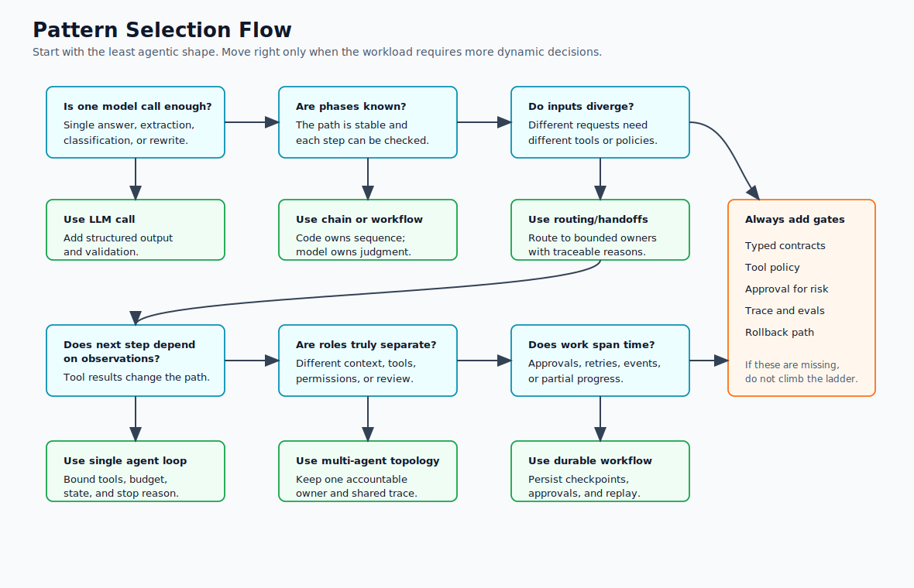
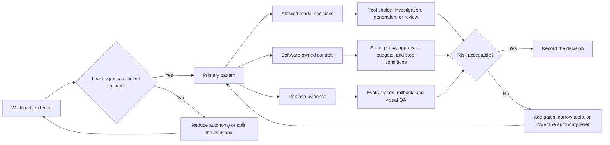

# Choosing the Right Pattern

Agentic design is a spectrum. The best architecture is usually the least agentic system that can meet the requirement with acceptable quality, latency, cost, and risk.

Use this chapter before choosing a framework, adding agents, or building a multi-agent topology. The decision should start with the workload, not with the most powerful pattern available.

## Selection Flow

Use this diagram as a practical gate before moving up the autonomy ladder. The question is not "can an agent do it?" The question is which smaller pattern can satisfy the workload with less risk.



## The Autonomy Ladder

Move up the ladder only when the lower rung cannot handle the job.

| Level | Pattern Shape | Use When | Main Risk |
| --- | --- | --- | --- |
| 1 | LLM call | A single answer, rewrite, classification, extraction, or summary is enough. | No access to live data or action. |
| 2 | Prompt chain | The work has known phases and each phase can be validated before the next one starts. | Brittle gates or unnecessary latency. |
| 3 | Deterministic workflow with LLM steps | Code owns the sequence, while LLMs handle bounded judgment inside steps. | Overfitting the workflow to today's process. |
| 4 | Routing and handoffs | Different inputs need different models, prompts, tools, agents, or policies. | Bad routing sends work to the wrong authority. |
| 5 | Single agent loop | The next step depends on observations discovered during execution. | Loops, tool misuse, and compounding errors. |
| 6 | Orchestrator-workers | The system must break an unknown task into subtasks and synthesize results. | The orchestrator becomes a hidden control plane. |
| 7 | Multi-agent system | Different specialists need separate context, tools, permissions, or review roles. | Coordination overhead, trace fragmentation, and cost growth. |
| 8 | Autonomous long-running agent | The task spans time, failures, external events, and partial progress. | Unbounded autonomy without strong state, policy, and observability. |

This ladder is not a maturity model. A production system can stay at level 2 forever if the task is stable and the value is clear.

## First Questions

Ask these questions before selecting a pattern:

- Is the workflow known before execution starts?
- Does the model need to choose the next step, or can code do it?
- Does the task need current data, private data, tools, or side effects?
- Can the system tolerate extra latency from multiple model calls?
- What is the maximum acceptable cost per run?
- What requires human approval?
- What evidence proves the answer or action is correct?
- What state must be replayable after a failure?
- What could go wrong if the model is persuasive but wrong?

If the answers are unclear, start with a deterministic workflow and add agentic behavior only where the workflow needs model judgment.

## Selection Outputs

Do not leave pattern selection as a conversation. Write down the decision in a form another engineer can review.

```text
Workload:
Primary pattern:
Why this is the least agentic sufficient design:
Model decisions allowed:
Software-owned controls:
Tools and side effects:
State that must be persisted:
Approval requirements:
Eval cases required before release:
Fallback or rollback path:
```

The most important line is "why this is the least agentic sufficient design." If the answer is "because agents are flexible," the design is not ready. Name the actual uncertainty the model must handle: ambiguous intent, unknown next step, incomplete evidence, variable tool choice, or open-ended investigation.

## Decision Record Map

Use this map to turn the selection output into an engineering review artifact. A pattern choice is ready when the workload evidence, autonomy boundary, controls, and release evidence can be reviewed separately.



## Selection Matrix

| Workload Signal | Prefer | Avoid |
| --- | --- | --- |
| Known fixed sequence | Prompt Chaining and Gates | Autonomous agents |
| One of several known task types | Routing and Handoffs | One giant prompt |
| Independent subtasks | Parallel Agents | Sequential chains that create avoidable latency |
| Unknown subtasks | Orchestrator-workers | Hard-coded task lists |
| Quality improves with review | Evaluator-Optimizer | Single-pass generation |
| High-risk side effects | Human Approval Gates | Direct tool execution from model output |
| Large tool surface | MCP-first Tool Use with policy | Broad untyped tools |
| Long-running work | Durable Workflows and Goals and State | Hidden in-memory loops |
| Sensitive data or compliance | Policy Enforcement and audit logs | Prompt-only controls |
| Retrieval-heavy answers | Agentic RAG Systems | Blind model responses |
| Debugging matters | Observability and Evals | Final-answer-only logs |

The same product may combine several rows. For example, a support refund workflow may use routing to classify the request, deterministic workflow steps for account lookup, RAG for policy evidence, human approval for exceptions, and an agent loop only for open-ended investigation.

## Example Choices

| Workload | Start With | Add Autonomy Only If |
| --- | --- | --- |
| Rewrite or summarize user-provided text | One model call with structured output | The system must fetch missing context or revise against external evidence. |
| Generate support replies from known policies | Workflow with retrieval and validation | The request requires investigation across tools with unknown next steps. |
| Triage tickets by product area | Routing and handoffs | The router needs to ask follow-up questions or inspect live systems. |
| Research a technical question | Agentic RAG or agent loop with retrieval tools | The system must decide whether evidence is sufficient or continue searching. |
| Issue refunds | Deterministic workflow with model-assisted evidence summary | The policy has ambiguous exceptions that require bounded investigation. |
| Coordinate delivery operations | Workflow plus explicit roles | Separate agents need distinct context, tools, permissions, or audit trails. |
| Maintain a long-running background task | Durable workflow | Runtime decisions depend on future events, partial progress, or recovery. |

These examples are intentionally conservative. Start with the boring pattern, then promote only the part of the system that has earned dynamic behavior.

## Workflows vs Agents

A workflow uses code to control the path. A model may classify, extract, summarize, critique, or generate inside a step, but software decides what happens next.

An agent uses the model to decide parts of the path. It observes state, decides the next action, calls tools, reads results, and continues until a goal is complete or a limit is reached.

Prefer a workflow when the process is stable, when correctness depends on deterministic rules, when latency or cost must stay low, when the system has to be easy to audit, and when operators need predictable failure modes. Prefer an agent when the process is open-ended, when the system has to discover missing information, when tool choice depends on intermediate observations, when the number of steps is unknown, or when a fixed workflow would branch into a tree nobody can maintain.

## Complexity Budget

Every additional agent, model call, tool, memory store, and evaluator spends part of the system's complexity budget, so spend it deliberately. Complexity is worth adding when it buys a concrete outcome: a higher task completion rate, lower human effort, better evidence grounding, safer side effects, lower cost through routing or smaller models, better debuggability, or clearer ownership boundaries.

Do not add complexity only because a pattern is popular. A multi-agent system that replaces a reliable four-step workflow usually makes the product slower, harder to test, and harder to explain.

## Pattern Evolution Path

A practical evolution path looks like this:

1. Start with one prompt or deterministic workflow.
2. Add structured outputs and validation.
3. Add retrieval or tools where the model needs evidence or action.
4. Add routing when inputs diverge into distinct paths.
5. Add evaluator loops where quality improves with critique.
6. Add durable state when work spans several steps or sessions.
7. Add agents only where dynamic decisions are required.
8. Add multi-agent coordination when separate roles need separate context, tools, or permissions.

Each step should improve a measured outcome. If a pattern does not improve accuracy, reliability, latency, cost, safety, or maintainability, remove it.

## Common Selection Mistakes

- Choosing multi-agent coordination when the real need is routing.
- Using an agent loop because the workflow was not written down.
- Giving the model broad tools when a narrow workflow step would work.
- Adding reflection when the system needs a better evaluator or test set.
- Adding memory before defining what state must be durable, correctable, and deletable.
- Treating framework examples as production architecture.
- Optimizing for autonomy before measuring task completion, cost, latency, or risk.

## Minimum Production Bar

Before a pattern handles users, money, private data, infrastructure, or customer communication, the system should have:

- typed inputs and outputs;
- explicit stop conditions;
- bounded tool permissions;
- traceable model and tool calls;
- replayable state transitions;
- eval datasets for expected behavior;
- fallback behavior for model, retrieval, and tool failure;
- human approval for high-risk actions;
- rollback or remediation for bad actions.

This minimum bar applies to simple systems too. Small systems fail faster because their boundaries are often implicit.

## Related Chapters

- [Prompt Chaining and Gates](./prompt-chaining-and-gates)
- [Routing and Handoffs](./routing-and-handoffs)
- [Circuit Breakers, Fallbacks, and Replay](./circuit-breakers-fallbacks-replay)
- [Agent Loop](../foundations/agent-loop)
- [Goals and State](../foundations/goals-and-state)
- [Agentic System Architecture](../systems-architecture/agentic-system-architecture)
- [Source Map](./source-map)
