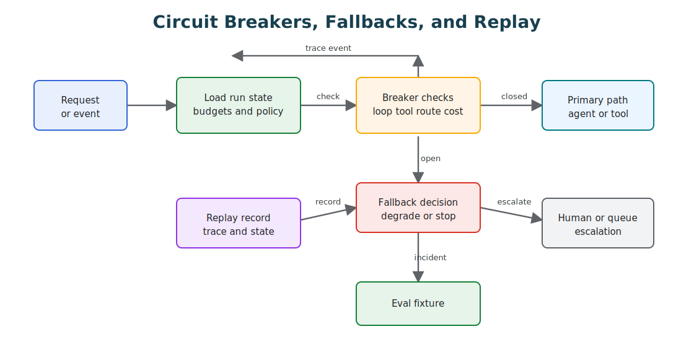

# Circuit Breakers, Fallbacks, and Replay

Agentic systems need controls that stop waste, contain damage, and make failures explainable. Circuit breakers stop unsafe or unproductive execution. Fallbacks give the system a safer next move. Replay lets engineers reconstruct what happened.

This is a reliability pattern for agent loops, tool use, RAG, workflow orchestration, and multi-agent systems.



## Intent

Protect the system from repeated failure and make every run recoverable enough to debug.

An agent should not keep calling the same failing tool, searching the same empty corpus, revising the same bad draft, or handing the same task between agents without progress.

The key idea is simple: autonomy needs runtime brakes. A breaker is not an error handler buried inside a tool wrapper. It is an architectural control that decides when the system must stop, degrade, ask for help, or preserve enough state for replay.

## Use When

- Agents can call tools, APIs, browsers, shells, or workflows.
- Work can loop, retry, delegate, or wait.
- Costs can grow with each model or tool call.
- Partial state matters after failure.
- Operators need to explain why a run stopped.

This pattern is mandatory for production systems with side effects.

## Avoid When

- The task is a throwaway prototype with no external effect.
- The system has no loop, retry, or tool use.
- Failures do not need investigation.

Even then, keep a simple run log. The prototype that works often becomes the production seed.

## Circuit Breakers

A circuit breaker turns repeated or high-risk failure into a stop, fallback, or escalation.

| Breaker | Trigger | Action |
| --- | --- | --- |
| Tool failure breaker | Same tool fails N times or returns malformed output. | Disable tool for run and choose fallback. |
| No-progress breaker | State does not change across iterations. | Stop loop and return blocked status. |
| Cost breaker | Token, model-call, or money budget is reached. | Stop, summarize progress, and ask for approval. |
| Latency breaker | Step or run exceeds time budget. | Defer, enqueue, or return partial result. |
| Retrieval breaker | Search returns low-coverage or conflicting evidence. | Ask clarification or escalate. |
| Policy breaker | Tool intent violates permissions or risk rules. | Block action and log policy reason. |
| Handoff breaker | Agents bounce a task between roles. | Assign owner or escalate to human. |
| Output breaker | Final answer fails schema, citation, or eval checks. | Repair once, then fail safely. |

Breakers need names and thresholds. "The agent got stuck" is not operational enough. "No-progress breaker fired after 4 iterations with unchanged evidence set" is debuggable.

Place breakers at the boundary where damage can grow:

| Boundary | What The Breaker Protects |
| --- | --- |
| Loop boundary | Prevents unbounded reasoning, repeated planning, and no-progress iteration. |
| Tool boundary | Prevents repeated external failures, malformed arguments, duplicate side effects, and unsafe writes. |
| Model boundary | Prevents runaway cost, latency spikes, bad model routes, and degraded structured-output behavior. |
| Retrieval boundary | Prevents answers from weak, stale, contradictory, or unauthorized evidence. |
| Memory boundary | Prevents private, stale, or low-confidence memory from steering future runs. |
| Policy boundary | Prevents the agent from converting intent into forbidden action. |
| Multi-agent boundary | Prevents delegation loops, unclear ownership, and disagreement without resolution. |

The breaker should emit a trace event with the breaker name, trigger, threshold, observed value, action taken, and user-visible stop reason. If the breaker fires but the trace does not explain why, operators will still be debugging a mystery.

## Fallbacks

A fallback should be safer than the failed path.

Useful fallback types:

- ask the user for missing information;
- return a partial answer with explicit limits;
- switch from autonomous tool use to deterministic workflow;
- switch from a weak model to a stronger model;
- switch from write action to read-only analysis;
- use cached or previously verified data;
- route to human review;
- schedule background processing;
- fail closed for restricted actions.

Do not use fallback as a way to hide failure. The user or operator should know what changed.

A good fallback has a contract:

- **Scope:** what the fallback is allowed to do.
- **Quality limit:** what the fallback cannot guarantee.
- **State rule:** whether the run can continue, must pause, or must stop.
- **User message:** how the limitation is explained without exposing internal noise.
- **Operator trace:** which breaker caused the fallback and what evidence was preserved.

For agentic systems, the safest fallback often reduces autonomy. Move from write to draft, from autonomous action to approval, from broad tool use to a deterministic workflow, or from final answer to clarification.

## Replay

Replay is the ability to reconstruct a run from durable state.

Store:

- run ID and parent run ID;
- goal and normalized intent;
- model calls, model versions, parameters, and prompt references;
- tool calls, inputs, outputs, errors, and side-effect identifiers;
- retrieval queries, source IDs, and citation metadata;
- state transitions;
- route decisions and handoffs;
- policy checks;
- breaker and fallback events;
- final output and eval results.

Redact sensitive content when required, but keep enough references to investigate the run.

Replay must be designed before the incident. After a failure, it is too late to discover that prompts, tool arguments, policy decisions, and state transitions were scattered across unrelated logs.

Replay also needs safety rules. A replay should not accidentally send another customer email, issue another refund, or write another memory record. Separate read-only trace replay, deterministic replay with mocked outputs, and sandbox replay with fake side effects.

## Replayable Actions

When an agent performs expensive or risky work, make the action replayable:

- record the input, selected tool, policy decision, and result;
- attach an idempotency key to external side effects;
- cache safe read-only results when freshness rules allow it;
- preserve enough context to reproduce a failed run;
- make rollback explicit for operations that change state.

Replay turns a failure from a mystery into a test case.

## Replay Levels

| Level | Capability | Use |
| --- | --- | --- |
| Trace replay | Reconstruct what happened from logs. | Incident review and debugging. |
| Deterministic replay | Re-run deterministic code with recorded model/tool outputs. | Regression tests and workflow validation. |
| Full replay | Re-run model and tool calls in a sandbox. | Reproduction when external systems are stable. |
| Counterfactual replay | Re-run with changed prompt, policy, model, or tool. | Evaluate fixes before rollout. |

Most teams should start with trace replay. Full replay is useful but harder because models, tools, and external data change.

Counterfactual replay is especially useful for agentic systems. It lets the team ask: would the new prompt, model route, policy rule, retrieval index, or tool schema have avoided the failure without breaking known-good cases?

## Implementation Notes

- Add breakers at the loop, tool, retrieval, route, and workflow levels.
- Record breaker events as first-class trace events.
- Tie fallback decisions to explicit failure reasons.
- Separate safe retries from repeated guessing.
- Make every side effect idempotent or traceable.
- Store enough state to resume or fail cleanly.
- Turn incidents into eval cases.
- Prefer typed breaker events over free-form log messages.
- Keep breaker thresholds configurable by environment, risk class, and tool capability.
- Treat a breaker firing as an evaluation signal, not only an operational event.

## Example Breaker Logic

```ts
type BreakerAction = 'continue' | 'fallback' | 'escalate' | 'stop';

type ToolFailure = {
  toolName: string;
  count: number;
  lastError: string;
};

type RunBudget = {
  maxIterations: number;
  maxToolFailuresPerTool: number;
  maxCostUsd: number;
};

type BreakerDecision = {
  action: BreakerAction;
  reason: string;
  traceEvent: {
    type: 'breaker';
    name: string;
    observed: number;
    threshold: number;
  };
};

function evaluateToolBreaker(
  failure: ToolFailure,
  budget: RunBudget
): BreakerDecision {
  if (failure.count < budget.maxToolFailuresPerTool) {
    return {
      action: 'continue',
      reason: 'tool_failure_budget_remaining',
      traceEvent: {
        type: 'breaker',
        name: `tool:${failure.toolName}`,
        observed: failure.count,
        threshold: budget.maxToolFailuresPerTool
      }
    };
  }

  return {
    action: 'fallback',
    reason: 'tool_failure_breaker_open',
    traceEvent: {
      type: 'breaker',
      name: `tool:${failure.toolName}`,
      observed: failure.count,
      threshold: budget.maxToolFailuresPerTool
    }
  };
}

function evaluateLoopBreaker(
  iteration: number,
  costUsd: number,
  budget: RunBudget
): BreakerDecision | null {
  if (iteration >= budget.maxIterations) {
    return {
      action: 'stop',
      reason: 'max_iterations_reached',
      traceEvent: {
        type: 'breaker',
        name: 'loop:max_iterations',
        observed: iteration,
        threshold: budget.maxIterations
      }
    };
  }

  if (costUsd >= budget.maxCostUsd) {
    return {
      action: 'escalate',
      reason: 'max_cost_reached',
      traceEvent: {
        type: 'breaker',
        name: 'run:max_cost_usd',
        observed: costUsd,
        threshold: budget.maxCostUsd
      }
    };
  }

  return null;
}
```

The important part is not the code size. The important part is that the stop reason becomes part of the run state and trace.

The action should drive behavior. `continue` proceeds on the primary path. `fallback` moves to a safer path. `escalate` asks a human or queue to take over. `stop` ends the run with a clear state and replay record.

## Failure Modes

- Breakers exist in logs but do not affect execution.
- Fallbacks silently lower quality without telling the user.
- Retries repeat the same inputs and expect different outcomes.
- Traces omit tool inputs, making replay impossible.
- Side effects cannot be matched to the agent run that created them.
- Multi-agent systems have no single owner when a breaker fires.
- Breaker thresholds are hard-coded and cannot change by risk class.
- Replay can reproduce the failure only by touching live systems again.
- The system falls back to a more powerful model when the real issue is missing policy or state.

## Evaluation Guidance

Test breakers and fallbacks directly. Do not wait for production incidents to prove that the runtime can stop safely.

| Eval Case | Expected Behavior |
| --- | --- |
| Tool fails repeatedly | Tool breaker opens, fallback path runs, trace records the threshold. |
| Loop makes no state progress | Loop stops with a no-progress reason and no extra tool calls. |
| Cost budget is exhausted | Run pauses, summarizes progress, and asks for approval or continuation budget. |
| Retrieval evidence is weak | Agent asks for clarification or refuses unsupported claims. |
| Policy blocks a write action | Action is denied or escalated before side effects. |
| Multi-agent delegation repeats | Supervisor assigns a single owner or escalates. |
| Replay uses recorded trace | Replay does not trigger live side effects. |

## Production Checklist

- Does every loop have max iterations, max cost, and max wall-clock time?
- Does every tool have timeout, retry, and failure thresholds?
- Does every fallback tell the operator what changed?
- Can the system stop safely after partial progress?
- Can a failed run become an eval fixture?
- Can side effects be audited and reversed when possible?
- Can operators replay a run without reading raw prompts from scattered logs?
- Are breaker events attached to trace IDs, eval cases, and incident reviews?
- Are fallback paths tested before launch?
- Can risky tools be disabled without redeploying the whole agent?

## Related Chapters

- [Agent Loop](../foundations/agent-loop)
- [Goals and State](../foundations/goals-and-state)
- [Self-Healing Workflows](../control-loops/self-healing-workflows)
- [Durable Workflows](../production-runtime/durable-workflows)
- [Cost Controls and Runtime Budgets](../production-runtime/cost-controls-runtime-budgets)
- [Observability and Evals](../production-runtime/observability-and-evals)
- [Policy Enforcement](../production-runtime/policy-enforcement)
