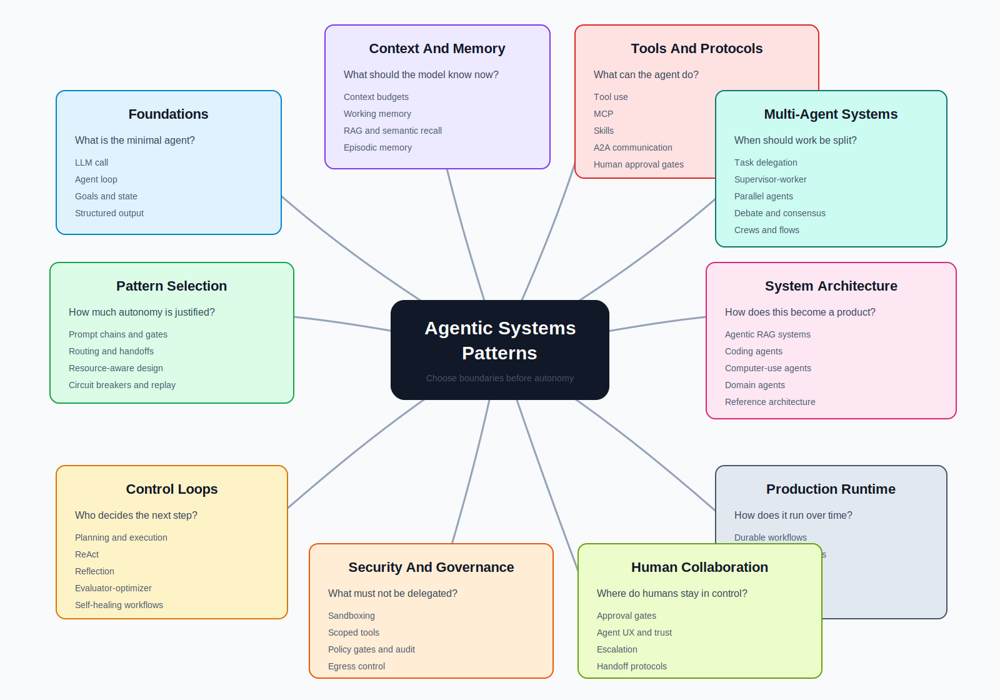

# Linked Pattern Mind Map

Patterns are easier to use when they are grouped by the engineering problem they solve.

Do not start with the pattern name. Start with the pressure in the system. Is the hard part control flow, tool safety, memory, evaluation, deployment, or coordination? The answer tells you which part of the map to use first.

This page is also an alternative table of contents. The sidebar shows where chapters live. This map shows how the ideas connect.

## Linked Alternative TOC

Use this map when you know the design problem but not the chapter name. The order is intentional: start with the loop, add control, add context and memory, expose tools safely, compose agents only when needed, then operate, secure, evaluate, and apply the system.

  
<a href="../intro">Agentic Systems Patterns</a>

  

    <section>
      <h3>0. Start With The Thesis</h3>
      <ul>
        <li><a href="../publishing/how-to-read">How To Read This Book</a></li>
        <li><a href="../foundations/what-is-an-agent">What Is An Agent?</a></li>
        <li><a href="./architecture-before-autonomy">Architecture Before Autonomy</a></li>
        <li><a href="./choosing-the-right-pattern">Choosing the Right Pattern</a></li>
        <li><a href="./from-patterns-to-systems">From Patterns To Systems</a></li>
        <li><a href="./pattern-composition-playbook">Pattern Composition Playbook</a></li>
      </ul>
    </section>
    <section>
      <h3>1. Start With The Loop</h3>
      <ul>
        <li><a href="../foundations/single-agent">Single Agent</a></li>
        <li><a href="../foundations/agent-loop">Agent Loop</a></li>
        <li><a href="../foundations/goals-and-state">Goals and State</a></li>
        <li><a href="../foundations/tool-use">Tool Use</a></li>
        <li><a href="../foundations/structured-output">Structured Output</a></li>
        <li><a href="../foundations/context-budgets-and-working-sets">Context Budgets and Working Sets</a></li>
        <li><a href="../foundations/context-engineering">Context Engineering</a></li>
      </ul>
    </section>
    <section>
      <h3>2. Add Control</h3>
      <ul>
        <li><a href="./pattern-evaluation-checklist">Pattern Evaluation Checklist</a></li>
        <li><a href="./pattern-composition-playbook">Pattern Composition Playbook</a></li>
        <li><a href="./prompt-chaining-and-gates">Prompt Chaining and Gates</a></li>
        <li><a href="./routing-and-handoffs">Routing and Handoffs</a></li>
        <li><a href="./resource-aware-agent-design">Resource-Aware Agent Design</a></li>
        <li><a href="./circuit-breakers-fallbacks-replay">Circuit Breakers, Fallbacks, and Replay</a></li>
        <li><a href="./source-map">Source Map</a></li>
      </ul>
    </section>
    <section>
      <h3>3. Engineer The Agent</h3>
      <ul>
        <li><a href="../agent-engineering-practice/agent-development-lifecycle">Agent Development Lifecycle</a></li>
        <li><a href="../agent-engineering-practice/agent-harnesses">Agent Harnesses</a></li>
        <li><a href="../agent-engineering-practice/agent-engineer-toolkit">Agent Engineer Toolkit</a></li>
        <li><a href="../agent-engineering-practice/framework-selection">Framework Selection</a></li>
        <li><a href="../agent-engineering-practice/evaluation-driven-agent-development">Evaluation-Driven Agent Development</a></li>
        <li><a href="../agent-engineering-practice/agent-threat-model">Agent Threat Model</a></li>
        <li><a href="../agent-engineering-practice/agent-security-and-sandboxing">Agent Security and Sandboxing</a></li>
        <li><a href="../agent-engineering-practice/agent-ux-and-human-trust">Agent UX and Human Trust</a></li>
      </ul>
    </section>
    <section>
      <h3>4. Choose The Control Loop</h3>
      <ul>
        <li><a href="../control-loops/planning-and-execution">Planning and Execution</a></li>
        <li><a href="../control-loops/react">ReAct</a></li>
        <li><a href="../control-loops/reflection">Reflection</a></li>
        <li><a href="../control-loops/evaluator-optimizer">Evaluator-Optimizer</a></li>
        <li><a href="../control-loops/self-improvement">Self-Improvement</a></li>
        <li><a href="../control-loops/self-healing-workflows">Self-Healing Workflows</a></li>
      </ul>
    </section>
    <section>
      <h3>5. Add Context And Memory</h3>
      <ul>
        <li><a href="../memory-knowledge/memory-augmented-agent">Memory-Augmented Agent</a></li>
        <li><a href="../memory-knowledge/long-term-episodic-memory">Long-Term Episodic Memory</a></li>
        <li><a href="../memory-knowledge/semantic-recall-rag">Semantic Recall and RAG</a></li>
        <li><a href="../memory-knowledge/working-memory">Working Memory</a></li>
        <li><a href="../memory-knowledge/knowledge-bound-agents">Knowledge-Bound Agents</a></li>
      </ul>
    </section>
    <section>
      <h3>6. Add Tools And Protocols</h3>
      <ul>
        <li><a href="../tools-skills-protocols/skills">Skills</a></li>
        <li><a href="../tools-skills-protocols/tool-capability-design">Tool Capability Design</a></li>
        <li><a href="../tools-skills-protocols/mcp-first-tool-use">MCP-first Tool Use</a></li>
        <li><a href="../tools-skills-protocols/a2a-agent-interoperability">A2A Agent Interoperability</a></li>
        <li><a href="../tools-skills-protocols/secure-agent-communication">Secure Agent Communication</a></li>
        <li><a href="../tools-skills-protocols/human-approval-gates">Human Approval Gates</a></li>
      </ul>
    </section>
    <section>
      <h3>7. Compose Multiple Agents</h3>
      <ul>
        <li><a href="../multi-agent-systems/choosing-multi-agent-topology">Choosing Multi-Agent Topology</a></li>
        <li><a href="../multi-agent-systems/task-delegation">Task Delegation</a></li>
        <li><a href="../multi-agent-systems/supervisor-worker">Supervisor / Worker</a></li>
        <li><a href="../multi-agent-systems/debate-and-consensus">Debate and Consensus</a></li>
        <li><a href="../multi-agent-systems/parallel-agents">Parallel Agents</a></li>
        <li><a href="../multi-agent-systems/crewai-flows-and-crews">CrewAI Flows and Crews</a></li>
      </ul>
    </section>
    <section>
      <h3>8. Turn Patterns Into Systems</h3>
      <ul>
        <li><a href="../systems-architecture/agentic-system-architecture">Agentic System Architecture</a></li>
        <li><a href="../systems-architecture/agents-as-services">Agents As Services</a></li>
        <li><a href="../systems-architecture/agentic-rag-systems">Agentic RAG Systems</a></li>
        <li><a href="../systems-architecture/open-personal-agent-architectures">Open Personal Agent Architectures</a></li>
        <li><a href="../systems-architecture/coding-agents">Coding Agents</a></li>
        <li><a href="../systems-architecture/computer-use-agents">Computer-Use Agents</a></li>
        <li><a href="../systems-architecture/domain-agent-architectures">Domain Agent Architectures</a></li>
        <li><a href="../systems-architecture/architecture-decision-records">Architecture Decision Records</a></li>
        <li><a href="../systems-architecture/reference-architecture">Reference Architecture</a></li>
      </ul>
    </section>
    <section>
      <h3>9. Operate In Production</h3>
      <ul>
        <li><a href="../production-runtime/overview">Production Runtime Overview</a></li>
        <li><a href="../production-runtime/durable-workflows">Durable Workflows</a></li>
        <li><a href="../production-runtime/observability-and-evals">Observability and Evals</a></li>
        <li><a href="../production-runtime/production-evaluation-feedback-loops">Production Evaluation Feedback Loops</a></li>
        <li><a href="../production-runtime/cost-controls-runtime-budgets">Cost Controls and Runtime Budgets</a></li>
        <li><a href="../production-runtime/policy-enforcement">Policy Enforcement</a></li>
        <li><a href="../production-runtime/event-triggered-agents">Event-Triggered Agents</a></li>
        <li><a href="../production-runtime/mastra-runtime">Mastra Runtime</a></li>
      </ul>
    </section>
    <section>
      <h3>10. Apply The Patterns</h3>
      <ul>
        <li><a href="../hands-on-labs/">Hands-On Labs</a></li>
        <li><a href="../hands-on-labs/lab-01-tool-using-agent">Lab 01 - Tool-Using Agent</a></li>
        <li><a href="../hands-on-labs/lab-02-agent-loop-and-planning">Lab 02 - Agent Loop and Planning</a></li>
        <li><a href="../hands-on-labs/lab-03-agentic-rag">Lab 03 - Agentic RAG</a></li>
        <li><a href="../hands-on-labs/lab-04-a2a-communication">Lab 04 - A2A Communication</a></li>
        <li><a href="../hands-on-labs/lab-05-multi-agent-supervisor">Lab 05 - Multi-Agent Supervisor</a></li>
        <li><a href="../hands-on-labs/lab-06-observability-and-evals">Lab 06 - Observability and Evals</a></li>
        <li><a href="../hands-on-labs/vertical-slice-examples">Vertical Slice Examples</a></li>
        <li><a href="../deprecated/historical-patterns">Historical Patterns</a></li>
        <li><a href="../publishing/publishing-and-releases">Publishing and Releases</a></li>
      </ul>
    </section>
  

## Visual Classification

## How To Read The Map

The center of the map is not "AI agent." The center is the system you are building.

An agentic system is usually a composition of several pattern families working together. One pattern controls the loop, another controls the context, another governs tools and permissions, and others handle evaluation, runtime and recovery, and human oversight. A final family may coordinate multiple agents. If a system has only the loop and none of the others, it is not a production architecture. It is a demo with a model inside it.

## Pattern Families

| Family | Design Question | Typical Patterns | Main Failure If Missing |
| --- | --- | --- | --- |
| Foundations | What is the minimal agent shape? | LLM call, agent loop, goals, state, structured output. | The system becomes mystical instead of inspectable. |
| Control loops | Who decides the next step? | ReAct, planning, reflection, evaluator-optimizer, self-healing workflows. | Loops run without a useful stop condition or quality gate. |
| Pattern selection | How much autonomy is justified? | prompt chaining, routing, resource-aware design, circuit breakers, replay. | The team adds autonomy where workflow code would be safer. |
| Context and memory | What should the model know right now? | working memory, RAG, episodic memory, context budgets, curated context. | The model sees too much, too little, or the wrong kind of memory. |
| Tools and protocols | What can the agent do? | tool use, MCP, skills, A2A, human approval, secure communication. | Tools become broad, unsafe, untyped, or impossible to audit. |
| Multi-agent systems | When should work be split? | delegation, supervisor-worker, parallel agents, debate, crews. | Coordination cost grows faster than task quality. |
| System architecture | How does this become a product? | agentic RAG, coding agents, computer-use agents, domain agents, reference architecture. | The pattern works in isolation but not inside a real application. |
| Production runtime | How does it run safely over time? | durable workflows, observability, evals, runtime budgets, policy, events, runtime orchestration. | Failures cannot be replayed, explained, budgeted, rolled back, or improved. |
| Security and governance | What must the model never be allowed to decide alone? | sandboxing, policy gates, scoped tools, audit trails, egress control. | Prompt instructions become the only control plane. |
| Human collaboration | Where do humans stay in the loop? | approval gates, UX, trust, escalation, handoff protocols. | Users cannot predict, correct, or trust the system. |
| Vertical slices | How do the patterns compose for one real task? | support refund assistant, safe coding agent, research to brief agent. | The book stays abstract and engineers cannot see the runtime shape. |

## Practical Classification Rule

Classify every pattern by the boundary it creates.

| Boundary | Example Question | Pattern Family |
| --- | --- | --- |
| Decision boundary | Can the model choose the next action? | Control loops, pattern selection. |
| Authority boundary | Can the model execute side effects? | Tools, security, human approval. |
| Context boundary | What enters the model context? | Context and memory. |
| State boundary | What survives between steps and sessions? | Memory, durable workflows. |
| Quality boundary | What blocks a bad answer or action? | Evaluation, gates, replay. |
| Coordination boundary | Who owns each part of the task? | Multi-agent systems. |
| Operational boundary | What happens when the run fails? | Production runtime. |
| Application boundary | How does this design work end to end? | Vertical slice examples. |

This keeps the taxonomy practical. A pattern is not important because it has a name. It is important because it gives the system a boundary that can be tested.

## What This Map Adds To The Book

The book already has a sidebar taxonomy. This map adds an architectural one. The sidebar answers where a chapter lives; the mind map answers which problem you are trying to solve. Use both. The sidebar helps you navigate the book, and the map helps you reason about the system you are designing.

For an applied reading path, use this sequence:

1. [What Is An Agent?](../foundations/what-is-an-agent)
2. [Architecture Before Autonomy](./architecture-before-autonomy)
3. [Agent Harnesses](../agent-engineering-practice/agent-harnesses)
4. [Production Runtime Overview](../production-runtime/overview)
5. [Agent Security and Sandboxing](../agent-engineering-practice/agent-security-and-sandboxing)
6. [Observability and Evals](../production-runtime/observability-and-evals)
7. [Vertical Slice Examples](../hands-on-labs/vertical-slice-examples)

## Related Chapters

- [Architecture Before Autonomy](./architecture-before-autonomy)
- [Choosing the Right Pattern](./choosing-the-right-pattern)
- [From Patterns To Systems](./from-patterns-to-systems)
- [Pattern Composition Playbook](./pattern-composition-playbook)
- [Context Budgets and Working Sets](../foundations/context-budgets-and-working-sets)
- [Context Engineering](../foundations/context-engineering)
- [Tool Capability Design](../tools-skills-protocols/tool-capability-design)
- [Agent Harnesses](../agent-engineering-practice/agent-harnesses)
- [Agent Threat Model](../agent-engineering-practice/agent-threat-model)
- [Agentic System Architecture](../systems-architecture/agentic-system-architecture)
- [Agents As Services](../systems-architecture/agents-as-services)
- [Choosing Multi-Agent Topology](../multi-agent-systems/choosing-multi-agent-topology)
- [Production Evaluation Feedback Loops](../production-runtime/production-evaluation-feedback-loops)
- [Vertical Slice Examples](../hands-on-labs/vertical-slice-examples)
