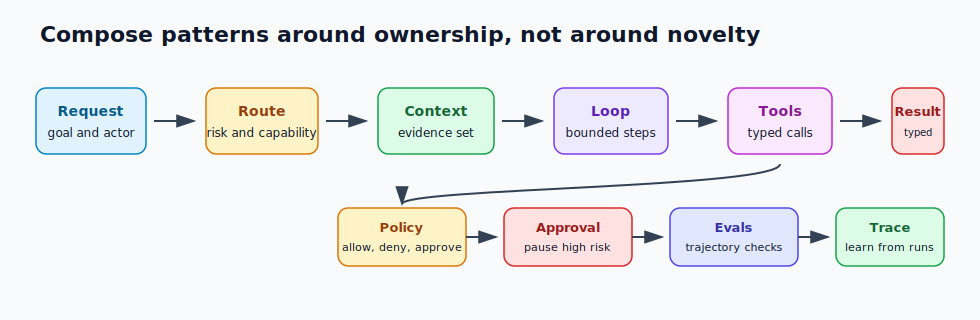

# Pattern Composition Playbook

Patterns become useful when they compose into a system that someone can operate. The goal is not to use as many patterns as possible. The goal is to put each responsibility in the right place: workflow owns flow, policy owns permission, tools own side effects, retrieval owns evidence, the loop owns bounded uncertainty, evals own proof, and observability owns learning from failure.

The easiest way to damage an agentic system is to compose patterns by vibe. Add memory because the agent forgot something. Add a second agent because the task feels large. Add reflection because the answer was weak. Add tools because the model needs data. Each decision may sound reasonable, but the result can become a system with no owner, no stop condition, no evidence boundary, and no way to replay failure.

Composition should start with ownership.



## The Composition Question

Before adding a pattern, ask what problem it owns.

| Pressure | Pattern To Consider | What Must Own The Boundary |
| --- | --- | --- |
| The task has known steps. | Prompt chain or deterministic workflow. | Workflow code. |
| The next step depends on observations. | Agent loop. | Loop controller and stop rules. |
| The answer needs evidence. | RAG, semantic recall, or knowledge-bound agent. | Retrieval and source policy. |
| The model must call tools. | Tool use or MCP-first tool use. | Tool manifest, schema, permission, and audit. |
| The action is risky. | Policy enforcement and human approval gate. | Runtime policy and durable workflow. |
| Quality can be judged better than generated. | Evaluator-optimizer or reflection. | Rubric, evidence checks, and revision budget. |
| Work needs separate context or permissions. | Supervisor-worker or parallel agents. | Coordinator, worker contracts, and merge policy. |
| Failure must be replayed. | Durable workflow, observability, and eval feedback loop. | Runtime, trace store, and eval suite. |

If no pattern owns a concrete problem, do not add it.

For concrete end-to-end examples, read [Vertical Slice Examples](../hands-on-labs/vertical-slice-examples) after this chapter. The slices show the same composition rule applied to support, coding, and research workflows.

## A Default Composition

For many production systems, the default composition is:

1. route the request by task type, risk, and capability;
2. load durable state, policy context, and caller identity;
3. assemble a small working set with approved evidence;
4. run a bounded agent loop only where uncertainty exists;
5. execute tools through typed schemas and permission checks;
6. enforce policy before side effects or memory writes;
7. pause for approval when risk requires it;
8. evaluate trajectory, evidence, output, and policy behavior;
9. record traces, costs, decisions, tool calls, and stop reasons;
10. convert production failures into regression evals.

That sequence is not a framework. It is a responsibility map. A simple system may skip several steps. A high-risk system may need all of them.

## Composition 1: Support Refund Investigation

Use this when the agent investigates a refund but must not directly issue money.

| Responsibility | Pattern |
| --- | --- |
| Intake and routing | Routing and handoffs. |
| Evidence | Semantic recall and typed business tools. |
| Investigation | Bounded agent loop. |
| Tool execution | Tool use with narrow read tools and draft-only write tools. |
| Safety | Policy enforcement before refund actions. |
| Human control | Approval gate for high-value or exception refunds. |
| Quality | Evaluator checks evidence, policy, and recommendation. |
| Operations | Trace, replay, and incident-to-eval feedback. |

The important boundary is financial authority. The agent may investigate, cite policy, and draft a refund request. It should not issue the refund. The refund action belongs to a policy-backed workflow, usually with approval.

```ts
async function handleRefundCase(input: RefundCase) {
  const route = routeSupportCase(input);
  const evidence = await collectRefundEvidence(input.orderId, route.region);

  const investigation = await refundAgent.investigate({
    caseId: input.caseId,
    evidenceRefs: evidence.refs,
    budget: { maxSteps: 6, maxToolCalls: 8, timeoutMs: 45000 }
  });

  const policy = enforcePolicy({
    actorRole: input.agentRole,
    capability: 'refund',
    riskLevel: investigation.riskLevel
  });

  if (policy.decision === 'require_approval') {
    return approvals.request({
      proposedAction: investigation.proposedRefund,
      evidenceRefs: investigation.evidenceRefs,
      policyRefs: investigation.policyRefs
    });
  }

  if (policy.decision !== 'allow') return policy;
  return refunds.draftRefundRequest(investigation);
}
```

This is agentic, but only in the investigation. The workflow owns routing, policy, approval, and side effects.

## Composition 2: Knowledge-Bound Policy Assistant

Use this when the assistant answers from approved policy, documentation, or compliance sources.

| Responsibility | Pattern |
| --- | --- |
| Source eligibility | Policy enforcement and knowledge-bound agent. |
| Evidence retrieval | Semantic recall and RAG. |
| Context control | Context budgets and working sets. |
| Answer shape | Structured output. |
| Unsupported questions | Refusal or human escalation. |
| Quality | Citation coverage and missing-evidence evals. |
| Operations | Source freshness monitoring and trace review. |

The critical boundary is evidence. The assistant should not answer because the model "knows" something. It should answer because the system retrieved eligible sources and the answer cites them.

```json
{
  "answer_status": "answered",
  "answer": "The request can be approved only if damage evidence is attached.",
  "citations": ["refund_policy.v3#damaged-items"],
  "evidence_refs": ["src_refund_policy_2026_04"],
  "missing_evidence": []
}
```

When evidence is missing, the correct output is not a weaker answer. It is `missing_evidence`, `conflicting_evidence`, `refused`, or `needs_human`.

## Composition 3: Multi-Agent Research And Review

Use this when a task benefits from separated workstreams and independent review.

| Responsibility | Pattern |
| --- | --- |
| Decomposition | Supervisor-worker. |
| Worker isolation | Scoped context and tool permissions. |
| Parallel work | Parallel agents when work is independent. |
| Review | Evaluator-optimizer or dedicated reviewer worker. |
| Merge | Supervisor merge policy. |
| Accountability | One final owner and stop reason. |
| Operations | Per-worker traces and merge-decision replay. |

The critical boundary is final ownership. Multiple agents can produce evidence, drafts, or critiques. One component must own final synthesis.

```ts
type ResearchAssignment = {
  workerRole: 'source_finder' | 'technical_reviewer' | 'risk_reviewer';
  objective: string;
  scopedContextRefs: string[];
  allowedTools: string[];
  expectedOutputSchema: string;
  acceptanceCriteria: string[];
};
```

If every worker sees the same context and tools, you probably do not have a useful multi-agent system. You have duplicated model calls.

## What Not To Compose

Some combinations are risky unless there is a strong boundary:

| Risky Composition | Why It Fails | Control |
| --- | --- | --- |
| Agent loop plus broad tools. | The loop can amplify a bad tool decision. | Narrow tools, policy, approval, stop rules. |
| RAG plus memory writes. | Retrieved errors become durable facts. | Memory write review and source metadata. |
| Evaluator plus no evidence. | The evaluator scores confidence without proof. | Citation and trajectory checks. |
| Multi-agent plus shared tool surface. | Every worker can cause the same damage. | Per-worker tool scopes. |
| Human approval plus vague request. | Humans approve without knowing the action. | Typed approval request and exact-action binding. |
| Policy only in prompts. | The model can ignore or reinterpret policy. | Runtime enforcement before execution. |

Composition is not about more parts. It is about better boundaries.

## Design Review

Before approving a composed system, ask:

1. What owns the goal?
2. What owns state?
3. What owns evidence?
4. What owns tool permissions?
5. What owns policy?
6. What owns approval?
7. What owns evaluation?
8. What owns final answer or action?
9. What owns replay and rollback?
10. What production failure becomes a new eval?

If the answer is "the prompt" for any high-risk responsibility, the architecture is not ready.

## Design Rule

Compose patterns only when each added pattern has a job, a boundary, an owner, and an eval that can fail.

## Related Chapters

- [Architecture Before Autonomy](./architecture-before-autonomy)
- [From Patterns To Systems](./from-patterns-to-systems)
- [Pattern Evaluation Checklist](./pattern-evaluation-checklist)
- [Agents As Services](../systems-architecture/agents-as-services)
- [Tool Use](../foundations/tool-use)
- [Agent Loop](../foundations/agent-loop)
- [Policy Enforcement](../production-runtime/policy-enforcement)
- [Human Approval Gates](../tools-skills-protocols/human-approval-gates)
- [Production Evaluation Feedback Loops](../production-runtime/production-evaluation-feedback-loops)
- [Vertical Slice Examples](../hands-on-labs/vertical-slice-examples)
