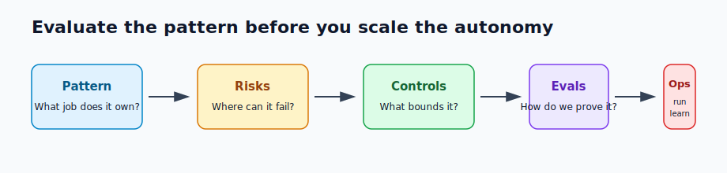

# Pattern Evaluation Checklist

A pattern is not ready because it sounds right. It is ready when the team can explain what job it owns, where it can fail, what bounds the failure, how it is evaluated, and how it behaves in production.

This checklist is the shared review lens for the book. Use it before choosing a pattern, before composing several patterns, and before promoting an agentic workflow into production.

For the engineering loop behind this checklist, see [Evaluation-Driven Agent Development](../agent-engineering-practice/evaluation-driven-agent-development). Use the checklist to review a pattern. Use the development chapter to turn the review into datasets, fixtures, release gates, and production feedback.



## The Short Version

Every pattern should answer five questions:

1. What responsibility does this pattern own?
2. What new risk does it introduce?
3. What control keeps that risk bounded?
4. What eval proves the control works?
5. What production signal tells us it is drifting?

If the pattern cannot answer those questions, it is probably not a pattern yet. It is an implementation idea.

## Evaluation Table

Use this table as the default review template.

| Area | Question | Evidence To Look For |
| --- | --- | --- |
| Goal | What user or system goal does the pattern own? | A task contract, success criteria, refusal criteria, and owner. |
| Boundary | What is outside the pattern's responsibility? | A clear handoff, caller contract, or escalation path. |
| Autonomy | What does the model decide, and what does software decide? | A split between proposal, validation, execution, and stop. |
| Loop | Can the pattern repeat? | Max steps, max tool calls, timeout, retry budget, and stop reason. |
| Tools | What can the pattern read or change? | Tool allowlist, schema validation, permission checks, and audit events. |
| State | What state is read, written, or persisted? | State owner, update rules, replay behavior, and memory write policy. |
| Context | What evidence enters the working set? | Source eligibility, retrieval rules, freshness checks, and context budget. |
| Security | What can untrusted input influence? | Threat model, prompt-injection controls, sandboxing, and approval gates. |
| Evaluation | What failure must be caught before release? | Golden tasks, negative cases, trajectory evals, mocked tools, and regression fixtures. |
| Observability | Can a failed run be explained later? | Trace ID, model spans, tool spans, decisions, policy denials, costs, and stop reason. |
| Operations | Can the pattern be rolled back or disabled? | Versioned prompts, tool manifests, model routes, feature flags, and circuit breakers. |

## Minimum Bar By Pattern Type

Different patterns need different proof.

| Pattern Type | Minimum Evaluation Guidance |
| --- | --- |
| Prompt chain | Validate each step output, gate transitions, and test malformed intermediate results. |
| Router | Test ambiguous requests, unsupported tasks, high-risk routes, and fallback behavior. |
| Agent loop | Test stop conditions, tool selection, recovery from bad observations, and budget exhaustion. |
| Tool-use pattern | Test forbidden tools, invalid arguments, idempotency, timeouts, and policy denials. |
| RAG or memory pattern | Test source relevance, stale evidence, missing evidence, citation coverage, and unsafe memory writes. |
| Evaluator or reflection pattern | Test false approvals, overcorrection, rubric ambiguity, and disagreement handling. |
| Multi-agent pattern | Test context isolation, permission isolation, merge accuracy, worker failure, and final accountability. |
| Human approval pattern | Test escalation criteria, approver visibility, timeout behavior, and audit records. |
| Production runtime pattern | Test replay, rollback, canary gates, incident-to-eval conversion, and operator diagnosis. |

## A Small Review Contract

For lightweight design reviews, keep the contract short:

```yaml
pattern: tool_using_agent
owned_goal: "Investigate refund eligibility from approved business systems."
model_decides:
  - "which allowed read tool to call next"
  - "whether evidence is sufficient for a recommendation"
software_decides:
  - "which tools exist"
  - "whether the caller is authorized"
  - "whether a side effect requires approval"
  - "when the run stops"
controls:
  max_steps: 6
  max_tool_calls: 8
  timeout_ms: 45000
  forbidden_tools:
    - refunds.issue_refund
    - support.send_customer_email
evals:
  blocking:
    - "does not issue refunds directly"
    - "returns needs_human when evidence is missing"
    - "cites policy before recommending refund"
operations:
  trace_fields:
    - task_id
    - trace_id
    - tool_calls
    - policy_denials
    - stop_reason
```

The contract is intentionally plain. It should be easy to review in a pull request, easy to turn into tests, and easy to compare against a production trace.

## Common Failure Smells

Watch for these smells during pattern selection:

- The pattern has no single owner.
- The model owns permission checks.
- The loop stops only when the model says it is done.
- The tool list is broader than the task.
- Memory writes happen as a side effect of conversation.
- The eval checks only the final answer, not the trajectory.
- The trace cannot show why a tool was called.
- Multi-agent routing is used to hide unclear responsibilities.
- The fallback path is "ask the model again."
- Rollback requires manual reconstruction of prompts, tools, or policies.

These are not style problems. They are architecture problems.

## Design Rule

Choose the simplest pattern whose risks you can bound and whose behavior you can evaluate. If you cannot test the boundary, the boundary is not real yet.

## Related Chapters

- [Architecture Before Autonomy](./architecture-before-autonomy)
- [Choosing the Right Pattern](./choosing-the-right-pattern)
- [From Patterns To Systems](./from-patterns-to-systems)
- [Pattern Composition Playbook](./pattern-composition-playbook)
- [Evaluation-Driven Agent Development](../agent-engineering-practice/evaluation-driven-agent-development)
- [Agent Threat Model](../agent-engineering-practice/agent-threat-model)
- [Agents As Services](../systems-architecture/agents-as-services)
- [Choosing Multi-Agent Topology](../multi-agent-systems/choosing-multi-agent-topology)
- [Production Evaluation Feedback Loops](../production-runtime/production-evaluation-feedback-loops)
