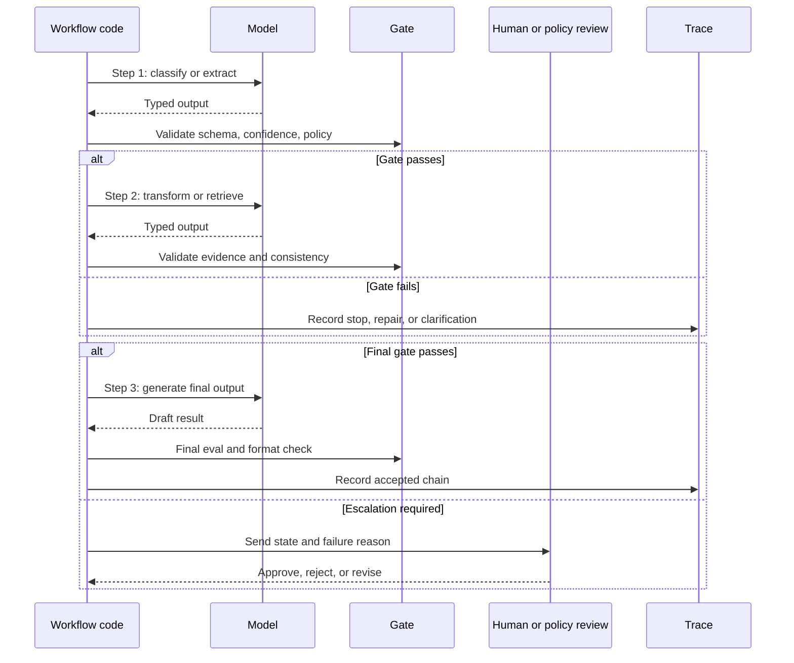

# Prompt Chaining and Gates

Prompt chaining breaks a task into known LLM steps and places validation gates between them. It is one of the safest ways to add model judgment without giving the model control over the whole workflow.

Use this pattern when the order of work is known but individual steps need language understanding, generation, classification, or extraction.

## Intent

Run several bounded model calls in a fixed sequence. Each call receives a narrow input, produces a typed output, and passes through a deterministic gate before the next step runs.

The model performs local judgment. Code owns the workflow.

## Use When

- The task has stable phases.
- Each phase can be tested independently.
- Intermediate outputs can be validated.
- You want lower risk than an autonomous agent loop.
- You need clear failure points and retry behavior.

Common examples:

- classify a request, extract fields, verify fields, then draft a response;
- summarize a document, extract claims, check claims, then produce a final answer;
- generate code, run tests, critique failures, then revise;
- retrieve evidence, normalize citations, then synthesize an answer.

## Avoid When

- The steps are unknown before execution starts.
- The chain would branch into dozens of special cases.
- No gate can verify intermediate outputs.
- The same input often needs a different sequence of work.
- Latency from multiple calls is unacceptable.

If the chain keeps growing conditional branches, consider [Routing and Handoffs](./routing-and-handoffs) or an [Agent Loop](../foundations/agent-loop).

## Architecture

```text
Input
  -> Step 1: classify or extract
  -> Gate 1: schema, confidence, policy, completeness
  -> Step 2: transform or retrieve
  -> Gate 2: evidence, consistency, permissions
  -> Step 3: generate final output
  -> Gate 3: final eval, formatting, approval
  -> Result
```

Gates should be deterministic whenever possible. A gate can use a model as an evaluator, but the gate still needs explicit criteria and a clear pass/fail output.



Use the diagram as a design test. Every arrow should map to a typed state transition, a named gate decision, and a bounded retry or escalation rule.

## Gate Types

| Gate | Checks | Failure Behavior |
| --- | --- | --- |
| Schema gate | JSON shape, required fields, enums, numeric ranges | Ask model to repair or fail fast. |
| Evidence gate | Citations, source freshness, retrieval coverage | Retrieve more evidence or escalate. |
| Policy gate | permissions, user role, restricted actions | Block, redact, or request approval. |
| Confidence gate | classification confidence, ambiguity, missing inputs | Ask a clarification question. |
| Consistency gate | claims match previous state and evidence | Re-run the step with narrower context. |
| Cost gate | model call count, token budget, time budget | Return partial result or defer. |
| Human gate | subjective or high-impact decision | Pause until approval. |

The strongest chains mix several gate types. A support workflow may use schema gates for extracted fields, policy gates for refunds, and human gates for exceptions.

## Gate Contract

Every gate should produce a machine-readable decision. Do not hide gate behavior inside prose.

```ts
type GateDecision =
  | { status: 'pass' }
  | {
      status: 'repair';
      reason: string;
      maxRetries: number;
      repairInstructions: string;
    }
  | {
      status: 'stop';
      reason: string;
      userVisibleMessage?: string;
    }
  | {
      status: 'escalate';
      reason: string;
      requiredRole: 'support_lead' | 'security_reviewer' | 'domain_expert';
    };
```

The chain should record the gate decision, not just the final output. A production trace should show which step ran, which gate accepted or rejected it, and what happened next.

Use explicit failure reasons:

| Failure Reason | Meaning | Next Action |
| --- | --- | --- |
| `schema_invalid` | Output cannot be parsed or required fields are missing. | Repair once or twice, then stop. |
| `evidence_missing` | The step made a claim without enough source support. | Retrieve more evidence or escalate. |
| `policy_denied` | The next step would violate permission or business policy. | Stop or request approval. |
| `ambiguous_input` | The chain cannot choose a safe interpretation. | Ask the user or route to review. |
| `budget_exhausted` | Retry, token, latency, or tool budget is spent. | Return partial result or stop. |

## Worked Gate Example: Refund Draft

A refund support chain should stop before it drafts a customer promise if required evidence is missing. The model can classify, extract, and summarize, but gates decide whether the next step may run.

| Chain Step | Model Output | Gate | Pass Condition | Failure Behavior |
| --- | --- | --- | --- | --- |
| Classify request | `refund_request` with confidence `0.91` | confidence gate | Confidence >= `0.72` and type is not `unknown`. | Ask a clarifying question. |
| Extract fields | `order_id`, `customer_id`, `issue`, `requested_outcome` | schema gate | Required fields exist and IDs match expected format. | Repair once, then stop with `schema_invalid`. |
| Retrieve policy | source IDs and policy version | evidence gate | Current refund policy and order evidence are present. | Stop with `evidence_missing` or retrieve again. |
| Draft recommendation | proposed refund or denial | policy gate | Recommendation matches threshold, account status, and policy version. | Stop with `policy_denied` or request approval. |
| Draft customer reply | customer-facing text | final gate | Text matches approved recommendation and does not promise unapproved payment. | Block and send to support lead. |

The important boundary is the fourth row. If the model proposes "full refund approved" but the policy gate returns `approval_required`, the chain must not continue to a customer-facing promise. It should pause with the exact evidence, proposed amount, policy version, and reviewer role.

```json
{
  "step": "policy_gate",
  "status": "escalate",
  "reason": "approval_required",
  "required_role": "support_lead",
  "evidence_refs": ["order:O-104", "policy:refunds:v2026-06"],
  "blocked_next_step": "draft_customer_reply"
}
```

This is the difference between a chain and a loose sequence of prompts. The chain carries typed state and stops before unsafe language or side effects escape.

## Implementation Notes

- Keep each prompt narrow. A step should have one job.
- Use structured output for every handoff between steps.
- Persist intermediate outputs, not just the final answer.
- Treat every model output as untrusted until a gate accepts it.
- Make repair loops bounded. A failed schema should not trigger infinite retries.
- Prefer deterministic gates for safety and model-based gates for subjective quality.
- Log each step with input hash, model, output, gate result, latency, and cost.

## Example Chain

```ts
type TicketClass = 'billing' | 'technical' | 'account' | 'unknown';

interface Classification {
  type: TicketClass;
  confidence: number;
  reason: string;
}

interface ExtractedFields {
  customerId?: string;
  orderId?: string;
  issue: string;
}

interface ChainState {
  input: string;
  classification?: Classification;
  fields?: ExtractedFields;
  draft?: string;
}

function gateClassification(result: Classification): string | null {
  if (result.confidence < 0.72) return 'classification_low_confidence';
  if (result.type === 'unknown') return 'unknown_ticket_type';
  return null;
}

function gateFields(fields: ExtractedFields): string | null {
  if (!fields.issue.trim()) return 'missing_issue';
  return null;
}

async function runTicketChain(input: string): Promise<ChainState> {
  const state: ChainState = { input };

  state.classification = await classifyTicket(input);
  const classificationError = gateClassification(state.classification);
  if (classificationError) throw new Error(classificationError);

  state.fields = await extractTicketFields(input, state.classification.type);
  const fieldError = gateFields(state.fields);
  if (fieldError) throw new Error(fieldError);

  state.draft = await draftResponse(state.classification.type, state.fields);
  return state;
}
```

The example keeps control flow in code. The model classifies, extracts, and drafts, but it does not decide which validation rules apply.

## Failure Modes

- A chain pretends to be deterministic while hidden prompts make important decisions.
- Gates validate shape but not meaning.
- The chain passes summarized state forward and loses key evidence.
- Repair loops keep asking the model to fix an output without changing the input or prompt.
- A model-based evaluator accepts fluent but unsupported claims.
- The chain becomes a fragile substitute for a real workflow engine.

## Production Checklist

- Are all step inputs and outputs typed?
- Can each step be tested with fixture inputs?
- Does every gate have a named failure reason?
- Does every repair loop have a retry limit?
- Are intermediate outputs persisted for replay?
- Are high-risk actions separated from generation steps?
- Can operators see which gate stopped a run?

## Related Chapters

- [Choosing the Right Pattern](./choosing-the-right-pattern)
- [Structured Output](../foundations/structured-output)
- [Evaluator-Optimizer](../control-loops/evaluator-optimizer)
- [Human Approval Gates](../tools-skills-protocols/human-approval-gates)
- [Durable Workflows](../production-runtime/durable-workflows)
