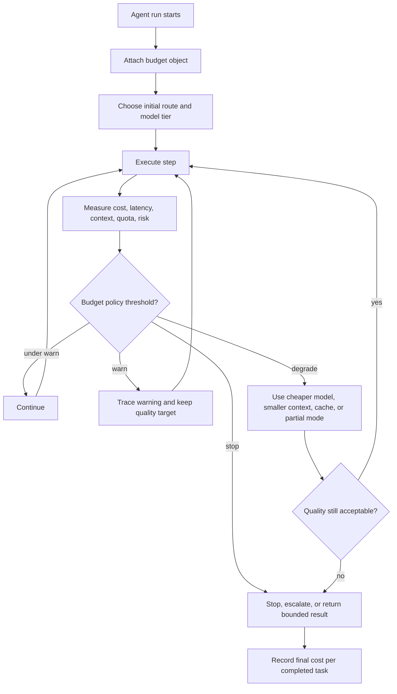

# Resource-Aware Agent Design

Agentic systems spend resources with every model call, retrieval, tool call, handoff, memory operation, and retry. Resource-aware design makes cost, latency, context, and compute part of the architecture.

Use this pattern when an agent must run repeatedly, serve users interactively, or operate under budget constraints.

## Intent

Optimize for completed tasks, not raw model intelligence.

A resource-aware agent chooses the cheapest safe path that can complete the job with acceptable quality.

## Resource Types

| Resource | What To Track |
| --- | --- |
| Tokens | prompt tokens, output tokens, hidden context, compression cost. |
| Model calls | count, model tier, retries, parallel calls. |
| Latency | end-to-end time, step time, tool wait time, human wait time. |
| Money | cost per run, cost per completed task, cost per route. |
| Context window | relevant context, stale context, duplicated context. |
| Tool quota | API rate limits, browser sessions, database load. |
| Human attention | approvals, corrections, escalations, review time. |
| Operational risk | side effects, policy checks, incident cost. |

Human attention is a resource. A cheap model path that creates constant review work is not cheap.

## Budget Objects

Give each run a budget object:

```ts
interface AgentBudget {
  maxCostUsd: number;
  maxModelCalls: number;
  maxToolCalls: number;
  maxIterations: number;
  maxWallClockMs: number;
  maxContextTokens: number;
  approvalRequiredAboveUsd?: number;
}
```

Budgets should travel with state so routers, tools, evaluators, and fallback logic can make consistent decisions.

## Budget Policy

A budget is useful only if the system knows what to do as it is spent.

```ts
type BudgetAction =
  | 'continue'
  | 'switch_to_cheaper_model'
  | 'compress_context'
  | 'skip_optional_review'
  | 'return_partial_result'
  | 'escalate'
  | 'stop';

type BudgetPolicy = {
  warnAtPct: number;
  degradeAtPct: number;
  stopAtPct: number;
  preferredDegradedAction: BudgetAction;
};
```

For example, an interactive support assistant might warn internally at 60 percent of budget, switch to cheaper classification and smaller context at 75 percent, and stop with a partial answer or human escalation at 95 percent. A background research agent might tolerate higher latency but stop earlier on tool quota or source freshness risk.

The budget policy should be part of the route or workflow contract, not an afterthought in logging.



Use this loop to review implementations. Resource control is not only a meter; it must change execution before cost, latency, context, quota, or risk breaks the run.

## Optimization Levers

| Lever | Use When | Trade-off |
| --- | --- | --- |
| Model routing | Some tasks are easy and some are hard. | Route mistakes can reduce quality. |
| Prompt chaining | Steps are known and can be validated. | More calls, but less context per call. |
| Context minimization | Context is large or noisy. | May omit useful evidence. |
| Retrieval filtering | Sources are numerous or mixed quality. | Filters can miss edge cases. |
| Parallelization | Independent subtasks dominate latency. | More total calls and harder aggregation. |
| Caching | Queries or tool outputs repeat. | Cache invalidation and freshness risks. |
| Early exit | Confidence is high enough. | Needs calibrated thresholds. |
| Human escalation | Automation would be risky or expensive. | Uses scarce human attention. |

Optimize only after you can trace costs by route and step.

## Context Compression

Compress context when it is too large, repeated, or stale.

Prefer:

- structured state over long chat history;
- file or record references over pasted content;
- retrieved snippets over entire documents;
- task-specific memory over global memory;
- summaries with source pointers;
- explicit deletion of irrelevant context.

Do not compress away evidence, constraints, tool errors, approvals, or unresolved questions.

## Cost-Aware Routing

Cost-aware routing sends work to the cheapest safe path:

- deterministic code for known operations;
- small model for classification and extraction;
- stronger model for planning or synthesis;
- specialized agent for domain work;
- human review for high-risk ambiguity.

The router needs evals. Otherwise cost savings can silently become quality loss.

## Latency Design

Interactive agents need visible progress and bounded wait.

Use:

- streaming status at workflow boundaries;
- parallel retrieval where safe;
- background jobs for long work;
- partial results with clear limits;
- cancellation;
- resumable state.

For long-running tasks, optimize for resumability before raw speed.

## Degraded Modes

Resource-aware systems should fail smaller before they fail completely.

| Constraint Hit | Degraded Mode | Do Not Do |
| --- | --- | --- |
| Token budget | Use references, summaries with citations, or smaller working set. | Drop constraints, approvals, or error history. |
| Model cost | Route simple steps to cheaper models. | Route high-risk synthesis to a weak model without eval proof. |
| Latency | Return partial result, background the rest, or ask to continue. | Hide long-running work behind a frozen UI. |
| Tool quota | Use cached read-only data with freshness labels. | Call write tools without current evidence. |
| Human attention | Batch low-risk reviews or raise confidence threshold. | Create vague approvals that humans rubber-stamp. |
| Risk budget | Require approval, sandbox, or stop. | Let the model decide that risk is acceptable. |

Degraded behavior should be visible in traces and user-facing output when it affects quality. A cheaper or partial path is acceptable; pretending it is the same path is not.

## Failure Modes

- Optimizing token count while increasing human correction work.
- Using a cheap model for routes it cannot classify reliably.
- Parallelizing dependent work and creating inconsistent results.
- Compressing context so aggressively that the agent forgets constraints.
- Caching stale evidence in regulated or fast-changing domains.
- Measuring cost per call instead of cost per completed task.

## Related Chapters

- [Choosing the Right Pattern](./choosing-the-right-pattern)
- [Routing and Handoffs](./routing-and-handoffs)
- [Context Engineering](../foundations/context-engineering)
- [Working Memory](../memory-knowledge/working-memory)
- [Cost Controls and Runtime Budgets](../production-runtime/cost-controls-runtime-budgets)
- [Observability and Evals](../production-runtime/observability-and-evals)
- [Circuit Breakers, Fallbacks, and Replay](./circuit-breakers-fallbacks-replay)
