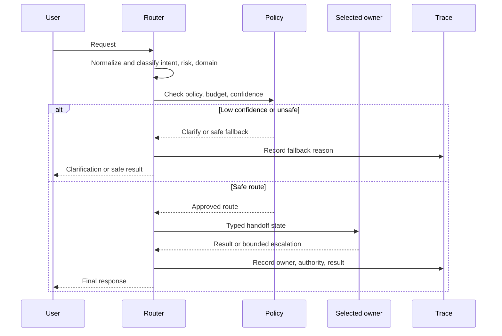

# Routing and Handoffs

Routing sends work to the right model, prompt, tool, workflow, or agent. Handoffs transfer responsibility with enough typed state for the next owner to act safely.

This pattern is often the missing middle between a single prompt and a multi-agent system.

## Intent

Use a classifier, policy rule, planner, or deterministic condition to choose the next execution path. Then pass a narrow state object to the selected path.

A router should decide where work belongs. It should not complete the work itself.

## Use When

- Inputs belong to distinct domains or intents.
- Different paths need different tools, permissions, models, or prompts.
- Simple requests should use cheap, fast paths.
- Risky requests need stricter policy or human approval.
- A large agent is struggling because it has too many tools or responsibilities.

Common examples:

- route support tickets to billing, technical, account, or fraud workflows;
- route easy requests to a small model and unusual requests to a stronger model;
- route code tasks to search, edit, review, or test agents;
- route requests with side effects through approval workflows;
- route RAG questions to the correct index, tenant, or domain corpus.

## Avoid When

- There is only one meaningful path.
- The router cannot explain or score its decision.
- The downstream paths have overlapping ownership.
- A wrong route would create dangerous side effects.
- The router depends on hidden conversation context that is not persisted.

If the route cannot be chosen with confidence, ask for clarification or send the task to a safe fallback path.

## Architecture

```text
Request
  -> Normalize input
  -> Classify intent, risk, domain, and required capability
  -> Apply policy and budget rules
  -> Select path
  -> Handoff typed state
  -> Downstream path completes or escalates
```

The handoff should include only the state the downstream path needs. Avoid dumping the full conversation into every specialist.



Use this diagram to test the design. A route is not ready if it cannot name the owner, authority, handoff state, confidence threshold, fallback, and trace fields.

## Router Outputs

A router output should be structured:

```ts
type Route =
  | 'answer_from_docs'
  | 'billing_workflow'
  | 'technical_triage'
  | 'human_review'
  | 'reject'
  | 'clarify';

interface RoutingDecision {
  route: Route;
  confidence: number;
  reason: string;
  requiredCapabilities: string[];
  risk: 'low' | 'medium' | 'high';
}
```

Good router decisions are inspectable. The system should log the route, confidence, reason, model version, policy checks, and fallback behavior.

## Handoff Contract

A handoff is not just a message. It is a change in responsibility.

Include:

- normalized user intent;
- route decision and reason;
- relevant extracted fields;
- evidence references;
- permission scope;
- budget remaining;
- deadline or timeout;
- previous failed routes or tool failures;
- expected output contract;
- escalation path.

Exclude:

- unrelated conversation history;
- tools the recipient cannot use;
- hidden policy text that should remain system-owned;
- raw sensitive data when a reference or redacted field is enough.

## Route Decision Record

Record the routing decision as data. This makes routing reviewable instead of anecdotal.

```json
{
  "route_id": "route_2026_06_21_001",
  "input_ref": "ticket_4921",
  "selected_route": "billing_workflow",
  "confidence": 0.84,
  "reason": "Customer asks about duplicate charge on order receipt.",
  "risk": "medium",
  "policy_checks": [
    { "name": "tenant_access", "decision": "allow" },
    { "name": "payment_write", "decision": "deny_without_approval" }
  ],
  "handoff": {
    "owner": "billing_workflow",
    "allowed_tools": ["orders.read", "payments.read", "refunds.draft_request"],
    "forbidden_tools": ["refunds.issue_refund"],
    "state_refs": ["order:ord_123", "payment:pay_456"],
    "expected_output": "billing_resolution_draft"
  },
  "fallback": "human_review",
  "max_handoffs": 2
}
```

The record should show three things: why the route was chosen, what authority moved with the handoff, and where the work goes if the route fails.

## Router Types

| Router Type | Best For | Watch Out For |
| --- | --- | --- |
| Rule router | Compliance, tenant, role, known metadata | Rule drift as products change. |
| Model router | Natural language intent and ambiguous requests | Low confidence and prompt injection. |
| Embedding router | Domain corpus or knowledge base selection | Similar but unsafe corpora. |
| Cost router | Model tier selection | Cheap model overuse on hard tasks. |
| Risk router | Approval, sandbox, or policy paths | Missing high-risk edge cases. |
| Capability router | Tool or agent selection | Overlapping tool descriptions. |

Production systems usually combine them. For example, code may enforce tenant and policy rules before a model chooses between specialist workflows.

## Implementation Notes

- Keep route labels stable. Treat route names as API contracts.
- Route before loading large context.
- Separate intent routing from policy routing.
- Use confidence thresholds with explicit clarify or fallback paths.
- Validate handoff state before the recipient starts.
- Do not let downstream agents silently reroute forever.
- Trace route decisions across the whole run.
- Test routers with adversarial and ambiguous examples, not only happy paths.

## Failure Modes

- A router becomes a hidden general-purpose agent.
- Route labels overlap, so the same request can fit several paths.
- Handoffs lose authority boundaries and give specialists too many tools.
- Low-confidence routes proceed instead of asking for clarification.
- Multi-agent handoffs create loops with no owner.
- Cost routing sends hard tasks to weak models and hides quality loss.

## Evaluation Strategy

Evaluate the route decision and the handoff contract separately. A correct route with missing authority, evidence, or budget is still a failed handoff.

- Build a labeled route set with clear, ambiguous, out-of-domain, adversarial, and high-risk requests.
- Test every route label plus the `clarify`, `reject`, and safe fallback paths.
- Test requests that contain language associated with one route but require another route by policy or tenant.
- Assert that each handoff includes its required state and excludes unrelated context and excess authority.
- Test downstream failure, rerouting, and loop prevention.
- Compare model routing with a deterministic or single-path baseline before adding more routes.

A compact fixture should make the route and handoff expectations visible:

```ts
type RoutingEvalCase = {
  caseId: string;
  input: string;
  expected: {
    route: Route;
    allowedAlternatives?: Route[];
    maxAuthority: "read" | "draft" | "write_after_approval";
    requiredHandoffFields: string[];
    forbiddenHandoffFields: string[];
    maxHandoffs: number;
  };
};
```

Measure route accuracy by class, unsafe misroute rate, clarification precision, fallback rate, handoff contract validity, authority expansion, loop rate, downstream completion rate, latency, and cost. Report a confusion matrix instead of relying only on overall accuracy. A router that performs well on common support requests can still fail every fraud or security case.

For the shared eval case contract and release-gate method, see [Evaluation-Driven Agent Development](../agent-engineering-practice/evaluation-driven-agent-development).

## Production Checklist

- Are route labels mutually understandable and stable?
- Does every route have an owner and output contract?
- Does the router have a fallback for low confidence?
- Does policy run before dangerous handoffs?
- Can an operator explain why a request took a path?
- Are route datasets part of regression tests?
- Are route loops impossible or bounded?

## Related Chapters

- [Choosing the Right Pattern](./choosing-the-right-pattern)
- [MCP-first Tool Use](../tools-skills-protocols/mcp-first-tool-use)
- [A2A Agent Interoperability](../tools-skills-protocols/a2a-agent-interoperability)
- [Supervisor / Worker](../multi-agent-systems/supervisor-worker)
- [Policy Enforcement](../production-runtime/policy-enforcement)
- [Context Engineering](../foundations/context-engineering)
- [Evaluation-Driven Agent Development](../agent-engineering-practice/evaluation-driven-agent-development)
