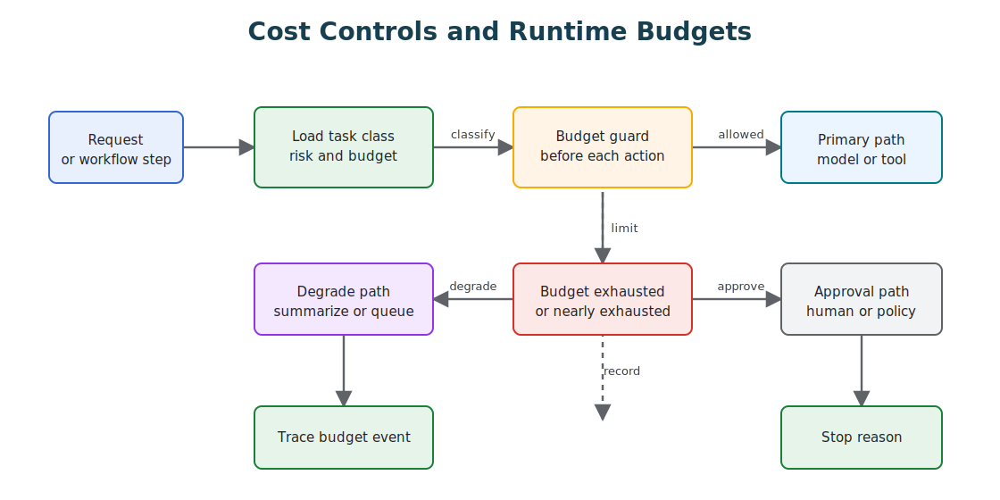
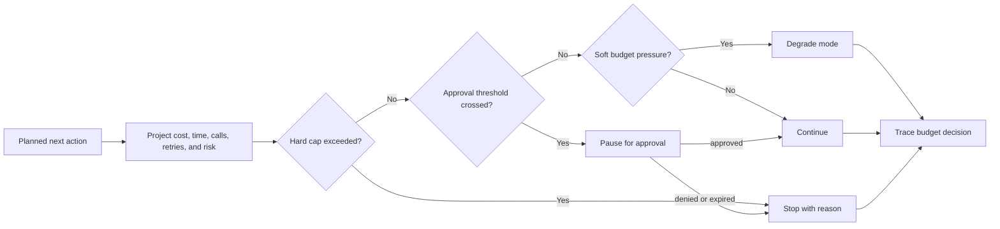

# Cost Controls and Runtime Budgets

Agentic systems spend money, time, context, tool quota, and human attention every time they think, retrieve, call a tool, delegate, retry, evaluate, or ask for approval. Runtime budgets make those costs explicit and enforceable.

Download the [cost controls and runtime budgets review checklist](/capstone-assets/templates/cost-controls-runtime-budgets-review-checklist.txt) before using this chapter for a production review.

This chapter is not about making agents cheap at any cost. It is about making cost, latency, and autonomy part of the control plane. A useful agent should know when to continue, when to degrade, when to ask for approval, and when to stop.



## Intent

Keep agentic behavior bounded by task value, risk, user tier, and operational limits.

A budget is not only a finance number. It is a runtime contract: how many steps the system may take, how many tools it may call, how long it may run, how much context it may carry, how many retries it may spend, how much human attention it may request, and how much autonomy is justified before escalation.

## Runtime Budget Readiness Questions

Use these questions before enabling autonomous loops, retries, retrieval, delegation, or write tools:

| Question | Evidence To Produce |
| --- | --- |
| What does the task justify spending? | Budget policy by task class, risk class, user tier, and business value. |
| What does the runtime measure? | Counters for model calls, tool calls, retries, retrieval, delegation, wall-clock time, and cost. |
| Where are budgets enforced? | Pre-action gates before model, tool, retrieval, memory, approval, and delegation steps. |
| What happens when budget is low? | Defined degraded modes, user-facing message, and operator stop reason. |
| When is approval required? | Thresholds for extra spend, write tools, risky evidence gaps, or high-risk tasks. |
| How are budget changes reviewed? | Versioned policy, eval cases, trace comparison, and rollback path. |

Budgeting is an architecture feature. If the budget is only a dashboard after the run, it is accounting, not control.

## Use When

- Agent runs can loop, retry, delegate, retrieve, or call tools.
- Model, tool, retrieval, or evaluator calls have meaningful cost or latency.
- Different task classes deserve different autonomy levels.
- The system serves interactive users and must preserve responsiveness.
- Operators need clear stop reasons when a run cannot continue.

Use this pattern before cost surprises appear in production. Retrofitting budgets after a runaway loop is harder because the architecture has already hidden the counters.

## Avoid When

- The task is a single deterministic function call.
- The system cannot observe model calls, tool calls, retries, or wall-clock time.
- The organization wants cost reduction without defining acceptable quality and risk.

Even then, keep simple counters. The first useful prototype often becomes the first production workflow.

## Budget Types

| Budget | What It Controls |
| --- | --- |
| Token budget | Prompt, context, retrieved evidence, memory, and reserved output space. |
| Model-call budget | Number of model calls, model tier, judge calls, and repair attempts. |
| Tool-call budget | Tool count, write operations, browser actions, shell commands, and external API quota. |
| Wall-clock budget | End-to-end time, step time, queue time, and human wait time. |
| Retry budget | How often a step can recover before the system changes strategy. |
| Delegation budget | Number of agents, handoffs, debates, or parallel branches. |
| Retrieval budget | Query count, source count, reranking cost, and evidence volume. |
| Memory budget | Memory reads, writes, retention, and privacy-sensitive recall. |
| Approval budget | How many human approvals, reviews, or escalations a workflow can request. |

The most important budget is often not money. In production, human attention and user patience are usually scarcer than tokens.

## Budget Ownership

Budgets should be owned by the runtime, not by the prompt. The model can propose that more work is useful, but software should decide whether the system is allowed to spend more.

Budget ownership usually belongs in the same layer that owns state, policy, trace IDs, and stop reasons:

- routers load the budget for the task class;
- loop controllers decrement the budget after each step;
- tool gateways check tool and side-effect budgets;
- retrieval services enforce evidence and query budgets;
- workflow engines persist budget state across retries and approvals;
- observability records budget events as first-class trace events.

If every tool wrapper tracks its own counters, the system will drift. The runtime needs one budget view for the run.

## Runtime Budget Object

Give every run a budget object that travels with the state:

```ts
type RiskClass = 'low' | 'medium' | 'high';
type BudgetDecision = 'continue' | 'degrade' | 'approval_required' | 'stop';

type RuntimeBudget = {
  riskClass: RiskClass;
  maxCostCents: number;
  maxModelCalls: number;
  maxToolCalls: number;
  maxWriteToolCalls: number;
  maxRetrievalQueries: number;
  maxDelegations: number;
  maxRetries: number;
  maxWallClockMs: number;
  approvalRequiredAboveCents: number;
};

type RuntimeUsage = {
  costCents: number;
  modelCalls: number;
  toolCalls: number;
  writeToolCalls: number;
  retrievalQueries: number;
  delegations: number;
  retries: number;
  startedAtMs: number;
};

type PlannedActionCost = {
  estimatedCostCents: number;
  modelCalls: number;
  toolCalls: number;
  writeToolCalls: number;
  retrievalQueries: number;
  delegations: number;
};
```

The budget object should be versioned. A production incident caused by a budget change should be replayable against the old and new budget policy.

## Enforcement

Check budgets before every expensive or risky action, not after the run is already over.

```ts
function checkBudget(
  budget: RuntimeBudget,
  usage: RuntimeUsage,
  next: PlannedActionCost,
  nowMs: number
): { decision: BudgetDecision; reason: string } {
  if (nowMs - usage.startedAtMs >= budget.maxWallClockMs) {
    return { decision: 'stop', reason: 'wall_clock_budget_exhausted' };
  }

  const projectedCost = usage.costCents + next.estimatedCostCents;
  if (projectedCost > budget.maxCostCents) {
    return { decision: 'stop', reason: 'cost_budget_exhausted' };
  }

  if (projectedCost > budget.approvalRequiredAboveCents) {
    return { decision: 'approval_required', reason: 'cost_approval_required' };
  }

  if (usage.writeToolCalls + next.writeToolCalls > budget.maxWriteToolCalls) {
    return { decision: 'degrade', reason: 'write_tool_budget_exhausted' };
  }

  if (usage.modelCalls + next.modelCalls > budget.maxModelCalls) {
    return { decision: 'degrade', reason: 'model_call_budget_exhausted' };
  }

  if (usage.retrievalQueries + next.retrievalQueries > budget.maxRetrievalQueries) {
    return { decision: 'degrade', reason: 'retrieval_budget_exhausted' };
  }

  if (usage.toolCalls + next.toolCalls > budget.maxToolCalls) {
    return { decision: 'degrade', reason: 'tool_call_budget_exhausted' };
  }

  if (usage.delegations + next.delegations > budget.maxDelegations) {
    return { decision: 'stop', reason: 'delegation_budget_exhausted' };
  }

  if (usage.retries >= budget.maxRetries) {
    return { decision: 'degrade', reason: 'retry_budget_exhausted' };
  }

  return { decision: 'continue', reason: 'within_budget' };
}
```

The decision should become part of the trace. Notice that the check uses projected cost, not only current usage. A budget gate that runs after the model call or tool call has already spent the money is only accounting. A budget gate that runs before the next action is control.

### Budget Decision Flow

Use this flow before each model call, retrieval query, tool call, delegation, retry, approval request, or memory write. It turns budget pressure into an explicit runtime decision.



## Degraded Modes

When a budget is nearly exhausted, the system should not improvise. It should switch to a known degraded mode:

| Budget Pressure | Safer Degraded Mode |
| --- | --- |
| Token budget is low | Summarize state and preserve evidence references. |
| Model-call budget is low | Stop revision loops and return best validated result. |
| Tool-call budget is low | Move from action to draft or read-only analysis. |
| Wall-clock budget is low | Return partial result or queue background work. |
| Retry budget is low | Stop retrying and expose the blocker. |
| Delegation budget is low | Assign one owner instead of adding more agents. |
| Retrieval budget is low | Ask for clarification or cite missing evidence. |
| Approval budget is low | Batch decisions or escalate to a human queue. |

The degraded mode should be visible to the user or operator. Silent degradation creates false confidence.

## Risk-Based Budgets

Not every task deserves the same budget.

Low-risk tasks can be cheap and fast. High-risk tasks may justify stronger models, more evidence, more policy checks, and human approval. The mistake is giving every task the same budget because the runtime has no task class.

| Task Class | Budget Posture |
| --- | --- |
| Classification | Small model, low context, strict latency, no tools unless necessary. |
| Evidence-bound answer | Retrieval budget, citation requirement, limited synthesis calls. |
| Workflow automation | Tool budget, retry budget, idempotency keys, stop reason. |
| Money movement | Write-tool budget, approval threshold, policy check, audit trace. |
| Multi-agent analysis | Delegation budget, merge budget, coordination trace, final evaluator. |
| Background research | Longer wall-clock budget, queue support, checkpointing. |

Budgets are a way to encode judgment. They say which tasks are worth more reasoning, more tools, more review, or more time.

## Budget Calculator Example

Start with a simple per-run estimate before building a complex dashboard.

| Item | Quantity | Unit Estimate | Run Estimate |
| --- | ---: | ---: | ---: |
| planner model call | 1 | 1.5 cents | 1.5 cents |
| retrieval queries | 3 | 0.2 cents | 0.6 cents |
| synthesis model calls | 2 | 2.0 cents | 4.0 cents |
| tool calls | 4 | 0.5 cents | 2.0 cents |
| evaluator call | 1 | 1.0 cents | 1.0 cents |
| retry reserve | 20% | 9.1 cents base | 1.8 cents |
| total planned budget |  |  | 10.9 cents |

Then map the estimate to a policy:

| Task Class | Default Cap | Approval Above | Degraded Mode |
| --- | ---: | ---: | --- |
| read-only support answer | 15 cents | 25 cents | answer with cited evidence and no extra retrieval |
| refund recommendation | 50 cents | 75 cents | draft recommendation and request human review |
| multi-agent incident analysis | $2.00 | $3.00 | stop fan-out and assign one owner |
| background research | $5.00 | $8.00 | queue continuation and return partial findings |

The exact numbers will differ by model and vendor. The useful habit is the same: estimate before the run, reserve for retries, enforce before actions, and record actual spend against the policy version.

## Alert Thresholds

Budget alerts should distinguish one expensive run from a systemic problem.

| Signal | Warning | Critical | Action |
| --- | ---: | ---: | --- |
| per-run cost | 80% of cap | 100% of cap | degrade or stop before next action |
| model calls per run | 80% of cap | cap reached | stop revision loop or require approval |
| write-tool calls | any unexpected write | cap reached | pause write route and review trace |
| retry rate | 10% of runs retry | 25% of runs retry | inspect failing step and add eval case |
| delegation fan-out | above planned worker count | uncontrolled worker creation | stop delegation and assign owner |
| queue spend rate | 2x normal hourly spend | 5x normal hourly spend | apply backpressure or pause route |
| approval requests | 2x normal volume | reviewer queue blocked | batch, route, or pause low-priority work |
| degraded-mode rate | 5% of runs | 15% of runs | review budgets, prompts, tools, or task routing |

Every alert should point to an operator action. A cost alert that only says "spend is high" is too vague to help during an incident.

## Interaction With Circuit Breakers

Budgets and breakers are related but not identical.

A budget says how much the system is allowed to spend. A breaker says when the system must stop or change strategy because the pattern of behavior is unsafe or unproductive.

Examples:

- a cost budget stops the run after a spend limit;
- a no-progress breaker stops the run even if budget remains;
- a tool budget limits calls to a tool class;
- a tool failure breaker disables a tool after repeated bad results;
- a delegation budget limits handoffs;
- a handoff breaker stops agents from bouncing work with no owner.

Use both. A run can be within budget and still be unsafe. A run can be safe but no longer worth the spend.

## Observability

Budget events should be visible in traces:

- budget policy version;
- task class and risk class;
- starting budget;
- remaining budget after each step;
- budget checks before model and tool calls;
- decision: continue, degrade, approval required, or stop;
- stop reason;
- user-visible degraded mode;
- operator-visible explanation.

If cost is only visible in the monthly bill, the architecture is already too late.

## Evaluation Guidance

Test budget behavior like any other production control.

| Eval Case | Expected Behavior |
| --- | --- |
| Model-call budget exhausted | Revision loop stops or degrades with a traceable reason. |
| Write-tool budget exhausted | Agent switches from action to draft or approval path. |
| Cost threshold crossed | Human approval is required before continuing. |
| Delegation budget exhausted | Supervisor assigns an owner or stops with blocked status. |
| Wall-clock budget exhausted | Workflow queues background work or returns partial result. |
| Low-value task requests expensive route | Router chooses cheaper safe path. |
| High-risk task needs more evidence | Runtime allows extra retrieval but requires stronger policy checks. |

The eval should check both outcome and trajectory. A final answer that looks good but exceeded budget without approval is not a pass.

## Failure Modes

- Budgets live only in prompts, so the model can ignore or reinterpret them.
- Budgets are checked only after expensive work has already happened.
- The same budget is used for low-risk classification and high-risk automation.
- Cost is optimized while human review work increases.
- Retry budgets hide repeated failure instead of changing strategy.
- Delegation budgets are missing, so multi-agent systems create coordination cost.
- Budget exhaustion is logged as a generic error with no stop reason.
- Operators cannot compare budget policy versions during incident review.

## Production Checklist

- Does every run start with a task class, risk class, and budget policy version?
- Are budgets checked before model, tool, retrieval, memory, and delegation actions?
- Are budget decisions recorded as trace events?
- Are degraded modes defined before launch?
- Can high-risk runs request approval for more budget?
- Can low-risk runs be stopped without human review?
- Are budgets tied to evals, incidents, and release gates?
- Can budget policy changes be rolled back?
- Can operators answer where the cost went for a single run?

## Related Chapters

- [Resource-Aware Agent Design](../pattern-selection/resource-aware-agent-design)
- [Circuit Breakers, Fallbacks, and Replay](../pattern-selection/circuit-breakers-fallbacks-replay)
- [Agent Loop](../foundations/agent-loop)
- [Context Budgets and Working Sets](../foundations/context-budgets-and-working-sets)
- [Observability and Evals](./observability-and-evals)
- [Production Evaluation Feedback Loops](./production-evaluation-feedback-loops)
- [Durable Workflows](./durable-workflows)
