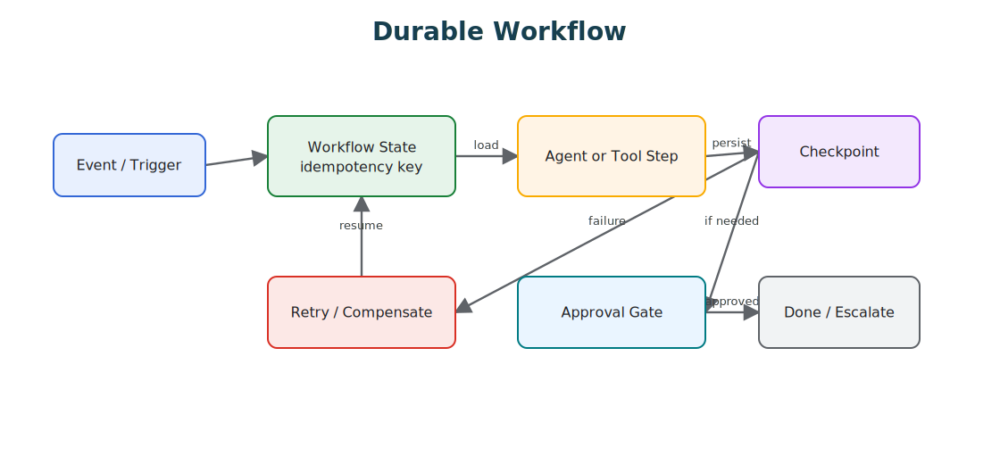

# Durable Workflows

Durable workflows make agentic systems resumable and auditable by owning retries, checkpoints, approvals, compensation, and long-running state.

> Source and downloads
>
> - [Repository source](https://github.com/GTuritto/Agentic-Systems-Patterns/tree/main/durable-workflow-pattern)
> - [Download code bundle](/downloads/durable-workflows.zip)

## Intent

Durable workflows wrap agent steps in a resumable execution model. The workflow owns ordering, checkpoints, retries, approvals, compensation, cancellation, and long-running state. Agents perform bounded work inside workflow steps.

This distinction matters. An agent loop is not a workflow engine. A model can propose the next action, but the workflow decides what step is active, what state is durable, which retry is safe, which approval is pending, and how the system resumes after failure.

## Use When

- Work spans minutes, hours, external systems, or human approvals.
- Tool calls may fail and must be retried safely.
- State must survive process restarts, deployments, timeouts, and partial outages.
- Side effects need idempotency, compensation, audit, or approval.
- Operators need replay, cancellation, rollback, and incident diagnosis.

## Avoid When

- The task is a short stateless response.
- No external side effects, retries, approvals, or durable state are needed.
- The workflow engine would hide more behavior than it clarifies.
- The team cannot define step boundaries and idempotency rules.
- The system cannot decide what should happen after partial completion.

## Architecture

Use this diagram to read Durable Workflows as a system boundary, not only a code shape. The key ownership question is: the runtime owns durable state, retries, traces, triggers, deployment configuration, and operational controls.



## System Shape

- **Pattern boundary:** the workflow owns step order, durable state, retries, approvals, cancellation, compensation, and replay.
- **Agent boundary:** the agent handles bounded uncertainty inside a step, then returns a typed result, refusal, error, or escalation.
- **State owner:** workflow state is durable; model context is temporary.
- **Side-effect boundary:** every external action has an idempotency key, checkpoint, and audit record.
- **Operational promise:** a run can fail, pause, resume, and be explained without losing its place.

## Core Protocol

1. Receive a request, event, schedule, or workflow command with an idempotency key.
2. Create or load workflow state with caller, goal, current step, policy context, and trace ID.
3. Execute one bounded step: deterministic code, agent loop, tool call, approval wait, or evaluator.
4. Checkpoint state, result, cost, trace events, errors, and pending approvals.
5. Decide next transition: continue, retry, wait, compensate, cancel, escalate, or complete.
6. Resume from the last durable checkpoint after restart or deployment.
7. Record final result, stop reason, side effects, and replay metadata.

## Implementation Notes

Keep workflow state separate from model conversation state.

```ts
type WorkflowState = {
  workflowId: string;
  traceId: string;
  status: 'running' | 'waiting' | 'succeeded' | 'failed' | 'cancelled';
  currentStep: string;
  completedSteps: string[];
  pendingApprovalId?: string;
  idempotencyKeys: Record<string, string>;
  sideEffects: Array<{
    actionId: string;
    tool: string;
    status: 'planned' | 'executed' | 'compensated';
  }>;
  stopReason?: string;
};
```

Each step should return a transition, not just text:

```ts
type StepResult =
  | { transition: 'continue'; nextStep: string; patch: Partial<WorkflowState> }
  | { transition: 'wait_for_approval'; approvalId: string; patch: Partial<WorkflowState> }
  | { transition: 'retry'; reason: string; retryAfterMs: number }
  | { transition: 'compensate'; reason: string; actionId: string }
  | { transition: 'complete'; output: unknown }
  | { transition: 'fail'; reason: string };
```

Idempotency is not optional for side effects:

```ts
async function executeRefundDraft(state: WorkflowState, input: RefundDraftInput) {
  const idempotencyKey = state.idempotencyKeys.refundDraft ?? `refund-draft:${state.workflowId}`;

  const result = await refunds.draftRefundRequest(input, { idempotencyKey });

  return {
    transition: 'continue',
    nextStep: 'review_policy',
    patch: {
      idempotencyKeys: { ...state.idempotencyKeys, refundDraft: idempotencyKey },
      sideEffects: [
        ...state.sideEffects,
        { actionId: result.draftId, tool: 'refunds.draftRefundRequest', status: 'executed' }
      ]
    }
  };
}
```

Retrying a model call is usually safe. Retrying a side effect is safe only when the side effect is idempotent or guarded by the workflow state.

## Failure Modes

- Side-effectful steps retry without idempotency.
- Approval state is stored only in chat history and disappears after restart.
- Workflow status says success while the agent step returned uncertainty or missing evidence.
- A deployment changes prompts or tool manifests halfway through a run without versioning.
- The workflow cannot resume because the current step is implicit.
- Compensation is missing for partially completed external actions.
- Cancellation stops the UI but not the underlying tool or worker.
- Traces show final output but not checkpoints, retries, approvals, and side effects.
- The workflow engine hides agent behavior instead of making it inspectable.

## Evaluation Strategy

Durable workflow evals should test recovery, not only happy paths.

- Test restart from every meaningful checkpoint.
- Test duplicate event delivery with the same idempotency key.
- Test retryable tool failure and fatal tool failure.
- Test approval wait, approval denial, approval timeout, and resume after approval.
- Test deployment during a waiting or running workflow.
- Test cancellation and compensation.
- Test replay from a production trace.
- Test that every final result has a stop reason and side-effect audit trail.

A compact workflow eval can look like this:

```json
{
  "case_id": "approval_timeout_after_refund_draft",
  "initial_step": "draft_refund",
  "events": [
    { "type": "tool_success", "tool": "refunds.draftRefundRequest" },
    { "type": "approval_timeout", "approval_id": "ap_123" }
  ],
  "expected": {
    "final_status": "waiting_or_escalated",
    "must_not_issue_refund": true,
    "requires_checkpoint": ["refund_draft", "approval_request"],
    "required_trace_events": ["step_started", "tool_result", "checkpoint", "approval_timeout"]
  }
}
```

Measure resume success rate, duplicate-event safety, retry success, compensation success, approval wait time, cancellation correctness, replay success, and incident recurrence.

## Production Checklist

- Define workflow state separately from prompt context.
- Give every workflow run a stable workflow ID, trace ID, and idempotency key.
- Checkpoint after every external side effect and approval request.
- Make side effects idempotent or compensatable.
- Version prompts, policies, model routes, tool manifests, and workflow definitions.
- Treat approval wait, timeout, denial, cancellation, and escalation as normal transitions.
- Persist enough trace data to replay failed runs.
- Define operational ownership for stuck, waiting, failed, and compensating workflows.
- Add alerts for retry storms, stuck approvals, duplicate side effects, and replay failures.
- Convert production workflow incidents into regression evals.

## Code Walkthrough

Read the excerpt as the smallest executable expression of the pattern. The surrounding chapter explains the design constraints; the code shows where those constraints become concrete interfaces, state, validation, or control flow.

## Source Code

This pattern currently has no dedicated code excerpt. Use the source and download links below for the full pattern folder.

## Download

- [Download source bundle](/downloads/durable-workflows.zip)
- [Open source folder](https://github.com/GTuritto/Agentic-Systems-Patterns/tree/main/durable-workflow-pattern)

The download bundle contains the current `durable-workflow-pattern/` folder from this repository.

## Related Patterns

- [Agent Loop](/foundations/agent-loop)
- [Goals and State](/foundations/goals-and-state)
- [Human Approval Gates](/tools-skills-protocols/human-approval-gates)
- [Policy Enforcement](/production-runtime/policy-enforcement)
- [Self-Healing Workflows](/control-loops/self-healing-workflows)
- [Production Evaluation Feedback Loops](/production-runtime/production-evaluation-feedback-loops)
- [Pattern Composition Playbook](/pattern-selection/pattern-composition-playbook)
