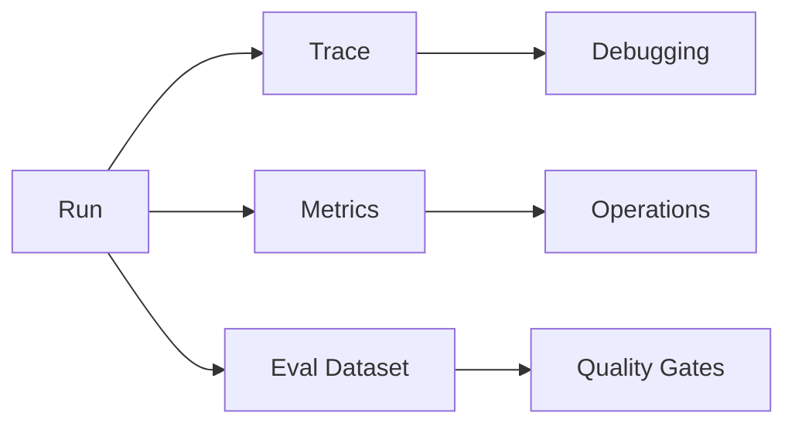

# Observability and Evals

Observability records what happened. Evals decide whether behavior is good enough.

> Source and downloads
>
> - [Repository source](https://github.com/GTuritto/Agentic-Systems-Patterns/tree/main/observability-and-evals-pattern)
> - [Download code bundle](/downloads/observability-and-evals.zip)

## Intent

The Observability and Evals Pattern makes agent behavior inspectable and testable. It captures traces, tool calls, prompts, model outputs, costs, latencies, and evaluation results so teams can debug and improve systems over time.

## Use When

- Agent decisions affect users, money, data, or external systems.
- You need regression tests for prompts, tools, routing, or workflows.
- Failures are hard to reproduce from final answers alone.

## Avoid When

- You cannot store traces safely because of privacy or regulatory constraints.
- The prototype is throwaway and has no operational users.
- You only log final answers and call that observability.

## Architecture

## Implementation Notes

- Trace at the level of run, loop iteration, model call, tool call, workflow step, and evaluator result.
- Store enough input/output detail to reproduce failures, with redaction for sensitive data.
- Maintain golden datasets for routing, structured outputs, tool plans, and final answers.
- Treat eval failures as release blockers for production agents.

## Failure Modes

- Logs that omit the prompt, tool input, or model configuration.
- Evals that only check happy paths.
- Metrics without trace IDs, making incidents hard to investigate.
- Storing sensitive data without retention or redaction rules.

## Code Walkthrough

Read the excerpt as the smallest executable expression of the pattern. The surrounding chapter explains the design constraints; the code shows where those constraints become concrete interfaces, state, validation, or control flow.

## Source Code

This pattern currently has no dedicated code excerpt. Use the source and download links below for the full pattern folder.

## Download

- [Download source bundle](/downloads/observability-and-evals.zip)
- [Open source folder](https://github.com/GTuritto/Agentic-Systems-Patterns/tree/main/observability-and-evals-pattern)

The download bundle contains the current `observability-and-evals-pattern/` folder from this repository.

## Related Patterns

- [Evaluator-Optimizer](https://github.com/GTuritto/Agentic-Systems-Patterns/blob/main/evaluator-optimizer-pattern/README.md)
- [Mastra Runtime](https://github.com/GTuritto/Agentic-Systems-Patterns/blob/main/mastra-runtime-pattern/README.md)
- [Compliance/Policy Enforcer](https://github.com/GTuritto/Agentic-Systems-Patterns/blob/main/compliance-policy-enforcer-agent/README.md)
