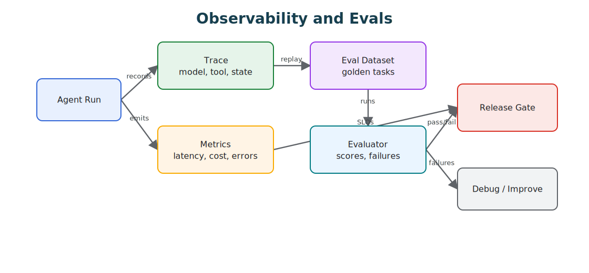

# Observability and Evals

Observability records what happened. Evals decide whether behavior is good enough.

> Source and downloads
>
> - [Repository source](https://github.com/GTuritto/Agentic-Systems-Patterns/tree/main/observability-and-evals-pattern)
> - [Download code bundle](/downloads/observability-and-evals.zip)

## Intent

The Observability and Evals Pattern makes agent behavior inspectable, replayable, and testable. Observability records what the agent did, why it did it, what it saw, what it changed, what it cost, and why it stopped. Evals turn those traces and known failures into release gates.

This pattern matters because agent failures rarely live only in the final answer. They live in the trajectory: a missing retrieval, an unsafe tool call, an ignored policy denial, a loop that never converged, a human approval that was skipped, or a model upgrade that changed the plan. Logging final answers is not observability.

## Use When

- Agent decisions affect users, money, data, or external systems.
- You need regression tests for prompts, tools, routing, or workflows.
- Failures are hard to reproduce from final answers alone.
- You need to compare model, prompt, tool, memory, or policy changes before release.
- You operate workflows where the stop reason matters as much as the answer.

## Avoid When

- You cannot store traces safely because of privacy or regulatory constraints.
- The prototype is throwaway and has no operational users.
- You only log final answers and call that observability.
- Nobody owns the eval suite after the first version ships.
- The organization is not ready to define retention, redaction, and access rules for traces.

## Architecture



## System Shape

- **Runtime boundary:** the runtime creates trace IDs, run IDs, span IDs, and idempotency keys before the agent starts work.
- **Span model:** model calls, retrieval calls, tool calls, policy decisions, approval waits, evaluator decisions, retries, and workflow steps are first-class spans.
- **Eval boundary:** evals are not an afterthought. They are connected to traces, incidents, release gates, and model or prompt changes.
- **Data boundary:** traces are redacted before storage, retained for a defined period, and protected like production data.
- **Operational boundary:** dashboards connect behavior, quality, cost, latency, and incident response.

## Core Protocol

1. Start every run with a stable trace ID, run ID, request ID, and caller context.
2. Record each model, tool, retrieval, policy, approval, evaluator, and workflow span.
3. Capture enough input, output, configuration, and evidence references to replay the behavior.
4. Redact secrets, credentials, private data, and unnecessary raw content before persistence.
5. Store stop reason, status, cost, latency, token count, tool count, retry count, and policy outcome.
6. Convert incidents, near misses, and representative traces into eval fixtures.
7. Gate risky changes with the relevant eval subset before deployment.
8. Keep failed evals attached to owners, release decisions, and follow-up work.

## Implementation Notes

- Trace at the level of run, loop iteration, model call, tool call, workflow step, and evaluator result.
- Store enough input/output detail to reproduce failures, with redaction for sensitive data.
- Maintain golden datasets for routing, structured outputs, tool plans, and final answers.
- Treat eval failures as release blockers for production agents.
- Track both final quality and trajectory quality. A good answer produced through an unsafe tool path is still a failure.
- Keep trace schemas stable. If every service logs different fields, debugging becomes archaeology.
- Attach eval cases to the pattern they protect: routing, retrieval, tool use, policy enforcement, memory, human approval, or multi-agent coordination.
- Separate product analytics from agent observability. Product analytics says what users did. Agent observability says what the system did on their behalf.

### Trace Event Example

```ts
type AgentTraceEvent = {
  traceId: string;
  runId: string;
  step: string;
  spanType:
    | 'model'
    | 'tool'
    | 'retrieval'
    | 'policy'
    | 'approval'
    | 'evaluator'
    | 'workflow';
  timestamp: string;
  status: 'started' | 'succeeded' | 'failed' | 'denied' | 'waiting';
  latencyMs: number;
  model?: string;
  tool?: string;
  policyDecision?: 'allow' | 'deny' | 'require_approval' | 'escalate';
  evidenceRefs?: string[];
  costCents?: number;
  stopReason?: string;
  redaction: 'none' | 'pii' | 'secret_removed';
};
```

### Eval Fixture Example

```json
{
  "case_id": "tool_called_without_policy_trace",
  "source_trace_id": "tr_1042",
  "failure": "A refund draft was created without a recorded policy decision.",
  "expected": {
    "required_spans": ["tool", "policy"],
    "must_not_call_tools": ["refunds.issue_refund"],
    "stop_reason": "policy_boundary"
  }
}
```

## Failure Modes

- Logs that omit the prompt, tool input, or model configuration.
- Evals that only check happy paths.
- Metrics without trace IDs, making incidents hard to investigate.
- Storing sensitive data without retention or redaction rules.
- Final-answer-only logging that hides the path that produced the answer.
- Tool calls without captured arguments, outputs, permissions, and side effects.
- Policy denials that are not visible in traces, so blocked work looks like model confusion.
- Traces that leak secrets, credentials, customer data, or internal reasoning that should not be stored.
- Evals that test prose quality but ignore retrieval evidence, tool trajectory, and policy behavior.
- Dashboards that show aggregate cost and latency but cannot drill into failed runs.
- Incident reviews that do not create new eval cases.
- Eval suites with no owner, no freshness process, and no release authority.

## Evaluation Strategy

- **Trace completeness:** every production run has correlated model, tool, policy, evaluator, and workflow spans.
- **Replayability:** engineers can reproduce a failure with the stored configuration, inputs, evidence references, and tool mocks.
- **Trajectory correctness:** the agent used the allowed tools, respected policy, stopped for the right reason, and did not skip required approvals.
- **Grounding quality:** answers that depend on retrieval cite the evidence that was actually used.
- **Cost and latency regression:** model, prompt, and tool changes cannot silently increase runtime cost or response time.
- **Policy-denial accuracy:** unsafe requests are blocked or escalated with a traceable reason.
- **Incident-to-eval conversion:** repeated or high-severity production failures become regression fixtures.

## Production Checklist

- Define a stable trace schema before production traffic.
- Redact and classify trace fields before storage.
- Correlate logs, metrics, traces, eval results, workflow state, and user-visible incidents.
- Give every eval suite an owner and a release decision role.
- Run targeted evals for prompt, model, tool, memory, policy, and workflow changes.
- Add dashboards for success rate, stop reason, policy denials, tool errors, cost, latency, retries, and eval regression rate.
- Define retention, access control, and deletion rules for trace data.
- Turn incidents and near misses into eval fixtures before closing the operational follow-up.

## Code Walkthrough

Read the excerpt as the smallest executable expression of the pattern. The surrounding chapter explains the design constraints; the code shows where those constraints become concrete interfaces, state, validation, or control flow.

## Source Code

This pattern currently has no dedicated code excerpt. Use the source and download links below for the full pattern folder.

## Download

- [Download source bundle](/downloads/observability-and-evals.zip)
- [Open source folder](https://github.com/GTuritto/Agentic-Systems-Patterns/tree/main/observability-and-evals-pattern)

The download bundle contains the current `observability-and-evals-pattern/` folder from this repository.

## Related Patterns

- [Evaluator-Optimizer](https://github.com/GTuritto/Agentic-Systems-Patterns/blob/main/evaluator-optimizer-pattern/README.md)
- [Durable Workflows](https://github.com/GTuritto/Agentic-Systems-Patterns/blob/main/durable-workflow-pattern/README.md)
- [Agent Loop](https://github.com/GTuritto/Agentic-Systems-Patterns/blob/main/agent-loop-pattern/README.md)
- [Tool Use](https://github.com/GTuritto/Agentic-Systems-Patterns/blob/main/tool-using-agent-pattern/README.md)
- [Compliance/Policy Enforcer](https://github.com/GTuritto/Agentic-Systems-Patterns/blob/main/compliance-policy-enforcer-agent/README.md)
- [Human Approval Gates](https://github.com/GTuritto/Agentic-Systems-Patterns/blob/main/human-in-the-loop-approval-agent/README.md)
