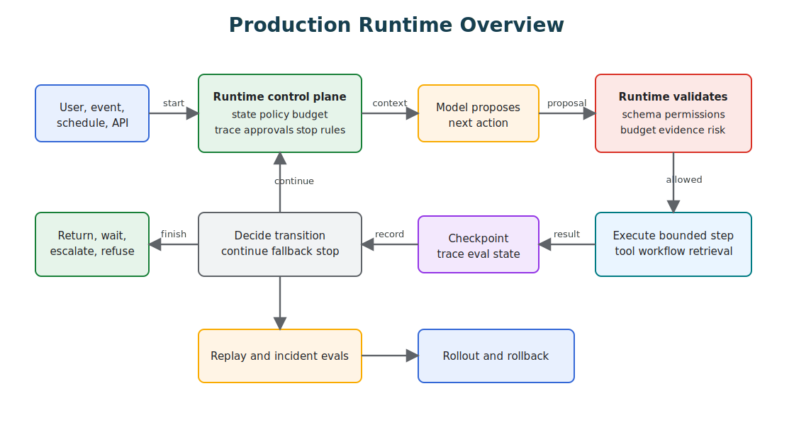

# Production Runtime Overview

Production agentic systems need more than prompts, tools, and a good model. They need a runtime that owns the execution boundary.

The core rule is the same throughout this book: the model proposes, the runtime decides. The model can propose a plan, a tool call, a memory write, a retrieval query, a reply, or a stop condition. The runtime owns whether that proposal is valid, allowed, affordable, observable, durable, and safe to execute.

This is where many agent projects fail. They treat the model call as the system, then add logging, retries, approvals, evals, and rollback after the first incident. A production runtime inverts that order. It gives the agent a controlled place to operate.

Read this after [Agent Harnesses](../agent-engineering-practice/agent-harnesses). The harness explains the working environment around one agent; this chapter explains what has to be true when that work runs as a production system with queues, budgets, retries, state, rollout, rollback, and operators.



## What The Runtime Owns

The production runtime is the control plane around model judgment.

| Runtime Concern | What It Owns |
| --- | --- |
| State | Goal, run status, workflow step, attempts, tool results, approvals, stop reason. |
| Policy | Permissions, risk classification, denial, approval, escalation, audit requirements. |
| Budgets | Tokens, model calls, tool calls, retries, delegations, wall-clock time, cost. |
| Tools | Schemas, permissions, timeouts, idempotency, side-effect records. |
| Memory and retrieval | Source eligibility, freshness, access control, evidence references, memory writes. |
| Observability | Trace IDs, spans, costs, latency, model and tool events, replay metadata. |
| Evaluation | Runtime checks, incident fixtures, release gates, regression datasets. |
| Recovery | Retries, fallbacks, circuit breakers, checkpoints, compensation, rollback. |

The runtime does not remove autonomy. It makes autonomy bounded enough to trust.

## Runtime Responsibility Matrix

The runtime should make ownership explicit. If nobody owns one of these rows, the model will eventually own it by accident.

| Responsibility | Runtime decision | Failure when missing |
| --- | --- | --- |
| Run admission | Should this request start, wait, refuse, or route elsewhere? | Unsafe or unsupported work enters the loop. |
| State ownership | Which state is durable, temporary, visible, or deleted? | Lost progress, hidden memory, non-replayable failures. |
| Execution mode | Should the task run synchronously, asynchronously, or as a durable workflow? | Timeouts, zombie runs, blocked users, partial side effects. |
| Proposal validation | Is the model proposal valid for schema, policy, budget, and state? | Tool calls execute because the model sounded confident. |
| Tool execution | Which credentials, timeout, idempotency key, and side-effect record apply? | Duplicate writes, leaked credentials, unclear ownership. |
| Approval state | What waits for human review, who approved it, and what exact action was approved? | Approval becomes broad permission instead of a bounded gate. |
| Cancellation | What stops immediately, what drains, and what must be compensated? | Cancelled runs keep spending or continue side effects. |
| Rollout | Which model, prompt, policy, tool schema, retriever, or harness version is active? | Regressions ship globally with no quick rollback. |
| Operations | Who is paged, what is disabled, and what evidence is preserved? | Incidents turn into manual archaeology. |

## The Runtime Loop

A production runtime loop is not just observe, decide, act. It is closer to:

1. receive a request, event, schedule, webhook, or workflow command;
2. authenticate the caller and load task class, risk class, state, policy, budget, and trace ID;
3. assemble the working set: goal, constraints, evidence, allowed tools, memory, and stop rules;
4. ask the model or deterministic router for a bounded proposal;
5. validate the proposal against schema, policy, budget, state, evidence, and approval rules;
6. execute one bounded step through a tool, workflow, retrieval service, evaluator, or approval gate;
7. checkpoint state, trace events, cost, latency, side effects, and stop reason;
8. decide whether to continue, fallback, wait, escalate, refuse, compensate, or complete;
9. convert important failures and near misses into eval cases.

This loop is what separates an agentic product from a demo. The model can still be creative and adaptive, but the system knows what happened and why.

## Runtime Boundaries

A good runtime creates explicit boundaries:

- **Decision boundary:** the model can suggest actions, but software validates them.
- **Authority boundary:** side effects require tool schemas, permissions, budgets, and approval rules.
- **State boundary:** durable workflow state is separate from model context.
- **Context boundary:** the model sees a selected working set, not every available document or memory.
- **Cost boundary:** every loop, tool, retry, model call, and delegation spends from a budget.
- **Policy boundary:** denial and escalation are runtime outcomes, not prompt preferences.
- **Recovery boundary:** retries, fallbacks, replay, and rollback are designed before production traffic.

When these boundaries are missing, the model becomes the control plane by accident.

## Execution Modes

Do not run every agent the same way. Match the runtime mode to the work.

| Mode | Use when | Runtime requirements |
| --- | --- | --- |
| Synchronous request | The task is short, read-heavy, and safe to fail fast. | Tight timeout, small budget, no irreversible side effects, complete trace. |
| Async job | The task may take seconds or minutes but does not need complex compensation. | Queue, status record, cancellation, retries, idempotency, progress events. |
| Durable workflow | The task spans approvals, external systems, retries, or long-running state. | Checkpoints, resumability, compensation, replay, versioned workflow state. |
| Event-triggered run | The task starts from webhook, schedule, stream, or system event. | Deduplication, event identity, ordering policy, backpressure, audit trail. |
| Human-gated run | The task can prepare work but needs approval before execution. | Approval record, exact-action binding, pause and resume semantics. |

The wrong mode creates production bugs. A refund workflow should not depend on one HTTP request staying alive. A short classifier should not pay the complexity cost of a durable workflow engine.

## Queues, Backpressure, And Concurrency

Agents consume scarce resources: model quota, tool capacity, human approval time, database connections, browser workers, and money. The runtime should control admission and concurrency before the loop starts spending.

Useful controls include per-tenant queues, route-level concurrency limits, model-provider rate limits, tool-specific bulkheads, retry budgets, dead-letter queues, and priority classes. Backpressure is not just an infrastructure concern. It is how the system refuses low-value work before it damages high-value work.

Concurrency also affects correctness. Two runs should not issue the same refund, update the same ticket, rewrite the same memory, or deploy the same service without coordination. Use locks, version checks, idempotency keys, or workflow state transitions where duplicate work would be harmful.

## Rollout And Rollback

Production agents change in more ways than normal services. A release may change model, prompt, tool schema, retriever, memory policy, approval rule, sandbox profile, evaluator, or workflow code. The runtime should version those pieces and record the active version set on every run.

Rollout should be gradual for high-risk agents:

- start with offline evals;
- run shadow or replay tests where possible;
- enable a small tenant, route, or percentage;
- compare traces, costs, stop reasons, policy denials, and user-visible outcomes;
- keep a rollback path for each changed component.

Rollback must be operational, not theoretical. Operators should be able to disable a tool, pin a model, revert a prompt, tighten a policy, stop a route, drain a queue, or force human approval without redeploying the whole product.

## How The Production Runtime Chapters Compose

Read the production runtime section as one operating model:

- [Durable Workflows](./durable-workflows) own long-running state, retries, checkpoints, approvals, compensation, and resumability.
- [Observability and Evals](./observability-and-evals) records what happened and turns behavior into something engineers can inspect.
- [Production Evaluation Feedback Loops](./production-evaluation-feedback-loops) converts production failures into regression cases and release gates.
- [Cost Controls and Runtime Budgets](./cost-controls-runtime-budgets) defines how much autonomy, spend, time, and human attention a run may consume.
- [Policy Enforcement](./policy-enforcement) keeps permission, risk, and compliance decisions outside the model.
- [Event-Triggered Agents](./event-triggered-agents) shows how agents respond to events without losing idempotency, state, and auditability.
- [Mastra Runtime](./mastra-runtime) maps these production concerns into a concrete runtime style.

The chapters are separate because each boundary deserves attention. In a real system, they should work together.

## Minimal Runtime Contract

Every production run should be able to produce a contract like this:

```ts
type RuntimeRun = {
  runId: string;
  traceId: string;
  requestId: string;
  actorId: string;
  tenantId: string;
  route: string;
  goal: string;
  autonomyLevel: "advisory" | "drafts_for_review" | "executes_after_approval" | "bounded_autonomous";
  riskClass: "low" | "medium" | "high";
  executionMode: "sync" | "async_job" | "durable_workflow" | "event_triggered";
  status: "queued" | "running" | "waiting" | "succeeded" | "failed" | "refused" | "cancelled";
  versionSet: {
    model: string;
    prompt: string;
    policy: string;
    toolSchema: string;
    retriever?: string;
    harness: string;
  };
  budgetPolicyVersion: string;
  policyVersion: string;
  workflowStep?: string;
  allowedTools: string[];
  idempotencyKey?: string;
  approvalId?: string;
  checkpointRef?: string;
  stopReason?: string;
};
```

This is not enough to implement a full platform, but it is enough to make the hidden parts visible. If a run does not have actor, tenant, route, trace ID, risk class, autonomy level, execution mode, version set, budget policy, policy version, allowed tools, status, and stop reason, it will be hard to operate.

For high-risk work, this contract should be stored before the first model call. The run may change state, but the runtime should never be guessing who started it, what authority it has, what version is active, or why it stopped.

## Runtime Checklist

Before a production agent handles real work, answer:

- What owns the active goal?
- Where is durable run state stored?
- Which component validates model proposals?
- Which execution mode fits this task?
- Which tools are allowed for this task class?
- Which actions require approval?
- What budget applies to the run?
- What happens when the budget is exhausted?
- What trace events are required?
- What side effects need idempotency or compensation?
- What breaker, fallback, or escalation path exists?
- What evals block release?
- What queue, concurrency limit, or backpressure policy applies?
- What component versions are recorded for every run?
- What can be rolled back without redeploying the whole system?

If those answers are vague, the system is still a prototype, even if it is already serving users.

## Failure Modes

- The model owns state transitions because the runtime has no workflow state.
- Policy lives in the prompt instead of a runtime enforcement layer.
- Tool calls happen before budget, permission, schema, or approval checks.
- Retry logic repeats side effects without idempotency keys.
- Observability records final answers but not proposals, validation decisions, tool calls, and stop reasons.
- Evals test final prose while the runtime path remains untested.
- Operators cannot disable a risky tool, prompt version, model route, or workflow step quickly.
- The system can continue spending tokens, tool calls, and human attention after the task is no longer worth it.
- A synchronous request hides a long-running workflow until the first timeout or duplicate retry.
- Queues grow without backpressure, priority, cancellation, or dead-letter handling.
- Cancelled runs stop the UI but not the queued tool call or external workflow.
- A model or prompt change ships without versioned traces, targeted evals, or a rollback plan.
- Partial failure looks like success because the runtime records the final answer but not the failed side effect.
- Durable state exists, but the model context and workflow state disagree about what step is active.

## Design Rule

Production runtime is where agentic architecture becomes honest. If the runtime cannot explain, bound, replay, and stop the agent, the model is not the only risk. The architecture is.

## Related Chapters

- [Architecture Before Autonomy](../pattern-selection/architecture-before-autonomy)
- [Agentic System Architecture](../systems-architecture/agentic-system-architecture)
- [Reference Architecture](../systems-architecture/reference-architecture)
- [Durable Workflows](./durable-workflows)
- [Observability and Evals](./observability-and-evals)
- [Production Evaluation Feedback Loops](./production-evaluation-feedback-loops)
- [Cost Controls and Runtime Budgets](./cost-controls-runtime-budgets)
- [Policy Enforcement](./policy-enforcement)
