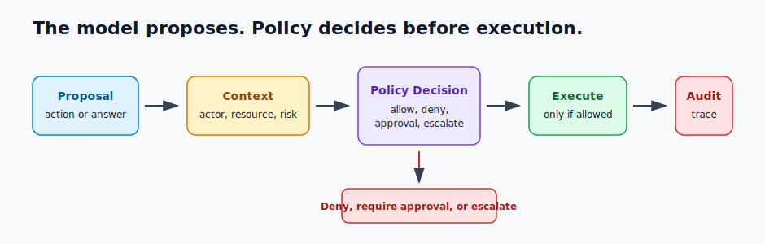

# Policy Enforcement

Policy enforcement constrains what the agent may say or do through permissions, data-access rules, business rules, safety rules, and escalation.

> Source and downloads
>
> - [Repository source](https://github.com/GTuritto/Agentic-Systems-Patterns/tree/main/compliance-policy-enforcer-agent)
> - [Download code bundle](/downloads/policy-enforcement.zip)

## Intent

Policy enforcement is the software-owned boundary that decides whether a model-proposed answer, tool call, data access, memory write, or side effect is allowed. The model can propose an action. The runtime decides whether to allow, deny, require approval, escalate, or audit it.

Policy should not live only in prompt text. Prompts can explain policy to the model, but enforcement belongs in code, workflow, tool manifests, access-control systems, and auditable decision records.

Knowledge-bound agents use the same idea for answers: the model should answer only from approved sources, cite the evidence, and refuse or escalate when the required source is missing, stale, forbidden, or conflicting.

The practical rule is: policy runs before authority. Before retrieval, before memory writes, before tool execution, before external communication, and before final answers in regulated or evidence-bound domains, the runtime should know whether the action is allowed.

## Use When

- Actions must be checked before execution.
- The agent handles private, regulated, security-sensitive, or business-critical data.
- The system needs approved sources, citations, or compliance constraints.
- Policy decisions must be auditable and replayable.
- The runtime can identify actor, resource, action, capability, risk, and context.
- Tool calls, memory writes, retrieval, final answers, or workflow transitions require different rules by task class.
- A human approval path exists for actions that are valid but too risky to execute autonomously.

## Avoid When

- Policy is only written as prompt guidance with no runtime check.
- The system cannot identify the actor, resource, action, and context.
- Policy checks happen after irreversible actions.
- Exceptions are silent, unreviewed, or missing from traces.
- Approved knowledge sources cannot be identified, updated, or cited.
- The runtime cannot stop, pause, or change execution after a policy decision.

## Architecture



## System Shape

- **Pattern boundary:** the policy boundary evaluates proposed actions, data access, answers, and memory writes before they take effect.
- **State owner:** the runtime owns policy context, decision records, policy version, trace ID, and enforcement outcome.
- **Model role:** the model proposes an action or answer and may explain risk, but it does not grant itself permission.
- **Knowledge boundary:** approved sources, freshness, citations, and refusal rules define what the agent may claim.
- **Budget boundary:** policy can require approval, downgrade capability, or stop when a run has exceeded the spend or autonomy allowed for its risk class.
- **Operational promise:** policy decisions happen before execution and are visible after the run.

## Core Protocol

1. Receive a proposed action, answer, tool call, retrieval result, or memory write.
2. Build policy context: actor, caller, tenant, resource, capability, risk, evidence, and trace ID.
3. Evaluate policy before the action executes or the answer is returned.
4. Return a decision: allow, deny, require approval, escalate, or audit-only.
5. If approval is required, pause through the approval gate.
6. Execute only decisions that are allowed or approved.
7. Record decision, reason, policy version, actor, resource, action, and trace ID.
8. Feed serious denials, misses, and overrides into regression evals.

## Implementation Notes

A policy decision should be a typed runtime object.

```ts
type PolicyOutcome = 'allow' | 'deny' | 'require_approval' | 'escalate' | 'audit';

type PolicyDecision = {
  actionId: string;
  actor: {
    id: string;
    role: string;
    tenantId?: string;
  };
  resource: {
    type: 'customer_record' | 'refund' | 'email' | 'memory' | 'document';
    id: string;
    tenantId?: string;
  };
  capability: 'read' | 'write' | 'send' | 'refund' | 'remember' | 'answer';
  riskLevel: 'low' | 'medium' | 'high' | 'critical';
  decision: PolicyOutcome;
  reason: string;
  requiredApproval?: {
    approverRole: string;
    approvalPolicy: string;
  };
  policyVersion: string;
  traceId: string;
};
```

The policy context should come from trusted runtime state, not only from model text:

```ts
type PolicyContext = {
  actionId: string;
  traceId: string;
  actorRole: string;
  actorTenant?: string;
  resourceTenant?: string;
  capability: PolicyDecision['capability'];
  riskLevel: PolicyDecision['riskLevel'];
  toolName?: string;
  evidenceStatus?: 'present' | 'missing' | 'stale' | 'forbidden';
  budgetState: 'within_budget' | 'approval_threshold' | 'exhausted';
  hasHumanApproval: boolean;
  policyVersion: string;
};
```

The enforcement function should run before retrieval, memory write, tool call, side effect, or final answer:

```ts
function enforcePolicy(input: PolicyContext): Pick<PolicyDecision, 'decision' | 'reason'> {
  if (input.actorTenant && input.resourceTenant && input.actorTenant !== input.resourceTenant) {
    return { decision: 'deny', reason: 'tenant_boundary' };
  }

  if (input.budgetState === 'exhausted') {
    return { decision: 'escalate', reason: 'budget_exhausted' };
  }

  if (input.budgetState === 'approval_threshold' && !input.hasHumanApproval) {
    return { decision: 'require_approval', reason: 'budget_approval_required' };
  }

  if (input.capability === 'refund' && input.riskLevel === 'high') {
    return { decision: 'require_approval', reason: 'high_risk_refund' };
  }

  if (input.capability === 'send' && input.actorRole !== 'support_agent') {
    return { decision: 'deny', reason: 'role_not_allowed' };
  }

  if (input.capability === 'answer' && input.evidenceStatus !== 'present') {
    return { decision: 'escalate', reason: 'required_evidence_not_available' };
  }

  if (input.capability === 'remember' && input.riskLevel !== 'low') {
    return { decision: 'require_approval', reason: 'memory_write_requires_review' };
  }

  return { decision: 'allow', reason: 'policy_passed' };
}
```

For knowledge-bound answers, policy also decides whether the evidence is allowed:

```ts
type SourcePolicy = {
  sourceId: string;
  approved: boolean;
  freshness: 'current' | 'stale' | 'unknown';
  citationRequired: boolean;
  allowedTenant?: string;
};
```

The model can explain why an action looks safe. The runtime still makes the decision.

### Where Policy Runs

| Boundary | Policy Question |
| --- | --- |
| Retrieval | Is this actor allowed to read these sources for this task? |
| Tool call | Is this tool allowed for the actor, tenant, resource, risk, and budget? |
| Memory write | Is this memory safe, scoped, useful, and allowed to persist? |
| Human approval | Is this action allowed only after review, and who can approve it? |
| Final answer | Is the answer supported by approved evidence and safe to return? |
| Workflow transition | Is the next step valid after the current state and policy decision? |

Treat each policy decision as a runtime event. It should have a trace ID, policy version, input summary, decision, reason, and execution effect.

## Failure Modes

- Policy exists only in the system prompt.
- Policy runs after a tool has already executed.
- The decision lacks actor, resource, tenant, or capability context.
- A retry bypasses policy because the first attempt was checked.
- Policy versions change but traces do not record which version applied.
- Denials are not logged, so operators cannot see attempted unsafe actions.
- Approval-required actions are treated as allowed.
- Knowledge answers cite unapproved, stale, or inaccessible sources.
- Exceptions become permanent undocumented policy holes.
- Policy checks ignore budget state, so an agent can keep spending after approval should be required.
- Memory writes bypass policy because they are treated as harmless context management.
- Final answers bypass policy even when the domain requires approved evidence.

## Evaluation Strategy

Policy evals should test allowed, denied, approval-required, and escalation paths.

- Test allowed low-risk actions.
- Test denied actions across role, tenant, resource, and capability boundaries.
- Test approval-required actions before side effects.
- Test stale or unapproved sources in knowledge-bound answers.
- Test retries and resumed workflows to ensure policy is applied every time.
- Test missing actor, resource, or tenant context.
- Test policy version changes and audit completeness.
- Test production incidents as replayable policy fixtures.
- Test budget-threshold cases that require approval before more work.
- Test memory-write denials, approvals, and tenant scoping.
- Test final-answer refusal or escalation when required evidence is missing.

A compact policy eval can look like this:

```json
{
  "case_id": "cross_tenant_customer_record_read",
  "proposed_action": {
    "actor_tenant": "tenant_a",
    "resource_tenant": "tenant_b",
    "capability": "read",
    "resource_type": "customer_record",
    "budget_state": "within_budget",
    "evidence_status": "present"
  },
  "expected": {
    "decision": "deny",
    "reason": "tenant_boundary",
    "must_not_execute": true,
    "required_trace_fields": ["actor", "resource", "policy_version", "trace_id"]
  }
}
```

Measure policy decision accuracy, false allow rate, false denial rate, approval-routing accuracy, tenant-boundary violations, stale-policy use, denial logging completeness, and recurrence of known policy failures.

For production systems, false allow is usually the most dangerous metric. A false denial may frustrate a user. A false allow may leak data, move money, send the wrong message, or create an incident.

## Production Checklist

- Enforce policy before execution, answer return, memory write, or external communication.
- Build policy context from trusted runtime data, not only model text.
- Return explicit allow, deny, require-approval, escalate, or audit decisions.
- Record actor, resource, capability, reason, policy version, and trace ID.
- Apply policy on retries and resumed workflows.
- Keep policy versions, tool manifests, source rules, and approval rules versioned.
- Treat missing policy context as deny or escalate.
- Apply policy to memory writes and final answers, not only tools.
- Connect policy decisions to runtime budget state.
- Add dashboards for denials, approvals, overrides, and false allows.
- Convert policy misses into regression evals.
- Review exceptions and expire them intentionally.

## Code Walkthrough

Read the excerpt as the smallest executable expression of the pattern. The surrounding chapter explains the design constraints; the code shows where those constraints become concrete interfaces, state, validation, or control flow.

## Source Code

These excerpts show the implementation shape. The complete code is available in the download bundle and repository source.

### `compliance-policy-enforcer-agent/policy_contract.ts`

[Open full source](https://github.com/GTuritto/Agentic-Systems-Patterns/blob/main/compliance-policy-enforcer-agent/policy_contract.ts)

```ts
export type PolicyOutcome = 'allow' | 'deny' | 'require_approval' | 'escalate';

export type PolicyContext = {
  traceId: string;
  actor: {
    id: string;
    role: 'support_agent' | 'finance_reviewer' | 'viewer';
    tenantId: string;
  };
  resource: {
    type: 'customer_record' | 'refund' | 'email' | 'memory' | 'document';
    id: string;
    tenantId: string;
  };
  capability: 'read' | 'write' | 'send' | 'refund' | 'remember' | 'answer';
  riskLevel: 'low' | 'medium' | 'high' | 'critical';
  evidenceStatus: 'present' | 'missing' | 'stale' | 'forbidden';
  budgetState: 'within_budget' | 'approval_threshold' | 'exhausted';
  hasHumanApproval: boolean;
  policyVersion: string;
};

export type PolicyDecision = {
  traceId: string;
  policyVersion: string;
  decision: PolicyOutcome;
  reason: string;
  executionAllowed: boolean;
  requiredApprovalRole?: 'finance_reviewer' | 'security_reviewer' | 'manager';
};

export function enforcePolicy(context: PolicyContext): PolicyDecision {
  const base = {
    traceId: context.traceId,
    policyVersion: context.policyVersion
  };

  if (context.actor.tenantId !== context.resource.tenantId) {
    return {
      ...base,
      decision: 'deny',
      reason: 'tenant_boundary',
      executionAllowed: false
    };
  }

  if (context.evidenceStatus === 'forbidden') {
    return {
      ...base,
      decision: 'deny',
      reason: 'evidence_forbidden',
      executionAllowed: false
    };
  }

  if (context.evidenceStatus === 'missing' || context.evidenceStatus === 'stale') {
    return {
      ...base,
      decision: 'escalate',
      reason: 'required_evidence_not_current',
      executionAllowed: false
    };
  }

  if (context.budgetState === 'exhausted') {
    return {
      ...base,
      decision: 'escalate',
      reason: 'budget_exhausted',
      executionAllowed: false
    };
  }

  if (context.capability === 'refund' && context.riskLevel !== 'low' && !context.hasHumanApproval) {
    return {
      ...base,
      decision: 'require_approval',
      reason: 'refund_requires_review',
      executionAllowed: false,
      requiredApprovalRole: 'finance_reviewer'
    };
  }

  if (context.capability === 'send' && context.actor.role !== 'support_agent') {
    return {
      ...base,
      decision: 'deny',
      reason: 'role_cannot_send',
      executionAllowed: false
    };
```

_Excerpt truncated for readability. Download the bundle or open the source file for the complete implementation._

## Download

- [Download source bundle](/downloads/policy-enforcement.zip)
- [Open source folder](https://github.com/GTuritto/Agentic-Systems-Patterns/tree/main/compliance-policy-enforcer-agent)

The download bundle contains the current `compliance-policy-enforcer-agent/` folder from this repository.

## Related Patterns

- [Human Approval Gates](/tools-skills-protocols/human-approval-gates)
- [Tool Capability Design](/tools-skills-protocols/tool-capability-design)
- [Agent Threat Model](/agent-engineering-practice/agent-threat-model)
- [Semantic Recall and RAG](/memory-knowledge/semantic-recall-rag)
- [Production Runtime Overview](/production-runtime/overview)
- [Cost Controls and Runtime Budgets](/production-runtime/cost-controls-runtime-budgets)
- [Production Evaluation Feedback Loops](/production-runtime/production-evaluation-feedback-loops)
- [Pattern Evaluation Checklist](/pattern-selection/pattern-evaluation-checklist)
