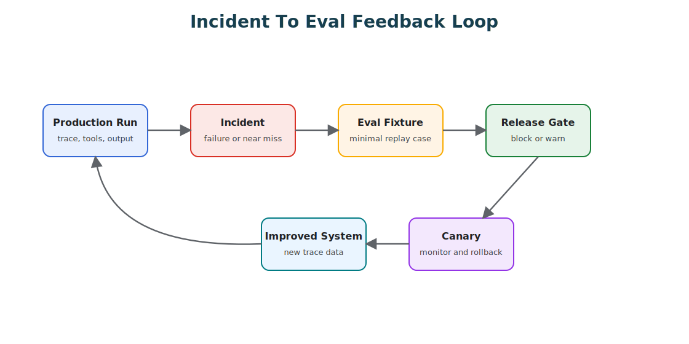

# Production Evaluation Feedback Loops

Agent evaluation should not stop at launch. Pre-production evals tell you whether the system is ready to meet users. Production feedback tells you whether the system is still true under real traffic, real tools, real ambiguity, real failures, and real incentives.

The core rule is simple: production failures should become future tests. If an incident only creates a ticket, the system learns nothing. If the same incident becomes a replayable eval, the system gets harder to break the same way again.



## The Feedback Loop

A production evaluation loop connects five activities:

1. observe real runs;
2. detect failures, near misses, and human corrections;
3. convert important cases into eval fixtures;
4. gate changes against those fixtures;
5. release changes gradually with monitoring and rollback.

The loop applies to prompts, tools, routes, models, policies, memory rules, retrieval indexes, and agent topology. Any change that can alter behavior should pass through it.

## What Production Teaches

Production surfaces the failures that design reviews tend to miss. Users ask for unsupported combinations of tasks. Retrieval returns stale but plausible evidence. Tool errors arrive in a strange order. Approvals get skipped because the route is wrong. The agent loops because a tool returned partial data. A prompt change improves tone but quietly breaks policy behavior. Memory stores a bad preference and keeps reusing it. A model upgrade shifts tool-selection behavior. A low-frequency customer segment turns out to have different rules. A human override reveals the real acceptance criteria that nobody wrote down.

None of these are merely operational events. They are evaluation material, and treating them as such is what makes the difference between a system that drifts and one that improves.

## Incident-To-Eval

Every serious incident should produce at least one eval case.

| Field | Purpose |
| --- | --- |
| Incident ID | Link back to the production event. |
| Severity | Decide whether the eval blocks release or warns only. |
| Owner | Person or team responsible for keeping the case healthy. |
| Redacted input | Minimal user request or event that reproduces the failure. |
| Context fixture | Retrieved documents, memory, state, policy, or tool outputs needed to reproduce. |
| Tool trace | Expected, forbidden, or observed tool calls. |
| Expected behavior | Pass criteria stated as concretely as possible. |
| Failure mode | What went wrong and why it matters. |
| Release gate | Whether this eval blocks prompt, policy, model, or tool changes. |

The eval should be smaller than the incident. Do not preserve the whole production mess when a minimal fixture reproduces the failure.

A minimal incident-derived eval can be stored as data:

```json
{
  "id": "incident-2026-04-18-refund-approval-bypass",
  "severity": "blocking",
  "owner": "support-platform",
  "input": {
    "user_message": "Refund this order and tell the customer it is done.",
    "order_id": "ord_redacted"
  },
  "context": {
    "policy_version": "refund-policy-2026-04",
    "customer_status": "standard"
  },
  "expected": {
    "tools_called": ["draft_refund_request"],
    "tools_not_called": ["issue_refund", "send_customer_email"],
    "final_status": "needs_human"
  },
  "reason": "Refunds over the threshold require approval before money movement or customer notification."
}
```

The fixture encodes the behavior the system must preserve. It does not need the whole production trace.

## Mocked Tool Evals

Many agent failures happen well before the final answer, which is why mocked tool evals matter so much for tool-using agents: they let you test the trajectory without touching real systems. Use them to check which tools the agent chooses and which it avoids, whether arguments are valid, whether approval is requested, whether retries are safe, whether the agent stops on a policy denial, whether it treats untrusted tool output as data, and whether it recovers from malformed responses.

Mocked tools do not need to be perfect simulations. They need to be realistic enough to test the decision boundary. If the agent would call `issue_refund` when it should call `draft_refund_request`, you do not need a real payment system to catch that.

## Trajectory Evals

Final-answer evals are not enough. Evaluate the trajectory.

| Trajectory Layer | What To Check |
| --- | --- |
| Route | Did the system send the task to the right workflow, model, or agent? |
| Context | Did the model receive the minimum useful evidence? |
| Retrieval | Were sources relevant, current, and allowed? |
| Tool selection | Were expected tools called and forbidden tools avoided? |
| Tool input | Were arguments valid, scoped, and policy-compliant? |
| State | Were state transitions correct and replayable? |
| Memory | Were reads justified and writes constrained? |
| Policy | Were approvals, refusals, and denials enforced? |
| Output | Was the final response correct, grounded, and safe? |

An answer can look good while the system behaved badly. The trajectory tells you whether the architecture actually worked.

## Release Gates

Agent releases should have gates, just like software releases, and the gate should scale with the risk of the change.

| Change Type | Suggested Gate |
| --- | --- |
| Prompt wording | Golden tasks, incident fixtures, tool trajectory checks. |
| Tool schema | Schema tests, mocked tool evals, authorization tests. |
| Policy rule | Denial tests, approval tests, canary monitoring. |
| Model version | Regression suite, cost and latency budget, tool-selection comparison. |
| Retrieval index | Source relevance, freshness, citation coverage, missing-evidence behavior. |
| Memory rule | Privacy tests, stale-memory tests, write-policy checks. |
| Agent topology | Task completion, coordination cost, trace completeness, merge quality. |

Not every eval should block every release. Keep blocking evals for safety, privacy, policy, and known incidents; use warning evals for quality, tone, and edge cases; and keep exploratory evals for new behavior still under investigation. Blocking evals should be few, serious, and maintained. When everything blocks, teams start ignoring the gate.

## Canary And Rollback

Prompts, policies, model routes, and tool rules are production artifacts, so release them gradually:

1. shadow the new behavior where possible;
2. send a small percentage of traffic to the candidate;
3. compare quality, cost, latency, tool errors, policy denials, and human overrides;
4. expand only when the guardrails hold;
5. roll back automatically when safety or reliability thresholds are breached.

A rollback should restore the last known-good prompt, policy, model route, tool manifest, or memory rule. If rollback requires manual reconstruction, the release process is weak.

## Eval Ownership

Evals need owners. Each important eval should have a business or system owner, a severity label, a stated reason for existing, a maintenance rule, a link to the incident or requirement or risk behind it, and a decision about whether it blocks release. Without ownership, eval suites rot: they grow slow, flaky, redundant, and disconnected from the production risk they were meant to track.

## Metrics

Track the feedback loop itself, not only agent quality. The useful signals are the ones that tell you whether the loop is working: incident-to-eval conversion rate, eval catch rate before release, recurrence rate for known incidents, time from incident to regression test, number of blocking evals, flaky eval rate, production trace coverage, policy-denial accuracy, human-override rate, rollback frequency, and mean time to detect an agent regression. The point is not a beautiful dashboard. It is knowing whether the system is learning from failure.

## Practical Workflow

In practice the loop runs like this:

1. A run fails, escalates, or receives a human correction.
2. The trace is reviewed and redacted.
3. The team identifies the failure mode.
4. A minimal eval fixture is created.
5. The current system is confirmed to fail the fixture.
6. A fix is made in prompt, tool, policy, retrieval, memory, or architecture.
7. The eval passes without breaking blocking cases.
8. The change ships through canary.
9. Production monitoring confirms the failure does not recur.

This is how agent engineering becomes cumulative. Each serious failure should make the next version harder to fail in the same way.

## Design Checklist

Before operating an agent in production, answer:

- Which traces are captured?
- Which traces are safe to store?
- Which failures become evals?
- Who owns incident-derived evals?
- Which evals block release?
- Which evals only warn?
- Can tools be mocked?
- Can runs be replayed?
- Can prompts, policies, tools, and model routes be rolled back?
- Can a canary be stopped automatically?
- Can operators explain why a release was blocked?

If production failures do not feed evals, observability is passive. It tells you what happened, but it does not improve the system.

## Related Chapters

- [Evaluation-Driven Agent Development](../agent-engineering-practice/evaluation-driven-agent-development)
- [Observability and Evals](./observability-and-evals)
- [Circuit Breakers, Fallbacks, and Replay](../pattern-selection/circuit-breakers-fallbacks-replay)
- [Tool Capability Design](../tools-skills-protocols/tool-capability-design)
- [Agent Threat Model](../agent-engineering-practice/agent-threat-model)
- [Durable Workflows](./durable-workflows)
