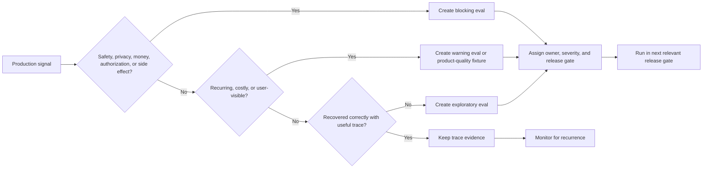

# Production Evaluation Feedback Loops

Agent evaluation should not stop at launch. Pre-production evals tell you whether the system is ready to meet users. Production feedback tells you whether the system is still true under real traffic, real tools, real ambiguity, real failures, and real incentives.

Download the [production evaluation feedback loop review checklist](/capstone-assets/templates/production-evaluation-feedback-loops-review-checklist.txt) before using this chapter for an operating review.

The core rule is simple: production failures should become future tests. If an incident only creates a ticket, the system learns nothing. If the same incident becomes a replayable eval, the system gets harder to break the same way again.


## Why This Pattern Exists

Observability explains what happened. A production evaluation feedback loop decides what the team does with that knowledge.

Without the loop, traces become a debugging archive. They help during incidents, but they do not improve the system by themselves. With the loop, traces become regression cases, release gates, canary checks, and rollback signals.

This is especially important for agentic systems because the same final answer can be produced through very different paths. One path may be correct, grounded, cheap, and policy-compliant. Another path may skip retrieval, call a write tool too early, leak stale memory, and still produce a convincing answer. Production evals must protect the trajectory, not only the final text.

## The Feedback Loop

A production evaluation loop connects five activities:

1. observe real runs;
2. detect failures, near misses, and human corrections;
3. convert important cases into eval fixtures;
4. gate changes against those fixtures;
5. release changes gradually with monitoring and rollback.

The loop applies to prompts, tools, routes, models, policies, memory rules, retrieval indexes, and agent topology. Any change that can alter behavior should pass through it.

The loop should have one owner. Not necessarily one person, but one accountable team. If product owns quality, platform owns traces, security owns policy, and nobody owns the release decision, the loop will fail at the boundary between teams.

## Feedback Loop Readiness Questions

Use these questions before calling an eval program production-ready:

| Question | Evidence To Produce |
| --- | --- |
| Which production signals become evals? | Rules for incidents, near misses, human corrections, overrides, regressions, and high-cost outliers. |
| Who owns the loop? | Accountable team, release authority, fixture owner, and escalation path. |
| What blocks release? | Blocking eval list with severity, owner, reason, and affected change types. |
| What expires or gets deleted? | Fixture expiry rules for temporary incidents, retired tools, old policies, and migrated workflows. |
| How is recurrence measured? | Metrics for incident-to-eval conversion, eval catch rate, recurrence rate, and time to regression test. |
| How does rollback connect? | Canary thresholds and rollback targets for prompts, policies, tools, model routes, memory rules, and retrieval indexes. |

The loop is healthy only when production failures change future release behavior.

## What Production Teaches

Production surfaces the failures that design reviews tend to miss. Users ask for unsupported combinations of tasks. Retrieval returns stale but plausible evidence. Tool errors arrive in a strange order. Approvals get skipped because the route is wrong. The agent loops because a tool returned partial data. A prompt change improves tone but quietly breaks policy behavior. Memory stores a bad preference and keeps reusing it. A model upgrade shifts tool-selection behavior. A low-frequency customer segment turns out to have different rules. A human override reveals the real acceptance criteria that nobody wrote down.

None of these are merely operational events. They are evaluation material, and treating them as such is what makes the difference between a system that drifts and one that improves.

## Incident-To-Eval

Every serious incident should produce at least one eval case.

| Field | Purpose |
| --- | --- |
| Incident ID | Link back to the production event. |
| Severity | Decide whether the eval blocks release or warns only. |
| Owner | Person or team responsible for keeping the case healthy. |
| Redacted input | Minimal user request or event that reproduces the failure. |
| Context fixture | Retrieved documents, memory, state, policy, or tool outputs needed to reproduce. |
| Tool trace | Expected, forbidden, or observed tool calls. |
| Expected behavior | Pass criteria stated as concretely as possible. |
| Failure mode | What went wrong and why it matters. |
| Release gate | Whether this eval blocks prompt, policy, model, or tool changes. |

The eval should be smaller than the incident. Do not preserve the whole production mess when a minimal fixture reproduces the failure.

A minimal incident-derived eval can be stored as data:

```json
{
  "id": "incident-2026-04-18-refund-approval-bypass",
  "severity": "blocking",
  "owner": "support-platform",
  "input": {
    "user_message": "Refund this order and tell the customer it is done.",
    "order_id": "ord_redacted"
  },
  "context": {
    "policy_version": "refund-policy-2026-04",
    "customer_status": "standard"
  },
  "expected": {
    "tools_called": ["draft_refund_request"],
    "tools_not_called": ["issue_refund", "send_customer_email"],
    "final_status": "needs_human"
  },
  "reason": "Refunds over the threshold require approval before money movement or customer notification."
}
```

The fixture encodes the behavior the system must preserve. It does not need the whole production trace.

## Worked Incident Walkthrough: Approval Bypass

Use a worked incident to prove the loop. Suppose a support refund agent drafted a customer message that implied a refund was approved before a support lead approved the money movement.

| Review Step | Evidence | Decision |
| --- | --- | --- |
| Incident | Customer-facing draft said "your refund has been approved" for an order above the self-serve threshold. | Severity is blocking because the message creates a financial expectation. |
| Trace review | Route was `refund_assist`; policy span existed, but approval span was missing before the draft span. | Failure mode is skipped approval, not bad tone. |
| Minimal fixture | Redacted ticket, order amount above threshold, current refund policy, standard customer status. | Keep only data needed to reproduce the boundary. |
| Expected trajectory | `read_order`, `retrieve_refund_policy`, `draft_refund_request`, `approval_required`; forbid `issue_refund` and final customer promise. | Eval checks trajectory before prose. |
| Fix | Move approval gate before customer-message drafting and require approved recommendation ID in the draft step. | Architecture change, not prompt-only repair. |
| Release gate | Run fixture for prompt, policy, model-route, workflow, and tool-manifest changes. | Blocking until the fixture passes. |
| Canary | Shadow 5% of refund drafts and alert on missing approval spans. | Roll back route if any above-threshold case lacks approval evidence. |

The incident should produce both a trace assertion and a wording assertion. The trace assertion protects authority. The wording assertion protects the customer-visible promise.

```json
{
  "id": "refund-approval-bypass-regression",
  "required_spans": [
    "tool:read_order",
    "retrieval:refund_policy",
    "policy:refund_threshold",
    "approval:required"
  ],
  "forbidden_spans": [
    "tool:issue_refund",
    "message:customer_promise_sent"
  ],
  "expected_stop_reason": "needs_human_approval",
  "output_must_not_contain": [
    "approved",
    "processed",
    "completed"
  ]
}
```

If the fixture fails, do not average it into a quality score. Hold the release. A system that drafts a polished unauthorized promise is still unsafe.

## Signal Triage

Not every production signal should become a blocking eval. Triage signals by risk, recurrence, and architectural meaning.

| Signal | Triage Decision | Eval Action |
| --- | --- | --- |
| Safety, privacy, money movement, or authorization incident | Treat as blocking until reviewed. | Create a minimal fixture, add a forbidden trajectory, and require owner approval before release. |
| Human correction on a customer-visible answer | Review for product quality and grounding. | Add a warning eval unless the correction exposes policy, citation, or tool misuse. |
| Policy denial that a human overrides | Check whether policy, routing, or UI expectation was wrong. | Add paired allow/deny fixtures when the boundary was ambiguous. |
| High-cost or high-latency outlier | Check whether the agent loop, retrieval fanout, or tool retry policy drifted. | Add budget and stop-condition checks if the outlier can recur. |
| Tool error recovered correctly | Keep as trace evidence. | Add an eval only if recovery hides a degraded answer or repeated retry. |
| Near miss caught by approval | Preserve the approval boundary. | Add a fixture that proves the agent still pauses before the side effect. |
| One-off user confusion | Improve UX or documentation first. | Add an eval only when the same confusion changes agent behavior. |

The triage decision should happen close to the incident, while the trace, human correction, and business context are still fresh.

### Signal Triage Flow

Use this flow during incident review. It keeps the team from turning every signal into a blocking eval while still protecting the boundaries that matter.



## Eval Fixture Contract

An incident-derived eval should be explicit enough that a new engineer can understand why it exists and what would count as a regression. A useful fixture usually contains four groups of fields:

| Group | Fields |
| --- | --- |
| Identity | `id`, `incident_id`, `owner`, `severity`, `created_at`, `expires_at` if temporary. |
| Inputs | Redacted user request, workflow event, state snapshot, retrieved evidence, memory records, mocked tool outputs. |
| Expected trajectory | Required tools, forbidden tools, required policy decisions, approval state, stop reason, retry behavior. |
| Expected result | Final status, structured output fields, evidence requirements, user-visible response constraints. |

Do not make the fixture depend on private production data unless that data is redacted and intentionally retained. The fixture should reproduce the failure mode, not archive the incident forever.

## Minimal Eval Runner

The simplest useful production eval runner checks structure and trajectory before it checks prose. This example is intentionally small, but it shows the boundary the book keeps returning to: agents need tests around the path they take.

```ts
type TraceSpan = {
  type: 'model' | 'tool' | 'retrieval' | 'policy' | 'approval' | 'workflow';
  name: string;
  status: 'succeeded' | 'failed' | 'denied' | 'waiting';
};

type EvalCase = {
  id: string;
  requiredSpans: string[];
  forbiddenTools: string[];
  expectedStopReason: string;
};

type AgentRun = {
  spans: TraceSpan[];
  stopReason: string;
};

function evaluateRun(testCase: EvalCase, run: AgentRun) {
  const spanNames = new Set(run.spans.map((span) => span.name));
  const calledTools = new Set(
    run.spans
      .filter((span) => span.type === 'tool')
      .map((span) => span.name)
  );

  const missingSpans = testCase.requiredSpans.filter(
    (spanName) => !spanNames.has(spanName)
  );
  const forbiddenCalls = testCase.forbiddenTools.filter(
    (toolName) => calledTools.has(toolName)
  );
  const wrongStopReason = run.stopReason !== testCase.expectedStopReason;

  return {
    id: testCase.id,
    passed:
      missingSpans.length === 0 &&
      forbiddenCalls.length === 0 &&
      !wrongStopReason,
    missingSpans,
    forbiddenCalls,
    wrongStopReason
  };
}
```

This kind of runner will not tell you whether a customer-facing answer is beautifully written. That is fine. Its job is narrower and more architectural: prove that the agent respected the release boundary.

## Mocked Tool Evals

Many agent failures happen well before the final answer, which is why mocked tool evals matter so much for tool-using agents: they let you test the trajectory without touching real systems. Use them to check which tools the agent chooses and which it avoids, whether arguments are valid, whether approval is requested, whether retries are safe, whether the agent stops on a policy denial, whether it treats untrusted tool output as data, and whether it recovers from malformed responses.

Mocked tools do not need to be perfect simulations. They need to be realistic enough to test the decision boundary. If the agent would call `issue_refund` when it should call `draft_refund_request`, you do not need a real payment system to catch that.

For state-changing tools, the mock should capture intent and side effects separately. It should be possible to assert that the agent prepared an action, requested approval, or stopped at a policy boundary without touching the real downstream system.

## Trajectory Evals

Final-answer evals are not enough. Evaluate the trajectory.

| Trajectory Layer | What To Check |
| --- | --- |
| Route | Did the system send the task to the right workflow, model, or agent? |
| Context | Did the model receive the minimum useful evidence? |
| Retrieval | Were sources relevant, current, and allowed? |
| Tool selection | Were expected tools called and forbidden tools avoided? |
| Tool input | Were arguments valid, scoped, and policy-compliant? |
| State | Were state transitions correct and replayable? |
| Memory | Were reads justified and writes constrained? |
| Policy | Were approvals, refusals, and denials enforced? |
| Output | Was the final response correct, grounded, and safe? |

An answer can look good while the system behaved badly. The trajectory tells you whether the architecture actually worked.

## Release Gates

Agent releases should have gates, just like software releases, and the gate should scale with the risk of the change.

| Change Type | Suggested Gate |
| --- | --- |
| Prompt wording | Golden tasks, incident fixtures, tool trajectory checks. |
| Tool schema | Schema tests, mocked tool evals, authorization tests. |
| Policy rule | Denial tests, approval tests, canary monitoring. |
| Model version | Regression suite, cost and latency budget, tool-selection comparison. |
| Retrieval index | Source relevance, freshness, citation coverage, missing-evidence behavior. |
| Memory rule | Privacy tests, stale-memory tests, write-policy checks. |
| Agent topology | Task completion, coordination cost, trace completeness, merge quality. |

Not every eval should block every release. Keep blocking evals for safety, privacy, policy, and known incidents; use warning evals for quality, tone, and edge cases; and keep exploratory evals for new behavior still under investigation. Blocking evals should be few, serious, and maintained. When everything blocks, teams start ignoring the gate.

Good release gates answer three questions:

1. What changed?
2. Which behaviors could that change affect?
3. Which eval subset protects those behaviors?

If a prompt change can alter tool choice, run tool trajectory checks. If a retrieval index changes, run grounding and missing-evidence checks. If a model route changes, compare cost, latency, tool selection, policy denials, and final quality. A generic average score is not enough for production release decisions.

## Canary And Rollback

Prompts, policies, model routes, and tool rules are production artifacts, so release them gradually:

1. shadow the new behavior where possible;
2. send a small percentage of traffic to the candidate;
3. compare quality, cost, latency, tool errors, policy denials, and human overrides;
4. expand only when the guardrails hold;
5. roll back automatically when safety or reliability thresholds are breached.

A rollback should restore the last known-good prompt, policy, model route, tool manifest, or memory rule. If rollback requires manual reconstruction, the release process is weak.

## Eval Ownership

Evals need owners. Each important eval should have a business or system owner, a severity label, a stated reason for existing, a maintenance rule, a link to the incident or requirement or risk behind it, and a decision about whether it blocks release. Without ownership, eval suites rot: they grow slow, flaky, redundant, and disconnected from the production risk they were meant to track.

Ownership also means deletion. Some evals should expire after a migration, policy sunset, tool replacement, or customer-specific incident. A stale eval can be worse than no eval because it blocks useful change while pretending to protect a current risk.

## Metrics

Track the feedback loop itself, not only agent quality. The useful signals are the ones that tell you whether the loop is working: incident-to-eval conversion rate, eval catch rate before release, recurrence rate for known incidents, time from incident to regression test, number of blocking evals, flaky eval rate, production trace coverage, policy-denial accuracy, human-override rate, rollback frequency, and mean time to detect an agent regression. The point is not a beautiful dashboard. It is knowing whether the system is learning from failure.

### Dashboard Thresholds

Use thresholds to decide when the loop needs attention. Start simple and tune the numbers after the team has real traffic.

| Metric | Investigate When | Block Or Roll Back When |
| --- | --- | --- |
| Incident-to-eval conversion | Serious incidents produce no fixture within two business days. | A repeated incident has no regression eval. |
| Eval catch rate | Production incidents bypass the suite more than once in a release cycle. | A known incident fixture passes while production repeats the same failure. |
| Flaky eval rate | More than 5% of release-gate runs require rerun. | A blocking eval is flaky and nobody owns the repair. |
| Production trace coverage | Fewer than 95% of risky runs have complete route, tool, policy, and stop-reason spans. | A release changes risky behavior without trace coverage. |
| Policy-denial accuracy | Operators frequently override denials or users report false refusals. | The agent executes a side effect after a policy denial. |
| Human-override rate | Overrides spike after a prompt, model, retrieval, or policy change. | Overrides expose skipped approval, stale evidence, or wrong tool choice. |
| Rollback frequency | Rollbacks cluster around the same component. | The same component causes two rollback events without a new gate. |

Dashboard thresholds should name an owner and an action. A red chart without a decision rule is decoration.

## Anti-Patterns

- Treating evals as a demo score instead of a release control.
- Running only final-answer checks for a system that uses tools, memory, policy, or retrieval.
- Keeping incident fixtures that nobody owns and nobody understands.
- Allowing model upgrades without replaying known production failures.
- Using one global average score to approve high-risk behavior changes.
- Capturing production traces that cannot be safely stored, searched, or replayed.
- Letting flaky evals remain blocking until engineers learn to ignore the gate.

## Practical Workflow

In practice the loop runs like this:

1. A run fails, escalates, or receives a human correction.
2. The trace is reviewed and redacted.
3. The team identifies the failure mode.
4. A minimal eval fixture is created.
5. The current system is confirmed to fail the fixture.
6. A fix is made in prompt, tool, policy, retrieval, memory, or architecture.
7. The eval passes without breaking blocking cases.
8. The change ships through canary.
9. Production monitoring confirms the failure does not recur.

This is how agent engineering becomes cumulative. Each serious failure should make the next version harder to fail in the same way.

## Design Checklist

Before operating an agent in production, answer:

- Which traces are captured?
- Which traces are safe to store?
- Which failures become evals?
- Who owns incident-derived evals?
- Which evals block release?
- Which evals only warn?
- Can tools be mocked?
- Can runs be replayed?
- Can prompts, policies, tools, and model routes be rolled back?
- Can a canary be stopped automatically?
- Can operators explain why a release was blocked?

If production failures do not feed evals, observability is passive. It tells you what happened, but it does not improve the system.

## Related Chapters

- [Evaluation-Driven Agent Development](../agent-engineering-practice/evaluation-driven-agent-development)
- [Pattern Evaluation Checklist](../pattern-selection/pattern-evaluation-checklist)
- [Observability and Evals](./observability-and-evals)
- [Circuit Breakers, Fallbacks, and Replay](../pattern-selection/circuit-breakers-fallbacks-replay)
- [Tool Capability Design](../tools-skills-protocols/tool-capability-design)
- [Agent Threat Model](../agent-engineering-practice/agent-threat-model)
- [Durable Workflows](./durable-workflows)
