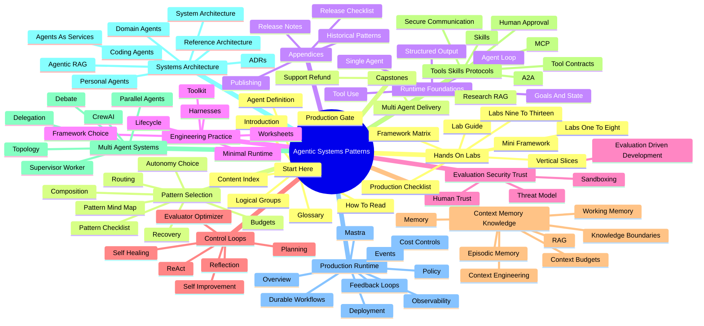

# Content Index Mind Map

Use this page when you want a visual index before choosing a reading path. The mind map shows the book as one engineering sequence: orient the reader, choose the pattern, define the runtime, control risk, compose the system, operate it, and prove it with labs and capstones.

## Book Mind Map

## Fast Routes

| Goal | Start Here | Then Read |
| --- | --- | --- |
| Learn the field from zero | [How To Read This Book](/publishing/how-to-read) | [What Is An Agent?](/foundations/what-is-an-agent), [Agent Loop](/foundations/agent-loop), [Tool Use](/foundations/tool-use) |
| Choose the right architecture | [Architecture Before Autonomy](/pattern-selection/architecture-before-autonomy) | [Choosing the Right Pattern](/pattern-selection/choosing-the-right-pattern), [Pattern Evaluation Checklist](/pattern-selection/pattern-evaluation-checklist) |
| Build a working slice | [Lab Guide](/hands-on-labs/) | [Framework and Language Matrix](/hands-on-labs/framework-language-matrix), then the lab closest to your target system |
| Review production readiness | [10/10 Production Gate](/publishing/ten-out-of-ten-production-gate) | [Evaluation-Driven Agent Development](/agent-engineering-practice/evaluation-driven-agent-development), [Production Runtime Overview](/production-runtime/overview) |
| Compare complete examples | [Capstone Projects](/capstone-projects/) | [Support Refund Agent](/capstone-projects/support-refund-agent), [Research RAG Agent](/capstone-projects/research-rag-agent), [Multi-Agent Delivery Workflow](/capstone-projects/multi-agent-delivery-workflow) |

## Full Content Index

### Start Here

- [Introduction](/intro) - the book promise, audience, and practical engineering bar.
- [How To Read This Book](/publishing/how-to-read) - reader paths for learners, builders, architects, reviewers, and publishers.
- [Logical Groups](/publishing/logical-groups) - the recommended sequence for reading and reviewing the book.
- [Content Index Mind Map](/publishing/content-index-mind-map) - this visual index and grouped chapter map.
- [What Is An Agent?](/foundations/what-is-an-agent) - the core definition of agentic systems.
- [Glossary and Acronyms](/publishing/glossary) - shared vocabulary for the whole book.
- [10/10 Production Gate](/publishing/ten-out-of-ten-production-gate) - the release-quality bar for agentic systems.

### Pattern Selection and Composition

- [Architecture Before Autonomy](/pattern-selection/architecture-before-autonomy) - why ownership, policy, evals, and rollback come before agent behavior.
- [Choosing the Right Pattern](/pattern-selection/choosing-the-right-pattern) - choose the least agentic pattern that satisfies the workload.
- [Pattern Evaluation Checklist](/pattern-selection/pattern-evaluation-checklist) - turn pattern selection into reviewable evidence.
- [Linked Pattern Mind Map](/pattern-selection/pattern-classification-mind-map) - visual map of pattern families and related tradeoffs.
- [From Patterns To Systems](/pattern-selection/from-patterns-to-systems) - compose individual patterns into complete systems.
- [Pattern Composition Playbook](/pattern-selection/pattern-composition-playbook) - common combinations and their control requirements.
- [Prompt Chaining and Gates](/pattern-selection/prompt-chaining-and-gates) - fixed staged workflows with validation gates.
- [Routing and Handoffs](/pattern-selection/routing-and-handoffs) - send work to the right model, tool, agent, policy, or human.
- [Resource-Aware Agent Design](/pattern-selection/resource-aware-agent-design) - bound token use, latency, tools, retries, and cost.
- [Circuit Breakers, Fallbacks, and Replay](/pattern-selection/circuit-breakers-fallbacks-replay) - stop bad runs and preserve recovery evidence.
- [Source Map](/pattern-selection/source-map) - how external pattern references map into the book.

### Agent Runtime Foundations

- [Single Agent](/foundations/single-agent) - the simplest agent shape and where it is enough.
- [Agent Loop](/foundations/agent-loop) - how state, action, observation, and stop conditions form a run.
- [Goals and State](/foundations/goals-and-state) - make intent, progress, and memory explicit.
- [Tool Use](/foundations/tool-use) - connect model decisions to bounded external actions.
- [Structured Output](/foundations/structured-output) - convert model output into schemas software can validate.

### Engineering Practice and Frameworks

- [Agent Development Lifecycle](/agent-engineering-practice/agent-development-lifecycle) - design, harness, eval, trace, review, rollout, and maintenance.
- [Agent Harnesses](/agent-engineering-practice/agent-harnesses) - the controlled environment around instructions, tools, state, evals, and approvals.
- [Building a Minimal Agent Runtime](/agent-engineering-practice/building-a-minimal-agent-runtime) - the smallest runtime shape worth trusting.
- [Agent Engineer Toolkit](/agent-engineering-practice/agent-engineer-toolkit) - the practical surfaces needed for governable agent work.
- [Framework Selection](/agent-engineering-practice/framework-selection) - choose a framework by runtime needs instead of hype.
- [Cross-Framework Decision Matrix](/agent-engineering-practice/cross-framework-decision-matrix) - compare frameworks across state, tools, evals, deployment, and observability.
- [Real Framework Setup Notes](/agent-engineering-practice/real-framework-setup-notes) - local setup and release evidence for real frameworks.
- [Templates and Worksheets](/agent-engineering-practice/templates-and-worksheets) - reusable artifacts for design and review.

### Evaluation, Security, and Trust

- [Evaluation-Driven Agent Development](/agent-engineering-practice/evaluation-driven-agent-development) - make evals part of design, release, and incident learning.
- [Agent Threat Model](/agent-engineering-practice/agent-threat-model) - identify prompt injection, unsafe tools, memory poisoning, and authority risks.
- [Agent Security and Sandboxing](/agent-engineering-practice/agent-security-and-sandboxing) - restrict execution and keep model proposals behind policy.
- [Agent UX and Human Trust](/agent-engineering-practice/agent-ux-and-human-trust) - show capability, uncertainty, approvals, and evidence clearly.

### Control Loops

- [Planning and Execution](/control-loops/planning-and-execution) - separate plan ownership from execution and validation.
- [ReAct](/control-loops/react) - interleave reasoning, action, and observation.
- [Reflection](/control-loops/reflection) - revise work without hiding failure.
- [Evaluator-Optimizer](/control-loops/evaluator-optimizer) - improve outputs through explicit evaluation.
- [Self-Improvement](/control-loops/self-improvement) - use learning loops under tight governance.
- [Self-Healing Workflows](/control-loops/self-healing-workflows) - recover from known failures with bounded repair paths.

### Context, Memory, and Knowledge

- [Context Budgets and Working Sets](/foundations/context-budgets-and-working-sets) - select, label, compress, retrieve, and drop context deliberately.
- [Context Engineering](/foundations/context-engineering) - assemble context as a first-class design surface.
- [Memory-Augmented Agent](/memory-knowledge/memory-augmented-agent) - govern retrieval, injection, storage, and correction.
- [Long-Term Episodic Memory](/memory-knowledge/long-term-episodic-memory) - store experience without corrupting future runs.
- [Semantic Recall and RAG](/memory-knowledge/semantic-recall-rag) - retrieve source-grounded evidence for answers.
- [Working Memory](/memory-knowledge/working-memory) - manage temporary run context.
- [Knowledge-Bound Agents](/memory-knowledge/knowledge-bound-agents) - keep behavior inside approved knowledge boundaries.

### Tools, Skills, and Protocols

- [Skills](/tools-skills-protocols/skills) - package reusable capabilities for agents.
- [Tool Capability Design](/tools-skills-protocols/tool-capability-design) - expose external actions through narrow, auditable contracts.
- [MCP-first Tool Use](/tools-skills-protocols/mcp-first-tool-use) - design tool use around model context protocol boundaries.
- [A2A Agent Interoperability](/tools-skills-protocols/a2a-agent-interoperability) - exchange work between agents through typed envelopes.
- [Secure Agent Communication](/tools-skills-protocols/secure-agent-communication) - protect remote tools and agent-to-agent exchange.
- [Human Approval Gates](/tools-skills-protocols/human-approval-gates) - require people where authority or risk demands review.

### Multi-Agent Systems

- [Choosing Multi-Agent Topology](/multi-agent-systems/choosing-multi-agent-topology) - decide when to delegate, supervise, debate, parallelize, or stay single-agent.
- [Task Delegation](/multi-agent-systems/task-delegation) - split work without losing ownership.
- [Supervisor / Worker](/multi-agent-systems/supervisor-worker) - coordinate specialists through one accountable controller.
- [Debate and Consensus](/multi-agent-systems/debate-and-consensus) - compare answers while controlling merge policy.
- [Parallel Agents](/multi-agent-systems/parallel-agents) - run independent work streams with bounded joins.
- [CrewAI Flows and Crews](/multi-agent-systems/crewai-flows-and-crews) - separate flow ownership from crew collaboration.

### Systems Architecture

- [Agentic System Architecture](/systems-architecture/agentic-system-architecture) - combine loops, tools, memory, policy, evals, and runtime.
- [Agents As Services](/systems-architecture/agents-as-services) - package agent behavior behind APIs, queues, and contracts.
- [Agentic RAG Systems](/systems-architecture/agentic-rag-systems) - combine retrieval, planning, evidence checks, refusal, and escalation.
- [Open Personal Agent Architectures](/systems-architecture/open-personal-agent-architectures) - design user-owned agents with consent and portability.
- [Coding Agents](/systems-architecture/coding-agents) - apply agent loops to repository work.
- [Computer-Use Agents](/systems-architecture/computer-use-agents) - govern screen-based actions and recovery.
- [Domain Agent Architectures](/systems-architecture/domain-agent-architectures) - constrain agents in high-stakes domains.
- [Architecture Decision Records](/systems-architecture/architecture-decision-records) - make important design choices reviewable.
- [Reference Architecture](/systems-architecture/reference-architecture) - define the production ownership boundary around agents.

### Production Runtime

- [Overview](/production-runtime/overview) - the control plane around admitted work, state, policy, and evidence.
- [Deployment Walkthrough](/production-runtime/deployment-walkthrough) - turn a system into a release path with gates, canaries, and rollback.
- [Durable Workflows](/production-runtime/durable-workflows) - keep long-running work replayable and recoverable.
- [Observability and Evals](/production-runtime/observability-and-evals) - connect traces and metrics to behavioral evaluation.
- [Production Evaluation Feedback Loops](/production-runtime/production-evaluation-feedback-loops) - turn incidents and feedback into regression tests.
- [Cost Controls and Runtime Budgets](/production-runtime/cost-controls-runtime-budgets) - cap calls, tokens, tools, retries, latency, and spend.
- [Policy Enforcement](/production-runtime/policy-enforcement) - enforce rules outside model judgment.
- [Event-Triggered Agents](/production-runtime/event-triggered-agents) - keep unattended triggers idempotent, observable, replayable, and safe.
- [Mastra Runtime](/production-runtime/mastra-runtime) - map runtime responsibilities into a Mastra-style shape.

### Hands-On Labs

- [Lab Guide](/hands-on-labs/) - how to use the labs as implementation evidence.
- [Framework and Language Matrix](/hands-on-labs/framework-language-matrix) - map labs to language, framework style, and runtime concern.
- [Lab Production Readiness Checklist](/hands-on-labs/production-readiness-checklist) - name the missing controls after a demo works.
- [01 - Tool-Using Agent](/hands-on-labs/lab-01-tool-using-agent) - build a minimal tool boundary.
- [02 - Agent Loop and Planning](/hands-on-labs/lab-02-agent-loop-and-planning) - separate planning from execution.
- [03 - Agentic RAG](/hands-on-labs/lab-03-agentic-rag) - build scoped retrieval and grounded answers.
- [04 - A2A Communication](/hands-on-labs/lab-04-a2a-communication) - exchange typed agent messages.
- [05 - Multi-Agent Supervisor](/hands-on-labs/lab-05-multi-agent-supervisor) - coordinate bounded specialist work.
- [06 - Observability and Evals](/hands-on-labs/lab-06-observability-and-evals) - evaluate behavior through traces and regression tasks.
- [07 - Mastra Runtime Packaging](/hands-on-labs/lab-07-mastra-runtime-packaging) - package a TypeScript runtime shape.
- [08 - CrewAI Flows and Crews](/hands-on-labs/lab-08-crewai-flows-and-crews) - build a CrewAI-style Python shape.
- [From-Scratch Mini-Framework Track](/hands-on-labs/from-scratch-mini-framework) - see framework ideas without framework magic.
- [09 - Minimal Agent Loop](/hands-on-labs/lab-09-minimal-agent-loop) - implement the core loop directly.
- [10 - Tool Registry and Policy Gate](/hands-on-labs/lab-10-tool-registry-and-policy-gate) - route tools through policy.
- [11 - Context, Memory, Trace, and Evals](/hands-on-labs/lab-11-context-memory-trace-evals) - connect context, memory, observability, and evaluation.
- [12 - LangGraph State Graph](/hands-on-labs/lab-12-langgraph-state-graph) - implement stateful graph execution.
- [13 - AutoGen Transcript Evals](/hands-on-labs/lab-13-autogen-transcript-evals) - evaluate multi-agent transcripts.
- [Vertical Slice Examples](/hands-on-labs/vertical-slice-examples) - compare product-shaped runnable slices.

### Capstone Projects

- [Capstone Projects](/capstone-projects/) - how to read complete examples.
- [Support Refund Agent](/capstone-projects/support-refund-agent) - customer support with authority boundaries and rollback.
- [Research RAG Agent](/capstone-projects/research-rag-agent) - source-grounded research with evidence controls.
- [Multi-Agent Delivery Workflow](/capstone-projects/multi-agent-delivery-workflow) - coordinated delivery with roles, traces, and runbooks.

### Appendices

- [Historical Patterns](/deprecated/historical-patterns) - older terminology retained for comparison.
- [Publishing and Releases](/publishing/publishing-and-releases) - how the online book is built and maintained.
- [Release Readiness Checklist](/publishing/release-readiness-checklist) - publishing checks before release.
- [Release Notes](/publishing/release-notes) - current release history.

## A++ Use Test

This index is doing its job when a reader can answer four questions in under one minute:

- Where should I start for my current goal?
- Which chapter explains the concept I am missing?
- Which later chapter turns that concept into production evidence?
- Which lab or capstone proves the idea in a more complete shape?
