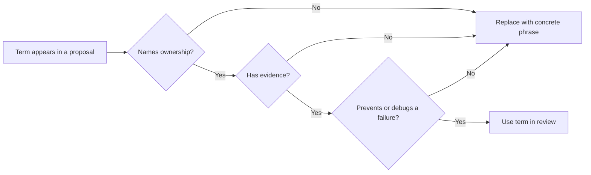

# Glossary and Acronyms

Use this chapter when a term blocks progress. The definitions are short on purpose. Each term explains what the word means in this book and why it matters when you design, test, or operate an agentic system.

Read the glossary as a control vocabulary. In this book, terms are useful only when they help a team decide ownership, risk, evidence, or release readiness.

## How To Use This Glossary

Use a term in a design review only if the team can answer three questions:

1. What does this term own?
2. What evidence proves it works?
3. What failure does it help us prevent or debug?

If a term does not answer those questions, replace it with a more concrete phrase. For example, "agentic workflow" is too broad unless you can name the goal, state, tool boundary, policy gate, and stop condition.

Use this flow when a term sounds useful but vague. Keep the term only when it sharpens ownership, evidence, and failure analysis.

## Term Review Map

Use this map during design reviews. When a term appears in a proposal, ask the review question before accepting it.

| When Someone Says... | Ask... | Go To |
| --- | --- | --- |
| Agent | What runtime decision does the model make that code cannot make safely enough? | [What Is An Agent?](/foundations/what-is-an-agent) |
| Autonomous | Which decisions, tools, budgets, and stop conditions are delegated? | [Architecture Before Autonomy](/pattern-selection/architecture-before-autonomy) |
| Memory | Is this task-local context, durable user memory, episodic history, or retrieved knowledge? | [Context Engineering](/foundations/context-engineering) |
| Tool | What authority does it grant, and what policy checks run before side effects? | [Tool Capability Design](/tools-skills-protocols/tool-capability-design) |
| Eval | Which behavior, trajectory, policy decision, or failure mode does it catch? | [Evaluation-Driven Agent Development](/agent-engineering-practice/evaluation-driven-agent-development) |
| Human-in-the-loop | Does the human approve an exact action, review a result, or only receive a notification? | [Human Approval Gates](/tools-skills-protocols/human-approval-gates) |
| Multi-agent | What separate context, permission, skill, latency, or review need justifies another agent? | [Choosing Multi-Agent Topology](/multi-agent-systems/choosing-multi-agent-topology) |
| Production-ready | Where is the evidence for traces, eval gates, rollback, ownership, and incident response? | [10/10 Production Gate](/publishing/ten-out-of-ten-production-gate) |

## Core Terms

| Term | Meaning | Why It Matters |
| --- | --- | --- |
| Agent | A system that pursues a goal through a loop, uses tools or context, tracks state, and stops by rule. | It separates real agent architecture from a single model call. |
| Agent loop | The observe, decide, act, evaluate, and stop cycle around an agent. | It is where budgets, policy, state, and failure handling must live. |
| Autonomy | The amount of decision authority delegated to the system. | More autonomy requires stronger boundaries, tests, approvals, and rollback. |
| Boundary | The line between model choice and deterministic system control. | Weak boundaries turn model uncertainty into system risk. |
| Capability | A thing the system can do, usually through a tool, skill, workflow, or service. | Capabilities need ownership, authorization, audit, and tests. |
| Context | The information passed into a model or agent step. | Context controls what the model can use, confuse, leak, or ignore. |
| Goal | The explicit outcome the system is trying to reach. | Ambiguous goals produce ambiguous behavior and weak evals. |
| Policy | A rule that constrains what the agent may do. | Policy must be enforced outside the prompt when actions carry risk. |
| State | Data that records the current run, memory, progress, decisions, or external effects. | Hidden state makes replay, debugging, and safety reviews hard. |
| Stop condition | A rule that ends a loop or hands control to a human/system. | Without stop conditions, agents waste budget or take unsafe repeated actions. |
| Tool | A callable capability exposed to an agent. | Tool design is a control plane, not just an API wrapper. |

## Common Confusions

These pairs cause many weak designs. Use the sharper term in reviews.

| Confused Terms | Distinction |
| --- | --- |
| Model call vs agent | A model call returns one response. An agent loop can decide what to do next. |
| Workflow vs agent | A workflow follows a path owned by code. An agent chooses at least some steps from observations. |
| Memory vs context | Context is what the model sees now. Memory is stored state with retention, correction, and deletion rules. |
| Tool vs skill | A tool executes a capability. A skill packages procedure, references, scripts, templates, and examples. |
| Policy vs prompt instruction | Policy is enforced by software or an authority boundary. A prompt instruction is guidance to the model. |
| Eval vs test | Tests usually check deterministic behavior. Evals check model-influenced outputs, trajectories, or judgments. |
| Trace vs log | Logs record events. Traces connect the run: goal, context, decisions, tools, outputs, costs, and stop reason. |
| Approval vs notification | Approval blocks an exact action until accepted. Notification only tells someone what happened. |

When in doubt, choose the term that makes ownership and evidence more inspectable.

## Architecture Terms

| Term | Meaning | Why It Matters |
| --- | --- | --- |
| Architecture decision record (ADR) | A short record of an architecture choice, context, alternatives, and consequences. | ADRs make agent design reviewable after the demo phase. |
| Circuit breaker | A control that stops or degrades execution when failures cross a threshold. | It prevents repeated model/tool failure from becoming user-visible damage. |
| Deterministic boundary | Code, schema, policy, or workflow logic that does not rely on model judgment. | It keeps high-risk decisions outside probabilistic text generation. |
| Durable workflow | A workflow that can persist, resume, retry, and recover after interruption. | Production agents need continuity across crashes, queues, and timeouts. |
| Fallback | A safer alternate path used when the preferred path fails or becomes too risky. | Fallbacks preserve service quality without pretending autonomy always works. |
| Handoff | A typed transfer of work between components, agents, tools, or humans. | Handoffs need context, state, ownership, and acceptance criteria. |
| Idempotency | The property that repeating an action produces the same intended effect. | Retries and replay are unsafe without idempotent external actions. |
| Replay | Re-running a trace, workflow step, or decision path for debugging or evaluation. | Replay turns incidents into reproducible tests. |
| Routing | Choosing which path, tool, model, workflow, or agent should handle a task. | Bad routing adds cost, latency, and failure modes. |
| Service boundary | The contract around a deployable system component. | Agents become operable when treated like services with APIs and SLOs. |

## Evaluation Terms

| Term | Meaning | Why It Matters |
| --- | --- | --- |
| Eval case | A concrete input, expected behavior, and scoring rule. | It turns a vague quality claim into a repeatable check. |
| Eval gate | A required evaluation threshold before release or rollout. | It prevents prompt or policy changes from shipping on confidence alone. |
| Fixture | A controlled test input, document set, tool response, or trace. | Fixtures make agent behavior reproducible. |
| Grader | Code, rubric, or model that scores an output or trajectory. | Graders must be tested, or they become another unreliable agent. |
| Regression | A previously passing behavior that fails after a change. | Agent systems need regression suites because small prompt changes can shift behavior. |
| Trace | A structured record of prompts, tool calls, decisions, observations, costs, and results. | Traces explain what happened when outputs are not enough. |
| Trajectory | The full path an agent takes through steps, tools, state, and decisions. | Some failures only appear across the path, not in the final answer. |

## Memory and Knowledge Terms

| Term | Meaning | Why It Matters |
| --- | --- | --- |
| Context budget | The token, latency, cost, and attention limit for context. | More context is not always better; it can distract or leak. |
| Context packet | A deliberately assembled bundle of instructions, facts, state, tools, and evidence. | It makes context selection inspectable. |
| Episodic memory | Stored records of events, interactions, or runs. | It helps personalization and continuity but requires retention and correction rules. |
| Knowledge boundary | The trusted sources an agent may use for claims. | It reduces hallucination and supports refusal when evidence is missing. |
| Retrieval-augmented generation (RAG) | A design where retrieved evidence is added to model context. | RAG helps only when retrieval quality, citations, and freshness are tested. |
| Semantic recall | Retrieval based on meaning rather than exact keyword matching. | It can find useful evidence but can also retrieve plausible wrong material. |
| Working memory | Task-local state used during one run or session. | It keeps multi-step work coherent without turning every fact into durable memory. |

## Security and Trust Terms

| Term | Meaning | Why It Matters |
| --- | --- | --- |
| Approval gate | A point where a human or policy service must approve an exact action. | Gates reduce risk for money, credentials, user data, and irreversible changes. |
| Audit log | A record of decisions, approvals, tool calls, and external effects. | Audit logs support incident review and accountability. |
| Credential boundary | The rule for which identity or secret a tool call may use. | Agents should not inherit broad credentials by default. |
| Least privilege | Giving the system only the access it needs for the task. | Broad access turns model mistakes into security incidents. |
| Sandbox | A constrained environment for code, browser, file, or network actions. | Sandboxes limit damage when generated actions fail or are attacked. |
| Threat model | A structured analysis of what can go wrong, who can cause it, and how to reduce risk. | Agent threat models must include tools, memory, prompts, users, and external data. |
| Trust contract | The promises the product makes about what the agent can do, show, change, or decide. | Users need clear control when agents act on their behalf. |

## Protocol and Framework Terms

| Term | Meaning | Why It Matters |
| --- | --- | --- |
| A2A | Agent-to-agent communication through typed messages, identity, and authorization. | A2A needs contracts; free-form chat between agents is hard to secure or debug. |
| MCP | Model Context Protocol, a protocol for exposing tools and resources to model clients. | MCP can standardize tool access, but servers still need auth, policy, and lifecycle control. |
| Skill | A packaged procedural capability with instructions, files, scripts, or examples. | Skills preserve tested know-how and reduce repeated prompt bloat. |
| Supervisor | A component or agent that assigns, reviews, or coordinates worker agents. | Supervisors need authority, stop rules, and failure handling. |
| Worker | A bounded agent or component responsible for a subtask. | Workers should have narrow inputs, outputs, tools, and success criteria. |

## Acronyms

| Acronym | Expansion | Note |
| --- | --- | --- |
| ADR | Architecture Decision Record | Use for design choices and consequences. |
| A2A | Agent-to-Agent | Use for typed agent communication. |
| API | Application Programming Interface | Treat agent tools as APIs with policy. |
| CI | Continuous Integration | Use CI for eval gates and regression checks. |
| KPI | Key Performance Indicator | Use carefully; agent KPIs need quality and risk metrics. |
| MCP | Model Context Protocol | Use for tool/resource interoperability. |
| PII | Personally Identifiable Information | Requires minimization, masking, retention, and access rules. |
| RAG | Retrieval-Augmented Generation | Requires retrieval evals and source controls. |
| SLA | Service Level Agreement | External commitment to service behavior. |
| SLO | Service Level Objective | Internal target for reliability, latency, or quality. |
| UX | User Experience | Includes trust, visibility, correction, and control. |

## Review Rule

When a chapter, ADR, or release note uses an acronym, define it on first use unless the surrounding section already does. This matters for an online book because readers often land on a single page from search instead of reading chapters in order.

## Related Chapters

- [What Is An Agent?](/foundations/what-is-an-agent)
- [Choosing the Right Pattern](/pattern-selection/choosing-the-right-pattern)
- [Context Engineering](/foundations/context-engineering)
- [Evaluation-Driven Agent Development](/agent-engineering-practice/evaluation-driven-agent-development)
- [Agent Threat Model](/agent-engineering-practice/agent-threat-model)
