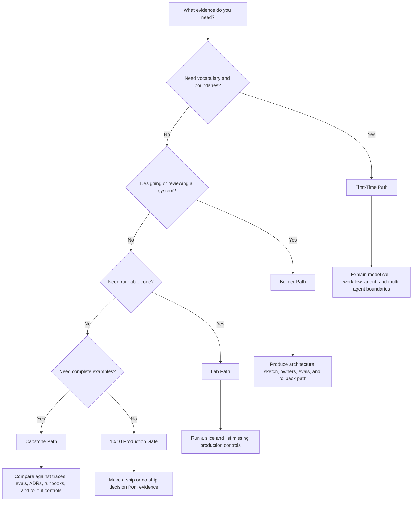

# How To Read This Book

This book has two jobs.

First, it makes an argument: agentic systems need architecture before autonomy. Second, it gives you a pattern reference you can use during design work.

You do not need to read every chapter in order. But do read the selection chapters before adding loops, tools, memory, or multiple agents to a system.

## Choose Your Path

Use the path that matches the decision in front of you.

| If you are... | Start with | Goal |
| --- | --- | --- |
| New to agentic systems | [First-Time Path](#first-time-path) | Learn the core vocabulary and boundaries. |
| Designing or reviewing a system | [Builder Path](#builder-path) | Choose patterns, controls, and production responsibilities. |
| Running code | [Lab Path](#lab-path) | Build small examples and connect them back to architecture. |
| Looking for product-shaped examples | [Capstone Path](#capstone-path) | See patterns combined into complete systems. |
| Learning visually or onboarding a team | [Visual Architecture Route](/publishing/logical-groups#visual-architecture-route) | Use diagrams to understand boundaries, ownership, and production controls. |
| Checking one pattern during work | [Reference Path](#reference-path) | Scan use cases, failure modes, evals, and production checklists. |
| Choosing a section to read | [Logical Groups](/publishing/logical-groups) | Understand why the book is grouped this way and where each group pays off. |
| Stuck on terminology | [Glossary and Acronyms](/publishing/glossary) | Decode agent, eval, protocol, security, and production terms. |
| Preparing a release | [10/10 Production Gate](/publishing/ten-out-of-ten-production-gate) | Check whether the system is reviewable, testable, observable, and reversible. |

The fastest useful route is not the shortest list of pages. It is the path that gets you to a design decision with enough context to avoid a bad abstraction.

## Reading Path Decision Flow

The path is finished only when it produces the evidence on the right.

## Time And Difficulty Guide

Use this table before choosing a route. The estimates assume a working software engineer who can skim familiar material and slow down for unfamiliar patterns, code, or production controls.

| Path | Best For | Difficulty | Time | Evidence You Should Produce |
| --- | --- | --- | ---: | --- |
| First-Time Path | Learning the vocabulary and boundaries. | Beginner to intermediate | 2-4 hours | A short explanation of agent, workflow, tool, state, memory, eval, and stop condition. |
| Builder Path | Designing or reviewing a real system. | Intermediate to advanced | 1-2 days | Architecture sketch, selected pattern, rejected alternatives, owners, evals, and rollback path. |
| Lab Path | Running examples and seeing implementation boundaries. | Intermediate | 1-3 days | Passing tests, trace output, missing-controls list, and one hardening task per lab. |
| Capstone Path | Comparing complete product-shaped systems. | Advanced | 4-8 hours | Gap analysis against traces, evals, ADRs, runbooks, and release controls. |
| Reference Path | Checking one pattern during design work. | Intermediate | 10-30 minutes per chapter | Fit/avoid decision, failure mode, eval case, and production checklist. |
| Release Path | Deciding whether a system can ship. | Advanced | 2-6 hours | Completed scorecard, release evidence record, known limits, and ship/no-ship decision. |

Do not optimize for speed. Optimize for evidence. A fast read that does not change the design is not useful.

## Path Exit Criteria

Use these checks to decide whether a path has paid off. If you cannot answer the exit question, continue with the linked path before choosing a pattern or shipping a system.

| Path | You are done when you can... | If not, continue with... |
| --- | --- | --- |
| First-Time Path | Explain the difference between a model call, prompt chain, workflow, single agent, and multi-agent system. | [Pattern Selection and Composition](/pattern-selection/architecture-before-autonomy) |
| Builder Path | Draw the system boundary, name the owner of state, tools, memory, policy, evals, and rollback, and defend why each pattern belongs. | [Reference Architecture](/systems-architecture/reference-architecture) |
| Lab Path | Run a small implementation, identify the missing production controls, and name the next hardening step. | [Lab Production Readiness Checklist](/hands-on-labs/production-readiness-checklist) |
| Capstone Path | Compare a complete example with your own system and list the gaps in traces, evals, ADRs, runbooks, and rollout controls. | [Capstone Projects](/capstone-projects/) |
| Reference Path | Decide whether the pattern fits, what it costs, how it fails, and which eval proves it works. | [Choosing the Right Pattern](/pattern-selection/choosing-the-right-pattern) |
| Release Path | Show evidence that the system is reviewable, testable, observable, reversible, and owned. | [10/10 Production Gate](/publishing/ten-out-of-ten-production-gate) |

Do not treat a path as complete because the pages were read. Treat it as complete when it changes the design decision in front of you.

## Logical Groups

The sidebar is organized as a design path, not a flat catalog.

| Group | Purpose | Read When |
| --- | --- | --- |
| [Start Here](/intro) | Orient yourself, choose a reader path, and define what counts as an agent. | You are new to the book or need the shortest entry point. |
| [Pattern Selection and Composition](/pattern-selection/architecture-before-autonomy) | Decide whether to use a prompt, chain, router, loop, multi-agent system, or reliability pattern. | You are choosing or reviewing an architecture. |
| [Agent Runtime Foundations](/foundations/what-is-an-agent) | Learn the core runtime primitives: single agent, loop, state, tools, and structured output. | You need the vocabulary and control boundaries. |
| [Engineering Practice and Frameworks](/agent-engineering-practice/agent-development-lifecycle) | Move from demo to engineered system with lifecycle, harnesses, framework choices, and worksheets. | You are planning implementation. |
| [Evaluation, Security, and Trust](/agent-engineering-practice/evaluation-driven-agent-development) | Add eval gates, threat modeling, sandboxing, and human-trust controls. | The system affects users, data, or external actions. |
| [Control Loops](/control-loops/planning-and-execution) | Add planning, reflection, evaluator-optimizer, self-improvement, and self-healing patterns. | The agent needs iterative control. |
| [Context, Memory, and Knowledge](/foundations/context-budgets-and-working-sets) | Design working sets, context packets, memory, semantic recall, RAG, and knowledge boundaries. | The system depends on evidence or remembered state. |
| [Tools, Skills, and Protocols](/tools-skills-protocols/skills) | Design tool capabilities, skills, MCP, A2A, approvals, and secure communication. | The agent needs external capabilities. |
| [Multi-Agent Systems](/multi-agent-systems/choosing-multi-agent-topology) | Choose and operate topologies for delegation, supervision, debate, and parallel work. | One agent is no longer enough. |
| [Systems Architecture](/systems-architecture/agentic-system-architecture) | Compose full systems: services, RAG systems, coding agents, computer-use agents, domains, ADRs, and references. | You are designing the whole system boundary. |
| [Production Runtime](/production-runtime/overview) | Run agents with durability, observability, feedback loops, policy, budgets, events, and rollout controls. | You are preparing for production. |
| [Hands-On Labs](/hands-on-labs/) | Build the patterns in small exercises and framework tracks. | You want implementation practice. |
| [Capstone Projects](/capstone-projects/) | Study complete product-shaped examples with traces, evals, ADRs, runbooks, and rollback. | You want to see patterns combined. |

## Recommended First Pass

Start here if you want the book to read like a book, not a catalog:

- Reader: engineer or technical lead who wants the full argument.
- Outcome: understand the book's architecture-first position before using the catalog.
- Approximate depth: medium-long; best read across multiple sessions.

1. [Introduction](/intro)
2. [Logical Groups](/publishing/logical-groups)
3. [What Is An Agent?](/foundations/what-is-an-agent)
4. [Architecture Before Autonomy](/pattern-selection/architecture-before-autonomy)
5. [Choosing the Right Pattern](/pattern-selection/choosing-the-right-pattern)
6. [From Patterns To Systems](/pattern-selection/from-patterns-to-systems)
7. [Agent Development Lifecycle](/agent-engineering-practice/agent-development-lifecycle)
8. [Agent Harnesses](/agent-engineering-practice/agent-harnesses)
9. [Building a Minimal Agent Runtime](/agent-engineering-practice/building-a-minimal-agent-runtime)
10. [Cross-Framework Decision Matrix](/agent-engineering-practice/cross-framework-decision-matrix)
11. [Real Framework Setup Notes](/agent-engineering-practice/real-framework-setup-notes)
12. [Templates and Worksheets](/agent-engineering-practice/templates-and-worksheets)
13. [Evaluation-Driven Agent Development](/agent-engineering-practice/evaluation-driven-agent-development)
14. [Agent Threat Model](/agent-engineering-practice/agent-threat-model)
15. [Tool Capability Design](/tools-skills-protocols/tool-capability-design)
16. [Agentic System Architecture](/systems-architecture/agentic-system-architecture)
17. [Agents As Services](/systems-architecture/agents-as-services)
18. [Choosing Multi-Agent Topology](/multi-agent-systems/choosing-multi-agent-topology)
19. [Coding Agents](/systems-architecture/coding-agents)
20. [Production Runtime Overview](/production-runtime/overview)
21. [Deployment Walkthrough](/production-runtime/deployment-walkthrough)
22. [Capstone Projects](/capstone-projects/)
23. [Support Refund Agent Capstone](/capstone-projects/support-refund-agent)
24. [Research RAG Agent Capstone](/capstone-projects/research-rag-agent)
25. [Multi-Agent Delivery Workflow Capstone](/capstone-projects/multi-agent-delivery-workflow)
26. [Production Evaluation Feedback Loops](/production-runtime/production-evaluation-feedback-loops)
27. [Cost Controls and Runtime Budgets](/production-runtime/cost-controls-runtime-budgets)
28. [Reference Architecture](/systems-architecture/reference-architecture)
29. [10/10 Production Gate](/publishing/ten-out-of-ten-production-gate)

This path gives you the thesis before the catalog details.

## First-Time Path

Start here if you are new to agentic systems:

- Reader: software engineer learning the vocabulary.
- Outcome: know what makes an agent different from a model call, chain, or workflow.
- Approximate depth: short-medium; read before the labs.

1. [Introduction](/intro)
2. [Logical Groups](/publishing/logical-groups)
3. [What Is An Agent?](/foundations/what-is-an-agent)
4. [Glossary and Acronyms](/publishing/glossary)
5. [Single Agent](/foundations/single-agent)
6. [Agent Loop](/foundations/agent-loop)
7. [Goals and State](/foundations/goals-and-state)
8. [Tool Use](/foundations/tool-use)
9. [Tool Capability Design](/tools-skills-protocols/tool-capability-design)
10. [Context Budgets and Working Sets](/foundations/context-budgets-and-working-sets)
11. [Context Engineering](/foundations/context-engineering)
12. [Choosing the Right Pattern](/pattern-selection/choosing-the-right-pattern)
13. [Hands-On Labs](/hands-on-labs/)

This path gives you the core vocabulary before the production runtime chapters.

## Builder Path

Use this path when you are designing or reviewing a system:

- Reader: builder, staff engineer, architect, reviewer, or technical lead.
- Outcome: produce a defensible design with explicit state, tools, memory, policy, evals, and runtime boundaries.
- Approximate depth: medium-long; use alongside a real design.

1. [Choosing the Right Pattern](/pattern-selection/choosing-the-right-pattern)
2. [Resource-Aware Agent Design](/pattern-selection/resource-aware-agent-design)
3. [Agent Development Lifecycle](/agent-engineering-practice/agent-development-lifecycle)
4. [Agent Harnesses](/agent-engineering-practice/agent-harnesses)
5. [Building a Minimal Agent Runtime](/agent-engineering-practice/building-a-minimal-agent-runtime)
6. [Cross-Framework Decision Matrix](/agent-engineering-practice/cross-framework-decision-matrix)
7. [Real Framework Setup Notes](/agent-engineering-practice/real-framework-setup-notes)
8. [Templates and Worksheets](/agent-engineering-practice/templates-and-worksheets)
9. [Evaluation-Driven Agent Development](/agent-engineering-practice/evaluation-driven-agent-development)
10. [Agent Threat Model](/agent-engineering-practice/agent-threat-model)
11. [Tool Capability Design](/tools-skills-protocols/tool-capability-design)
12. [Agent Security and Sandboxing](/agent-engineering-practice/agent-security-and-sandboxing)
13. [Agents As Services](/systems-architecture/agents-as-services)
14. [Choosing Multi-Agent Topology](/multi-agent-systems/choosing-multi-agent-topology)
15. [Reference Architecture](/systems-architecture/reference-architecture)
16. [Production Runtime Overview](/production-runtime/overview)
17. [Deployment Walkthrough](/production-runtime/deployment-walkthrough)
18. [Capstone Projects](/capstone-projects/)
19. [Support Refund Agent Capstone](/capstone-projects/support-refund-agent)
20. [Research RAG Agent Capstone](/capstone-projects/research-rag-agent)
21. [Multi-Agent Delivery Workflow Capstone](/capstone-projects/multi-agent-delivery-workflow)
22. [Observability and Evals](/production-runtime/observability-and-evals)
23. [Production Evaluation Feedback Loops](/production-runtime/production-evaluation-feedback-loops)
24. [Cost Controls and Runtime Budgets](/production-runtime/cost-controls-runtime-budgets)
25. [10/10 Production Gate](/publishing/ten-out-of-ten-production-gate)

This path is best for architecture work, design reviews, and production readiness checks.

## Lab Path

Use this path when you want to run code:

- Reader: implementation-focused engineer.
- Outcome: run small examples, inspect boundaries, and understand what must change before production.
- Approximate depth: hands-on; expect setup and debugging time.

1. [Lab Framework and Language Matrix](/hands-on-labs/framework-language-matrix)
2. [Real Framework Setup Notes](/agent-engineering-practice/real-framework-setup-notes)
3. [Lab Production Readiness Checklist](/hands-on-labs/production-readiness-checklist)
4. [Deployment Walkthrough](/production-runtime/deployment-walkthrough)
5. [Lab 01 - Tool-Using Agent](/hands-on-labs/lab-01-tool-using-agent)
6. [Lab 02 - Agent Loop and Planning](/hands-on-labs/lab-02-agent-loop-and-planning)
7. [Lab 03 - Agentic RAG](/hands-on-labs/lab-03-agentic-rag)
8. [Lab 04 - A2A Communication](/hands-on-labs/lab-04-a2a-communication)
9. [Lab 05 - Multi-Agent Supervisor](/hands-on-labs/lab-05-multi-agent-supervisor)
10. [Lab 06 - Observability and Evals](/hands-on-labs/lab-06-observability-and-evals)
11. [Lab 07 - Mastra Runtime Packaging](/hands-on-labs/lab-07-mastra-runtime-packaging)
12. [Lab 08 - CrewAI Flows and Crews](/hands-on-labs/lab-08-crewai-flows-and-crews)
13. [From-Scratch Mini-Framework Track](/hands-on-labs/from-scratch-mini-framework)
14. [Lab 09 - Minimal Agent Loop](/hands-on-labs/lab-09-minimal-agent-loop)
15. [Lab 10 - Tool Registry and Policy Gate](/hands-on-labs/lab-10-tool-registry-and-policy-gate)
16. [Lab 11 - Context, Memory, Trace, and Evals](/hands-on-labs/lab-11-context-memory-trace-evals)
17. [Lab 12 - LangGraph State Graph](/hands-on-labs/lab-12-langgraph-state-graph)
18. [Lab 13 - AutoGen Transcript Evals](/hands-on-labs/lab-13-autogen-transcript-evals)
19. [Capstone Projects](/capstone-projects/)
20. [Support Refund Agent Capstone](/capstone-projects/support-refund-agent)
21. [Research RAG Agent Capstone](/capstone-projects/research-rag-agent)
22. [Multi-Agent Delivery Workflow Capstone](/capstone-projects/multi-agent-delivery-workflow)
23. [10/10 Production Gate](/publishing/ten-out-of-ten-production-gate)

Each lab links back to the pattern chapters and downloadable source bundles. The labs intentionally move between Python, TypeScript, framework-neutral code, LangChain/LangGraph-style retrieval, LangGraph-style state graphs, AutoGen-style supervision and transcript evals, Mastra-style runtime packaging, CrewAI-style flow orchestration, protocol-first A2A code, and test-based evals so you can see the architecture beneath the API.

## Capstone Path

Use this path when you want complete product-shaped examples:

- Reader: engineer who has finished the core chapters or labs.
- Outcome: connect patterns, traces, evals, ADRs, runbooks, and rollout controls into complete systems.
- Approximate depth: medium; best used as design-review material.

1. [Capstone Projects](/capstone-projects/)
2. [Support Refund Agent Capstone](/capstone-projects/support-refund-agent)
3. [Research RAG Agent Capstone](/capstone-projects/research-rag-agent)
4. [Multi-Agent Delivery Workflow Capstone](/capstone-projects/multi-agent-delivery-workflow)
5. [Deployment Walkthrough](/production-runtime/deployment-walkthrough)
6. [Templates and Worksheets](/agent-engineering-practice/templates-and-worksheets)

This path is best after the labs. It shows how patterns, frameworks, evals, traces, ADRs, and runbooks fit together.

## Reference Path

Use the sidebar or search when you need a specific pattern. Each generated pattern chapter follows the same structure:

- Reader: engineer making a local pattern choice.
- Outcome: decide whether a pattern fits, what it costs, and how to test it.
- Approximate depth: fast lookup; jump between related chapters.

Pattern pages include:

- when to use it
- when to avoid it
- architecture
- system shape
- core protocol
- implementation notes
- failure modes
- evaluation strategy
- production checklist
- source code and downloads

The repeated structure makes chapters easy to scan during design work. Do not read those pages like a novel. Use the authored chapters for the argument and the pattern pages for decisions.
