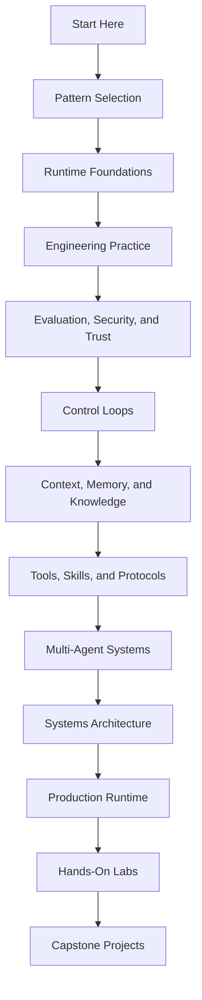

# Logical Groups

This book is grouped by the order in which engineering decisions usually appear. Start with the problem and pattern choice, then add runtime primitives, engineering practice, risk controls, architecture, production operations, labs, and complete examples.

Use this page when the sidebar feels large. Each group answers a different question and gives the reader a clear place to start.

## Group Map

| Group | Main Question | Reader Payoff |
| --- | --- | --- |
| [Start Here](/intro) | What is this book, and what counts as an agent? | You get the vocabulary, reader paths, glossary, and production bar. |
| [Pattern Selection and Composition](/pattern-selection/architecture-before-autonomy) | Which pattern should this system use? | You avoid adding autonomy where a prompt, chain, router, or workflow is enough. |
| [Agent Runtime Foundations](/foundations/what-is-an-agent) | What primitives make an agent run? | You understand loops, state, tools, structured output, context, and control boundaries. |
| [Engineering Practice and Frameworks](/agent-engineering-practice/agent-development-lifecycle) | How do we build this like software, not a demo? | You get lifecycle, harness, framework, setup, and worksheet guidance. |
| [Evaluation, Security, and Trust](/agent-engineering-practice/evaluation-driven-agent-development) | How do we know this is safe and useful? | You connect evals, threat models, sandboxing, and user trust to release decisions. |
| [Control Loops](/control-loops/planning-and-execution) | When should the system plan, reflect, optimize, or heal? | You choose iterative control without hiding failure or cost. |
| [Context, Memory, and Knowledge](/foundations/context-budgets-and-working-sets) | What should the agent know, remember, or retrieve? | You design context packets, memory, RAG, and knowledge boundaries deliberately. |
| [Tools, Skills, and Protocols](/tools-skills-protocols/skills) | What can the agent do outside the model? | You define tool contracts, skills, approvals, MCP, A2A, and communication safety. |
| [Multi-Agent Systems](/multi-agent-systems/choosing-multi-agent-topology) | When is one agent no longer enough? | You compare delegation, supervision, debate, parallelism, and crew-style workflows. |
| [Systems Architecture](/systems-architecture/agentic-system-architecture) | How do these patterns become a full system? | You see services, RAG systems, coding agents, personal agents, domain architectures, ADRs, and references. |
| [Production Runtime](/production-runtime/overview) | How does the system survive real operation? | You add durability, observability, feedback loops, budgets, policy, events, rollout, and rollback. |
| [Hands-On Labs](/hands-on-labs/) | How do these ideas look in code? | You build small vertical slices across Python, TypeScript, custom runtimes, and common agent frameworks. |
| [Capstone Projects](/capstone-projects/) | What does a complete agentic system look like? | You study product-shaped systems with traces, evals, ADRs, runbooks, and rollback plans. |
| [Historical Patterns](/deprecated/historical-patterns) | Which older terms still matter? | You can compare current architecture language with older pattern names. |
| [Publishing Appendix](/publishing/publishing-and-releases) | How is the book maintained and released? | You get release, checklist, and publishing notes for the online book. |

## Design Pipeline

Read left to right when you want the book to build one design argument. Jump to the group with the missing evidence when you are reviewing a real system.

## Problem Map

Use this map when you know the problem but not the right group. Start with the section listed, then follow its related chapters.

| If Your Problem Is... | Start With | Leave With |
| --- | --- | --- |
| The team wants to add an agent but has not justified autonomy. | [Pattern Selection and Composition](/pattern-selection/architecture-before-autonomy) | A smaller design or a clear reason for agentic behavior. |
| The implementation hides state in prompts or chat history. | [Agent Runtime Foundations](/foundations/what-is-an-agent) | Explicit goals, state, tools, structured output, and stop conditions. |
| A demo works, but nobody knows how to test or operate it. | [Engineering Practice and Frameworks](/agent-engineering-practice/agent-development-lifecycle) | A lifecycle, harness, framework boundary, and worksheet trail. |
| The system can affect users, data, money, or external systems. | [Evaluation, Security, and Trust](/agent-engineering-practice/evaluation-driven-agent-development) | Evals, threat model, sandbox, approval, and trust controls. |
| The agent keeps looping, retrying, or self-correcting without clear evidence. | [Control Loops](/control-loops/planning-and-execution) | A loop design with stop conditions, budgets, and reviewable failure states. |
| Answers depend on documents, memory, or context assembly. | [Context, Memory, and Knowledge](/foundations/context-budgets-and-working-sets) | Source policy, context packet, retrieval, memory, and freshness rules. |
| The agent needs tools, approvals, MCP, A2A, or secure messages. | [Tools, Skills, and Protocols](/tools-skills-protocols/skills) | Narrow tool contracts, protocol envelopes, permissions, and audit records. |
| One agent is overloaded or needs specialist collaborators. | [Multi-Agent Systems](/multi-agent-systems/choosing-multi-agent-topology) | A topology, role boundary, transcript, merge policy, and stop rule. |
| Several patterns must become one deployable product. | [Systems Architecture](/systems-architecture/agentic-system-architecture) | A system boundary, ADRs, service shape, and reference architecture. |
| The design is near production. | [Production Runtime](/production-runtime/overview) | Durability, observability, policy, budgets, rollout, and rollback evidence. |
| You want proof in code before committing to a design. | [Hands-On Labs](/hands-on-labs/) | A small runnable slice and a list of missing production controls. |
| You want to compare against complete examples. | [Capstone Projects](/capstone-projects/) | A gap list for traces, evals, ADRs, runbooks, and release controls. |

## Recommended Order

Read these groups in order when you want the book to build one argument:

1. Start Here
2. Pattern Selection and Composition
3. Agent Runtime Foundations
4. Engineering Practice and Frameworks
5. Evaluation, Security, and Trust
6. Control Loops
7. Context, Memory, and Knowledge
8. Tools, Skills, and Protocols
9. Multi-Agent Systems
10. Systems Architecture
11. Production Runtime
12. Hands-On Labs
13. Capstone Projects

This order keeps the reader inside one design argument: choose the pattern, define the runtime, add loop control only where needed, give the agent evidence and capabilities, decide whether one agent is enough, then turn the design into an operated system.

## Visual Architecture Route

Use this route when you want the diagrams to carry the first pass. It is useful for design reviews, team onboarding, and PDF reading.

| Step | Chapter | What The Diagram Should Clarify |
| --- | --- | --- |
| 1 | [Agent Loop](/foundations/agent-loop) | How state, actions, observations, and stop conditions form a run. |
| 2 | [Planning and Execution](/control-loops/planning-and-execution) | Who owns the plan, validation, execution, and progress. |
| 3 | [Memory-Augmented Agent](/memory-knowledge/memory-augmented-agent) | How retrieval, context injection, storage, and correction stay governed. |
| 4 | [Tool Capability Design](/tools-skills-protocols/tool-capability-design) | Where permissions, policy, tool calls, and audit records sit. |
| 5 | [Secure Agent Communication](/tools-skills-protocols/secure-agent-communication) | Which authority gates protect agent-to-agent or remote-tool exchange. |
| 6 | [Choosing Multi-Agent Topology](/multi-agent-systems/choosing-multi-agent-topology) | When to delegate, supervise, debate, parallelize, or stay single-agent. |
| 7 | [Agentic System Architecture](/systems-architecture/agentic-system-architecture) | How the patterns compose into services, state, policy, evals, and operations. |
| 8 | [Production Runtime Overview](/production-runtime/overview) | What must exist around the agent before production use. |
| 9 | [Event-Triggered Agents](/production-runtime/event-triggered-agents) | How unattended triggers stay idempotent, observable, replayable, and safe. |

After this route, use the pattern chapters as a reference. Each diagram should answer a concrete ownership question, not just decorate the page.

## Group Contracts

Each group should give the reader one durable artifact or decision. Use this table to know when to continue, pause, or jump.

| Group | Enter When | Exit With |
| --- | --- | --- |
| Start Here | You need orientation, vocabulary, or the production bar. | A reading path and a shared definition of agentic system. |
| Pattern Selection and Composition | You are deciding whether autonomy belongs in the design. | A selected pattern, rejected alternatives, and acceptance criteria. |
| Agent Runtime Foundations | You need to make the run explicit. | Goal, state, tool, output, context, and stop-condition contracts. |
| Engineering Practice and Frameworks | You are turning a design into software. | Harness, framework choice, worksheet, and review trail. |
| Evaluation, Security, and Trust | The system affects real users, data, money, or decisions. | Eval set, threat model, sandbox boundary, and trust controls. |
| Control Loops | The system must plan, revise, evaluate, or recover. | Loop policy, budget, evaluator, failure states, and stop rules. |
| Context, Memory, and Knowledge | The answer depends on evidence, history, or retrieval. | Context packet, source policy, memory rule, and freshness boundary. |
| Tools, Skills, and Protocols | The agent needs external capabilities or agent-to-agent exchange. | Tool contracts, permission envelope, approval gate, and audit record. |
| Multi-Agent Systems | One agent is overloaded or multiple roles improve the work. | Topology, role contracts, merge policy, transcript, and escalation path. |
| Systems Architecture | Patterns must become a deployable product. | Service boundary, ADRs, data/control flow, and reference architecture. |
| Production Runtime | The system is close to release or already operating. | Durability, traces, eval feedback, budgets, rollout, and rollback plan. |
| Hands-On Labs | You need proof in code. | Runnable slice, test evidence, and missing-production-control list. |
| Capstone Projects | You want an end-to-end comparison point. | Gap analysis against a product-shaped system. |

## Handoff Rules

Move forward only when the current group has produced evidence. A pattern choice without acceptance criteria is not ready for implementation. A runtime design without state and stop conditions is not ready for tools. A tool surface without approval and audit boundaries is not ready for production. A lab without a missing-controls list is not proof of readiness.

Jump backward when evidence is missing:

| Missing Evidence | Return To |
| --- | --- |
| The team cannot explain why the system needs autonomy. | Pattern Selection and Composition |
| State, tools, memory, or policy live only inside prompts. | Agent Runtime Foundations |
| There is no eval set or threat model. | Evaluation, Security, and Trust |
| The system has no trace, replay, budget, or rollback path. | Production Runtime |
| The architecture has no written decision record. | Systems Architecture |

These handoffs keep the book from becoming a tour of concepts. Every section should either produce a decision, expose a gap, or send the reader to the section that can close it.

## Value Test

Each group should help a reader make a better engineering decision:

- choose a smaller design when autonomy is unnecessary
- make state, tools, memory, and context visible
- add evals before relying on behavior
- separate model judgment from deterministic control
- make risk reviewable by another engineer
- connect examples to production responsibilities

If a group does not help with one of those outcomes, it should be revised, merged, or removed.

## Takeaway

The book is not organized by trend names. It is organized by decisions: choose the pattern, define the runtime, control risk, compose the system, operate it, and prove it with examples.
