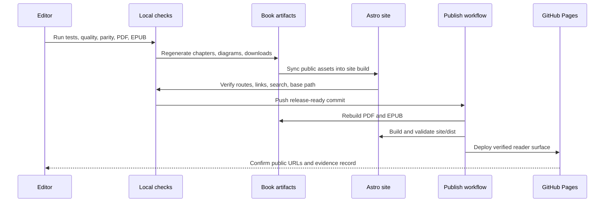

# Publishing and Releases

The book is published for reading on the Astro GitHub Pages site. PDF and EPUB files are courtesy companion formats for offline reading; the online reader is the primary product.

## Public URLs

- Book site: <https://gturitto.github.io/Agentic-Systems-Patterns/>
- Courtesy PDF: <https://gturitto.github.io/Agentic-Systems-Patterns/releases/Agentic-Systems-Patterns.pdf>
- Courtesy EPUB: <https://gturitto.github.io/Agentic-Systems-Patterns/releases/Agentic-Systems-Patterns.epub>
- Repository: <https://github.com/GTuritto/Agentic-Systems-Patterns>
- Discussions: <https://github.com/GTuritto/Agentic-Systems-Patterns/discussions>

## Release Artifacts

The checked-in courtesy formats live at:

```text
book/releases/Agentic-Systems-Patterns.pdf
book/releases/Agentic-Systems-Patterns.epub
```

The GitHub Pages deployment publishes the same files at:

```text
/releases/Agentic-Systems-Patterns.pdf
/releases/Agentic-Systems-Patterns.epub
```

Each `Publish Book` workflow run also uploads the courtesy formats as a workflow artifact. Use that artifact when you need to inspect the exact PDF or EPUB produced by a specific CI run.

Before tagging or announcing a release, use the [Release Readiness Checklist](./release-readiness-checklist.md). Use [Release Notes](./release-notes.md) as the reader-facing summary of what changed and what evidence supports the release. Use [GitHub Discussions](https://github.com/GTuritto/Agentic-Systems-Patterns/discussions) as the canonical public feedback channel for reader questions, chapter feedback, and release follow-up.

Download the reusable publishing artifact: [release evidence record](/capstone-assets/templates/release-evidence-record.txt).

## Local Publishing Commands

From the repository root:

```sh
npm test
npm run release:commands
npm run typecheck
npm run capstones:evidence
npm run native-examples:validate
npm run native-examples:smoke:langgraph
npm run book:manifest:test
npm run book:visuals:verify
npm run book:quality
npm run book:build
npm run site:build
npm run site:parity
npm run book:pdf
npm run book:epub
```

These commands cover runnable examples, release command parity, TypeScript contracts, capstone evidence alignment, native framework slices, generated chapters, editorial consistency, visual coverage, diagram assets, site routes, internal links, and the courtesy PDF/EPUB downloads.

Use `npm run site:dev` for the primary local reader preview.

Use `npm run book:start` only for the VitePress authoring preview.

The main outputs are:

```text
site/dist
book/releases/Agentic-Systems-Patterns.pdf
book/releases/Agentic-Systems-Patterns.epub
```

`site/dist` is deployed to GitHub Pages. The Astro build uses the base path `/Agentic-Systems-Patterns/`.

The lower-level book pipeline commands are:

```sh
npm run book:content
npm run book:content:verify
npm run book:diagrams
npm run book:diagrams:verify
```

Run lower-level commands only when you are editing generated chapters, source bundles, editorial metadata, or diagram exports directly. A release should still pass the full command set above.

Use this flow as the publishing model. The online book is the release surface; PDF and EPUB are generated companions that must match the same verified content.



## GitHub Pages Release Gate

Use this gate before announcing the online book:

| Check | Evidence |
| --- | --- |
| Site base path is correct | Built links resolve under `/Agentic-Systems-Patterns/`. |
| Reader routes exist | `site:parity` reports all manifest chapters and section pages. |
| Download assets exist | Courtesy PDF, courtesy EPUB, source bundles, trace examples, eval reports, and worksheets are present under `site/dist`. |
| Book quality gates pass | `book:quality` verifies manifest coverage, generated content, editorial consistency, diagram assets, and Mermaid SVG coverage. |
| Capstone evidence agrees | `capstones:evidence` verifies capstone chapters, runtime output, trace assets, eval reports, and scorecard links. |
| Search is generated | Pagefind indexes the built site without build errors. |
| Courtesy formats match the site | `book:pdf` and `book:epub` run after content changes and the deploy copies are refreshed. |
| Release notes are current | Review date, scope, known boundaries, and verification evidence match the release. |

Do not treat GitHub Pages as a static file dump. Treat it as the product surface: routes, downloads, search, PDF, navigation, and release notes must agree.

## Reader Surface Checklist

Before sharing the public URL, inspect the site as a reader would:

| Surface | What To Check | Why It Matters |
| --- | --- | --- |
| Homepage | Primary action opens the book and secondary actions resolve. | New readers need a clear start. |
| Sidebar | Sections match the logical groups and current manifest. | Readers need orientation across 100+ chapters. |
| Search | A query such as `approval`, `RAG`, or `eval` returns useful pages. | GitHub Pages readers use the book as a reference. |
| Courtesy formats | The PDF and EPUB download and reflect the current site content. | Offline readers should not receive stale guidance. |
| Templates | Worksheets and checklists download from public paths. | The book's value depends on reusable artifacts. |
| Source bundles | Pattern and lab downloads resolve. | Engineers need working code beside the prose. |
| Release notes | Current version, scope, evidence, and limits are explicit. | Public claims need proof and boundaries. |

If a surface fails, fix the site or document the limitation before announcing the release.

## Deployment

Deployment is handled by:

```text
.github/workflows/publish-book.yml
```

The workflow runs on every push to `main` and can also be triggered manually with `workflow_dispatch`. It checks release command parity, capstone evidence, the book manifest, editorial content, visual coverage, diagram assets, and Mermaid SVG coverage, builds the courtesy PDF and EPUB, validates the VitePress authoring build, builds the Astro site, runs Astro parity/link checks, and deploys `site/dist`.

## Release Evidence Record

For each public release, keep a short evidence record:

```text
version:
date:
commit:
site url:
pdf url:
epub url:
commands passed:
visual pages checked:
known limitations:
rollback action:
```

This record is useful when a reader reports a broken page, stale PDF, missing download, or mismatch between the site and repository.

Use the downloadable [release evidence record](/capstone-assets/templates/release-evidence-record.txt) when the release changes content, assets, routes, courtesy format generation, search, or publishing workflow behavior. For the current release, start from the filled [pre-launch release evidence for 2026-06-21](/capstone-assets/templates/prelaunch-release-evidence-2026-06-21.txt) and add the public URL checks after deployment.

## License

Source code and runnable examples are licensed under the MIT License. Book/reference content, diagrams, worksheets, and generated publishing artifacts are licensed under [Creative Commons Attribution-NonCommercial-ShareAlike 4.0 International](https://creativecommons.org/licenses/by-nc-sa/4.0/) (`CC-BY-NC-SA-4.0`).

When reusing or adapting the content, preserve attribution, use it only for non-commercial purposes unless separate permission is granted, and distribute adaptations under the same license.
