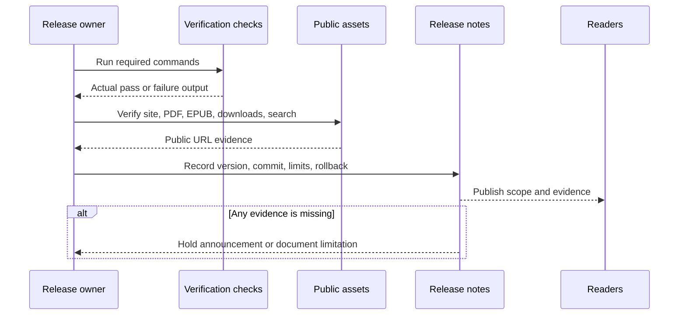

# Release Notes

These notes summarize the current release shape of *Agentic Systems Patterns*. Use them with the [Release Readiness Checklist](./release-readiness-checklist.md) before publishing.

Use the [release evidence record](/capstone-assets/templates/release-evidence-record.txt) to capture actual command output, public URL checks, asset checks, known limits, and rollback action for a release. The current filled local record is the [pre-launch release evidence for 2026-06-21](/capstone-assets/templates/prelaunch-release-evidence-2026-06-21.txt).

## Current Release

Version: `1.0.0`

Review date: 2026-06-21

Release theme: turn the repository from a pattern catalog into a complete guide for designing, implementing, evaluating, and operating agentic systems across frameworks.

## Reader Value Added

- Clear reader paths for first-time readers, builders, lab users, capstone users, and reference users.
- Pattern chapters with consistent intent, use/avoid guidance, architecture, system shape, protocol, failure modes, eval strategy, production checklist, source links, and downloads.
- Framework-agnostic labs across Python and TypeScript.
- Coverage of LangChain/LangGraph-style retrieval, LangGraph-style state graphs, Mastra-style runtime packaging, AutoGen-style transcript evaluation, CrewAI-style flows, A2A, MCP, and deterministic custom runtimes.
- A from-scratch mini-framework track that explains what agent frameworks package under the hood.
- Product-shaped capstones for refund support, research RAG, and multi-agent delivery workflows.
- A running support refund case study that starts in the Introduction and early foundation chapters before returning in labs and capstones.
- More concrete pattern teaching examples for single-agent drafting, prompt-chain refund gates, and evaluator-optimizer scoring.
- Optional per-exercise time budgets across Labs 01-13 so readers can split lab work into shorter reviewable blocks.
- Deeper advanced examples for framework setup failures, refund approval incident-to-eval conversion, and domain-specific authority boundaries.
- Filled production-readiness examples for support refund, research RAG, and multi-agent delivery workflows.
- Native framework slices for selected LangGraph, Mastra, CrewAI, and AutoGen examples.
- Release-ready publishing flow for the GitHub Pages reader, courtesy PDF/EPUB, generated source bundles, diagrams, Pagefind search metadata and filters, parity checks, and native example validation.

## Verification Evidence

Before publishing, the release should pass:

```sh
npm test
npm run release:commands
npm run typecheck
npm run capstones:evidence
npm run native-examples:validate
npm run native-examples:smoke:langgraph
npm run book:manifest:test
npm run book:visuals:verify
npm run book:build
npm run site:build
npm run site:parity
npm run book:pdf
npm run book:epub
```

The release is not ready if any command fails, if visual coverage regresses, if capstone evidence drifts from runtime output, or if the generated courtesy PDF and EPUB are not refreshed after content changes.

Record the actual command results with the release. Expected evidence is not enough for a public tag or announcement.

Use this flow when turning these notes into a public release. A release note is valid only when it points to current evidence, public assets, and a rollback action.



## Evidence Record Template

For each public release, record:

| Field | Value |
| --- | --- |
| Version | |
| Date | |
| Commit | |
| Release owner | |
| Commands passed | |
| Public URLs checked | |
| Discussions checked | |
| Download assets checked | |
| Capstone evidence checked | |
| Search checked | |
| Search filters checked | |
| Courtesy PDF checked | |
| Courtesy EPUB checked | |
| Known limitations | |
| Rollback action | |

Keep this record in the release PR, GitHub release, or appended release notes. Do not replace actual evidence with a planned checklist.

## Reader-Facing Asset Checks

Before publishing, verify these built-site paths:

| Asset | Path |
| --- | --- |
| Online book | `/Agentic-Systems-Patterns/` |
| Discussions | `https://github.com/GTuritto/Agentic-Systems-Patterns/discussions` |
| Courtesy PDF | `/Agentic-Systems-Patterns/releases/Agentic-Systems-Patterns.pdf` |
| Courtesy EPUB | `/Agentic-Systems-Patterns/releases/Agentic-Systems-Patterns.epub` |
| Templates | `/Agentic-Systems-Patterns/capstone-assets/templates/` |
| Captured output examples | [lab-and-capstone-command-output.txt](/capstone-assets/output-examples/lab-and-capstone-command-output.txt) |
| Completed production readiness examples | [completed-production-readiness-examples.txt](/capstone-assets/templates/completed-production-readiness-examples.txt) |
| Downloads | `/Agentic-Systems-Patterns/downloads/` |
| Search index and filters | `/Agentic-Systems-Patterns/pagefind/` with section, type, level, and reader-path metadata. |

The release should not be announced until the GitHub Pages site, GitHub Discussions feedback channel, courtesy PDF, courtesy EPUB, downloads, templates, captured output examples, and Pagefind search index are all generated from the same content or verified against the same release.

## Known Scope Boundaries

- Examples are educational and deterministic by default; live model-provider integrations require local configuration.
- Native framework slices are comparison points for important boundaries, not exhaustive tutorials for every framework feature.
- The book favors architecture, production evidence, and design review discipline over API-by-API framework coverage.
- Historical pattern names remain in the deprecated section so older terminology can be mapped to the current taxonomy.

## Publishing Artifacts

- Site output: `site/dist`
- PDF source artifact: `book/releases/Agentic-Systems-Patterns.pdf`
- PDF deploy copy: `book/docs/public/releases/Agentic-Systems-Patterns.pdf`
- EPUB source artifact: `book/releases/Agentic-Systems-Patterns.epub`
- EPUB deploy copy: `book/docs/public/releases/Agentic-Systems-Patterns.epub`
- Generated downloads: `book/docs/public/downloads/`

## Release Summary

This release is ready when the reader can answer five questions after finishing the guide:

1. Which agentic pattern should I use, and why?
2. What owns state, policy, tools, memory, approvals, traces, and evals?
3. How do I run a small example and identify what is missing for production?
4. How does the same architecture map across frameworks and languages?
5. What evidence proves the system is safe enough to release?

## Post-Release Checks

After deployment, open the public GitHub Pages URL and verify:

- the homepage loads;
- chapter navigation works;
- search opens, returns metadata-rich results, and level/type filters work;
- the courtesy PDF downloads;
- the courtesy EPUB downloads;
- at least one worksheet, trace, eval report, captured output example, and source bundle downloads.

If any public asset fails, update the release notes with the limitation or roll back the announcement.
