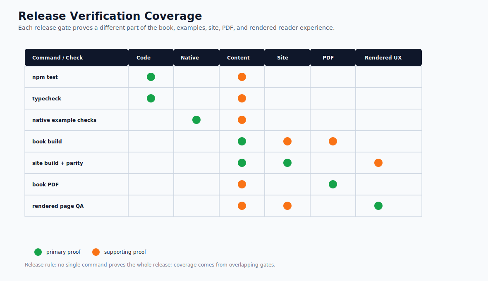

# Release Readiness Checklist

Use this checklist before publishing a new version of the book. The standard is not "the site builds." The standard is that a reader can move from concept, to pattern choice, to lab, to capstone, to release evidence without finding missing context.

Download the reusable publishing artifact: [release evidence record](/capstone-assets/templates/release-evidence-record.txt).

## Verification Coverage

Use this graph to see why release readiness needs overlapping checks. Code tests, native example checks, content builds, site parity, courtesy format generation, and rendered-page QA each prove a different part of the release.



## Reader Journey

| Gate | Release Evidence |
| --- | --- |
| Start path is coherent | [How To Read This Book](./how-to-read.md) gives first-time, builder, lab, capstone, and reference paths. |
| Pattern selection is usable | Selection chapters explain when to use a pattern, when to avoid it, and how patterns compose. |
| Labs prove architecture, not only APIs | Labs identify language, framework, source files, baseline command, production gap, and expected output. |
| Mini-framework track explains the primitives | The from-scratch track shows loop, decision, tool registry, policy, memory, trace, and eval responsibilities. |
| Capstones feel product-shaped | Capstones include state, policy, memory, approvals, traces, evals, ADRs, runbooks, rollback, and framework mappings. |

## Content Quality

| Gate | Release Evidence |
| --- | --- |
| No unfinished markers | Search for common draft markers outside generated assets. |
| Diagrams have context | Architecture diagrams are introduced by the ownership boundary or decision they explain. |
| Tables are not orphaned | Tables have enough context before and after them to explain how the reader should use the rows. |
| Examples name their limits | Demo code states what production still needs: state, policy, tracing, evals, approval, deployment, or framework integration. |
| Terminology is stable | State, policy, memory, tools, traces, evals, workflows, and approvals mean the same thing across chapters. |

## Chapter A++ Spot Check

Before publishing, select at least one chapter from each changed section and check it against the book's editorial bar. A chapter is release-ready when it gives the reader a decision, boundary, test, or reusable artifact, not just more information.

| Check | Release Evidence |
| --- | --- |
| Reader promise is clear | The first screen says what problem the chapter solves and why it matters. |
| Use and avoid cases are explicit | The chapter helps a reader choose the pattern or reject it. |
| Ownership is visible | State, tools, policy, memory, approvals, evals, and stop conditions have owners. |
| Failure modes are concrete | The chapter names realistic ways the design can fail and how to detect them. |
| Production gap is named | The chapter explains what changes before real users, data, money, or side effects. |
| Evaluation is actionable | The reader can turn the guidance into a test, eval case, fixture, or release gate. |
| Reuse artifact exists | The chapter leaves a checklist, schema, trace shape, worksheet, ADR, or implementation pattern. |
| Online UX works | Headings, tables, diagrams, code blocks, links, and downloads are readable in the built site. |

If a changed chapter fails more than two checks, do not treat it as an A++ change. Revise the chapter or record the limitation in the release notes.

## Verification Commands

Run these from the repository root:

```sh
npm test
npm run release:commands
npm run typecheck
npm run capstones:evidence
npm run native-examples:validate
npm run native-examples:smoke:langgraph
npm run book:manifest:test
npm run book:visuals:verify
npm run book:quality
npm run book:build
npm run site:build
npm run site:parity
npm run book:pdf
npm run book:epub
```

Expected evidence:

| Command | What It Proves |
| --- | --- |
| `npm test` | Deterministic pattern examples, labs, capstones, evidence gates, and protocol examples still run. |
| `npm run release:commands` | Package scripts, release docs, and the publish workflow list the same release gates. |
| `npm run typecheck` | TypeScript examples and shared contracts still compile. |
| `npm run capstones:evidence` | Capstone chapters, runtime stop reasons, trace assets, eval reports, and scorecard links agree. |
| `npm run native-examples:validate` | Native framework example files are syntactically valid and required assets exist. |
| `npm run native-examples:smoke:langgraph` | LangGraph native slices install optional dependencies and execute without provider keys. |
| `npm run book:manifest:test` | Sidebar, PDF manifest, chapter ownership, and generated chapter registration are valid. |
| `npm run book:visuals:verify` | Every manifest chapter and the homepage have a Mermaid diagram, image, or SVG reference. |
| `npm run book:quality` | Manifest coverage, generated chapters, title/H1 consistency, unfinished markers, diagram assets, diagram alt text, and Mermaid SVG coverage are valid. |
| `npm run book:build` | VitePress authoring build, generated pages, diagrams, and downloads are valid after quality gates pass. |
| `npm run site:build` | Astro reader site builds with synced public assets and search index. |
| `npm run site:parity` | Published routes and internal links match the book manifest. |
| `npm run book:pdf` | The courtesy PDF and deploy copy can be regenerated. |
| `npm run book:epub` | The courtesy EPUB and deploy copy can be regenerated. |

## Visual QA

Inspect these pages in the built site before release:

1. `/book/intro/`
2. `/book/publishing/how-to-read/`
3. `/book/pattern-selection/choosing-the-right-pattern/`
4. `/book/agent-engineering-practice/cross-framework-decision-matrix/`
5. `/book/hands-on-labs/`
6. `/book/hands-on-labs/from-scratch-mini-framework/`
7. `/book/capstone-projects/`
8. `/book/systems-architecture/reference-architecture/`
9. `/book/publishing/release-notes/`

Check that diagrams render, headings fit, code blocks are readable, tables do not feel unexplained, and navigation keeps the reader oriented.

## Public URL QA

After deployment to GitHub Pages, inspect the public site with the production base path:

| Public URL | Check |
| --- | --- |
| `/Agentic-Systems-Patterns/` | Homepage renders and primary actions work. |
| `/Agentic-Systems-Patterns/book/intro/` | Introduction loads from the deployed site. |
| `/Agentic-Systems-Patterns/book/publishing/how-to-read/` | Reader paths are reachable. |
| `/Agentic-Systems-Patterns/book/pattern-selection/choosing-the-right-pattern/` | Core pattern selection page loads. |
| `/Agentic-Systems-Patterns/book/hands-on-labs/` | Lab index loads and lab links resolve. |
| `/Agentic-Systems-Patterns/book/capstone-projects/` | Capstone index loads and artifact links resolve. |
| `/Agentic-Systems-Patterns/releases/Agentic-Systems-Patterns.pdf` | Courtesy PDF downloads. |
| `/Agentic-Systems-Patterns/releases/Agentic-Systems-Patterns.epub` | Courtesy EPUB downloads. |
| `/Agentic-Systems-Patterns/pagefind/` | Search assets exist, search returns results, and level/type filters work. |

Local build checks prove the deployable artifact. Public URL QA proves the deployed reader surface.

## Download And Asset QA

Check the reader-facing assets that make the online book useful:

| Asset | Release Evidence |
| --- | --- |
| Courtesy PDF | `/releases/Agentic-Systems-Patterns.pdf` exists and reflects the current content. |
| Courtesy EPUB | `/releases/Agentic-Systems-Patterns.epub` exists and reflects the current content. |
| Source bundles | Pattern, lab, native framework, and capstone downloads resolve from the built site. |
| Templates | Worksheets, scorecards, and review checklists resolve under `/capstone-assets/templates/`. |
| Completed examples | Completed ADR, lab evidence, and production-readiness examples resolve under `/capstone-assets/templates/`. |
| Trace examples | Capstone trace JSON files resolve and match the chapter references. |
| Eval reports | Capstone eval report files resolve and match the chapter references. |
| Capstone evidence gate | `npm run capstones:evidence` passes against chapter text, runtime output, trace assets, eval reports, and scorecard links. |
| Diagrams | SVG diagrams render on chapter pages and are not orphaned. |
| Search metadata | Pagefind reports chapter filters and rendered search results show section, type, and level metadata. |

This check matters because the book is an online product. A chapter can read well and still fail readers if its downloads or evidence artifacts are missing.

## Release Evidence Record

Before publishing, record:

```text
version:
date:
commit:
commands passed:
visual pages checked:
download assets checked:
known limitations:
release owner:
rollback action:
```

Put the record in the release notes, GitHub release, or release PR description.

Use the downloadable [release evidence record](/capstone-assets/templates/release-evidence-record.txt) when the release changes reader-facing content or publishing behavior. The current release already has a filled [pre-launch release evidence record](/capstone-assets/templates/prelaunch-release-evidence-2026-06-21.txt); complete its public GitHub Pages section after deployment.

## Release Decision

Do not publish if any of these are true:

- A required command fails.
- A core reader path contains a broken link or missing image.
- A lab points to source code that no longer exists.
- A capstone claims native framework coverage that has no matching example or clear scope.
- The courtesy PDF or EPUB is stale relative to the site content.
- Release notes do not say what changed and how it was verified.

Publish only when the release evidence is stronger than the claim made to readers.
