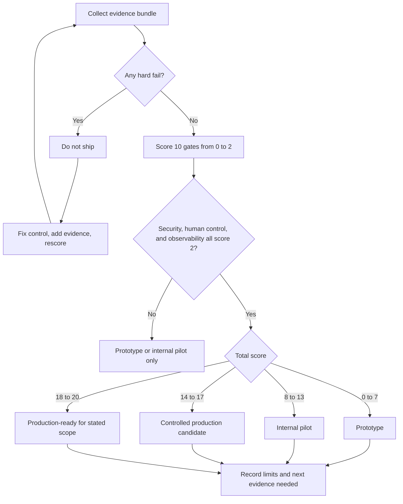

# 10/10 Production Gate

This book is not finished when you can describe agent patterns. It is finished when you can design a system that a team can review, test, ship, observe, and roll back.

Use this gate before calling an agentic system production-ready. A score below 8 means the design is still a demo or prototype. A score of 10 means the team has evidence, not just confidence.

Download the reusable worksheet: [10/10 production gate scorecard](/capstone-assets/templates/ten-out-of-ten-production-gate-scorecard.txt).

## When To Use This Gate

Use this gate at three points:

| Moment | Purpose | Expected Outcome |
| --- | --- | --- |
| Before implementation | Find missing ownership before code makes the design expensive to change. | Architecture changes, not launch approval. |
| Before pilot | Decide whether limited users, data, or side effects are acceptable. | Internal pilot, controlled pilot, or blocked. |
| Before production | Verify evidence for every high-risk path. | Ship, ship with documented limits, or do not ship. |

Do not wait until launch week. The gate is most useful when it changes the design early.

## What A 10/10 System Proves

| Area | A 10/10 System Shows | Evidence |
| --- | --- | --- |
| Goal | The system has a narrow goal, explicit non-goals, and clear success criteria. | Problem statement, user story, acceptance tests. |
| Boundary | The design separates model judgment from deterministic control. | Architecture diagram, service contracts, policy boundary. |
| State | The system names what owns run state, durable memory, user data, and external effects. | State schema, retention rules, replay plan. |
| Tools | Every tool has a typed contract, authorization rule, timeout, and audit record. | Tool manifest, test fixtures, audit log example. |
| Context | Context is assembled deliberately and carries source, trust, freshness, and budget information. | Context packet example, retrieval trace, context budget. |
| Evaluation | The team can run evals for happy paths, edge cases, regressions, and known failures. | Eval dataset, grader rubric, CI gate output. |
| Security | The threat model covers tools, memory, prompts, retrieved content, credentials, and users. | Threat model, mitigations, sandbox tests. |
| Human control | Users can inspect, approve, correct, stop, or escalate risky behavior. | Approval UI, correction flow, audit trail. |
| Runtime | The system handles retries, timeouts, idempotency, degradation, and rollback. | Runbook, retry policy, rollback plan. |
| Observability | Operators can inspect traces, costs, latency, tool calls, eval drift, and incidents. | Dashboard, trace sample, alert thresholds. |

## Scorecard

Score each row from 0 to 2.

| Score | Meaning |
| ---: | --- |
| 0 | Missing or only described in prose. |
| 1 | Partly implemented but not tested or not reviewable. |
| 2 | Implemented, tested, documented, and tied to an owner. |

| Gate | Score |
| --- | ---: |
| Goal and non-goals are explicit. | 0-2 |
| Architecture boundary is reviewable. | 0-2 |
| State ownership is documented. | 0-2 |
| Tool contracts and permissions are tested. | 0-2 |
| Context packet is inspectable. | 0-2 |
| Eval gate blocks unsafe releases. | 0-2 |
| Threat model has mitigations. | 0-2 |
| Human control exists for risky actions. | 0-2 |
| Runtime can retry, resume, degrade, and roll back. | 0-2 |
| Observability explains incidents. | 0-2 |

Total score:

- 0-7: prototype
- 8-13: internal pilot
- 14-17: controlled production candidate
- 18-20: production-ready

Do not average away a missing safety control. A system that touches money, credentials, private data, infrastructure, or customer-visible actions must score 2 on security, human control, and observability.

## Release Decision Flow

Use this flow after scoring. It keeps hard fails from being hidden by a strong total score.

## Scoring Rules

Score evidence, not intent:

| Claim | Score 0 | Score 1 | Score 2 |
| --- | --- | --- | --- |
| "We have evals." | No eval fixtures exist. | Evals exist but do not block release or cover failures. | Evals cover expected and unsafe paths, run in CI, and block release. |
| "We have observability." | Logs exist but cannot reconstruct a run. | Traces exist for happy paths only. | Operators can inspect successful, failed, refused, escalated, and timed-out runs. |
| "We have approval." | Humans are notified after action. | Approval exists but authorizes vague behavior. | Approval binds one exact action, policy version, expiry, approver, and trace ID. |
| "We can roll back." | Rollback means redeploying or deleting the feature. | One rollback path exists but is untested. | Model, prompt, policy, tool, workflow, or agent behavior can be disabled independently. |

If the evidence is not inspectable by another engineer, do not score it as 2.

## Release Modes

Use the score to choose a release mode:

| Mode | Allowed Scope | Required Evidence |
| --- | --- | --- |
| Prototype | Local demos, fake data, no real side effects. | Clear label that it is not production. |
| Internal pilot | Internal users, limited data, read-only or tightly bounded actions. | Owner, logs, basic evals, rollback, and known limits. |
| Controlled production candidate | Real users or data with limited rollout and active monitoring. | Full scorecard, approval for risky actions, traces, eval gate, runbook. |
| Production-ready | Normal operation for the intended scope. | 18-20 score, no hard fails, tested rollback, incident-to-eval loop. |

The release mode should appear in the ADR, release notes, or launch plan. A system can be production-ready for one narrow task and still be a prototype for adjacent tasks.

## Hard Fails

Any hard fail blocks production, regardless of total score.

| Hard Fail | Why It Blocks |
| --- | --- |
| The agent can call high-risk tools without policy or approval. | The model can turn ambiguity into irreversible action. |
| Credentials are inherited broadly from the host process. | One prompt or tool bug can become a privilege escalation. |
| The team cannot replay a failed run. | Incidents cannot become regression tests. |
| Evals measure only final answer quality. | Tool misuse, hidden state, and unsafe trajectories remain invisible. |
| Context sources have no provenance or freshness rule. | The system can confidently act on stale or untrusted information. |
| There is no rollback plan for prompt, policy, model, or tool changes. | Safe release requires safe reversal. |

## Evidence Bundle

A serious design review should attach these artifacts:

1. Architecture diagram with model, tools, state, policy, memory, and user boundary.
2. ADR explaining the chosen pattern and rejected alternatives.
3. Tool manifest with permissions, risk class, timeouts, and audit fields.
4. Context packet example for one real task.
5. Trace from a successful run and a failed run.
6. Eval dataset with at least happy path, edge case, adversarial, and regression cases.
7. Threat model with mitigations and test evidence.
8. Approval or escalation flow for risky actions.
9. Runbook with alerts, incident triage, rollback, and owner.
10. Cost, latency, and budget thresholds.

## Minimum Production Review Questions

Ask these questions before launch:

1. What exact action can the system take without a human?
2. What state changes if the model is wrong?
3. Which tool call would be most expensive, risky, or irreversible?
4. What evidence would prove the answer or action is grounded?
5. What happens when retrieval returns stale or hostile content?
6. What happens when a tool times out after the external side effect succeeded?
7. Which eval would fail if the system regressed tomorrow?
8. Who receives the alert, and what can they roll back?
9. What does the user see when the agent is uncertain?
10. What would make the team shut the agent off?

## Where To Learn Each Gate

| Gate Area | Read |
| --- | --- |
| Pattern choice | [Choosing the Right Pattern](/pattern-selection/choosing-the-right-pattern) |
| Architecture boundary | [Architecture Before Autonomy](/pattern-selection/architecture-before-autonomy), [Agentic System Architecture](/systems-architecture/agentic-system-architecture) |
| State and loop control | [Agent Loop](/foundations/agent-loop), [Goals and State](/foundations/goals-and-state) |
| Tool contracts | [Tool Use](/foundations/tool-use), [Tool Capability Design](/tools-skills-protocols/tool-capability-design) |
| Context and memory | [Context Engineering](/foundations/context-engineering), [Context Budgets and Working Sets](/foundations/context-budgets-and-working-sets) |
| Evals | [Evaluation-Driven Agent Development](/agent-engineering-practice/evaluation-driven-agent-development), [Observability and Evals](/production-runtime/observability-and-evals) |
| Security | [Agent Threat Model](/agent-engineering-practice/agent-threat-model), [Agent Security and Sandboxing](/agent-engineering-practice/agent-security-and-sandboxing) |
| Human control | [Human Approval Gates](/tools-skills-protocols/human-approval-gates), [Agent UX and Human Trust](/agent-engineering-practice/agent-ux-and-human-trust) |
| Runtime | [Production Runtime Overview](/production-runtime/overview), [Deployment Walkthrough](/production-runtime/deployment-walkthrough) |
| Complete examples | [Capstone Projects](/capstone-projects/) |

## Takeaway

A 10/10 agentic system is not the most autonomous system. It is the system whose autonomy is narrow, tested, observable, reversible, and worth the operational cost.
