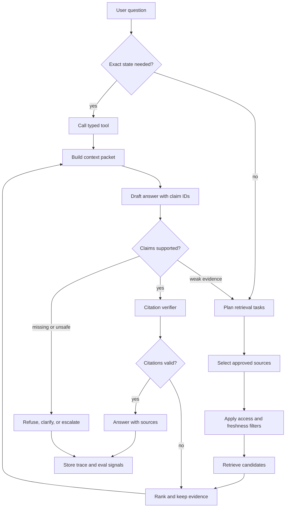

# Agentic RAG Systems

Agentic RAG uses agent behavior around retrieval. Instead of one retrieve-then-generate call, the system can plan queries, choose sources, call retrieval tools, inspect evidence, refine searches, verify citations, and decide whether to answer, ask for clarification, or escalate.

This chapter is architectural. The existing [Semantic Recall and RAG](../memory-knowledge/semantic-recall-rag) chapter explains the retrieval pattern. This chapter explains how to build a full system around it.

The important distinction is that Agentic RAG is not a smarter prompt around a vector database. It is a production system for evidence-grounded work. That system has source ownership, ingestion, indexing, retrieval, context assembly, generation, verification, evaluation, observability, and refresh.

Use the [Agentic RAG query trace worksheet](/capstone-assets/templates/agentic-rag-query-trace-worksheet.txt) during architecture reviews. It forces the team to record the question, sources, filters, omitted evidence, citation checks, and final runtime decision.

## Basic RAG vs Agentic RAG

Basic RAG is a pipeline:

```text
query -> retrieve -> inject context -> generate answer
```

Agentic RAG is a control loop:

```text
goal -> plan retrieval -> search -> inspect evidence -> refine or verify -> answer or refuse
```

The shift matters because many real questions are not one search. They require decomposition, source selection, permissions, freshness checks, and answer verification.

## When RAG Is Not Enough

Do not use semantic retrieval as a substitute for exact state.

If the question asks for the current account balance, order status, feature flag, inventory count, entitlement, payment state, access permission, or live incident status, the system should call a typed tool or database-backed service. RAG can explain policy, historical context, or documentation, but exact transactional state belongs behind a contract.

Use RAG for evidence and explanation. Use tools for current operational truth. Many useful systems combine both:

1. retrieve policy and procedure;
2. call a typed tool for current state;
3. assemble a context packet with both;
4. answer with citations and tool-result references;
5. refuse or escalate when evidence and state disagree.

## Reference Flow

Use this diagram to check whether the system can move backward when evidence is weak. The important path is not only query-to-answer; it is the loop from retrieval to verification, refinement, refusal, or escalation.


## Query Trace Flow

This flow is the reader's debugging map. Every arrow should produce trace evidence that a reviewer can inspect after a wrong answer, refusal, or escalation.



## System Components

- **Source registry:** Lists approved sources, owners, sensitivity, freshness, tenant scope, and deletion rules.
- **Ingestion pipeline:** Imports source material, detects changes, chunks content, redacts where needed, and records versions.
- **Index builder:** Creates vector, keyword, graph, or hybrid indexes from approved chunks.
- **Query planner:** Decomposes complex requests into retrieval tasks.
- **Retrieval router:** Chooses indexes, databases, APIs, memories, or web sources.
- **Access filter:** Applies user permissions and source-level policy before retrieval.
- **Retriever:** Runs vector, keyword, graph, SQL, API, or hybrid search.
- **Ranker:** Removes duplicates, stale chunks, low-relevance evidence, and policy-ineligible content.
- **Context builder:** Assembles a traceable context packet with instructions, state, evidence, tool results, memory, exclusions, and budget.
- **Verifier:** Checks whether the evidence actually supports the answer.
- **Synthesizer:** Produces the final answer with citations and uncertainty.
- **Citation verifier:** Checks that citations support the specific claims they are attached to.
- **Telemetry:** Records query, sources, ranks, context packet, citations, costs, and verifier outcomes.
- **Evaluation loop:** Replays traces, measures retrieval and answer quality, and turns incidents into regression cases.

## Use When

- The answer must be grounded in changing or private sources.
- The question may require multiple searches or source types.
- Users need citations, provenance, and freshness.
- Retrieval failures should lead to clarification, refusal, or escalation instead of hallucination.

## Avoid When

- A deterministic database query would answer the question directly.
- The system cannot enforce source permissions.
- The corpus is too noisy to support reliable grounding.
- Citation quality is not evaluated.

## Architecture Decisions

Define these decisions explicitly:

- Source inventory: which sources exist and who owns them.
- Freshness policy: how stale each source may be.
- Chunking policy: how documents are split and updated.
- Metadata policy: tenant, user, project, date, sensitivity, and source type.
- Retrieval strategy: vector, keyword, graph, SQL, API, or hybrid.
- Citation policy: what counts as a valid citation.
- Refusal policy: what happens when evidence is weak.
- Evaluation policy: what dataset proves retrieval quality.

## Source Lifecycle

Most RAG failures start before retrieval. The source lifecycle is part of the architecture.

| Stage | Design Question | Failure If Ignored |
| --- | --- | --- |
| Source registration | Who owns this source and who may query it? | orphaned documents, unclear permissions. |
| Ingestion | How are updates, deletes, and redactions detected? | stale or forbidden chunks remain searchable. |
| Chunking | What unit can support a citation? | citations point to broad documents or miss context. |
| Indexing | Which index versions exist and which model built them? | regressions cannot be traced or rolled back. |
| Access filtering | Are permissions applied before retrieval and ranking? | unauthorized chunks enter candidate sets. |
| Refresh | How quickly must changes appear or disappear? | old policy wins because it is easier to retrieve. |
| Deletion | Can user, tenant, or legal deletion remove indexed content? | deleted data persists in vectors or caches. |

Do not treat the vector index as the source of truth. It is a derived artifact. The source registry and ingestion pipeline should be able to explain which original source produced each chunk, when it was indexed, and whether it is still valid.

## Corrective RAG Loop

Corrective RAG adds a verifier before final synthesis. If the evidence is weak, the system changes the query or source rather than forcing an answer.

The diagram above shows this loop: weak evidence returns to planning, supported evidence moves to synthesis, and unsafe or missing evidence becomes a refusal, clarification, or escalation path.

The verifier should check more than answer fluency. It should ask whether each important claim has supporting evidence, whether the cited source is current, whether the caller is allowed to see it, whether another source conflicts with it, whether the answer used exact state from a tool when required, and whether the final answer should instead be a refusal or escalation.

## Multi-Agent RAG

A multi-agent RAG system separates roles:

- Researcher: decomposes the information need.
- Retriever: searches specific sources.
- Verifier: checks evidence against claims.
- Synthesizer: writes the answer.
- Policy agent: checks source eligibility and sensitive-data boundaries.

Use separate agents only when the roles produce independent value. If all roles read the same evidence and repeat the same prompt, use one agent with structured steps.

## Trace Model

Agentic RAG needs traces that make retrieval behavior reviewable. A final answer with citations is not enough. You need to know how the system got there.

```ts
type RagTrace = {
  runId: string;
  actorId: string;
  tenantId: string;
  question: string;
  queryPlan: Array<{
    queryId: string;
    purpose: string;
    sourceTypes: string[];
  }>;
  retrievals: Array<{
    queryId: string;
    indexName: string;
    indexVersion: string;
    filters: Record<string, unknown>;
    returnedSourceIds: string[];
    selectedSourceIds: string[];
    omittedSourceIds: string[];
  }>;
  contextPacketId: string;
  citations: Array<{
    claimId: string;
    sourceId: string;
    chunkId: string;
    verifierStatus: "supported" | "weak" | "contradicted" | "not_checked";
  }>;
  outcome: "answered" | "refused" | "clarification_needed" | "escalated";
  policyVersion: string;
};
```

This trace lets the team debug the real failure: bad planning, wrong source, missing filter, stale index, poor rerank, weak context assembly, citation mismatch, or verifier miss.

## End-To-End Query Trace

Use a concrete trace in design reviews. A trace should show the path from user question to final answer, not only the final citations.

| Step | Trace Evidence | Failure It Exposes |
| --- | --- | --- |
| User asks | actor, tenant, question, task type, risk class | wrong tenant, unsupported task, or exact-state question routed to RAG |
| Planner decomposes | subqueries, source types, required freshness, tool needs | missing source class or over-broad query |
| Access filter runs | allowed sources, denied sources, policy version | unauthorized source entering retrieval |
| Retriever searches | query text, filters, index version, scores, source IDs | stale index, wrong metadata, low recall |
| Ranker trims | selected chunks, omitted chunks, reason for omission | best evidence dropped under context budget |
| Context builder assembles | instructions, evidence, tool results, memory, exclusions | policy or citation requirement missing from context |
| Synthesizer drafts | claim IDs, answer sections, cited chunks | unsupported claim or citation laundering |
| Verifier checks | support status per claim, conflicts, missing evidence | weak evidence accepted as grounded |
| Runtime decides | answered, refused, clarification, or escalation | forced answer when evidence was insufficient |

The trace should make omissions visible. A reviewer should see not only what the system used, but also what it rejected, why it was rejected, and whether rejection was safe.

## Retrieval Failure Playbook

Most RAG incidents are not model failures. They are source, filter, ranking, context, or verification failures. Triage them separately.

| Symptom | Likely Cause | First Fix |
| --- | --- | --- |
| Correct source never appears. | Source missing, stale ingestion, wrong index, or access filter too strict. | Check source registry, ingestion log, index version, and filters. |
| Correct source appears but is not selected. | Reranker, dedupe, or budget trimming removed it. | Inspect selected and omitted chunks with scores and reasons. |
| Answer cites a nearby but wrong claim. | Chunk too broad, citation verifier too weak, or synthesis overreaches. | Add claim-level citation checks and smaller citation units. |
| Answer uses old policy. | Freshness metadata missing or refresh SLA violated. | Add effective dates, stale-source rejection, and source owner alerts. |
| Answer leaks unauthorized content. | Access filter applied after retrieval or metadata missing. | Enforce permissions before retrieval and test tenant-boundary attempts. |
| Answer refuses too often. | Evidence threshold too high or query planner too narrow. | Add clarification path and source-specific fallback searches. |
| Agent keeps searching adjacent topics. | Planner lacks stop conditions or verifier gives vague feedback. | Add max rounds, query purpose, and verifier failure reason. |
| Prompt injection changes the answer style or policy. | Retrieved content was treated as instruction instead of evidence. | Label source text as untrusted evidence and add injection fixtures. |
| Conflicting sources are collapsed into one answer. | Ranker or synthesizer hid disagreement. | Preserve source dates and require conflict disclosure or escalation. |
| Answer depends on an omitted source. | Context budget removed decisive evidence without a review signal. | Record omitted chunks with reasons and test budget-pressure cases. |

The playbook keeps teams from tuning prompts when the real defect is retrieval plumbing.

## Evaluation Guidance

Evaluate the pipeline in layers.

| Layer | What To Test |
| --- | --- |
| Ingestion | source completeness, deletion, redaction, chunk versioning. |
| Retrieval | recall, precision, freshness, tenant isolation, source diversity. |
| Reranking | whether the best evidence survives trimming and budget pressure. |
| Context assembly | whether policy, goal, evidence, and citations are included and labeled. |
| Generation | groundedness, refusal behavior, uncertainty, and citation use. |
| Verification | false support, missed contradiction, hallucinated citation, stale-source rejection. |
| Operations | replay, trace completeness, rollback, source refresh, incident reproduction. |

Useful eval cases include known-answer questions, missing-evidence questions, conflicting sources, stale policy, tenant boundary attempts, prompt injection in retrieved documents, exact-state questions that should call tools, and citation traps where the right source is retrieved but does not support the specific claim.

Measure retrieval recall, retrieval precision, source freshness, source permission accuracy, context packet completeness, citation faithfulness, unsupported-claim rate, missing-evidence refusal rate, stale-source rejection, tenant-boundary violations, cost, latency, and replay success.

## Failure Modes

- Hallucinated citations: the answer cites a source that does not support the claim.
- Retrieval drift: the loop keeps searching adjacent topics instead of the user question.
- Over-fetching: too much context pushes out the important evidence.
- Permission leaks: retrieval returns documents the user should not see.
- Stale grounding: old documentation wins because it is easier to retrieve.
- Memory contamination: user preferences are treated as factual source material.
- Index drift: the source changed but the index did not.
- Delete failure: removed or revoked content remains searchable.
- Exact-state confusion: semantic search answers a question that required a live tool call.
- Citation laundering: a citation exists, but it supports a nearby claim rather than the actual claim.
- Verifier theater: the verifier approves plausible prose without checking source support.
- Trace gaps: the team cannot reconstruct which chunks were retrieved, omitted, or used.

## Production Controls

- Access-controlled indexes.
- Metadata filters before retrieval.
- Source registry with owners, sensitivity, freshness, and deletion rules.
- Chunk and index versioning.
- Reindexing and deletion workflows.
- Evidence-count and freshness thresholds.
- Context packet traces.
- Citation validation.
- Retrieval and citation eval datasets.
- Source-level telemetry.
- Human escalation for conflicting evidence.
- Typed tool fallback for exact transactional state.
- Red-team tests for prompt injection in retrieved documents.
- Incident replay from stored traces.

## Production Checklist

- Can every indexed chunk be traced to an original source, owner, version, and permission rule?
- Are access filters applied before retrieval, not only after ranking?
- Are stale, deleted, or revoked sources removed from all indexes and caches?
- Is exact operational state fetched through typed tools rather than semantic search?
- Does the context packet show included and omitted sources?
- Are citations verified against the specific claims they support?
- Can the system refuse or ask for clarification when evidence is missing?
- Can operators replay a failed answer from its retrieval trace?
- Are retrieval, reranking, context assembly, generation, and verification evaluated separately?
- Are source refresh and index rollback operationally documented?

## Related Chapters

- [Semantic Recall and RAG](../memory-knowledge/semantic-recall-rag)
- [Context Engineering](../foundations/context-engineering)
- [Knowledge-Bound Agents](../memory-knowledge/knowledge-bound-agents)
- [Tool Capability Design](../tools-skills-protocols/tool-capability-design)
- [Goals and State](../foundations/goals-and-state)
- [Evaluator-Optimizer](../control-loops/evaluator-optimizer)
- [Observability and Evals](../production-runtime/observability-and-evals)
