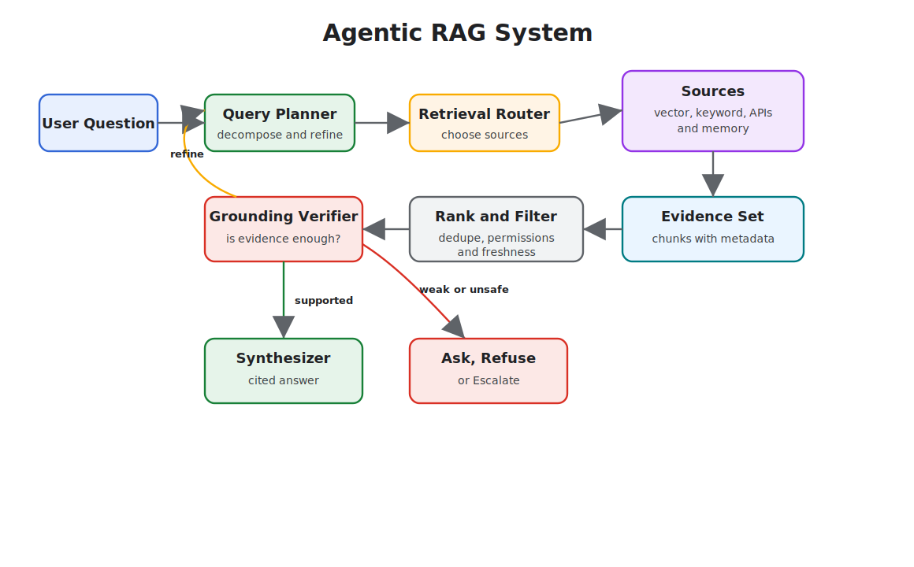

# Agentic RAG Systems

Agentic RAG uses agent behavior around retrieval. Instead of one retrieve-then-generate call, the system can plan queries, choose sources, call retrieval tools, inspect evidence, refine searches, verify citations, and decide whether to answer, ask for clarification, or escalate.

This chapter is architectural. The existing [Semantic Recall and RAG](../memory-knowledge/semantic-recall-rag) chapter explains the retrieval pattern. This chapter explains how to build a full system around it.

## Basic RAG vs Agentic RAG

Basic RAG is a pipeline:

```text
query -> retrieve -> inject context -> generate answer
```

Agentic RAG is a control loop:

```text
goal -> plan retrieval -> search -> inspect evidence -> refine or verify -> answer or refuse
```

The shift matters because many real questions are not one search. They require decomposition, source selection, permissions, freshness checks, and answer verification.

## Reference Flow



## System Components

- **Query planner:** Decomposes complex requests into retrieval tasks.
- **Retrieval router:** Chooses indexes, databases, APIs, memories, or web sources.
- **Access filter:** Applies user permissions and source-level policy before retrieval.
- **Retriever:** Runs vector, keyword, graph, SQL, API, or hybrid search.
- **Ranker:** Removes duplicates, stale chunks, low-relevance evidence, and policy-ineligible content.
- **Verifier:** Checks whether the evidence actually supports the answer.
- **Synthesizer:** Produces the final answer with citations and uncertainty.
- **Telemetry:** Records query, sources, ranks, citations, costs, and verifier outcomes.

## Use When

- The answer must be grounded in changing or private sources.
- The question may require multiple searches or source types.
- Users need citations, provenance, and freshness.
- Retrieval failures should lead to clarification, refusal, or escalation instead of hallucination.

## Avoid When

- A deterministic database query would answer the question directly.
- The system cannot enforce source permissions.
- The corpus is too noisy to support reliable grounding.
- Citation quality is not evaluated.

## Architecture Decisions

Define these decisions explicitly:

- Source inventory: which sources exist and who owns them.
- Freshness policy: how stale each source may be.
- Chunking policy: how documents are split and updated.
- Metadata policy: tenant, user, project, date, sensitivity, and source type.
- Retrieval strategy: vector, keyword, graph, SQL, API, or hybrid.
- Citation policy: what counts as a valid citation.
- Refusal policy: what happens when evidence is weak.
- Evaluation policy: what dataset proves retrieval quality.

## Corrective RAG Loop

Corrective RAG adds a verifier before final synthesis. If the evidence is weak, the system changes the query or source rather than forcing an answer.

The diagram above shows this loop: weak evidence returns to planning, supported evidence moves to synthesis, and unsafe or missing evidence becomes a refusal, clarification, or escalation path.

## Multi-Agent RAG

A multi-agent RAG system separates roles:

- Researcher: decomposes the information need.
- Retriever: searches specific sources.
- Verifier: checks evidence against claims.
- Synthesizer: writes the answer.
- Policy agent: checks source eligibility and sensitive-data boundaries.

Use separate agents only when the roles produce independent value. If all roles read the same evidence and repeat the same prompt, use one agent with structured steps.

## Failure Modes

- Hallucinated citations: the answer cites a source that does not support the claim.
- Retrieval drift: the loop keeps searching adjacent topics instead of the user question.
- Over-fetching: too much context pushes out the important evidence.
- Permission leaks: retrieval returns documents the user should not see.
- Stale grounding: old documentation wins because it is easier to retrieve.
- Memory contamination: user preferences are treated as factual source material.

## Production Controls

- Access-controlled indexes
- Metadata filters before retrieval
- Evidence-count and freshness thresholds
- Citation validation
- Retrieval eval datasets
- Source-level telemetry
- Human escalation for conflicting evidence
- Red-team tests for prompt injection in retrieved documents

## Related Chapters

- [Semantic Recall and RAG](../memory-knowledge/semantic-recall-rag)
- [Context Engineering](../foundations/context-engineering)
- [Knowledge-Bound Agents](../memory-knowledge/knowledge-bound-agents)
- [Evaluator-Optimizer](../control-loops/evaluator-optimizer)
- [Observability and Evals](../production-runtime/observability-and-evals)
