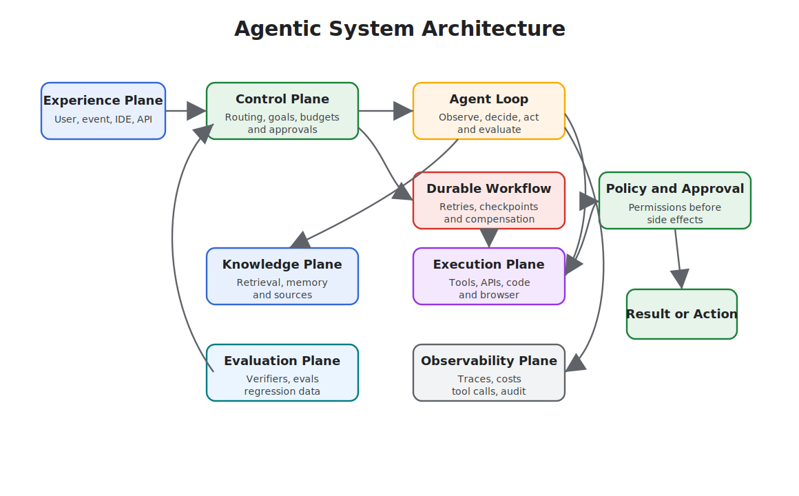

# Agentic System Architecture

An agentic system is more than a model call wrapped in a loop. It is a set of control planes, execution planes, data planes, and safety planes that let software use model judgment without losing engineering control.

Use this chapter when a single pattern is not enough and you need to combine agents, tools, memory, policies, workflows, evals, and observability into one coherent system.

When agents cross process, team, runtime, or ownership boundaries, treat them like services with explicit contracts. See [Agents As Services](./agents-as-services) for that architecture.

## Core Idea

Separate the system into planes:

- **Experience plane:** chat, IDE, API, webhook, ticket, mobile, or scheduled entrypoint.
- **Control plane:** routing, planning, permissions, budgets, approvals, task state, and stop conditions.
- **Execution plane:** tools, code execution, browser actions, API calls, workflows, and external side effects.
- **Knowledge plane:** retrieval, memory, indexes, metadata, source freshness, and citations.
- **Evaluation plane:** offline evals, runtime checks, verifiers, red-team tests, and regression datasets.
- **Observability plane:** traces, costs, latency, tool calls, model inputs, decisions, and operator review.

## Architecture Questions

- What owns the goal?
- What owns state?
- What may call tools?
- What requires approval?
- What happens when evidence is missing?
- What happens when the model is wrong?
- What can be replayed after a failure?
- What is deterministic, and what is model-mediated?

The system should have direct answers to those questions before it handles private data, money movement, production infrastructure, or customer-facing communication.

## Boundary Design

The most important architectural choice is the boundary between model judgment and deterministic software. Keep model outputs as proposals until software validates them.

Strong boundaries look like typed tool schemas, policy checks before side effects, explicit state transitions, human approval for high-risk operations, retrieval filters and citations, budget and timeout limits, and audit logs that connect the prompt, the decision, the tool input, and the result. Weak boundaries look like broad shell or browser access without approval, prompt-only policy enforcement, unstructured memory writes, hidden retries, tool results that cannot be traced, and agents that can rewrite their own operating rules without review.

## Composition Patterns

Common production systems combine several chapters from this book:

- **Agent Loop** for bounded observe-decide-act cycles.
- **Goals and State** for resumability and auditability.
- **MCP-first Tool Use** for discoverable tools.
- **Agentic RAG Systems** for evidence-grounded answers.
- **Durable Workflows** for long-running state, retries, and approvals.
- **Observability and Evals** for quality gates and regression control.
- **Policy Enforcement** for permission and compliance checks.
- **Agents As Services** for service boundaries, contracts, protocols, retries, and trace correlation between agents.

## Failure Modes

The recurring failures are easy to name. The model becomes the control plane, and no deterministic component owns state or permissions. Every pattern gets added at once, producing a system that is powerful but impossible to debug. Retrieval, memory, and tool output are mixed into one untrusted context blob. The system has no replay path after a bad action. Evals show up only after the first production failure, instead of before launch.

## Design Rule

Architecture should make failure visible. If a run fails, an operator should be able to answer: what goal was active, what evidence was used, what tool calls ran, what policy checks passed, what changed, and why the system stopped.

## Related Chapters

- [Agent Loop](../foundations/agent-loop)
- [Goals and State](../foundations/goals-and-state)
- [MCP-first Tool Use](../tools-skills-protocols/mcp-first-tool-use)
- [Agents As Services](./agents-as-services)
- [Agentic RAG Systems](./agentic-rag-systems)
- [Durable Workflows](../production-runtime/durable-workflows)
- [Observability and Evals](../production-runtime/observability-and-evals)
