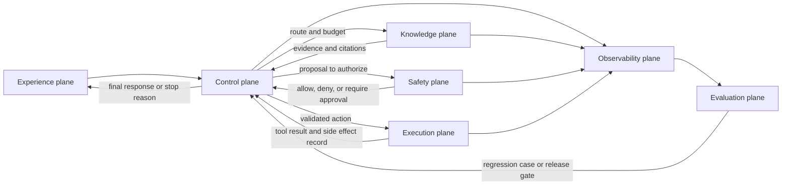

# Agentic System Architecture

An agentic system is more than a model call wrapped in a loop. It is a set of control planes, execution planes, data planes, and safety planes that let software use model judgment without losing engineering control.

Use this chapter when a single pattern is not enough and you need to combine agents, tools, memory, policies, workflows, evals, and observability into one coherent system.

This chapter owns composition and responsibility boundaries. It does not prescribe one framework or reimplement every plane. The specialized chapters own loop control, tools, memory, workflows, security, evaluation, and runtime operation.

When agents cross process, team, runtime, or ownership boundaries, treat them like services with explicit contracts. See [Agents As Services](./agents-as-services) for that architecture.

Download the [agentic system architecture review checklist](/capstone-assets/templates/agentic-system-architecture-review-checklist.txt) when turning this chapter into an ADR, design review, or capstone review.

## Core Idea

Separate the system into planes:

- **Experience plane:** chat, IDE, API, webhook, ticket, mobile, or scheduled entrypoint.
- **Control plane:** routing, planning, permissions, budgets, approvals, task state, and stop conditions.
- **Execution plane:** tools, code execution, browser actions, API calls, workflows, and external side effects.
- **Knowledge plane:** retrieval, memory, indexes, metadata, source freshness, and citations.
- **Evaluation plane:** offline evals, runtime checks, verifiers, red-team tests, and regression datasets.
- **Observability plane:** traces, costs, latency, tool calls, model inputs, decisions, and operator review.


The planes should have named owners. If the same prompt owns planning, policy, memory writes, tool authority, retry behavior, and user messaging, the system has no real architecture. It has a model with broad authority.

## Plane Ownership Matrix

Use this table during design review.

| Plane | Primary Owner | What It Must Decide | Evidence |
| --- | --- | --- | --- |
| Experience | product surface or API gateway | who starts the run, what the user sees, what requires confirmation | UI flow, API contract, approval copy |
| Control | runtime, workflow engine, or application service | goal state, routing, budgets, stop conditions, retries, escalation | state machine, workflow graph, timeout policy |
| Execution | tool gateway, service adapters, sandbox | which actions can run and with what authority | tool manifest, permission map, idempotency keys |
| Knowledge | retrieval service, memory service, data platform | what evidence can enter context and what can persist | index policy, memory policy, citation records |
| Evaluation | test harness and release gate | what quality bar blocks release | eval fixtures, thresholds, CI output |
| Observability | platform and operations team | how a failed run is reconstructed | trace schema, dashboards, redaction proof |
| Safety | policy service and human approval path | which actions are denied, allowed, or escalated | policy rules, approval records, audit logs |

This matrix prevents vague ownership. A chapter, framework, or team can own a plane, but the production system must name the owner.

## Runtime Plane Flow

The planes interact on every serious run. The experience plane starts the work, the control plane decides the route, the safety plane grants or denies authority, and the execution and knowledge planes return evidence. Evaluation and observability wrap the whole path.



Use the flow to find missing contracts. If a run can move from control to execution without safety, the system has hidden authority. If execution returns a side effect without observability, the incident review will be guesswork. If evaluation never receives traces, production failures will not become release gates.

## Architecture Questions

- What owns the goal?
- What owns state?
- What may call tools?
- What requires approval?
- What happens when evidence is missing?
- What happens when the model is wrong?
- What can be replayed after a failure?
- What is deterministic, and what is model-mediated?

The system should have direct answers to those questions before it handles private data, money movement, production infrastructure, or customer-facing communication.

Add these questions for production review:

- Which component can stop a run?
- Which component can resume a run?
- Which component can write memory?
- Which component can mutate user-visible records?
- Which component can spend money, send messages, deploy code, or change permissions?
- Which component proves that a policy check happened before authority was used?
- Which component turns incidents into eval cases?

If the answer is "the model decides," narrow the model's role. Let it propose. Let software validate, authorize, execute, and record.

## Boundary Design

The most important architectural choice is the boundary between model judgment and deterministic software. Keep model outputs as proposals until software validates them.

Strong boundaries look like typed tool schemas, policy checks before side effects, explicit state transitions, human approval for high-risk operations, retrieval filters and citations, budget and timeout limits, and audit logs that connect the prompt, the decision, the tool input, and the result. Weak boundaries look like broad shell or browser access without approval, prompt-only policy enforcement, unstructured memory writes, hidden retries, tool results that cannot be traced, and agents that can rewrite their own operating rules without review.

## Composition Contract

Every serious agentic system needs a written composition contract. It can live in an ADR, service contract, or runtime config, but it should answer the same questions.

```ts
type AgenticSystemContract = {
  systemId: string;
  owner: string;
  userEntrypoints: string[];
  supportedGoals: string[];
  stateOwner: "application" | "workflow-engine" | "agent-runtime" | "external-service";
  toolAuthority: Array<{
    toolName: string;
    capability: "read" | "draft" | "write" | "execute";
    approval: "none" | "human" | "policy" | "human-and-policy";
    idempotencyRequired: boolean;
  }>;
  knowledgeSources: Array<{
    source: string;
    freshnessRule: string;
    accessRule: string;
    citationRequired: boolean;
  }>;
  memoryPolicy: {
    canWrite: boolean;
    writeOwner: string;
    retention: string;
    deletionPath: string;
  };
  evalGate: {
    dataset: string;
    blockingThresholds: string[];
    requiredBeforeRelease: boolean;
  };
  observability: {
    traceId: string;
    redactionPolicy: string;
    replaySupported: boolean;
  };
  rollback: {
    disableModel: string;
    disableTool: string;
    disableWorkflow: string;
  };
};
```

The exact type matters less than the discipline. A reviewer should be able to read the contract and know what the system can do, who owns each boundary, and how the team proves it worked.

## Build Sequence

Build the system in thin vertical slices.

1. Start with the user-visible workflow and define the smallest valuable goal.
2. Add deterministic state before adding memory or multi-agent behavior.
3. Add one read-only tool and trace every call.
4. Add retrieval only after access rules and citation requirements are clear.
5. Add one write-capable tool behind policy, approval, and idempotency.
6. Add eval fixtures for successful runs, refusal cases, missing evidence, policy denial, tool failure, and rollback.
7. Add retries and recovery only after the trace can explain the first failure.
8. Add multi-agent topology only when a single agent creates unclear ownership or poor quality.

This order keeps the system inspectable. It also gives the team a working product slice before the architecture grows.

## Example: Support Refund Agent

A support refund agent may look simple: read a ticket, inspect orders, decide whether a refund is allowed, and draft a response. In production, that workflow crosses several planes.

| Step | Plane | Owner | Control |
| --- | --- | --- | --- |
| Customer asks for refund | experience | support UI | authenticated user and ticket context |
| Runtime creates goal | control | workflow service | run ID, tenant ID, timeout, stop condition |
| Agent reads policy | knowledge | retrieval service | tenant-scoped policy index with citations |
| Agent reads order | execution | order API adapter | read-only tool with trace record |
| Agent proposes refund | control | application service | structured decision object |
| Policy checks proposal | safety | policy service | amount, reason, region, customer status |
| Human approves edge case | safety | support supervisor | approval record with expiry |
| Refund executes | execution | payment adapter | idempotency key and rollback note |
| Run closes | observability | platform | trace, cost, tool calls, policy result |
| Failed case enters evals | evaluation | engineering team | regression fixture and release gate |

This architecture does not trust the model with money movement. The model reads evidence and proposes an action. Software checks the proposal, records the decision, and owns the side effect.

## Before And After Architecture Review

A weak design often sounds concise:

```text
Give the agent the customer ticket, policy docs, order API, refund API, and email tool.
Ask it to solve the case end to end.
```

That sketch hides the architecture inside the prompt. Reviewers cannot see who owns tenant scope, source freshness, refund authority, approval, retry safety, memory, or incident replay.

Use this review table to convert the sketch into a system.

| Weak Design Choice | Hidden Risk | Production Rewrite |
| --- | --- | --- |
| One agent receives every tool. | Read authority and write authority collapse into one role. | Split read tools, draft tools, and side-effect tools behind separate permissions. |
| Policy docs are just prompt context. | Stale or wrong policy can drive a customer-impacting action. | Retrieve policy through an access-controlled source with version, owner, and citation. |
| The model decides whether refund is allowed. | Business authority sits in generated text. | Model proposes a recommendation; policy service validates threshold, region, status, and exception rules. |
| Refund call happens inside the loop. | Retry or crash can duplicate money movement. | Payment adapter requires approval record, idempotency key, and side-effect trace. |
| Email is sent after the final answer. | Customer sees unsupported or unapproved language. | Model drafts email; runtime checks evidence, tone, policy, and approval state before send. |
| Memory stores the outcome automatically. | Bad or sensitive memory can persist across sessions. | Memory write is classified, reviewed by policy, and tied to retention and deletion rules. |
| Logs are plain text. | Operators cannot reconstruct why the action happened. | Trace links goal, evidence, model proposal, policy decision, approval, tool call, and stop reason. |

The safer design is still agentic. The model handles ambiguity, synthesis, and recommendation. The architecture owns authority, evidence, state, and recovery.

## Release Evidence Bundle

For an architecture review, require artifacts rather than assurances.

| Artifact | Minimum Content | Reviewer Question |
| --- | --- | --- |
| Plane ownership map | owners for experience, control, execution, knowledge, evaluation, observability, and safety | Who gets paged when this boundary fails? |
| Composition contract | supported goals, state owner, tool authority, knowledge sources, memory policy, eval gate, rollback | Can the model do anything outside this contract? |
| Happy-path trace | one successful run from entrypoint to final status | Can we prove the intended path works? |
| Denied-action trace | one blocked tool, retrieval, memory, or approval attempt | Can we prove authority is enforced before action? |
| Missing-evidence trace | one run that refuses, asks, or escalates | Can we prove the system does not invent support? |
| Rollback drill | feature flag, disable switch, or routing fallback | Can operators stop the risky behavior quickly? |
| Regression gate | eval cases tied to the known risks | Will the next release catch the same failure? |

If a team cannot attach these artifacts, the design is not ready for broad production use. It may still be a prototype or internal pilot, but its release label should say so.

## Framework Mapping

Frameworks can help, but they do not remove the need for boundaries.

| Architecture Need | Common Framework Support | What The Application Still Owns |
| --- | --- | --- |
| state graph | LangGraph, workflow engines, durable runtimes | domain state schema and migration rules |
| agent collaboration | AutoGen, CrewAI, custom service topology | role boundaries and final decision authority |
| tool discovery | MCP, tool registries, framework tool APIs | permissions, secrets, policy, and idempotency |
| retrieval | vector stores, RAG frameworks, search APIs | source access, freshness, citations, deletion |
| memory | framework memory stores or custom stores | write policy, correction, retention, user control |
| evals | test harnesses, judges, CI scripts | datasets, thresholds, release rules |
| observability | tracing SDKs and platform logs | redaction, run reconstruction, incident workflow |

Use framework features where they sharpen the boundary. Do not let framework convenience hide policy, ownership, or state.

## Composition Patterns

Common production systems combine several chapters from this book:

- **Agent Loop** for bounded observe-decide-act cycles.
- **Goals and State** for resumability and auditability.
- **MCP-first Tool Use** for discoverable tools.
- **Agentic RAG Systems** for evidence-grounded answers.
- **Production Runtime Overview** for the control plane around state, policy, budgets, traces, evals, and stop decisions.
- **Durable Workflows** for long-running state, retries, and approvals.
- **Observability and Evals** for quality gates and regression control.
- **Policy Enforcement** for permission and compliance checks.
- **Agents As Services** for service boundaries, contracts, protocols, retries, and trace correlation between agents.

## Architecture Review Checklist

A design is ready to build when reviewers can answer yes to these items:

- The system has one named owner and one incident owner.
- Each plane has a named owner and evidence artifact.
- The model proposes actions through structured outputs.
- Deterministic code validates structured outputs before side effects.
- Read tools, write tools, and execution tools have separate permissions.
- High-risk actions require policy, approval, or both.
- Retrieval sources have access rules, freshness rules, and citation rules.
- Memory writes have a policy, retention period, and deletion path.
- State can be inspected after failure.
- A run can be correlated across prompts, tool calls, policy checks, approvals, and side effects.
- Evals cover success, refusal, missing evidence, policy denial, tool failure, replay, and rollback.
- Rollback can disable the model, a tool, a workflow, or an agent without redeploying the whole system.

## Failure Modes

The recurring failures are easy to name. The model becomes the control plane, and no deterministic component owns state or permissions. Every pattern gets added at once, producing a system that is powerful but impossible to debug. Retrieval, memory, and tool output are mixed into one untrusted context blob. The system has no replay path after a bad action. Evals show up only after the first production failure, instead of before launch.

Other failures show up later. A team lets memory become a hidden database with no correction path. Tool adapters accept broad natural-language instructions instead of typed inputs. Retry logic repeats side effects without idempotency keys. A framework owns state in a way the application cannot inspect. A successful demo becomes a production release without threat modeling, redaction, or rollback.

## Design Review Questions

Ask these questions before implementation:

- Which business decision does this system make or support?
- What is the narrowest useful autonomy level?
- What evidence must be present before the model can answer?
- What action is too risky for autonomous execution?
- Which tool result can poison later reasoning if accepted blindly?
- Which state transition must never depend only on generated text?
- Which trace would an operator need during a production incident?
- Which eval would have caught the most likely embarrassing failure?
- Which feature flag disables the risky part first?
- What future chapter or ADR should own the next expansion?

## Design Rule

Architecture should make failure visible. If a run fails, an operator should be able to answer: what goal was active, what evidence was used, what tool calls ran, what policy checks passed, what changed, and why the system stopped.

Use [Reference Architecture](./reference-architecture) to turn these planes into a concrete deployment shape. Then use [Production Runtime Overview](../production-runtime/overview) to define the controls that execute and operate each run.

## Related Chapters

- [Agent Loop](../foundations/agent-loop)
- [Goals and State](../foundations/goals-and-state)
- [MCP-first Tool Use](../tools-skills-protocols/mcp-first-tool-use)
- [Agents As Services](./agents-as-services)
- [Agentic RAG Systems](./agentic-rag-systems)
- [Reference Architecture](./reference-architecture)
- [Production Runtime Overview](../production-runtime/overview)
- [Durable Workflows](../production-runtime/durable-workflows)
- [Observability and Evals](../production-runtime/observability-and-evals)
